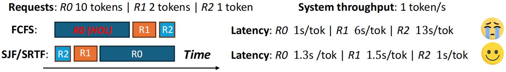

<!--Copyright © ZOMI 适用于 [License](https://github.com/Infrasys-AI/AIInfra) 版权许可 -->

# 07. LLM 推理请求调度：FCFS 调度

> 作者：Yuhao Chen

大模型推理的请求和传统的 Web/APP 请求或数据库查询完全不同：在传统的应用中，请求一般短、可预测、一次性完成。但是在大语言模型（LLM）的推理过程中，一个请求最终会生成多少个 token 通常是事先无法预知的。比如说，用户的提示词可能是“告诉我今天的天气”，也可能是“写一篇 200000 字的文章”。但推理系统在真正运行之前，并不知道解码会持续多少步。并且 LLM 推理分为两个不同的阶段：Prefill（预填充）是把输入 prompt 全部送进模型，计算量大但只需要执行一次； 而 Decode（解码）阶段会逐 token 生成输出，每次循环都要经过完整的前向传播，属于高频、低延迟的阶段。不同请求的 prefill / decode 长度差异很大，如果简单的混在一起处理，就会让 GPU 资源浪费或延迟飙升。因为这种输出的不确定性，许多 LLM 服务系统在调度请求时，都会选择一种最简单又直观的方式：先来先服务（FCFS, First-Come-First-Serve）。换句话说，调度器不会去预测哪个请求更短、更快完成，而是直接按照到达顺序排队。

## 深入理解 FCFS 调度

### FCFS 的定义与直观理解

- **定义**：按请求的**到达时间**排序，先到的请求优先被调度。顾名思义，先来后到，每次从就绪队列选择最先进入队列的进程，然后一直运行，直到进程退出或被阻塞，才会继续从队列中选择第一个进程接着运行。这似乎很公平，但是当一个长作业先运行了，那么后面的短作业等待的时间就会很长，不利于短作业[1]。FCFS 很像一个超市收银台——谁先排队，谁先结账。但是假如一个顾客购买的商品很多，那么后面排队的人即使买的物品很少也不得不等待，直到这名顾客结账完毕。


### FCFS 调度在大模型推理中的位置

1. **请求到达**

   * 用户通过 API/SDK 发起请求（包含输入文本、参数等）。
   * 系统将请求放入 **等待队列**。

2. **调度（Scheduling）**

   * 调度器决定哪些请求进入当前批次（batch）。
   * 这里涉及 **排队策略**（FCFS 就在这一环节）。

3. **Prefill 阶段**

   * 一次性处理整个输入上下文，算 Attention、KV cache 初始化。
   * 计算量大，算力密集。

4. **Decode 阶段**

   * 逐步生成 token，每次只前向推理一步。
   * 访存密集，依赖频繁的 KV cache 读写。

5. **结果返回用户**

   * token 流式输出或一次性返回。

---

**FCFS 位于第 2 步「调度」阶段**，作用是：

* 当多个请求堆在队列里时，**谁先到达，就先被调度进批次**。
* 在 **连续批处理（Continuous Batching）** 的迭代循环中，调度器会优先续跑已有的解码任务，然后再按照 **FCFS 顺序**补入新的预填充任务。

### 与连续批处理(continuous batching)的契合[2]

现代推理服务采用 **迭代级调度（iteration-level scheduling）**：每个调度周期，调度器会组装一个**混合批次**（包含正在解码的序列 + 新到达或分块的预填充请求），并提交执行。在此机制下，FCFS 扮演的是**补位规则**：

1. **优先续跑解码任务**（保障稳定的产出速率 / TPOT）；
2. **用剩余资源按队列顺序注入预填充任务**（降低 TTFT）；
3. **下一轮重新组合批次**——这正是 Continuous Batching 的核心思想。

### FCFS 的优缺点

#### 优点

1. **简单易实现**：算法复杂度极低，工程上几乎“零成本”落地，也不需要额外的请求特征估计（如上下文长度、剩余解码步数[2]）。

2. **公平性好**：严格按照到达时间排队，保证了用户层面直观的“谁先来谁先算”，不会出现长请求 starvation 的情况。

3. **可解释性强**：排队结果对用户、监控系统都直观透明，方便做 SLA 指标（P95、P99 延迟）的监控与解释。

---

#### 缺点
1. **无法感知任务长度**

* FCFS 完全不考虑请求的 **上下文长度** 或 **目标输出长度**。如果队列前面有一个超长请求，后面的一批短请求只能干等着，即使它们可以很快的输出结果，因为这个超长请求的 Prefill 阶段可能要消耗大量时间和显存。这种情况被称为 **Head-of-line blocking（队首阻塞）**，在 LLM 推理里尤其常见，因为输入长度分布差异极大[3]。



2. **吞吐与延迟的平衡受限**

* FCFS 追求的是“公平”，但并不保证整个推理系统的 **端到端延迟的最优**。在负载不均衡的情况下，整体吞吐率可能没问题，但尾部延迟（P95/P99）会飙升[8]。

3. **资源利用率不稳定**

* Prefill 和 Decode 的负载模式差异很大（算力 vs 内存）。如果 FCFS 把几个“大 Prefill”任务排在一起，就可能导致 GPU 在 Decode 端产生资源浪费[3]。

4. **对服务策略不敏感**

* 在一些场景，用户请求的重要性并不一样：比如「付费用户」 vs 「免费用户」，「实时对话」 vs 「批量处理」。但 FCFS 不区分优先级，所有请求一视同仁。这会让系统缺乏灵活性，无法满足不同业务线的服务等级需求[4]。

---

### 推理调度策略的演进路径

从上文中不难看出，fcfs 作为默认的调度策略有着一些局限性，所以其他调度策略也有广泛的运用空间[5]。


### 长度感知调度 (Length-Aware)

在大模型推理服务中，一个常见的问题是：一个很长的请求排在队列前面，后面一堆短请求只能干等着——这就是所谓的“队首阻塞”（Head-of-Line blocking）。为了解决这个问题，很多系统会尝试“看一眼”请求大概有多长，然后优先处理那些短小精悍的任务。

具体怎么做呢？一种思路是借鉴操作系统里的“最短作业优先”（SJF）或者“剩余时间最短优先”（SRPT）策略——谁快做完就先让谁上。但问题来了：我们往往没法提前知道一个请求到底会生成多少个 token。这时候，像 LAS（Least Attained Service）这样的方法就更实用：它不依赖准确的长度预测，而是看哪个请求“被服务得最少”，就优先照顾它，这样在长度不确定的情况下反而更稳。

那长度信息从哪来？其实有不少线索可用。比如用户输入的 prompt 有多长、设置了最大生成多少 token、已经解码了多少内容，甚至可以根据历史解码速度做个粗略估计。更聪明的做法还包括：根据任务类型（比如问答 vs. 写作）、停用词设置、温度参数等，用一个小模型快速猜一下输出长度,并且把这个参数输出给调度器。

工程上，通常会把请求按预估长度分到不同的“桶”里，短桶优先处理。但也不能让长请求永远等下去，所以还得加上“老化”机制——等得越久，优先级就慢慢提上来。另外，对那些特别长的请求（比如批量生成几千字），最好单独限流或者走离线通道，别挤占在线服务的资源。

当然，如果长度估计偏差太大，这套机制反而可能适得其反，比如把一个实际很长的请求误判为短任务，结果它卡在中间拖慢整个系统的速度。

---

### Token 级公平调度（Token-Level Fairness）

大模型生成文本不是一气呵成的，而是一步一步吐 token 的。每一步（step）都需要 GPU 算力和显存（尤其是 KV Cache）的支持。既然每一步都有一个“token 预算”，那为什么不把这笔预算公平地分给所有正在处理的请求呢？这就是 token 级公平调度的核心想法：在每一个解码 step 里，不让某个长对话“吃独食”，而是确保每个活跃请求至少能往前走一步。比如，先给每个请求分配 1 个 token 的“保底额度”，剩下的预算再按需分配。有些系统还会用“token 积分”机制——这一步没轮到你？没关系，下一轮优先补上。为了避免某个请求在单个 step 里狂吞几十个 token，通常还会设个上限。这样一来，短请求能更快完成并退出队列，新来的请求也能及时插进来，队首阻塞的问题自然就缓解了。

不过这种细粒度调度也有代价。系统需要频繁切换上下文，对 KV Cache 的管理要求更高，得靠 Paged Attention 这类技术来支撑高并发。而且调度逻辑变复杂了，如果切得太碎，GPU 内核启动和同步的开销反而会拖慢整体性能。所以得在“公平”和“效率”之间找平衡。顺便提一句，prefill（输入编码）和 decode（逐 token 生成）的资源需求很不一样：prefill 吃算力，decode 吃显存。把它们拆成两个独立的调度通道，能避免一个超长 prompt 的 prefill 把整个 decode 队列堵死。

---

### 优先级调度

现实中的服务从来不是“人人平等”的。付费用户 vs. 免费用户、实时对话 vs. 后台批处理、A/B 实验中的高优组……这些场景天然需要不同的服务等级。这时候，调度器就得“看人下菜碟”了。最简单的做法是搞多个队列，高优先级的走快车道，低优先级的排队限流。更精细一点的，可以用加权公平队列（类似 WFQ 或 DRR）：高权重的请求每轮能分到更多 token，或者等待时间更短。

当一个高优先级请求突然到来，也可以插个队，但最好别硬中断正在跑的请求（那样会清 KV Cache，代价太大），而是让它在下一个解码 step 里优先加入批处理——这叫“软抢占”。

---

### 混合调度

现实中，单一调度策略很难应对所有场景。于是大家开始搞“混合调度”——把长度感知、优先级控制、token 级分配这些手段分层组合起来[2]。

比如，在入口层先做一次粗筛：根据请求长度、优先级、是否是批处理等，决定它进哪个队列，甚至要不要拒掉。到了执行层，再用 token 级调度精细分配每一步的资源。prefill 和 decode 也最好分开调度，各自做批处理优化，互不干扰。更聪明的系统还会动态调整策略。比如，当显存快满了，就缩小批处理窗口；当队列里请求长度差异很大，就加快老化速度，防止短请求被饿死；如果 KV Cache 命中率高，说明上下文复用好，可以适当提高并发。这些调度策略还能和推理加速技术联动。比如用推测解码（Speculative Decoding）减少实际需要的 step 数；用分页 KV Cache 支撑更多并发；甚至根据缓存命中情况动态调优先级——命中率高的请求处理更快，整体吞吐也就上去了。最终目标，是在吞吐量、尾部延迟和资源成本之间动态找平衡，既能扛住白天的流量高峰，也能在深夜高效跑批处理任务。

---

### 队首阻塞 （HOL）的解决方案总结

- 把请求按长度分桶，短的优先处理，同时用“老化”机制防止长请求被遗忘；
- 把 prefill 和 decode 拆开调度，避免一个超长输入把整个系统卡住；
- 每个解码 step 里，强制给所有活跃请求至少分配 1 个 token，让短请求能快速跑完；
- 限制单个请求在单 step 里最多能拿多少 token，防止单点垄断；
- 对特别长或批量型的请求，直接引导到离线通道，别跟在线请求抢资源；
- 根据当前负载动态调整批处理大小——压力大时多合并，延迟敏感时少合并、快响应。

这些方法单独用可能效果有限，但组合起来，往往能显著改善用户体验。。

## vLLM 中的 FCFS 调度策略

### 默认调度策略

vLLM 对请求的调度处理流程[7]：

    当一堆请求来到 vLLM 服务器上时，按照 First-Come-First-Serve（FCFS）原则，优先处理那些最早到来的请求。
    当 gpu 资源不足时，为了让先来的请求能尽快做完推理，vLLM 会对那些后到来的请求执行“抢占”，即暂时终止它们的执行。
    一旦 vLLM 决定执行抢占操作，它会暂停处理新到来的请求。在此期间，它会将被抢占的请求相关的 KV block 全部交换（swap）至 cpu 上。等交换完成后，vLLM 才会继续处理新到来的请求。
    当 vLLM 认为 gpu 有足够资源时，它会将 cpu 上的 KV block 重新加载回 gpu，恢复被抢占请求的执行（recomputation）


### vLLM 默认 FCFS 调度的具体实现

#### 基于 Token 预算的分片调度引擎

* 系统在每个调度周期（Step）里，会设置一个 **最大 Token 预算（token_budget）**，类似“这一轮 GPU 能算多少 token”。
* 调度器遍历请求队列（等待队列 + 运行队列），按照 **FCFS 顺序**（先来先服务），为请求分配 token。
* 如果请求太大、超出预算，就会分片执行，把一部分内容推到下一个 Step 再继续。

#### Step 初始化

* 计算出本轮 token_budget。
* 初始化要调度的请求集合（running/new/resumed）。

#### 遍历运行队列

1. 计算该请求需要多少新 token（num_new_tokens），受 **预算限制**、**长 Prefill 限制**、**模型最大长度限制** 等条件约束。
2. 如果超出预算 → 截断分片，只调度部分请求。
3. 如果 cache 空间不足，会触发 **FCFS 抢占（preemption）**：从 **运行队列**的队尾抢占掉一个请求。被抢占请求会被清掉 KV cache，回到等待队列，状态改成 PREEMPTED。

#### 遍历等待队列

* 按照 fcfs 调度策略依次从等待队列的队头取出请求：
  * 检查状态是否满足执行条件（等待 KV、结构化输出 FSM、LoRA 等都可能跳过）。
  * 分配 KV cache 块，如果没空间则停止调度。
* 调度成功的请求转为 RUNNING 状态，并记录元数据（req_id ↔ kv_cache_block，scheduled_tokens 等）。

#### 更新状态

* 所有成功调度的请求会进入本轮的 **SchedulerOutput**，交给 Worker 执行。
* Step 结束后，每个请求会输出一个新 token（除非遇到停止条件），等待下轮继续。

#### 新请求的接入

* 外部调用 `scheduler.add_request`，新的请求进入等待队列。
* 上层引擎（EngineCoreProc）会调用 `schedule()`从 WAITING+RUNNING 中选出一批请求。
* 执行后通过 `update_from_output` 更新状态。

这样，新请求和旧请求都能被动态插入下一轮调度。

默认的 **FCFS 调度**在 vLLM 里并不是“纯排队”，而是：

* **基于 token 预算的动态分片**，每一轮 Step 都重新分配预算。
* **优先续跑 Decode（RUNNING 队列）**，保证输出平滑。
* **再按 FCFS 顺序补 Prefill（WAITING 队列）**，短请求和长请求交错执行。
* 如果资源不足，会触发 **抢占**，把低优先级或队尾请求放回等待队列。

这样，它既保持了 FCFS 的公平性，又通过分片和优先 Decode 避免了 Prefill“卡死”整个系统。


### Vllm 中 FCFS 策略的工程化增强

1. **分块预填充（Chunked Prefill）**

   - 将长 prompt 切分为 256/512 token 的小块，分多轮注入，**显著缓解队头阻塞**。
   - 通过 `max_num_partial_prefills` 控制并发分块数，避免过度打断解码流程。

2. **长短请求分级 + “短块优先”窗口**

   - 使用 `long_prefill_token_threshold` 划分长短请求；
   - 设置 `max_long_partial_prefills < max_num_partial_prefills`，使短块在分块窗口内**优先调度**，有效降低 P95/P99 延迟。

3. **预算与座位的“硬性护栏”**

   - 合理设置 `max_num_batched_tokens` 和 `max_num_seqs`，防止单次预填充耗尽全部资源；
   - 通过 KV 缓存控制，**优先保障解码任务的稳定执行**。

4. **轻量级优先级（温和改造）**

   - 在 FCFS 基础上引入少量 `priority` 字段（如“交互流量 > 批量任务”），但**限制抢占频率**，避免产出抖动。

5. **KV 缓存管理与容量优化**

   - 采用混合/分页/压缩 KV 缓存技术，扩大并发容量，减少因缓存不足导致的请求排队膨胀。

### 可复用的 vLLM 配置模板[6]

#### 低 TTFT（交互优先）

```yaml
policy: fcfs
enable_chunked_prefill: true
max_num_partial_prefills: 2
max_long_partial_prefills: 1
long_prefill_token_threshold: 0.04 * max_model_len
max_num_batched_tokens: max(DEFAULT_MAX_NUM_BATCHED_TOKENS, 2 * max_model_len)
max_num_seqs: 128
```

#### 高吞吐（离线/批量任务）

```yaml
policy: fcfs
enable_chunked_prefill: true
max_num_partial_prefills: 1
max_long_partial_prefills: 1
max_num_batched_tokens: 4 * max_model_len
max_num_seqs: 128
cuda_graph_sizes: [1,2,4,8,16,32,64,128]   # 可选
```

#### 通用抗阻塞（长上下文混合场景）

```yaml
policy: fcfs
enable_chunked_prefill: true
max_num_partial_prefills: 2
max_long_partial_prefills: 1
long_prefill_token_threshold: 0.06 * max_model_len
max_num_batched_tokens: max(2 * max_model_len, DEFAULT_MAX_NUM_BATCHED_TOKENS)
max_num_seqs: 128
disable_hybrid_kv_cache_manager: false
```


## 参考与引用

* [1] WZCU, “系统调度算法详解,” 2023. [Online]. Available: [http://interview.wzcu.com/System/%E8%B0%83%E5%BA%A6%E7%AE%97%E6%B3%95.html](http://interview.wzcu.com/System/%E8%B0%83%E5%BA%A6%E7%AE%97%E6%B3%95.html)  
* [2] Hugging Face, “LLM performance: request queueing strategies,” Blog, 2024. [Online]. Available: [https://huggingface.co/blog/tngtech/llm-performance-request-queueing](https://huggingface.co/blog/tngtech/llm-performance-request-queueing)  
* [3] Hugging Face, “LLM performance: prefill vs decode under concurrent requests,” Blog, 2024. [Online]. Available: [https://huggingface.co/blog/tngtech/llm-performance-prefill-decode-concurrent-requests](https://huggingface.co/blog/tngtech/llm-performance-prefill-decode-concurrent-requests)  
* [4] Y. Yu et al., “Orca: A Distributed Serving System for Transformer-Based Generative Models,” OSDI, 2022. [Online]. Available: [https://www.usenix.org/conference/osdi22/presentation/yu](https://www.usenix.org/conference/osdi22/presentation/yu)  
* [5] W. Kwon et al., “Efficient Memory Management for Large Language Model Serving with PagedAttention,” 2024. [Online]. Available: [https://arxiv.org/abs/2403.02310](https://arxiv.org/abs/2403.02310)  
* [6] vLLM, “SchedulerConfig & Continuous Batching (source code, version-dependent),” 2024. [Online]. Available: [https://github.com/vllm-project/vllm](https://github.com/vllm-project/vllm) (see `vllm/core/scheduler`)  
* [7] vLLM Community, “Is FCFS scheduling holding back vLLM’s performance in production?”, vLLM Forum, 2024. [Online]. Available: [https://discuss.vllm.ai/t/is-fcfs-scheduling-holding-back-vllms-performance-in-production/1584](https://discuss.vllm.ai/t/is-fcfs-scheduling-holding-back-vllms-performance-in-production/1584)  
* [8] Databricks, “LLM Inference Performance Engineering Best Practices,” Blog, 2024. [Online]. Available: [https://www.databricks.com/blog/llm-inference-performance-engineering-best-practices](https://www.databricks.com/blog/llm-inference-performance-engineering-best-practices)

---
```


