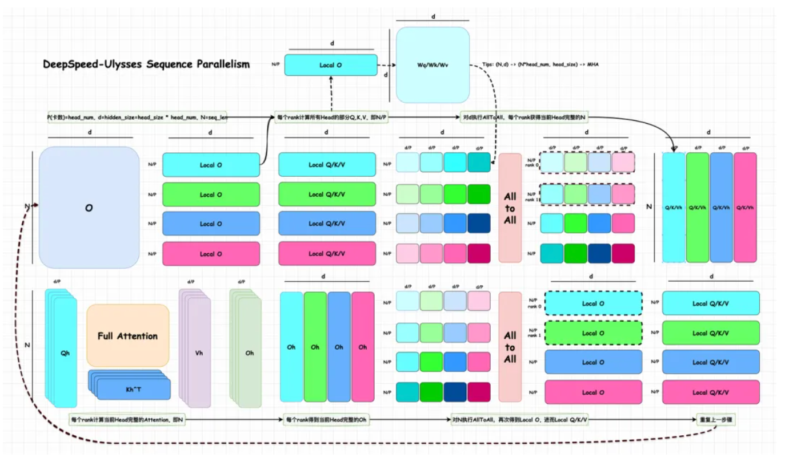
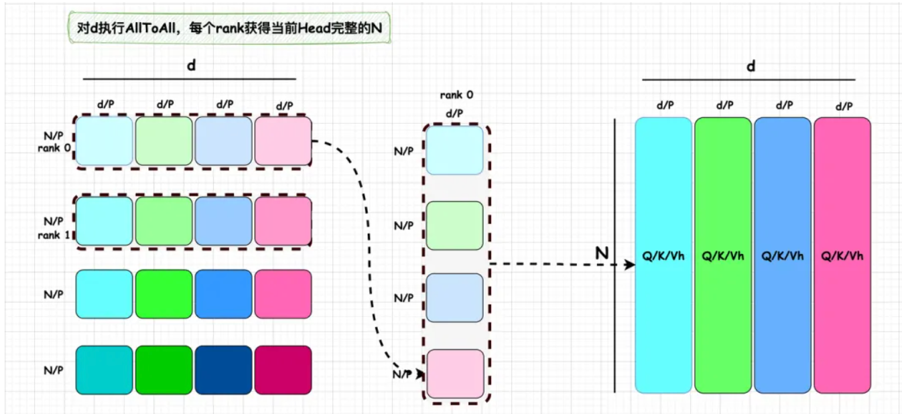
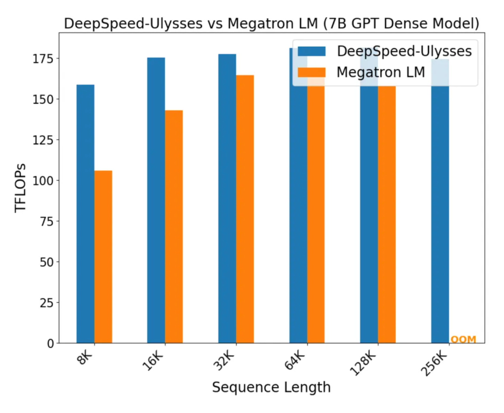

# Ulysses 长序列并行

Author by: 付溦崴

DeepSpeed 提出了一种新的序列并行方法：DeepSpeed-Ulysses。
在 Transformer 结构中，**前馈层（FFN）**的计算是逐 token 独立的，不依赖于序列长度。而 **自注意力机制（Self-Attention）** 则不同，它需要全局的信息交互：每个 Query 都必须与整个序列的 Key、Value 交互。  

因此，**Attention 的计算是序列并行的最大挑战**：  
- 序列被分割后，每张 GPU 只持有部分 token，无法单独完成注意力计算。  
- 必须通过 **通信操作** 在 GPU 之间交换 Q/K/V，确保每个 GPU 能看到完整的序列。  

传统的 Megatron-LM 序列并行方案通过 AllGather 等通信完成这一过程，但其通信复杂度较高，扩展性有限。DeepSpeed-Ulysses 的核心贡献就是降低序列并行的通信量，从而支持更长的序列。

## DeepSpeed-Ulysses 整体流程
简单来说 Ulysses 的核心思想是：  
**利用两次 All-to-All，将数据重分布，使得每个 GPU 既能并行处理子序列，又能独立计算完整的 Attention Head。**
整体的流程如下图所示：

我们可以假设 GPU 数量为 P，注意力头数为 head num，满足 head_num % P=0，这里为了简化理解，我们假设 P = head num。图中，Local O/Q/K/V 表示每个 rank 上的数据，Qh, Kh, Vh, Oh 表示当前 head 上在 N 维度上完整的数据。N 表示序列长度 seq len，d 表示 hidden size，head size 表示每个注意力头使用的隐藏向量的维度，并且满足：d=hidden_size=head_size * head_num。P 和 head num 应该需要满足整除关系，从另一方面来看，其实也保证 MHA 计算的数值正确性，每个 Head 本身的 hd 维度需要完整，才能保证 Attention score 是数值正确的。因此，Ulysses 图中的 d/P，实际上只是按照 head num 进行切分，并不会对每个 head 自身的 hd 再次切分。

- 输入矩阵切分：
首先，对输入矩阵 O 进行切分，每个卡上获得[N/P,d]大小分块的数据，即 Local O。DeepSpeed-Ulysses 不对权重进行切分，每个卡上持有完整的 Wq/Wk/Wv 权重。因此，每个卡上的[N/P,d]分块，可以直接和当前卡上的 Wq/Wk/Wv 相乘，得到[N/P,d]大小的 Q,K,V 矩阵作为输出，即 Local Q/K/V。注意，这些 Q,K,V 矩阵的性质是：所有 Head 的部分 Q, K, V，即 N/P。

- 第一次 All-to-All（对 d 维度）：
经过上一个步骤，我们得到的 Local Q/K/V，每个卡只有持有其中 N/P 部分，但是 Attention 部分要求对完整的 N 进行注意力机制的计算，并且，最好同时能实现 Attention 的分布式运算。为此，我们需要使得每卡恰好持有一个 Attention Head 的 N 维度上完整的 Q/K/V 值。这要怎么实现呢？DeepSpeed 团队发现，此时，只要对 d 维度执行一个 All-To-All 操作，恰好能实现这个功能。

All-To-All 这个通信方式同 All-Reduce 一样，是分布式训练中的 Collective functions，All-to-All 在每个进程向每个其他进程发消息的一部分，最后处理器拥有各个进程消息的一部分，这个操作可以理解成一个分布式矩阵转置操作。以下图为例，执行 All-To-All 后，rank 0 持有 4 个[N/P, d/P]的数据，分别属于 N 的不同部分，因此可以进一步合并成[N, d/P=head_size]。这正好是一个 head 所需要的在 N 维度上完整的 Q/K/V。

- Attention 计算：
由于经过 All-To-All 后，每个 rank 都恰好拿到了一个 head 在 N 维度上完整的 Q/K/V，即 Qh, Kh 和 Vh，因此可以按照正常的 Attention 流程进行注意力机制计算，每个 rank 得到当前 Head 完整的 Oh。

- 第一次 All-to-All（对 N 维度）：
每个 rank 得到当前 Head 完整的 Oh 后，为了能够使得后续的和 Wo 相乘以及 MLP 模块能够直接执行序列并行，我们还需要将 Oh([N, d/P])变换成 Local O([N/P, d])的形式，而这恰好又可以用另一个 All-To-All 来完成，即，对 N 维度执行 All-To-All。得到的结果恰好就是 Local O 的形式，那么，可以直接把结果传给 Wo 以及 MLP，继续执行序列并行。

-MLP 计算：这部分计算就如上述所说，每个 token 的计算是独立的，因此可以在不同卡上进行分块计算。

下图对 Megatron-LM SP+DP 的训练性能对比：

# 通信量分析
## All-to-All 的通信量
在执行 **All-to-All** 操作之前，每张 GPU 保存的数据规模为：$ \frac{N \cdot d}{P} $
其中，$N$ 为序列长度，$d$ 为隐藏层维度，$P$ 为并行度（GPU 数量）。  
进一步切分后，每个小数据块的大小为：$ \frac{N \cdot d}{P^2} $
在 All-to-All 通信中，单卡既要 **发送（send）** 数据，也要 **接收（accept）** 数据。但从通信量角度，可以将系统的总通信量理解为所有 GPU 的发送量之和，因此单卡的通信量只需关注 **send 部分**。  
对于单卡而言，它的发送量为：
$ \text{send} = \frac{N \cdot d}{P^2} \times (P-1) $
当 $P$ 较大时，约等于：
$ \frac{N \cdot d}{P} $
也就是说，**单卡执行一次 All-to-All 的通信量大约是 $ \frac{N \cdot d}{P} $**。  
相比之下，单卡执行一次 **All-Gather** 或 **Reduce-Scatter** 的通信量则是 $ N \cdot d $。这表明 All-to-All 的通信量被有效地降低了一个数量级。

## Forward 通信量
q/k/v_chunk 各自做 1 次 All-to-All 通讯，则这里合起来做了 3 次 All-to-All 通讯，各卡上原始的 Attention 结果做了 1 次 All-to-All 通讯综上，Ulysses 的前向过程一共做了 4 次 All-to-All 通讯，因此总通信量为 $\frac{4Nd}{P}$。
（注意，如果配套使用了 zero 操作，fwd 过程还会涉及模型权重的 all-gather，不过这里我们不考虑这一点，我们就假设是最朴素的 ulysses，单卡上有完整的模型）

下面的表格对比了 Ulysses 与 Megatron-LM SP 的通信量：
| 特性    | DeepSpeed-Ulysses         | Megatron-LM SP      |
| ----- | ------------------------- | ------------------- |
| 切分方式  | 序列维度 + Head 维度重分布         | 序列维度                |
| 通信模式  | 双 All-to-All（d + N）       | AllGather/AllReduce |
| 通信复杂度 | $O(N/P)$                  | $O(N)$              |
| 扩展性   | 更适合超长序列                   | 较难扩展到百万级别           |
| 工程实现  | 与 ZeRO/FlashAttention 等兼容 | 强绑定 TP，更复杂          |

