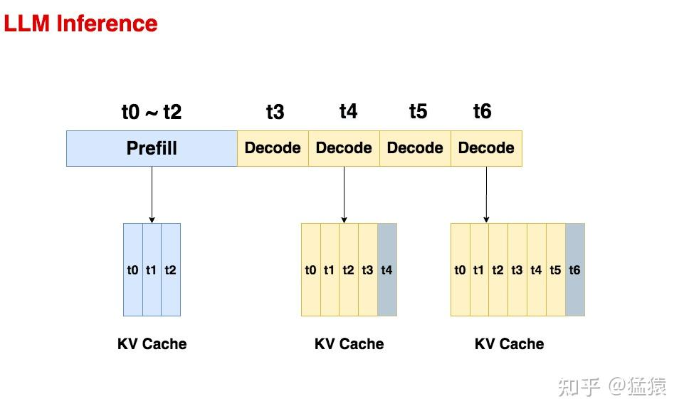
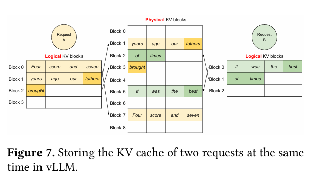

# PagedAttention

Authored by：汪袁烁

## 概述

本文主要用于科普和简述 PagedAttention 的原理，主要用于支持`./05FastGen`的背景技术中的 PagedAttention 部分

### 前言 - 为什么有 PagedAttention

首先，LLM Infer 主要有`prefill`和`decode`两个阶段：

如图，不难观察到：

- Decode 阶段的是逐一生成 token 的，因此它不能像 prefill 阶段那样能做大段 prompt 的并行计算
- 随着 prompt 数量变多和序列变长，KV cache 也变大，对 gpu 显存造成压力
- 由于输出的序列长度无法预先知道，所以我们很难提前为 KV cache 量身定制存储空间

因此，如何优化 KV cache，节省显存，提高推理吞吐量，就成了 LLM 推理框架需要解决的重点问题。

### 背景 - 之前如何做的

针对这个 KVCache 分配，之前的做法是很简单粗暴的直接按照(batch_size, max_seq_len)这样的固定尺寸。显然，会造成大量的内存浪费。

### PagedAttention

类比传统的分页操作系统，PagedAttention 对于不同的 Request 正如对于不同进程一样分别分配进程块并且通过虚实转换机制映射到物理内存中实现分页管理。

如图，不同的 request 都可以被分页然后填充到需要的地方。

## Ref
1. [图解大模型计算加速系列之：vLLM 核心技术 PagedAttention 原理](https://zhuanlan.zhihu.com/p/691038809)
2. [PagedAttention 论文](https://arxiv.org/pdf/2309.06180)

