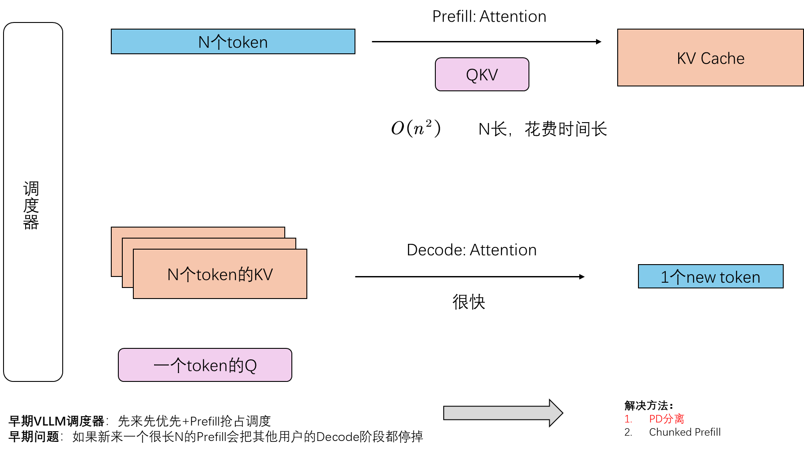

# PD分离

Authored by：汪袁烁

## 概述
为了更便于理解 Prefill 和 Decode 是如何相互影响的，我计划引入 PD 分离的简述和科普。通过阅读本文可以更好的理解一个大模型推理框架是如何 Prefill 和 Decode 协助的，当然也可以更深入的理解`./05FastGen`中长序列场景下对于 Prefill 和 Decode 阶段互相影响的痛点

## 前言与动机

首先科普一下：

Prefill 是 N 个 token 一起输入，它的 attention 主要是 QKVSplit 之后得到 KVCache 的过程。它的复杂度是 $O(n^2)$，因此 N 越长花费时间越长。

Decode 则是基于 N 个 KVCache 生成一个新 token 的过程，它的速度很快。

如图：

我们常用的大模型推理的框架就是通过调度器调度 Prefill 和 Decode 的两个过程。

然而，早期的 VLLM 的调度器是**先来先服务 + Prefill 可以抢占 Decode**的设计。这样的问题是，如果我有多个用户正在 Decode 等待生成相应，突然有新用户来了一个很长的 Prefill 请求，那么其他用户就不得不因此等待很长的时间（被抢占了）。

解决该问题主要当时提出的有 PD 分离和 Chunked Prefill 两个方法：Chunked Prefill 主要是利用 Prefill 和 Decode 阶段低层算子的相似性尝试将两个阶段放到一起的方法，不在本文的讨论范围；本文主要介绍 PD 分离。

## 技术概述

既然我把 Prefill 和 Decode 都放到一个 GPU 上会资源竞争，那么我直接把 P 和 D 作为两个节点放到两个 GPU 上不就好啦？

没错！这就是 PD 分离的基本思想。也即把 P 节点和 D 节点放在两个 GPU 上，当 P 阶段进行完之后将结果传给 D 阶段。这样的话即便其他用户的 Prefill 来了因为你的 D 节点在其他 GPU 上进行的（分离了），所以不会影响你的 Decode 阶段。

## 核心问题

我们有了基本的技术思路，那么现在只需要解决这个思路的几个关键技术点就行了。

### P、D 节点间如何传 KVCache

- polling mode: P 节点发送结果到 pool，然后 D 节点从 pool 里面去取。（2 次传输，代码相对简介）

- p2p mode: P 节点知道自己发到哪个 D 节点，直接发送。（1 次传输，代码设计也相对更难）

目前有些库实现了这些 mode：[LMCache](https://github.com/LMCache/LMCache)、[MoonCake](https://github.com/kvcache-ai/Mooncake)、[NIXL](https://github.com/ai-dynamo/nixl)，当然还有 [vLLM](https://github.com/vllm-project/vllm) 的 model_runner 模块。

### PD 如何和 VLLM 交互

本质也即传输的 KVCache 如何被 VLLM 管理，VLLM 会尝试为 KVCache 分配 Paged Memory，并在需要的时候从 Paged Memory 中取出。更详细的过程可以看我这篇文章`./05-1 PagedAttention`。值得注意的是，PagedAttention 也是我们本系列主体 FastGen 的背景解决技术和重要参考，学习本技术也有助于你理解整个 FastGen 的流程。

### VLLM 何时发送请求

因为我们现在 PD 分离了，以往我们直接发一个 request 给一个 instance 然后直接执行就行了。但是现在我有 P、D 两个节点（两个 instance），我希望它们都看到这个 request。[VLLM 社区](https://blog.vllm.ai/2025/09/05/anatomy-of-vllm.html)对此讨论了很多解决方法：

- 先 P 后 D：也是最直观的方法，我先把 request 发给 P 节点让 P 节点得到结果再发给 D 节点。
- 先 D 后 P：因为用户 request 本质是希望得到生成的 token，因此也可以先发给 D，当 D 发现自己无法生成 token 的时候再去向 P 节点请求 KVCache。

## 结语

本文是一个 PD 分离简要介绍，旨在帮助你理解 Prefill、Decode 是什么，以及以 VLLM 为例的推理框架是如何调度它们的。理解完本文可以继续去看`./05FastGen`也即长序列情况下 DeepSeed 是如何应对 PD 调度的问题。

## Ref
1. [VLLM 中的 PD 分离 B 站](https://www.bilibili.com/video/BV1wcdbYwE6s?spm_id_from=333.788.videopod.sections&vd_source=8a4545c25a1c1192fb4e7e037876e6f4)
2. [PD 分离 博客](https://johng.cn/ai/pd-separation)

