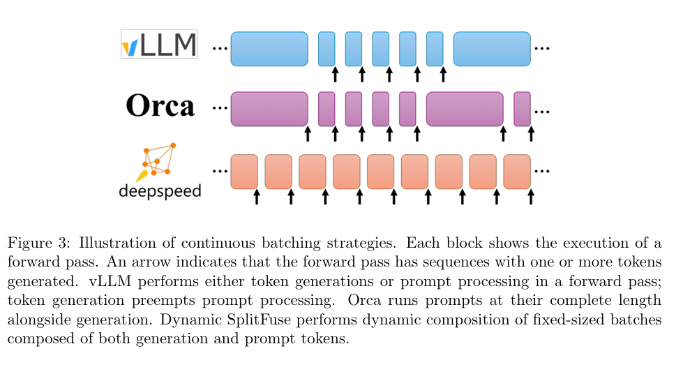

# FastGen
Author by: 汪袁烁

*提示：如果你对于 Prefill 和 Decode 阶段还不是很了解，可以去看我的`./PD 分离`，我在那里对于 Prefill、Decode 以及大模型推理框架中它们是如何运作的进行了一个简要介绍。*

## Introduction

长提示工作负载变得越来越重要，而现有的 VLLM 等框架面临长提示词难以维持高质量的服务。此外，众所周知，LLM 的推理主要分为`prefill`（用户输入 prompt）和`decode`（LLM 输出 token）两个阶段，然而 `decode`的生成阶段往往会打断`prefill`阶段：

>When systems treat them as distinct
>phases, generation will be preempted by prompt processing that risks breaking the service level
>agreements (SLAs).

更具体的，在多个请求进入之后先进行先来先服务的调度策略，但是一旦显存被打满之后，可能后来的请求会通过`Swapping`策略（先释放被抢占请求的所有 block，然后从 gpu 上交换到 cpu 上）
或者`Recomputation`策略（直接释放它们的物理块，把它们重新放入等待处理的队列中，等后续资源充足时再重新从 prefill 阶段开始做推理）。从而发生打断的情况。

为了解决该痛点，本文的主角，`DeepSpeed-FastGen`诞生了。

## background

你也许会想，这个问题难道没有前人发现或者尝试解决吗？当然，在 FastGen 之前，我们往往采用以下方法来处理该问题：

### 分块 KV 缓存

我们知道`KVCache`用来缓存之前所有已经生成的 token 的 key 和 value 向量，目的是在后续生成 token 时重用这些计算，避免重复的 attention 计算。然而它具有
内存碎片化 / 内存浪费 / 预分配无效空间 等问题。为了处理这些问题，VLLM 团队提出了 PagedAttention。更具体的，它通过将每个请求的 KV cache 分割成固定大小的块等方法，可以灵活处理这些空间碎片。

然而它也有自己的局限性，在长 prompt（上下文很长）的场景下，加载 / 处理这个 prompt 本身就是一个巨大的计算 / 内存操作。如果系统设计是区分 prompt processing 和后续 token generation 阶段，有可能在 prompt 阶段占用很长时间或带来调度不平衡。

关于 PagedAttention 的更多细节，我已经放在了`./05-1PagedAttention.md`上了。

### 连续批处理

之前我们说过，`decode`和`prefill`往往被视为两个阶段，这样往往造成负载不均，并且在面临长文本序列的输入时容易花费较长时间。而“Continuous batching”（连续批处理）则允许 请求 随时加入 / 离开 运行的 batch，而不是在 prompt 阶段与生成阶段严格分割、或者说先把所有 prompt 全部处理完才开始生成。也就是说批次是“动态流式”的，而不是静态预先构造。

## motivation

### 关于token延迟

我们知道，对于输入的多个句子我们会对其叠成batch然后输入，维度为[batchsize, seq_len]。那么在一次完整的前向传播（prefill + decode）中，究竟什么对于每个token平均生成延迟影响大呢。

该实验的图可以清晰的看到，叠的batch的形状对平均生成没有显著影响，关键影响的参数是token的数量（bathchsize * seq_len）。换言之，forward pass 的性能瓶颈主要由 总 token 数（tokens_in_forward） 决定，而不是 batch 内的序列数。

我们知道，Prefill 阶段是大 token 数的 batch，Decode 是小 token 数的 batch。因此对于我们的启示是调度器只需统一以 “forward tokens” 为核心指标，因为它们本质对于性能的影响参数可以统一为forward token数量。

### LLM 推理吞吐量随 forward tokens 数变化的规律

刚刚我们发现forward tokens是影响每个token处理延迟的核心，那么它是如何影响LLM推理的吞吐量的呢？

- Token 数较小时（左半段）：吞吐量随着 token 数快速上升；说明 GPU 此时还没有被完全“吃满”，瓶颈在 内存加载（memory-bound）。

- Token 数较大时（右半段）：吞吐量趋于饱和，维持在一个稳定值；此时 GPU 计算单元满负载运行，系统进入 throughput saturation region（吞吐饱和区）；此后再增加 tokens，也不会显著提升性能。

我们可以得到启示，Prefill 阶段由于输入token数量多自然处于饱和区，为了保持Decode阶段处于饱和区，可以通过动态融合提升利用率。

## DeepSpeed-FastGen

### 设计原理 - 数学分析

根据上述motivation，我们可以尝试设计一个调度器来保持Prefill和Decode两个阶段保持在最佳状态。上述图的曲线是一个凸函数，根据数学公式：
$$
0 \geq \lim _{h \rightarrow 0} \frac{f(x+h)-2 f(x)+f(x-h)}{h^2} \quad \Rightarrow \quad 2 f(x) \geq f(x+h)+f(x-h)
$$
用这个不等式推理，我们令h = 0：
$$
f(2 x) \leq 2 f(x)
$$
这意味着若有一组 tokens 总量是 2x，最优的做法不是一次性把 2x 全部投入一个batch而是将它们分成两个大小为 x 的批次分别执行。

更一般的，凸优化中这个定理可以进一步推广，因此我们可以知道：对于一个待处理的总 token 池 P，若系统可以执行 F 次 forward pass 来处理这 P 个 token，那么要最大化总体吞吐量（或平均 throughput），最优做法是 将这 P 个 token 平分到 F 次 forward，即每次用 P/F 个 token。来得到最大吞吐量的效果。

## DynamicSplitFuse

根据上述的规律观察和数学推导，我们不难得到如下结论：

- **对于长 prompt 或长 token 流，应将其切成若干段（chunk）调度到多个 forward**；
- **在多请求并发场景下，应把不同请求的 token 池合并后 “均匀分配” 给每次 forward**；

那么根据这个结论，我们就可以设计出FastGen的核心技术 - DynamicSplitFuse调度策略了

### 核心思想

如图：

它的核心思想是：

对较长的 prompt，将其 拆（Split） 成多个小段，在多个 forward pass 中逐步处理，只在最后一段进行生成（token output）。

对较短的 prompt，将多个 prompt 合并 融合（Fuse），填满目标的 token 预算，使得每个 forward pass 的总 token 数稳定且高效。

通过这样 拆 + 合并的组合，使得每次 forward pass 的 token 数比较集中、稳定，从而更可能落在 GPU 吞吐效率较高的区间。

简而言之，Dynamic SplitFuse 在 PagedAttention 的基础之上引入 prompt 分片、prompt + 生成融合的策略，用来保持每个 forward pass 的 token 数保持一个稳定 / 合理的预算，从而让 GPU 在高吞吐率区域运行更稳定，减少由于 prompt 本身过长引起的不平衡、长前向传递导致的延迟 / 抢占问题。

### 联想和思考

这时候你可能会问，这个不就是`./PD分离`一文中提出的**chunked prefill**思想吗？没错！FastGen的原论文：

>A similar approach has been proposed in Sarathi[11] where it splits a prompt
>into smaller chunks to combine more token generation with prompt processing and to run
>forward passes with consistent batch sizes. 

明确表示借鉴了*Sarathi*的chunked prefill。也即把长序列的prefill和decode利用底层算子的特性融合起来，宏观来看，长序列的prefill貌似被chunked成多份了，但是微观的算子层面，decode阶段仍然可以看到整体的prefill的KV Cahce。

##  Implementation and Usage

前面分析了那么多，对于用户层面而言，我们可能更关心它暴露的上层API以及我们如何使用它们：

# Ref

1. [DeepSpeed-FastGen 论文](https://arxiv.org/pdf/2401.08671v1)
2. [DeepSpeed-MII 文档](https://deepspeed-mii.readthedocs.io/en/rtd-staging/)
3. [OpenLMAI 博客](https://openlm.ai/deepspeed-fastgen/)
4. [DeepSeed 知乎](https://zhuanlan.zhihu.com/p/665494115)
5. [PagedAttention 论文](https://arxiv.org/pdf/2309.06180)
6. [关于 PD 分离](https://www.bilibili.com/video/BV1wcdbYwE6s?spm_id_from=333.788.videopod.sections&vd_source=8a4545c25a1c1192fb4e7e037876e6f4)

