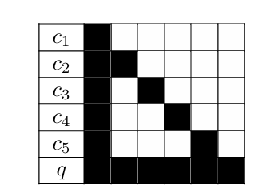

# StarAttention 介绍
Author by: 于佼良

## 一、为什么需要 StartAttention？
在我们搞清楚什么是 StarAttention(下文以 SA 简称)之前，首先我们需要回答，提出 SA 是为了解决什么问题？简单来说，SA 是为了优化在长序列推理的过程中，超长 k，v 带来的内存和计算的巨大开销，并且这个方法是即插即用，不需要对模型进行重新的训练或者微调。 

## 二、什么 StarAttention？
SA 分两部分，第一部分称为上下文编码（Context encoding）。第二部分为查询编码与 token 生成。

### 1. 上下文编码
对于输入序列，它通常由上下文 c 和紧跟其后的 q 组成，在上下文编码中，把这个 c 划分为 n 个连续的块，$$c=[c_1,c_2,...c_n]$$

在每个块中，包含 b 个 token。这里引入了一种锚定块机制，在这个机制中，除了第一个块，每个块都以第一个块作为前缀。图示如下：

每个拼接后的块(下文称为增强块)可以表示为：

$$ c'=[c_1,(c_1,c_2),(c_1,c_3)....(c_1,c_n)] $$

每个主机分配一个 $c_i'$, 共计 2b 个 token，用于生成对应的 K 和 V，以及进行 attention 计算，而锚定块 $c_1$ 的 K 和 V 并不需要保存，当前增强块中的最后 b 个 token 对应的 K 和 V 留在当前的机器缓存中。

如果只是把长序列简单的分块，每个机器持有自己那一部分的 token 并计算 attention，会导致模型的输出结果不正确，这部分自然不难理解，由于每个机器看到的 token 只是整个序列的局部，且没有上下文信息的补充，在计算过程中，自然无法捕捉前文携带的信息。

那么为什么多了一点锚定块就能 work，这里需要提到 attention 的 sink。在 StreamingLLM 的相关论文中提到了这个概念，即通过实验观察发现，在滑动窗口丢弃了最早的 token 之后，输出明显变得糟糕，以此来提示了初始位置那部分 token 的重要性。基于这样的思路，锚定块在 star attention 中的使用就自然而然了，每个增强块的注意力 sink 都会集中在开头的部分，那么开头的部分就使用完整序列的开头部分，即全局注意力的 sink 部分，然后再将它们丢弃，只保留最后 b 个 token 的 k 和 v，此时局部 attention 的分布就会近似全局 attention 的分布情况。

此外，实验中还发现，锚定块对精度的影响完全由它的内容决定，而不是由位置信息决定。实验方式为，对锚定块进行不同规则的位置编码，发现精度差异不大，对锚定块的内容进行修改，发现选择第一个 block 的 token 精度最高，锚定块不选择第一个 block，而是当前 block 的前一个 block 的话，精度也比第一个 block 要差。

初看之下似乎，start attention 和 streaming llm 提到的结论有点相悖，前者认为是信息重要，后者认为绝对位置比较重要。关于这一点，我认为它们本质上是一致的，即对于完整的序列来说，开头的 block，是注意力得分较高的部分，也就是 sink 的部分，start attention 得出的位置不重要的结论只是通过改动 position id，而 first block 的重要性是他们的绝对位置决定的，这个 position id 带来的影响太小。不过这个自圆其说的想法不一定正确，欢迎大家提出指导意见~

### 2、查询编码与 token 生成
这部分就比较常规了, 由于每个机器存放了部分 k 和 v，怎么去算最终的 attention 呢？ 

一个 q，一堆 k 和 v，没错，就是 flash attention！

虽然 flash attention 并不针对分布式的场景，但是 star attention 中提到的上下文编码构造出的分布式 k，v 非常契合 flash attention 的计算方法。关于 flash attention 的具体计算方式，这里就不展开啦~

### 3、性能与精度的 trade off
总的来说，star attention 是通过锚定块这样的 trick，来减少了类似 ring attention 这样的通信，同时又控制了每个机器的计算和内存开销。有一个自然而然的问题，那就是如果上下文块或者锚定块越大，对全局序列的“感受野”就会越大，精度自然会更好，理论上会无限接近全局注意力。但是如果锚定块太大，或者上下文块太大，它就无法带来预期中的性能优化。

下面贴一些简单的图示：

## 三、补充说明
最后简单总结一下，StarAttention 的思路，像是对于 RingAttention 通过求近似解得到的优化。由于 attention sink 的存在，通过锚定块的设计，可以近似计算出类似全局注意力分布的多个局部注意力，从而大大降低了通信的开销。

欢迎批评指正~

#### 参考文献
* Star Attention: Efficient LLM Inference over Long Sequences
* EFFICIENT STREAMING LANGUAGE MODELS
 WITH ATTENTION SINKS

