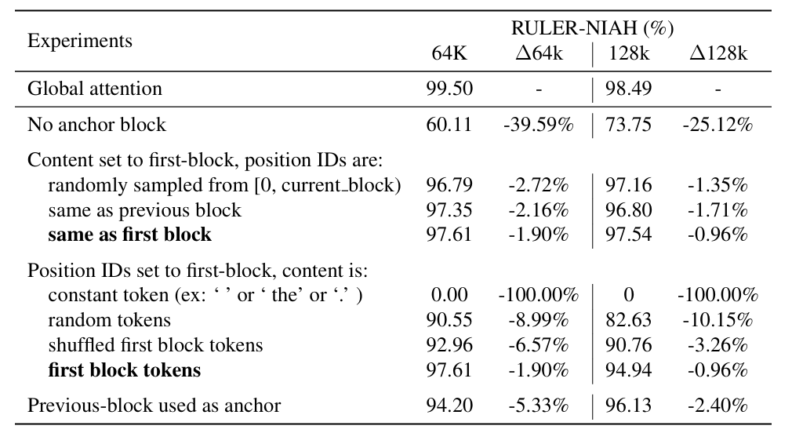

# StarAttention介绍
Author by: 于佼良

## 一、为什么需要StartAttention？
在我们搞清楚什么是StarAttention(下文以SA简称)之前，首先我们需要回答，提出SA是为了解决什么问题？简单来说，SA是为了优化在长序列推理的过程中，超长k，v带来的内存和计算的巨大开销，并且这个方法是即插即用，不需要对模型进行重新的训练或者微调。 

## 二、什么StarAttention？
SA分两部分，第一部分称为上下文编码（Context encoding）。第二部分为查询编码于token生成。

### 1. 上下文编码
对于输入序列，它通常由上下文c和紧跟其后的q组成，在上下文编码中，把这个c划分为n个连续的块，$c=[c_1,c_2,...c_n]$, 在每个块中，包含b个token。这里引入了一种锚定块机制，在这个机制中，除了第一个块，每个块都以第一个块作为前缀。图示如下：

每个拼接后的块(下文称为增强块)可以表示为：

$$ c'=[c_1,(c_1,c_2),(c_1,c_3)....(c_1,c_n)] $$

每个主机分配一个$c_i'$, 共计2b个token，用于生成对应的K和V，以及进行attention计算，而锚定块$c_1$的K和V并不需要保存，当前增强块中的最后b个token对应的K和V留在当前的机器缓存中。

如果只是把长序列简单的分块，每个机器持有自己那一部分的token并计算attention，会导致模型的输出结果不正确，这部分自然不难理解，由于每个机器看到的token只是整个序列的局部，且没有上下文信息的补充，在计算过程中，自然无法捕捉前文携带的信息。

那么为什么多了一点锚定块就能work，这里需要提到attention的sink。在StreamingLLM的相关论文中提到了这个概念，即通过实验观察发现，在滑动窗口丢弃了最早的token之后，输出明显变得糟糕，以此来提示了初始位置那部分token的重要性。基于这样的思路，锚定块在star attention中的使用就自然而然了，每个增强块的注意力sink都会集中在开头的部分，那么开头的部分就使用完整序列的开头部分，即全局注意力的sink部分，然后再将它们丢弃，只保留最后b个token的k和v，此时局部attention的分布就会近似全局attention的分布情况。

此外，实验中还发现，锚定块对精度的影响完全由它的内容决定，而不是由位置信息决定。实验方式为，对锚定块进行不同规则的位置编码，发现精度差异不大，对锚定块的内容进行修改，发现选择第一个block的token精度最高，锚定块不选择第一个block，而是当前block的前一个block的话，精度也比第一个block要差。

初看之下似乎，start attention 和 streaming llm提到的结论有点相悖，前者认为是信息重要，后者认为绝对位置比较重要。关于这一点，我认为它们本质上是一致的，即对于完整的序列来说，开头的block，是注意力得分较高的部分，也就是sink的部分，start attention得出的位置不重要的结论只是通过改动position id，而first block的重要性是他们的绝对位置决定的，这个position id带来的影响太小。不过这个自圆其说的想法不一定正确，欢迎大家提出指导意见~

### 2、

