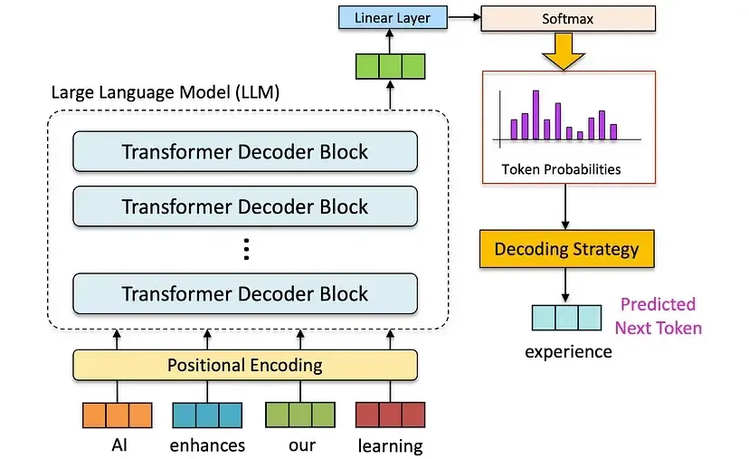
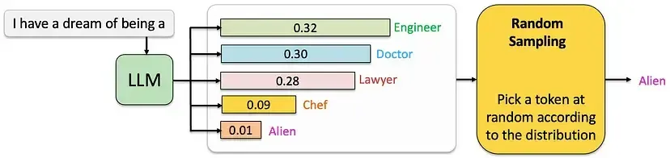
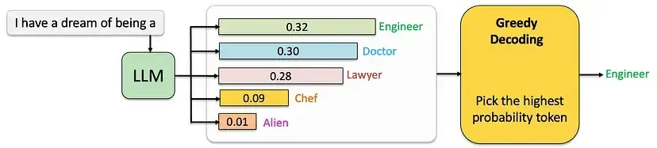
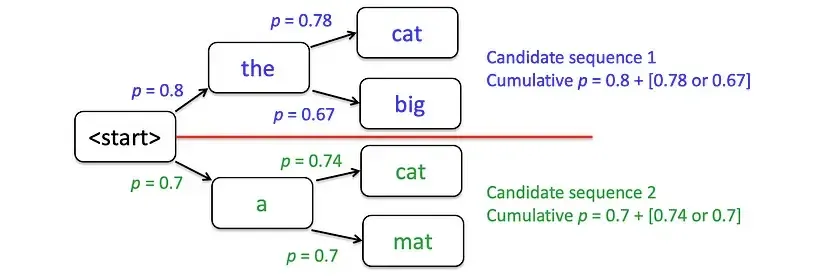
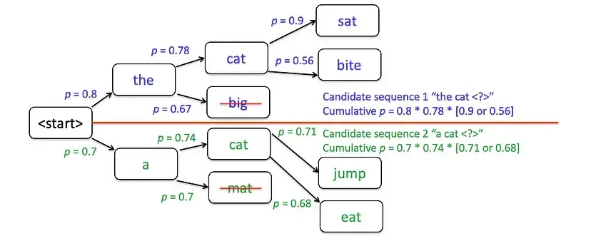
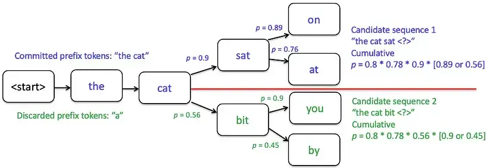

<!--Copyright © ZOMI 适用于[License](https://github.com/Infrasys-AI/AIInfra)版权许可-->

# 01. 大模型采样基础(DONE)

> Author by：杨汝琦

在自然语言处理（NLP）的生成任务中，大模型常被用于文本创作、机器翻译等场景。要让模型生成符合上下文逻辑、连贯自然的文本，**采样**是关键环节——它决定了模型每次生成的词或词元，直接影响输出文本的质量与多样性。

大多数大语言模型以**自回归**方式运行：模型会根据已生成的词元序列，预测下一个词元的概率分布。例如图片所示，模型通过“AI enhances our learning”的序列，预测出下一个词元“experience”。这种特性让模型能捕捉复杂的语言模式与依赖关系，从数学角度可表示为：

$$
\mathit{P(w_n|w_1,w_2,\ldots,w_{n-1})}
$$

其中，$w_n$ 是待生成的下一个词元，$w_1,w_2,\ldots,w_{n-1}$ 是已生成的词元序列。在文本生成过程中，大模型正是通过不同的采样算法，从这个概率分布中确定最终输出的 $w_n$。

本篇文章将从简单到复杂，依次介绍三种常见的大模型输出采样方法：随机采样、贪婪采样和束搜索采样，帮助大家清晰理解每种策略的核心逻辑与实际效果。

## 1. 随机采样 (Random)

### 1.1 原理

随机采样 (Random Sampling) 是大模型采样中最基础的形式：它从模型输出的概率分布中**随机选择下一个词元**，而非直接挑选概率最高的选项，因此可能选中低频的罕见词。  

具体过程为：在生成每一步，模型先通过 softmax 函数计算所有候选词的概率分布（所有候选词的概率和为 1），再根据这个分布随机选择一个词作为下一个输出。  

随机采样的优点是简单直观，能生成多样化的文本，有效避免重复或单调的输出。但它存在显著缺陷：概率分布的“长尾区域”（模型为大量候选词分配低概率的部分）容易被选中——这会导致生成的文本毫无意义、出现语法错误，或是与上下文逻辑脱节，也是大模型用纯随机采样时输出质量易波动的核心原因。

### 1.2 示例

当用户输入 “I have a dream of being a” 时，LLM 会基于训练数据和内部逻辑，为下一个词元的所有候选（如 Engineer、Doctor、Lawyer 等）分配概率值。在图中，这些候选词的概率分别为 0.32、0.30、0.28、0.09 和 0.01。  

随机采样不会直接选择概率最高的 “Engineer”，而是将所有候选词及其概率看作一个**完整的概率分布**，并根据这个分布随机挑选输出。这意味着：即便 “Engineer” 的概率最高，模型仍有可能选择概率较低的词（比如 “Alien”），从而生成新颖甚至出人意料的结果。这种特性能增加文本的多样性与创造性，避免生成重复、死板的句子。

## 2. 贪婪采样 (Greedy)

### 2.1 原理

贪婪采样 (Greedy Sampling) 是典型的“贪心策略”，核心逻辑是**每一步都选择概率最高的词元**。与随机采样不同，它不会从概率分布中随机挑选，而是直接锁定概率最大的候选词作为输出。  

在生成过程的每一步，模型先计算当前所有候选词的概率分布，再直接选择概率最高的词元加入序列，之后基于新序列继续生成下一个词元。  

贪婪采样的优点很明确：能保证每一步都生成“最可能的词”，因此生成的文本通常较为连贯，且符合语法规则。但它的问题也很突出：一是容易陷入“局部最优陷阱”——每一步的“最优选择”可能会让后续词元的概率分布受限，从而错过全局更优的序列（比如忽略低概率词背后隐藏的高概率后续词）；二是输出缺乏多样性，容易显得重复、单调，因为它没有探索其他可能产生更好结果的替代路径。

下面是一个贪婪采样导致文本重复单调的示例：

- 输入：“My favorite color is”（我最喜欢的颜色是）
- 贪婪采样输出：“My favorite color is blue blue blue blue is blue and blue is my favorite color blue”（我最喜欢的颜色是蓝色蓝色蓝色蓝色，蓝色是蓝色，蓝色是我最喜欢的蓝色）

这个例子清晰体现了贪婪采样的问题：多次重复“blue”，却没有添加任何有意义的信息，最终生成单调且不自然的文本。

### 2.2 示例

当用户输入 “I have a dream of being a” 时，LLM 会为下一个词元的候选（如 Engineer、Doctor、Lawyer 等）分配概率值，在图中这些概率分别为 0.32、0.30、0.28、0.09 和 0.01。  

贪婪采样的做法很直接：每次都选择概率最高的词元作为输出，再将这个词元加入输入序列，继续生成下一个词。就像图片中所示，在这个例子里“Engineer”的概率最高（0.32），所以模型会直接选择它作为当前步的输出。这种方法简单高效，但缺点也很明显——由于只考虑当前步的最优解，忽略了全局可能的更优序列，导致生成的文本质量不够自然，且缺乏多样性。

## 3. 束搜索采样 (Beam Search)

### 3.1 原理

束搜索（Beam Search）是贪婪采样的改进版本，介于穷举搜索与贪婪采样之间。它通过在**每个生成步骤保留“束宽”（Beam Width，记为 num_beams）个概率最高的候选序列**，最终从这些序列中选择概率总和最高的结果，以此降低“丢失潜在高概率序列”的风险。  

具体流程可分为四步：

1. **初始化**：从起始词开始，筛选出束宽数量的候选序列（比如束宽=2，就保留 2 个概率最高的初始序列），这些序列按词元的概率排序。
2. **扩展**：每次生成一个词元后，模型会为每个候选序列计算下一词元的概率分布，并选择多个概率最高的词元，分别扩展到对应的候选序列后，形成新的序列集合。
3. **剪枝**：扩展后，对所有新序列的“累积概率”（而非单个词元概率）排序，只保留束宽数量的高概率序列，丢弃其余低概率序列。
4. **重复**：不断重复“扩展-剪枝”的过程，直到生成结束符（如 `<eos>`）或达到预设的最大生成长度。

相比贪婪采样，束搜索能避免局部最优陷阱——通过探索多个候选序列，生成更连贯、更合理且兼具多样性的文本。但它的计算成本更高：当束宽设置较大时，需要处理的序列数量会显著增加，导致计算效率下降，对硬件资源的要求也更高。

### 3.2 示例

以束宽（num_beams = 2）生成“the cat sat on the mat”这句话为例，具体过程如下：

1. 初始阶段：从起始词开始，筛选出概率最高的 2 个候选词——“the”和“a”。
2. 第一次扩展与剪枝：为每个候选词评估概率最高的 2 个下一词元（比如“the”对应“cat”“big”，“a”对应“cat”“mat”），之后计算所有新序列的累积概率，只保留得分最高的 2 个序列（例如舍弃“the big”和“a mat”，选择“the cat”和“a cat”）。

在下一个步骤中，继续对“the cat”和“a cat”进行扩展：比如“the cat”扩展出“the cat sat”“the cat ran”，“a cat”扩展出“a cat sat”“a cat slept”。之后再次剪枝——舍弃“the cat ran”和“a cat slept”，保留累积概率更高的“the cat sat”和“a cat sat”。若某一步中，线上方的候选词概率高于下方，它们就会成为下一步的核心候选序列。

需要注意的是：束宽越大，能探索的序列可能性越多，理论上能生成更好的结果，但计算成本也会同步增加；当束宽=1 时，束搜索本质上就等同于贪婪采样——因为每一步只保留 1 个概率最高的序列。

尽管束搜索在“探索”与“利用”之间取得了平衡，比贪婪采样的输出更优，但它仍有不足：一是可能存在重复问题（比如多次围绕同一主题词展开）；二是多样性有限，无法覆盖所有潜在的合理序列；三是束宽较大时，计算效率会明显下降。

下面是一个束搜索采样导致文本重复的示例：

- 输入：“My favorite color is”（我最喜欢的颜色是）
- 束搜索采样输出（k = 3）：
  - “My favorite color is blue because blue is a great color”（我最喜欢的颜色是蓝色，因为蓝色是很棒的颜色）
  - “My favorite color is blue, and I love blue clothes”（我最喜欢的颜色是蓝色，而且我喜欢蓝色的衣服）
  - “My favorite color is blue, blue is just the best”（我最喜欢的颜色是蓝色，蓝色就是最好的）

这个例子中，“blue”在每个输出序列中都多次出现，尽管束搜索生成了 3 个不同序列，但整体语义相似、存在重复，仅在细节表达上有细微差别。

## 4. 总结与思考

三种采样策略各有侧重，核心权衡集中在“多样性”“连贯性”与“计算成本”三者之间：  

- 随机采样：多样性最高，但连贯性最差、输出质量波动大，适合需要创意性的场景（如诗歌创作、脑洞对话）；  
- 贪婪采样：连贯性中等、计算成本最低，但多样性最差，适合对效率要求高、无需多样输出的场景（如固定格式摘要、关键词生成）；  
- 束搜索：连贯性最高、多样性中等，但计算成本高于前两者，适合对输出质量要求高的场景（如机器翻译、学术文本生成）。  

在实际应用中，工业界很少直接使用这三种基础策略，更多是在此基础上优化（如 Top-K 采样、核采样/Nucleus Sampling）——这些进阶策略能进一步平衡“多样性”与“连贯性”，减少基础策略的缺陷，是当前大模型文本生成的主流选择。

## 5. 参考与引用

- [一文读懂 LLM 解码策略：从贪婪解码到核采样](https://segmentfault.com/a/1190000046114574)  
- Hugging Face Docs. *Text Generation Strategies*（大模型采样实践权威指南）
