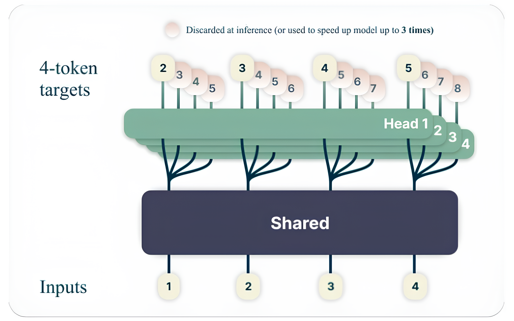
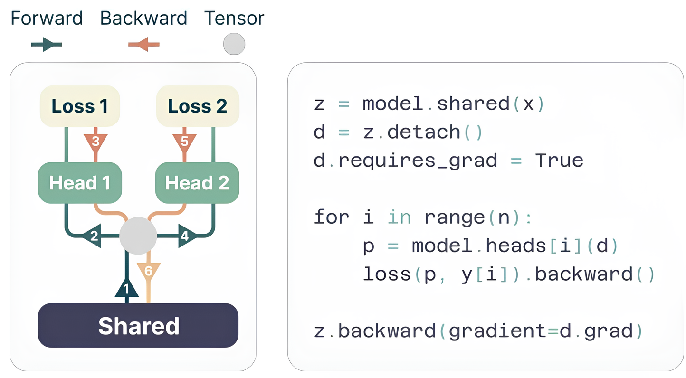

# 并行采样：深入解析 Multi-Token Prediction 与 Lookahead Decoding
> Author by：李文骁

在大语言模型（LLM）中，传统自回归解码（Autoregressive Decoding）每次仅能生成 1 个 Token，导致推理速度随生成序列长度线性增长。为解决这一问题，业界涌现出多种非自回归采样优化技术，比如 Multi-Token Prediction 与 Lookahead Decoding.
## 一、Multi-Token Prediction（MTP）
### 1.1 MTP 在训练阶段作用
MTP 初衷是为了让 LLM 训练更高效。在传统 LLM 训练时，每一步只预测“下一个 token”，而 MTP 则在每一步同时预测“接下来 n 个 token”（比如一次预测 3 个），用多个独立的输出头并行计算。
例如，Meta 在 2024 年发表的论文《Better & Faster Large Language Models via Multi-token Prediction》中，于共享权重层后接入多个单独的输出头，在每一步并行预测多个 token，提升了模型的长序列预测能力。

其中每个输出头的输入均为上一层的输出特征，彼此权重独立更新，旨在学习多个 token 间的通用知识。

在 DeepSeek-V3 技术报告中显示，其进一步优化了 MTP 模块结构，用“级联模块”保持前后 token 预测的逻辑连贯——每个模块基于前一个模块的输出预测下一个 token，保持因果关系，避免了生成序列前后矛盾。目前开源的 llm 模型（例如 Qwen3-Next、GLM-4.5），训练时都加了 MTP 模块以提升性能。

### 1.2 MTP 在推理阶段作用
MTP 在推理阶段存在较多限制:
- 由于在训练时，每一个 MTP 模块只学习了基于前一模块输出特征的单步推理，在递归多步预测情况下（当前 MTP 模块输出，在下一轮作为自己的输入），输出分布会逐渐偏离训练目标，即随着 mtp 模块数增加，采纳率会迅速下降。
- MTP 大多为“独立模块”设计：要预测 3 个 token，就得加载 3 个 MTP 模块，每个模块有自己的权重和缓存。存在额外的内存占用，且预测调度以及 kv cache 的管理较为复杂（比如要协调 3 个模块的计算顺序和 kv cache 细节）。
- 当前主流大模型(例如，deepseek v3、Qwen3-Next、GLM-4.5)的开源权重中，MTP 头个数（num_nextn_predict_layers），均为 1。

由于上述限制，在当前主流的开源推理框架（vllm 和 sglang）中，对于 MTP 加速推理这一特性，均仍采用“EAGLE-style”框架，即只使用一个 MTP 头作为草稿模型，按照要求生成 k 个待选 token，再由主干模型验证并决定是否采纳。主体预测流程如下：

#### 1.2.1 验证前的前置步骤：草稿生成（Drafting Phase）
在每一轮的预测中，会根据需要额外预测的 token 数量 k，通过**MTP 头（Multi-Token Prediction Head）** 递归生成草稿序列，为后续验证做准备：
1. **初始 token 生成**：主模型先对输入序列 \(t_{1:i}\) 进行一次前向计算，生成第一个“已验证 token” \(\hat{t}_{i+1}\)（作为草稿序列的起始锚点）。
2. **递归草稿生成**：MTP 头以 autoregressive（自回归）方式递归生成 \(K\) 个草稿 token（\(K\) 为预设的草稿深度）：
   - 第 1 步草稿（\(k=1\)）：MTP 头接收主模型输出的隐藏状态 \(h_i\)，并结合“输入序列+已验证 token”（\([t_{2:i};\hat{t}_{i+1}]\)）的嵌入，生成第一个草稿 token \(\hat{t}_{i+2}\)。
   - 第\(k>1\)步草稿：MTP 头复用前一步（\(k-1\)）输出的隐藏状态 \(\hat{h}_{i+k}\)，并结合前一个草稿 token \(\hat{t}_{i+k}\) 的嵌入，生成第\(k\)个草稿 token \(\hat{t}_{i+k+1}\)。
3. **最终草稿序列**：经过\(K\)步递归后，得到完整的草稿序列 \(\hat{t}_{i+2:i+K+1}\)（长度为\(K\)），与已验证 token \(\hat{t}_{i+1}\) 共同组成待验证的“扩展序列”。

#### 1.2.2 主模型的验证流程（Verification Phase）
主模型对草稿序列的验证遵循**并行计算+严格接受准则**，确保输出分布与原始自回归解码完全一致（无损质量），具体步骤如下：

- 并行计算草稿 token 的 logits
    主模型不再逐 token 进行自回归计算，而是一次性对所有草稿 token 进行**并行前向计算**：
    - 输入：将待验证的“扩展序列”（已验证 token \(\hat{t}_{i+1}\) + 草稿序列 \(\hat{t}_{i+2:i+K+1}\)）输入主模型。
    - 并行计算：主模型对草稿序列对应的位置（\(i+2\) 到 \(i+K+1\)）同时计算 logits（即每个位置的 token 概率分布），避免了传统自回归“一次一 token”的串行开销。

- 基于严格准则的草稿接受判断
    验证的核心是判断草稿 token 是否与主模型“原生自回归生成的 token”一致，采用**逐位置串行接受**策略（确保因果一致性）：
    - 接受准则：从第一个草稿 token（\(\hat{t}_{i+2}\)）开始，依次对比“草稿 token”与“主模型在该位置采样的 top-1 token”（即主模型原生生成的 token）：
    - 若一致：接受该草稿 token，继续验证下一个。
    - 若不一致：立即停止验证，**仅接受前序一致的草稿 token**，后续未验证的草稿 token 全部丢弃。
    - 理论保证：《Fast Inference from Transformers via Speculative Decoding》论文明确指出，该验证准则严格遵循推测解码的理论基础，可确保最终输出分布与原始主模型完全一致，无需额外评估生成质量。

- 验证后的序列延续
  - 若\(m\)个草稿 token 被接受（\(0 \leq m \leq K\)），则当前生成序列更新为 \(t_{1:i+1+m}\)（已验证 token + \(m\)个接受的草稿 token）。
  - 主模型以更新后的序列为输入，进入下一轮“草稿生成-验证”循环，直到达到预设的最大生成长度。

## 二、Lookahead Decoding

