<!--Copyright © ZOMI 适用于[License](https://github.com/Infrasys-AI/AIInfra)版权许可-->

# 03. 知识蒸馏(DONE)

> Author by：曾薇敏, ZOMI

大模型蒸馏（Model Distillation）是一种知识迁移技术，旨在将一个大型、复杂、高性能的“教师模型”（Teacher Model）的知识，迁移到一个更小、更高效、更适合部署的“学生模型”（Student Model）中。其核心思想是让学生模型学习教师模型的“行为模式”而非仅仅学习原始数据标签，从而在保持较高性能的同时大幅降低计算和存储成本。

接下来将重点介绍大模型的知识蒸馏相关技术，并展开几个经典的知识蒸馏框架和算法进行详细解读。

## 什么是大模型蒸馏

知识蒸馏是人工智能与深度学习领域的一项核心技术，其本质在于将大型复杂模型中的知识与能力迁移到更小、更高效的模型之中。这一过程源于早期的神经网络研究，最初的目标是通过模仿教师模型的输出，来训练出能够在资源受限环境中部署的学生模型。

随着大语言模型的兴起，知识蒸馏（KD）在大型语言模型（LLMs）中发挥着三个关键作用：

1. 主要为了**增强能力（advance）**，即通过从教师模型中提取和迁移知识，使学生模型能够掌握更高层次的推理与认知模式；

2. 提供传统的**压缩作用（compress）**，在保持性能的同时减少模型规模和计算开销，提高运行效率；

3. 一种新兴趋势是通过**自我生成知识实现自我改进（self-improvement）**，即利用模型自身生成的数据不断迭代训练，从而实现能力的持续提升。

LLMs 的通用知识蒸馏流程是⼀个结构化、系统化的过程，旨在将知识从复杂的教师模型迁移到较简单的学⽣模型。如下图所示，整体流程可分为四个阶段，每一阶段均对应着蒸馏在不同功能维度上的作用。

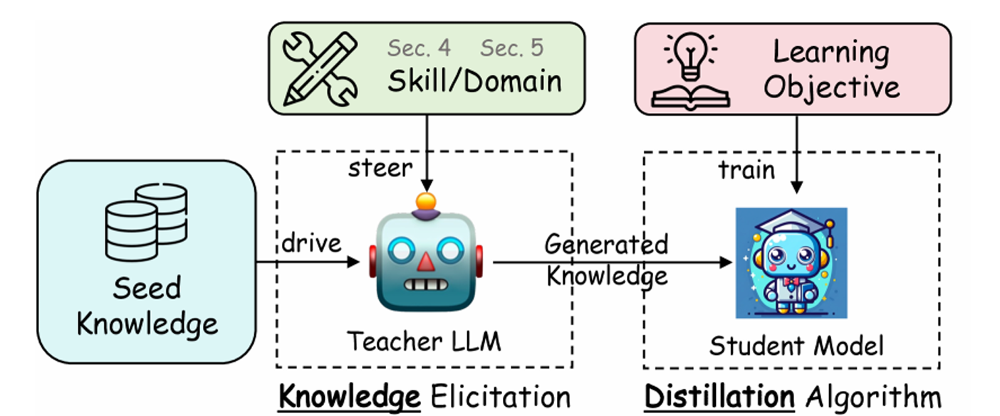

第一阶段是**目标技能或领域的引导**。教师模型通过提示或模板被聚焦到特定的知识范围或能力类型。与早期的无差别模仿不同，这一过程强调对教师知识的定向挖掘。例如，将教师模型限定在医学、法律等专业领域，或推理、语言理解等能力上。

第二阶段是**种子知识的注入**。种子知识通常是小规模的输入数据集，包含与目标领域相关的少量知识实例或线索。其作用是为教师模型提供生成的起点，使其能够基于有限的输入扩展出更大规模、更系统的训练样本。

第三阶段是**蒸馏知识的生成**。教师模型在指令和种子知识的引导下，生成符合目标领域的示例。示例不仅包括答案，还可能包含推理链条与解释性内容。教师模型将自身的隐性推理能力外化为显性数据，使学生模型能够从中学习如何进行复杂思考。

第四阶段是**学生模型的训练与优化**。生成的蒸馏数据被用作训练语料，学生模型在损失函数的约束下不断调整参数，以最小化与教师输出之间的差异。

总体而言，大模型蒸馏流程是一个多维度的知识迁移框架。它通过目标引导和种子扩展实现能力拓展，通过训练优化实现性能压缩。随着开源大模型的发展，蒸馏已不再局限于单向的“教师—学生”模式。利用开源模型自身作为教师角色，通过生成数据和自蒸馏的方式不断迭代更新已经成为新的趋势。

## 主流蒸馏方法分类

当前，针对大规模语言模型的知识蒸馏方法呈现多样化趋势，下面是一些比较典型的大模型蒸馏的类别。

**稀疏→稠密蒸馏**：稀疏→稠密蒸馏指使用稀疏的混合专家（Mixture-of-Experts, MoE）教师模型，将其知识迁移到结构致密的学生模型的过程。

典型流程通常分为**知识聚合**和**标准蒸馏**两阶段，先将不同专家的知识（如参数或输出）进行汇总，即聚合预训练专家知识，然后再通过常规的蒸馏损失对学生模型进行微调。知识聚合方式包括线性叠加和层次融合等。常用知识聚合策略包括对专家参数加权求和、取平均、Top-K 聚合或奇异值分解等方式收集知识，然后以 KL 散度等蒸馏损失细化学生。目标是在保持高性能的同时，获得一个硬件友好的稠密模型。此外，针对 MoE 特性，还有方法（“Every Expert Matters”）提出了专用的蒸馏机制，通过知识增强（KA）学生感知路由器（SAR）未激活专家的知识，让学生模型能更有效地利用所有专家的输出，这在 ROUGE-L 等指令遵循评估中被证明能显著优于常规 KD 基线方法。

**多模态蒸馏**：多模态蒸馏指从包含多种模态信息（如视觉+语言）的教师模型向学生模型传递跨模态知识的过程。其基本机制通常包括对不同模态的表示进行对齐和融合，以使学生学习教师在视觉、语言等任务上的综合能力。

常见方法需要设计多模态对齐损失，包括跨模态表示对齐蒸馏和模态间关系蒸馏等，如**表示对齐蒸馏**通过最小化视觉和语言特征的距离（例如 LLaVA-KD 中的 MDist 将视觉表征与语言表征对齐）；**关系蒸馏**则关注元素之间的关系保持（如 LLaVA-KD 中的 RDist 对视觉令牌关系进行学习）。训练策略包括联合蒸馏和分阶段蒸馏，LLaVA-KD 采用三阶段训练（蒸馏预训练、监督微调、蒸馏微调），并结合多模态输出蒸馏（MDist）和视觉关系蒸馏（RDist），以同时对齐学生模型的视觉特征和输出分布。有方法采用基于隐式视觉知识的方案，如 VIKDF (Visual Implicit Knowledge Distillation Framework) 通过 IQ-Former 提取视觉隐式知识，并利用 BVIF 技术将知识融入 LLM，使其能够生成连贯、富有情境理解的对上表展示了 Distinct-4 指标和语言模型损失（多样性分析）。

**数据蒸馏**：“数据蒸馏”是数据增强 (Data Augmentation, DA) 与 KD 框架结合的一种强大范式，包括数据集蒸馏，伪标签数据蒸馏，合成数据蒸馏，任务驱动数据蒸馏等。**数据集蒸馏**旨在将大规模训练集压缩为极小的合成样本集合，同时保留原数据的训练效果，即一个教师 LLM 在庞大的原始数据库上进行训练。通过数据集蒸馏，合成一个紧凑、高质量的子集（蒸馏数据库），以保留关键知识，然后使用这个较小的数据集来训练学生 LLM，旨在达到与教师相似的性能，同时需要显著更少的数据。

数据蒸馏方法主要可分为**基于优化的数据压缩**与**合成样本**生成两大类。前者采用梯度匹配、轨迹匹配等元学习技术迭代优化小数据集，使学生在该数据上训练时近似原数据训练效果；后者则利用生成模型或教师模型反演等手段直接合成语料（如使用 MMD 匹配分布或 Prompt 引导大模型生成数据）。另一种趋势是提示驱动的合成数据，通过设计提示词让大模型生成任务相关的伪标注数据，以此训练学生。如 UltraChat 通过收集跨领域（如关于世界的提问、创作与生成、现有材料协助）的元信息，指导教师 LLM 蒸馏出具有词汇和主题多样性的大规模指令和对话数据。还有 Phi 系列 (Phi-1, Phi-1.5)，其专注于蒸馏“教科书质量”的数据集，例如在编码领域，蒸馏出清晰、独立、具有指导意义且平衡的内容，以小数据集实现卓越性能。

**与 RL 结合**：结合强化学习的蒸馏在学生模型训练中同时引入教师监督和环境奖励，将知识蒸馏和强化学习目标统一优化。实验证明相比单独使用 RL 或 KD，联合训练能更高效地提升模型推理能力。例如，LLMR 方法通过从教师 LLM 的预测概率导出 q 值并构造奖励函数，然后用策略梯度方法让学生根据该奖励进行训练，使用反向散度缓解了暴露偏差问题。类似地，DeepSeek 团队使用基于 RL 优化的教师模型生成高质量推理示例，然后通过传统的监督蒸馏让小模型学习这些知识。

该类方法需要设计**联合损失**或**奖励塑形**，将蒸馏损失（如 KL 散度）与环境回报结合。奖励塑形是指在原始奖励中加入教师监督得到的 KL 项，使学生的策略优化既考虑任务回报也模仿教师；联合损失优化是指将传统交叉熵或 KL 蒸馏损失作为 RL 的辅助损失同时最小化。**直接偏好优化**（Direct Preference Optimization）DPO 是一种简化 RL 目标的方法，它将涉及奖励最大化和 KL 散度约束的强化学习目标流线化为单阶段的策略训练。例如，Zephyr 模型 就利用 DPO 蒸馏教师 LLM 中的偏好对齐知识。

## 主流大模型蒸馏算法与效果

### MiniLLM

MiniLLM 框架的核心方法的整体思路是将蒸馏目标从传统的正向 KL 散度替换为反向 KL 散度（RKL），这一机制被应用于白盒知识蒸馏，避免学生模型高估教师分布的长尾概率。其通过策略梯度推导，并设计了三项关键策略——单步分解（减少方差，通过精确期望计算单步质量）、教师混合采样（抑制奖励作弊，提高采样质量）以及长度归一化（解决长度偏差，避免偏好短文本）。在不同模型族与多种规模上，系统性地评估了 MiniLLM 框架的性能。结果显示，MiniLLM 在生成质量、长文本一致性、概率校准性（ECE 低）等方面显著优于传统 KD 和 SFT，并且通过在策略采样有效缓解了暴露偏差。MiniLLM 的性能与教师模型规模呈正相关，部分学生模型甚至超过教师模型表现。

传统 KD 方法普遍基于**正向 KL 散度 $KL[p‖q]$** 作为优化目标，即令学生模型尽可能覆盖教师模型的概率分布。这种“模式覆盖（mode-covering）”特性在分类任务中通常有效，但在开放式文本生成任务中却带来了严重问题：教师模型的分布往往包含大量长尾模式，而学生模型容量有限，被迫去拟合低概率区域，容易导致生成质量下降。更具体而言，学生模型在训练时过度追逐教师的长尾分布，推理时则表现为**暴露偏差（exposure bias）**、文本不连贯以及生成内容的置信度偏差。以**反向 KL 散度 $KL[q‖p]$ 替代正向 KL 散度**作为蒸馏目标。与正向 KL 的模式覆盖不同，反向 KL 具有**模式寻求（mode-seeking）** 的特性，使学生模型更专注于教师分布的高概率区域，而非追逐长尾噪声。

**算法简介**：

MiniLLM 的蒸馏流程可概括为以下几个关键步骤：首先在输入与初始化阶段，准备指令数据集 D（用于蒸馏对齐）、预训练语料 $D_{PT}$​（保持语言建模能力）、教师模型 p、以及已在 $D_{PT}$​ 上预训练的学生模型 $q_{θ0​​}$，并设定学习率、批大小和梯度裁剪阈值等超参数。通过这一流程，学生模型不仅继承了教师分布的高概率模式，还在长文本生成、一致性与校准性上超越了传统蒸馏方法为了让学生模型具备基本的指令遵循能力，算法先在 D 上进行一次监督微调，选取验证集损失最低的参数 θ 作为起点。进入核心的迭代蒸馏阶段，每轮训练会从 D 中采样提示并获取教师响应，同时从 $D_{PT}$ 中采样长文档文本。接着计算三类梯度：一是基于反向 KL 的单步分解梯度；二是长度归一化梯度；三是语言建模梯度。最后，将这三类梯度（以及 PPO 风格的裁剪）结合起来更新参数 θ，不断迭代直至收敛。

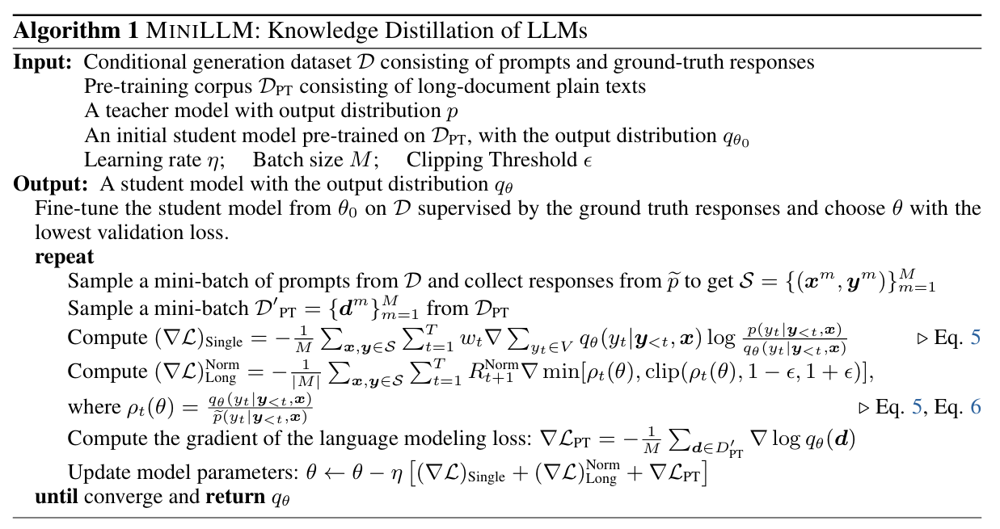

**实验结果**：

上图所示为评估结果。GPT4 和 R-L 分别表示在 5 个随机种子下的 GPT-4 平均反馈分数和 Rouge-L 分数。每种模型规模的最佳分数用加粗字体表示，当学生模型表现超过教师模型，其分数则标记为 *。

实验结果表明，MiniLLM 在多个规模和模型族下均显著优于基线方法。与传统 KD 和 SeqKD 相比，MiniLLM 更好地对齐教师分布，在 Rouge-L 和 GPT-4 偏好评测中均取得领先。在部分规模下（如 GPT-2 760M 的学生模型），MiniLLM 的表现甚至超过了对应的教师模型。MiniLLM 生成的文本在流畅性、相关性和逻辑性上普遍优于 SFT、KD 与 SeqKD。

如上图，基于 LLaMA 系列模型，在 SelfInst 数据集上的结果中，MiniLLM 在人类偏好方面优于所有基线方法，并与教师模型表现相当。

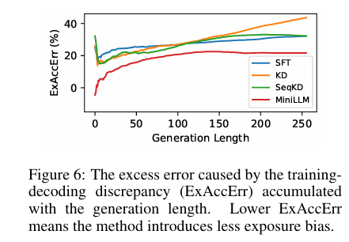

上图是训练-解码差异导致的累积超额错误（ExAccErr）随生成长度的变化，MiniLLM 的 ExAccErr 显著更低，并在长文本生成（>150 tokens）中误差停止累积，表明反向 KL 的模式寻求特性有效缓解了暴露偏差。

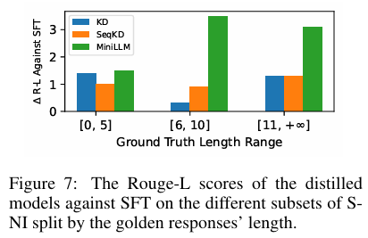

上图是在 S-NI 数据集上按响应长度划分的子集上，蒸馏模型相对于 SFT 的 Rouge-L 评分。在需要较长响应（≥6 tokens）的任务中，MiniLLM 相比标准 KD 模型显示出明显优势，但在短响应任务上性能相似。

上表是 SST2 和 BoolQ 数据集上的 ECE（Expected Calibration Error） 和准确率得分（校准性分析）。MiniLLM 的校准性显著优于基线方法（ECE 更低），并且准确率更高。

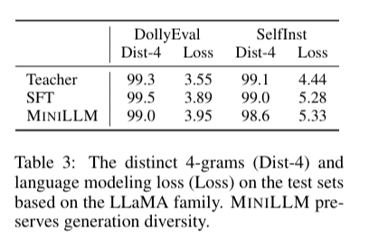

上表展示了 Distinct-4 指标和语言模型损失（多样性分析）。在 Distinct-4 指标上，MiniLLM 与基线方法相近，说明反向 KL 的模式寻求特性并未导致明显的模式坍缩。学生模型既能保证生成质量，也能维持基本的多样性。

实验结果清晰地展示了 MiniLLM 框架的有效性与稳健性。通过引入反向 KL 与三项稳定训练策略，MiniLLM 不仅在整体生成质量上超过传统蒸馏方法，还显著改善了长文本一致性与概率校准。同时，学生模型的多样性未受到明显削弱，表明模式寻求与生成多样性之间可以取得良好平衡。

### LM-Cocktail（混合专家）

针对预训练语言模型（LM）微调后通用能力显著退化（即**灾难性遗忘**）的问题，**LM-Cocktail**被提出以增强微调模型的通用弹性(即具备通用性和专业性)。该技术的核心思路是**模型合并**（model merging）。它通过**加权平均**的方式，合并目标任务微调模型、预训练基础模型，以及来自其他领域的同类模型。其中，合并权重可以基于目标域的少量（例如 5 个）验证示例的预测损失自动计算。实验结果表明，LM-Cocktail 在 Llama 和 BGE 等模型上表现出惊人的有效性。它能够在维持目标任务卓越性能的同时，显著提升模型在 FLAN、MMLU 和 MTEB 等通用任务上的表现和弹性。该方法适用于基于解码器和基于编码器的 LM，且具有**极简**和**兼容**的优势。

在大模型的压缩与迁移中，LM-Cocktail 与知识蒸馏常以互补方式结合使用，包括蒸馏前融合，即先将多个教师模型的参数融合成综合教师，再通过 SFT、RLHF 或 DPO 等方法训练学生模型，以实现教师知识的统一；蒸馏后融合，即先分别蒸馏出多个小模型，再通过参数融合提升泛化性与稳定性；以及动态融合蒸馏，在蒸馏过程中动态调整模型融合比例，实现多源教师知识的持续注入（如 MergeKD, 2024）。

**技术范式:**

LM-Cocktail 被设计为一个通用范式，能够融合多来源的模型权重以恢复通用性能。该范式的前提条件是具备一个为通用应用而预训练的基础语言模型 $\mathcal{m}_{b}$，以及针对特定目标任务 $t$ 利用领域特定数据 $\boldsymbol{X}_{t}$ 微调得到的专家模型 $\mathcal{m}_{t}$。为增强通用弹性，LM-Cocktail 将目标任务的专家模型与包括基础模型在内的其他领域专家模型 $\{\mathcal{m}_{d}\}_\mathcal{D}$ 进行加权合并。最终得到的通用弹性模型 $\mathcal{m}_{r}$ 的权重通过以下通用合并函数确定：

$$m_r \leftarrow \alpha m_t + (1 - \alpha) \sum_{m_b, {m_d}_D} w_i * m_i \quad(1)$$

其中，${m}_{r}$ 代表弹性模型，$\alpha$ 是一个超参数（默认值为 0.5）。公式（1）将目标任务微调模型 ${m}_{t}$ 与其他候选模型进行组合，其中 $w_{i}$ 代表归一化后的合并权重，需满足 $\sum_{i}w_{i}=1$。

LM-Cocktail 的核心关键之一是如何自动且高效地确定合并权重 $w_{i}$。由于弹性模型 ${m}_{r}$ 需要在保留目标域卓越性能的同时提升通用领域的表现，因此候选模型在目标域的性能成为分配合并权重的关键指标。LM-Cocktail 引入了一种基于目标任务少量（few-shot）验证样本 $e_{t}$ 的预测损失来计算权重的方法。该机制通过 softmax 函数，将损失值转化为权重分配：

$$w_{i}\leftarrow\mathrm{softmax}(-\mathcal{l}(\mathcal{m}_{i},e_{t})/\tau) \quad (2)$$

在该公式中，$\mathcal{l}({m}_{i},e_{t})$ 表示候选模型 ${m}_{i}$ 在目标域 $t$ 的少量验证样本 $e_{t}$ 上的预测损失，而 $\tau$ 是控制平滑度的温度参数。该损失驱动的权重分配机制确保了在目标任务上表现较差（即损失较大）的候选模型将被分配较小的系数，从而保障了合并后的模型在目标任务上的性能不会因融合低效模型而降低。根据实验，仅使用 5 个少量样本就足以达到有竞争力的结果。

LM-Cocktail 的通用范式可以根据实际资源限制进行调整。在最简单的情况下，即**单专家模型**（Mono-Specialist）场景，如果缺少其他通用领域的专家模型，合并函数将简化为仅合并目标模型 $m_t$ 与基础模型 $m_b$ 的形式：
 $$ m_r \leftarrow \alpha m_t + (1 - \alpha) m_b \quad(3) $$ 

在这种情况下，通常直接采用超参数 $\alpha$ 来控制两者权重（例如 $\alpha=0.5$），而不需要使用损失计算。此外，即使在目标域缺乏训练数据无法进行微调的情况下，LM-Cocktail 仍然可以应用，通过合并基础模型和现有通用领域专家模型，仅利用少量目标域验证样本 $e_t$ 计算权重，即可为下游任务生成定制模型，这一过程避免了训练新模型的成本。LM-cocktail 的实验结果验证了其通用适用性，它能对基于解码器（如 LLaMA）和基于编码器（如 BGE）的语言模型都做出实质性贡献。

LM-Cocktail 框架之所以在实践中备受关注，源于其独特的设计所带来的多项核心优势，主要是以下几点：

- **极其简单 (Extremely Simple)**
  - 该方法无需进行昂贵的额外训练，模型合并的权重可以直接通过在少量验证样本上进行推理来计算，操作流程极为简便。
- **完全兼容 (Fully Compatible)**
  - LM-Cocktail 可以作为一个独立的“后处理”步骤，无缝集成到任何现有的模型微调工作流中，无需对既有流程进行任何修改。
- **富有竞争力 (Empirically Competitive)**
  - 大量实验证明，通过该方法生成的模型，既能在目标专业领域保持与原始微调模型相媲美的卓越性能，又能在通用任务上实现强大的性能恢复。
- **普遍适用 (Universally Applicable)**
  - 该框架的有效性不仅限于特定类型的模型架构，它已被证实对**解码器模型**（Decoder-based LMs，常用于文本生成）和**编码器模型**（Encoder-based LMs，常用于文本表示）均有显著效果。

这些优势得到了广泛的实证分析支持，下一节我们介绍相关的实验数据与关键发现。

**LM-Cocktail 实验结果分析:**

LM-Cocktail 的实验结果通过对基于解码器的 LLaMA 模型和基于编码器的 BGE 模型进行全面评估，证实了其有效性和通用适用性。

上图直观地说明了微调会导致通用能力显著退化，而 LM-Cocktail 能够在提高目标任务准确性的同时，保持甚至增强模型在其他不相关任务上的准确性。

在针对特定任务进行微调的场景中，实验对比了基础模型（Base）、微调模型（Fine-tuned）和两种 LM-Cocktail 变体（LM-Cocktail$_{2}$ 和 LM-Cocktail$_{10}$）的性能。

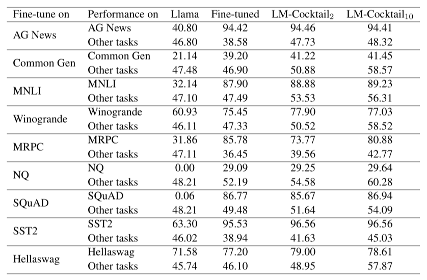

以上表 Llama 的结果为例，虽然微调模型在目标任务（如 AG News）上实现了显著提升（从 40.80% 升至 94.42%），但其在剩余的 29 个“其他任务”上的平均准确率大幅下降（从 46.80% 降至 38.58%），验证了灾难性遗忘的存在。相比之下，LM-Cocktail$_{2}$（合并基础模型和微调模型）在目标任务上保持了高准确率（94.46%），同时显著恢复了“其他任务”的性能（升至 47.73%）。而融合了更多专家模型的 LM-Cocktail$_{10}$ 则进一步将通用任务的性能提升至 48.32%，**在多数情况下甚至超越了原始的基础模型**。

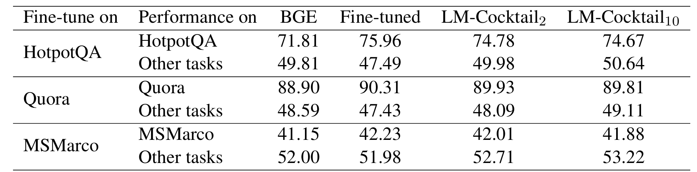

上表针对编码器模型 BGE 进行了类似的分析，观察到了相同的趋势：LM-Cocktail$_{2}$ 和 LM-Cocktail$_{10}$ 成功地在保持下游任务性能的同时，提高了模型在其他不相关任务上的表现，验证了 LM-Cocktail 对表示模型和生成模型的普适性。此外，**图 2** 展示了在最简配置（仅合并基础模型和微调模型）下，通过调整微调模型权重 $\alpha$ 可以发现在目标任务性能不下降的前提下，显著提高模型在其他任务上的准确性，甚至超越基础模型。

LM-Cocktail 的另一关键优势是其在目标域缺乏微调数据时的应用能力（Without Fine-tuning）。在这种情境下，该方法通过合并现有的基础模型和通用领域专家模型，利用少量（few-shot）目标域验证样本计算合并权重。

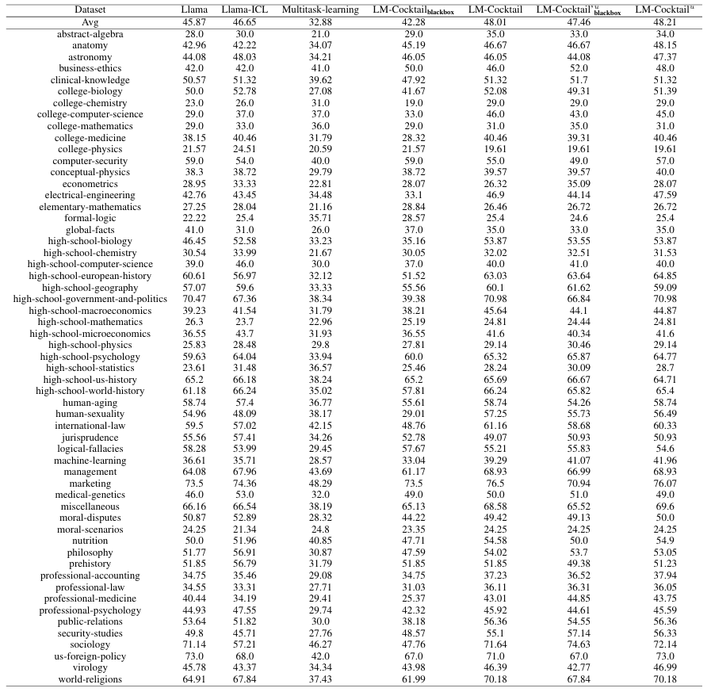

上表展示了在 MMLU 基准测试（包含 57 个未在微调中出现的任务）上的结果，LM-Cocktail 在平均准确率上显著优于 Llama 基础模型和 Llama-ICL（上下文学习）方法。这证明 LM-Cocktail 仅通过重组现有模型，**无需额外训练**，即可实现性能的显著提升，且不增加推理延迟。

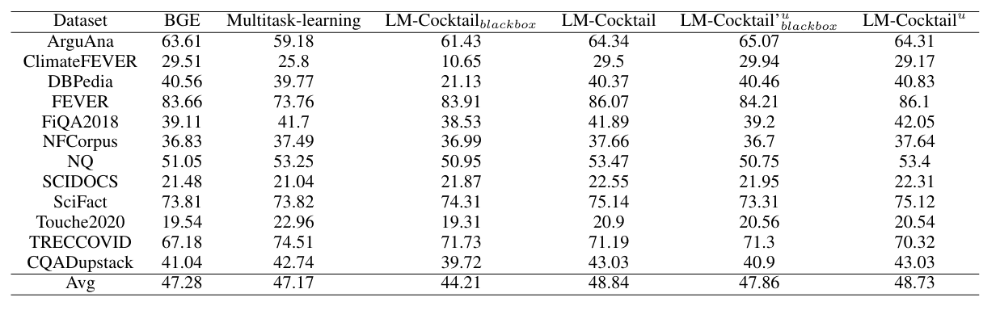

上表验证了该方法对于编码器模型 BGE 同样有效，通过混合现有模型即可提高新任务的准确性。关于模型合并所需少量示例的数量。

上表的分析显示，**仅使用 5 个示例**就可以获得令人满意的性能，并且性能提升在超过 50 个示例后变得十分有限，展示了该方法在数据效率上的竞争力。

综上所述，LM-Cocktail 是一种**极简**且**兼容**的模型合并技术，能够有效地解决预训练模型在微调中普遍存在的灾难性遗忘问题。实验结果一致证明，无论是针对基于解码器的 Llama 还是基于编码器的 BGE，无论是具备目标任务微调数据还是完全缺乏训练数据，LM-Cocktail 都能在维持目标域卓越性能的同时，显著提升或恢复模型在广泛通用任务上的弹性，且不涉及昂贵的重新训练成本。

### SDD(尺度解耦蒸馏)

**尺度解耦蒸馏（Scale Decoupled Distillation, SDD）**是一种新型知识蒸馏方法，旨在突破传统基于 Logit 蒸馏的结构性限制。以往的蒸馏仅利用教师网络的全局 Logit 作为知识迁移信号，这种方式将图像不同区域的语义信息耦合在一起，导致学生网络学习到模糊甚至相互冲突的特征表示，尤其在处理多语义或相似类别样本时表现不佳。

SDD 的核心创新在于**在空间尺度上对 Logit 进行解耦**。通过将全局 Logit 分解为若干多尺度局部 Logit，SDD 为每个局部区域建立独立的蒸馏通道，使学生网络能够更细粒度地继承教师的语义知识。这一解耦策略显著减少了语义干扰，使知识传递更加明确。

此外，SDD 将局部知识划分为**一致性知识**与**互补性知识**。一致性知识描述与全局预测相符的区域特征，而互补性知识则保留语义模糊性和不确定性。通过对互补性知识赋予更高权重，SDD 引导学生关注难分类样本，提升了模型的判别鲁棒性。实验证明，该方法在 CIFAR-100、ImageNet 和 CUB200 等数据集上显著优于传统 KD、DKD 和 NKD 等 Logit 蒸馏方法，尤其在细粒度分类场景中表现突出。值得注意的是，SDD 无需增加额外的结构或计算开销，保持了与传统蒸馏方法相当的效率。

**多尺度池化与信息加权：**

SDD 通过**多尺度池化（multi-scale pooling）** 和 **信息加权（information weighting）** 实现知识的结构化迁移。  

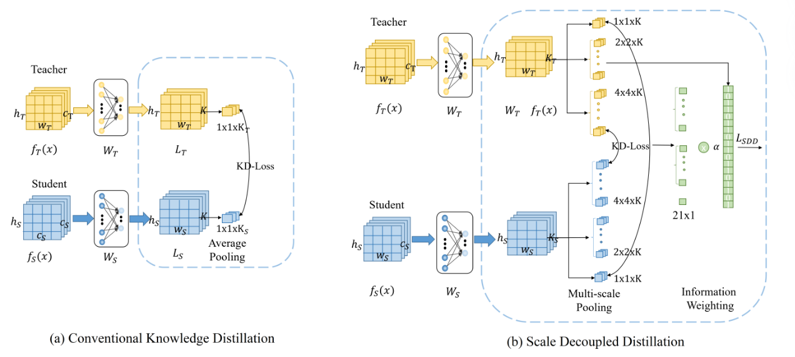

上图是传统知识蒸馏（KD）（a）和 SDD 方法（b）的示意图。与仅通过全局平均池化考虑全局 logit 知识的传统 KD 相比，SDD 提出通过多尺度池化捕获多尺度 logit 知识，以便学生可以从教师那里继承细粒度和明确语义知识。

在每个尺度与位置上，SDD 分别构建教师与学生的 Logit 对应对，并独立计算蒸馏损失，从而实现层次化的知识传递。对于每个局部 Logit，若其预测类别与全局预测一致，则视为一致性知识，否则为互补性知识。前者强化主类别的多尺度语义表达，后者则提供跨类别的辅助判别信号，帮助学生网络识别模糊样本与边界区域。

为突出互补性知识的作用，SDD 引入加权损失设计。整体蒸馏目标可表示为：

$\mathcal{L}_{SDD} = \mathcal{D}_{con} + \beta \mathcal{D}_{com}$

其中，$\mathcal{D}_{con}$ 表示一致性知识的蒸馏损失，$\mathcal{D}_{com}$ 为互补性知识的损失项，$\beta > 1$ 控制两者的权重平衡。通过适当提升 $\beta$，SDD 使学生模型更加关注局部与全局预测不一致的模糊样本，从而提升整体判别能力与泛化性能。

**实验结果：**

SDD 在多个基准数据集上进行了广泛而严格的评估，实验结果全面地展示了其超越传统 Logit 蒸馏方法的优越性和有效性。

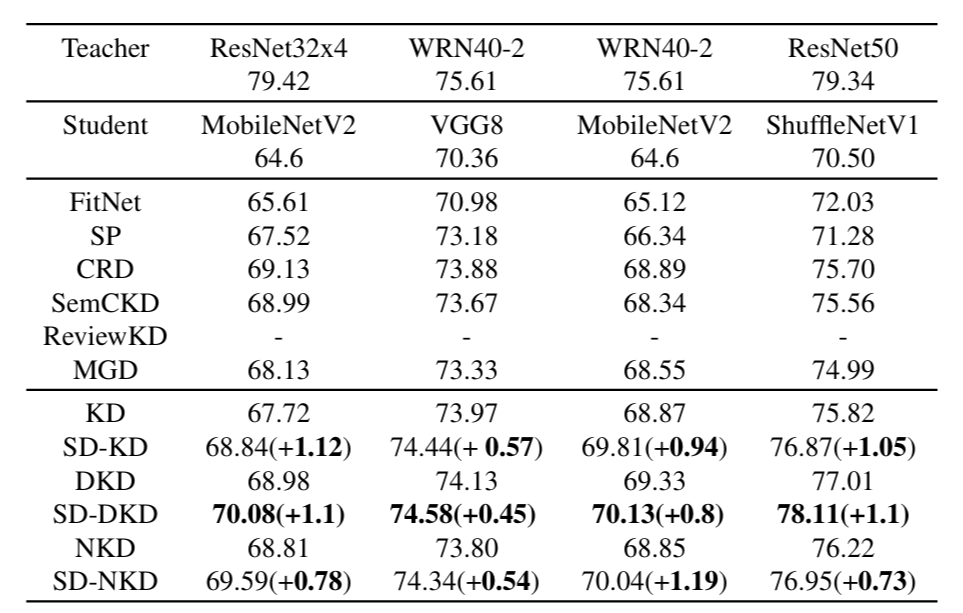

上图展示了 CIFAR-100 上的模型蒸馏后的性能，对比了在不同网络结构和层数的教师/学生对（如 ResNet32x4/MobileNetV2）下，SD-KD、SD-DKD、SD-NKD 等与传统 KD 方法的 Top-1 准确率。结果显示 SDD 始终能为 KD、DKD 和 NKD 带来显著的性能提升（近 1%），证明 SDD 在处理网络结构和层数不同的教师-学生对时是有效的。

上图是不同方法在 CUB200 数据集上的性能，对比了 SDD 在细粒度分类任务中的性能。SDD 在该任务上带来了 1.06% 到 6.41% 的显著提升。这表明 SDD 能够捕获局部细粒度的语义信息，这对细粒度分类至关重要。

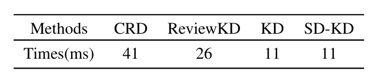

上图是不同方法的训练效率对比，对比了 SD-KD 与 CRD、ReviewKD、KD 的每批次训练时间（毫秒）。结果显示 SD-KD 的训练时间与传统 KD 相同，且低于基于特征的蒸馏方法（如 CRD 和 ReviewKD）。这证明了 SDD 具有很高的计算效率。

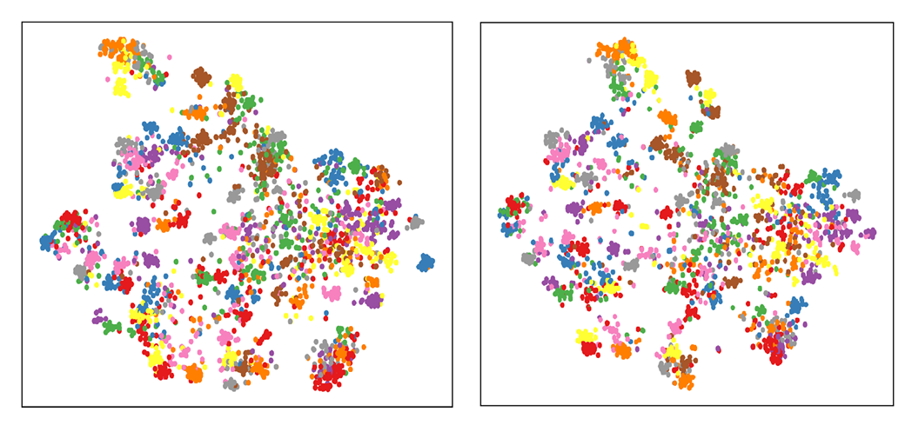

上图是对比了 KD（左）和 SD-KD（右）学习到的特征的 t-SNE 投影图。SD-KD 学习到的特征表示比 KD 更具可分离性，表明 SDD 能够增强学生网络的判别能力。

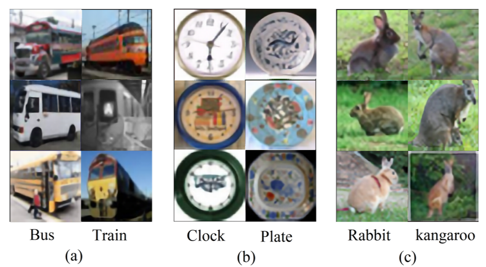

上图是 SD-KD 正确分类的模糊样本示例，即 SD-KD 训练的学生网络能正确分类，但传统 KD 训练的学生网络错误分类的一些样本。这些样本通常是在全局语义上相似的**模糊样本** 。这验证了 SDD 可以帮助学生获取局部区域的细粒度语义信息，从而提高其对模糊样本的判别能力。

从上面的实验结果可以看出，SDD超越了传统Logit蒸馏方法，在异构网络对上持续带来近1%的显著性能提升。尤其在细粒度分类任务中，准确率提升多达6.41%。SDD通过捕获局部细粒度语义，增强了学生网络的特征判别能力，有效识别了模糊样本。同时，它保持了与传统KD相同的高计算效率。

### 典型蒸馏算法总结：

**MiniLLM**是一种基于**知识蒸馏**的优化方法，它专注于**目标函数**的改进，将传统蒸馏的正向KL散度替换为**反向KL散度（RKL）**，从而避免学生模型高估教师分布的长尾概率，提高生成内容的精确度和概率校准性。它通过策略梯度优化，并结合单步分解、教师混合采样、长度归一化等策略，有效缓解了生成模型的**暴露偏差**和训练方差。

**尺度解耦蒸馏（SDD）**也是一种知识蒸馏方法，其创新点在于对Logit知识的结构重构。它通过多尺度池化将教师模型的全局Logit解耦为多个局部Logit输出，实现了细粒度的语义建模。SDD将这些解耦知识划分为一致性和互补性知识，通过提高互补性知识的权重，引导学生模型关注并提升对模糊样本的判别能力。该方法保持了高计算效率，尤其在细粒度分类任务中表现优越。

**LM-Cocktail（混合专家）**则完全脱离了传统蒸馏的训练过程，采用模型合并作为后处理步骤来解决LLM微调后的灾难性遗忘问题。它通过加权平均的方式，合并目标任务微调模型、预训练基础模型以及其他领域模型，从而在保持目标任务性能的同时，显著恢复和提升模型的通用能力。权重是基于目标域的少量（例如5个）验证示例的预测损失自动计算的。该方法具备极简和兼容性。

## 实例：DeepSeek 蒸馏技术解读

DeepSeek-R1 的蒸馏过程在算法上相对简单但极为高效，其核心方法是 **Supervised Fine-Tuning (SFT)**，也被称为序列级知识蒸馏（SeqKD）。这种方法的高效性并不依赖于复杂的算法设计，而在于教师模型（DeepSeek-R1，参数量 671B 的 MoE 大模型）在数据生成阶段投入了极高的资源与精力。通过精细的数据筛选和拒绝采样（Rejection Sampling）机制，DeepSeek-R1 严格保证了训练数据的质量与知识密度，使得即便只采用最基础的 SFT，也能取得显著的性能提升。

在具体实现上，DeepSeek-R1 对 Qwen 与 Llama 等小型密集模型（Dense Models）（参数量从 1.5B 到 70B 不等）采用直接监督微调（SFT）。这种训练通过最大化教师模型生成序列的似然度（序列被视为硬标签），使学生的预测与教师保持一致。SFT 是 LLM 蒸馏中最常用、最稳定的学习方法之一。DeepSeek-R1 的开发者明确指出，其蒸馏模型（DeepSeek-R1-Distill 系列）仅使用了 SFT，不包含额外的强化学习（RL）阶段，这有力地证明了在高质量数据支撑下，单纯的 SFT 足以实现显著能力迁移。这种从 MoE 模型到密集模型的迁移同时实现了**模型压缩**和**能力增强**。

DeepSeek-R1 蒸馏的关键在于其**数据生成**与**知识提取**阶段。模型利用经过推理导向的强化学习（RL）训练后收敛的检查点（即 DeepSeek-R1 自身的中间版本，而非原始 Base 模型）作为“教师”来生成大规模高质量推理数据。这构成了**自知识提炼（Self-Knowledge Elicitation）**的核心步骤。拒绝采样在此扮演关键角色，对输出进行严格筛选，也就是在进行数据整理 （Data Curation）和数据扩充（Data Augmentation）。

DeepSeek-R1 通过拒绝采样，严格筛选并仅保留正确的响应实现了数据策划与过滤。它剔除了混合语言、过长段落和代码块的思维链（CoT）等低质量样本，从而保证了用于 SFT 的数据的纯净性与可读性。最终用于蒸馏的教师数据集总计约 **800k 样本**，包括约 600k 提炼出的推理相关数据和约 200k 通用非推理数据（如写作、问答等）。

蒸馏的核心目标并非复制答案，而是传递教师模型的思维模式与推理能力。DeepSeek-R1 的数据中包含大量带有详细思维链（CoT）的推理轨迹，通过这些结构化的解释信息，学生模型得以学习教师的思维过程，而非仅仅模仿输出。

整体来看，DeepSeek-R1 的蒸馏流程遵循 LLM 时代的通用蒸馏管线：首先确定目标技能（推理能力）；然后由教师模型通过**拒绝采样**生成高质量数据；最后使用这些数据对学生模型进行**监督微调**（SFT），从而完成知识的迁移与能力对齐。

**实验结果：**

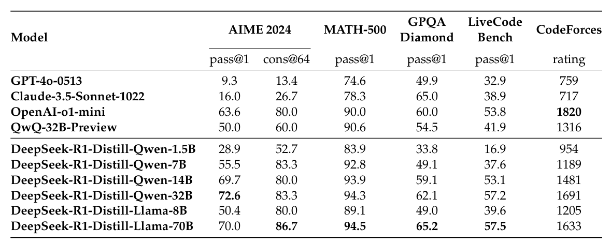

上图是 DeepSeek-R1 蒸馏模型与其他可比模型在推理基准上的比较。 DeepSeek-R1-7B 模型在所有评估指标上全面超越了非推理模型 GPT-4o-0513，而 DeepSeek-R1-14B 则显著超越了当时开源的 QwQ-32B-Preview。这些结果证明了 DeepSeek-R1 蒸馏策略的高效性，并显示了其 32B 和 70B 模型在密集模型中设定了推理基准的新纪录。

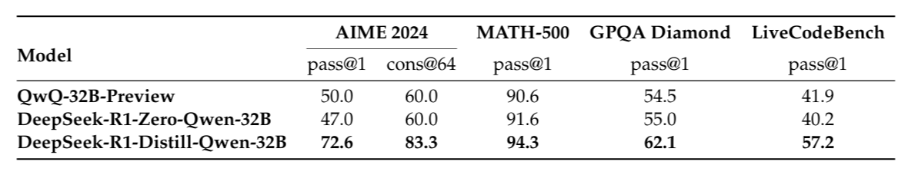

上图是蒸馏模型与纯 RL 训练模型的对比，DeepSeek-R1 蒸馏模型（DeepSeek-R1-Distill-Qwen-32B）在所有推理基准测试上的性能，都显著优于直接经过大规模 RL 训练的同参数量模型（DeepSeek-R1-Zero-Qwen-32B）。这表明蒸馏策略既经济又有效。

**自知识蒸馏：**

除此以外，DeepSeek-R1 的第三阶段（拒绝采样 + SFT）本质上也是一种**自知识蒸馏（Self-Knowledge Distillation）**。模型在强化学习后以自身（RL 收敛检查点）为教师，生成并精炼推理轨迹，再以这些高质量数据微调自身（SFT 更新参数），实现自我改进与能力提升。这一阶段主要有以下意义：

1. **修复 RL 缺陷：** 解决了纯 RL 模型 DeepSeek-R1-Zero 存在的可读性差和语言混合等问题。
2. **增强通用能力：** 通过纳入 200k 的通用数据，增强了模型的写作、问答和自我认知等非推理能力。
3. **知识迁移基础：** 800k 数据集成为后续蒸馏小模型（如 Qwen、Llama）的教师数据集，推动了跨模型能力迁移。

这一过程也印证了在 LLM 时代知识蒸馏正从单纯的“模型压缩”演化为推动模型的自我提升与技能迁移。

**总结：**

DeepSeek-R1 的蒸馏过程以高质量数据和严格拒绝采样为核心，通过单纯的监督微调（SFT）实现了从超大规模 MoE 模型向密集模型的高效能力迁移。其自知识蒸馏机制不仅修复了纯 RL 模型的缺陷，还显著提升了模型的推理与通用能力，展现了现代大模型蒸馏从“压缩”向“自我进化”的演化方向。

## 总结与思考

本文对大型语言模型（LLMs）知识蒸馏技术作了系统介绍。本文首先阐明了在大模型时代下，源于专有模型的成本、隐私与领域适应性局限，以及开源模型对能力提升的迫切需求，共同推动了蒸馏技术的演进。本文将大模型蒸馏的核心作用归纳为能力增强、模型压缩与自我改进三个维度，并梳理了从目标引导、种子注入、知识生成到学生训练的四阶段通用蒸馏流程。

在技术方法层面，本文重点剖析了四类主流蒸馏范式：稀疏→稠密蒸馏（如 MoE 知识聚合）、多模态蒸馏（如 LLaVA-KD 中的跨模态对齐）、数据蒸馏（如 Phi 系列的“教科书”质量数据）以及与强化学习结合的蒸馏（如 DPO）。通过对 MiniLLM、LM-Cocktail、SDD 等代表性算法的深入分析，本文揭示了从优化损失函数（如反向 KL 散度）、融合参数空间（如模型合并）到精炼数据质量（如 SFT）等不同技术路径的实现细节与成效。还以 Deepseek-R1 的蒸馏为实例介绍了大模型蒸馏的实际应用。最后，本文从诸多维度介绍了蒸馏效果评估体系，涵盖了从任务性能、生成质量到知识相似性、鲁棒性与效率的综合考量。

基于本文所介绍的各项技术，我们可以清晰地观察到大模型蒸馏正在经历从“模型压缩”向“能力迁移与融合”的深刻演进，呈现出以下几个显著的发展趋势：

**蒸馏目标从“模仿输出”转向“迁移能力”。**

早期蒸馏强调在参数与计算资源受限环境下复制教师输出分布，而近期工作更强调保留或迁移高级能力（例如链式推理、偏好对齐）。不同任务应选择不同的蒸馏目标与训练策略以对齐能力，而不仅仅是分布拟合。

**知识来源转向多源融合**：传统的蒸馏是单向的“教师-学生”知识传递。LM-Cocktail 通过在参数空间对预训练基础模型、目标任务微调模型及其他领域专家模型进行加权平均，能够有效恢复微调模型丧失的通用能力，稀疏→稠密蒸馏中对 MoE 多专家知识进行聚合，也印证了从多源知识中提炼精华是提升学生模型泛化性的有效途径。

**任务与数据驱动的蒸馏设计日益重要:** 数据蒸馏、合成语料与提示驱动的数据生成方法成为常态。DeepSeek-R1 仅采用简单的 SFT，但依靠 RL 优化后的教师模型生成并严格筛选的高质量推理数据集取得了卓越的蒸馏效果。Phi 系列对“教科书质量”数据的专注也证明了这一点。数据质量与多样性在蒸馏中或许比单纯的算法改进更为关键。

**跨范式融合：KD + RL + 自蒸馏:** 将蒸馏与强化学习（或偏好学习）结合可以同时传递教师的行为与任务回报信号；自蒸馏（教师自身生成并再用于微调）则为模型提供低成本的自我改进路径。联合损失、奖励塑形、直接偏好优化等方法代表了蒸馏与行为对齐技术融合的方向。

**知识粒度从“全局耦合”转向“解耦对齐”:** 这种解耦的范式允许学生模型针对性地学习教师的不同知识侧面（如事实知识、推理能力、多模态关联），减少了不同语义信息的相互干扰，使得知识迁移更加明确和高效。

**损失函数的权衡（mode-seeking vs mode-covering）：** 生成任务中，正向 KL（mode-covering）往往迫使学生去拟合长尾低概率模态，反而降低生成质量；反向 KL（mode-seeking）及其他倾斜损失被证明更利于准确、连贯的生成。

**评估指标向多维可靠性扩展：** 除了任务性能外，研究社区越来越重视校准（ECE）、生成分布距离（MAUVE）、多样性（distinct-n）、一致性（response consistency）与鲁棒性（对抗、OOD）等评价维度，反映出对蒸馏后模型可靠性与可部署性的更高要求。

## 参考文献

[1] Xu X, Li M, Tao C, et al. A survey on knowledge distillation of large language models[J]. arXiv preprint arXiv:2402.13116, 2024.

[2] Gu Y, Dong L, Wei F, et al. Minillm: Knowledge distillation of large language models[J]. arXiv preprint arXiv:2306.08543, 2023.

[3] Liu X, Hu L, Bailis P, et al. Online speculative decoding[J]. arXiv preprint arXiv:2310.07177, 2023.

[4] Kim G, Chu G, Yang E. Every Expert Matters: Towards Effective Knowledge Distillation for Mixture-of-Experts Language Models[J]. arXiv preprint arXiv:2502.12947, 2025.

[5] Xue F, He X, Ren X, et al. One student knows all experts know: From sparse to dense[J]. arXiv preprint arXiv:2201.10890, 2022.

[6] Cai Y, Zhang J, He H, et al. Llava-kd: A framework of distilling multimodal large language models[J]. arXiv preprint arXiv:2410.16236, 2024.

[7] Zhang B, Ma H, Ding J, et al. Distilling implicit multimodal knowledge into large language models for zero-resource dialogue generation[J]. Information Fusion, 2025, 118: 102985.

[8] Fang L, Yu X, Cai J, et al. Knowledge distillation and dataset distillation of large language models: Emerging trends, challenges, and future directions[J]. arXiv preprint arXiv:2504.14772, 2025.

[9] Xu H, Zhu Q, Deng H, et al. KDRL: Post-Training Reasoning LLMs via Unified Knowledge Distillation and Reinforcement Learning[J]. arXiv preprint arXiv:2506.02208, 2025.

[10] Guo D, Yang D, Zhang H, et al. Deepseek-r1: Incentivizing reasoning capability in llms via reinforcement learning[J]. arXiv preprint arXiv:2501.12948, 2025.

[11]Yang C, Zhu Y, Lu W, et al. Survey on knowledge distillation for large language models: methods, evaluation, and application[J]. ACM Transactions on Intelligent Systems and Technology, 2024.

[12]Lee S, Zhou J, Ao C, et al. Quantification of Large Language Model Distillation[J]. arXiv preprint arXiv:2501.12619, 2025.

[13]Wortsman M, Ilharco G, Gadre S Y, et al. Model soups: averaging weights of multiple fine-tuned models improves accuracy without increasing inference time[C]//International conference on machine learning. PMLR, 2022: 23965-23998.

[14]Luo S W C L Y. Scale decoupled distillation[J]. arXiv preprint arXiv:2403.13512, 2024.
