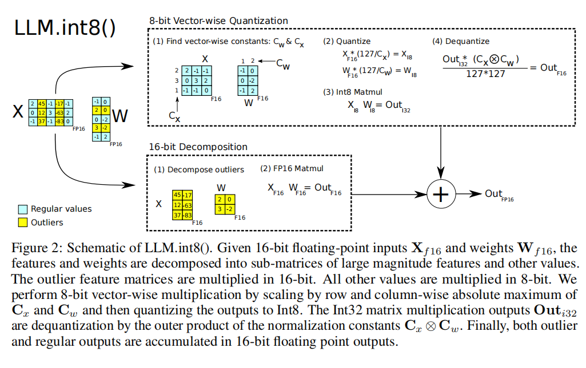
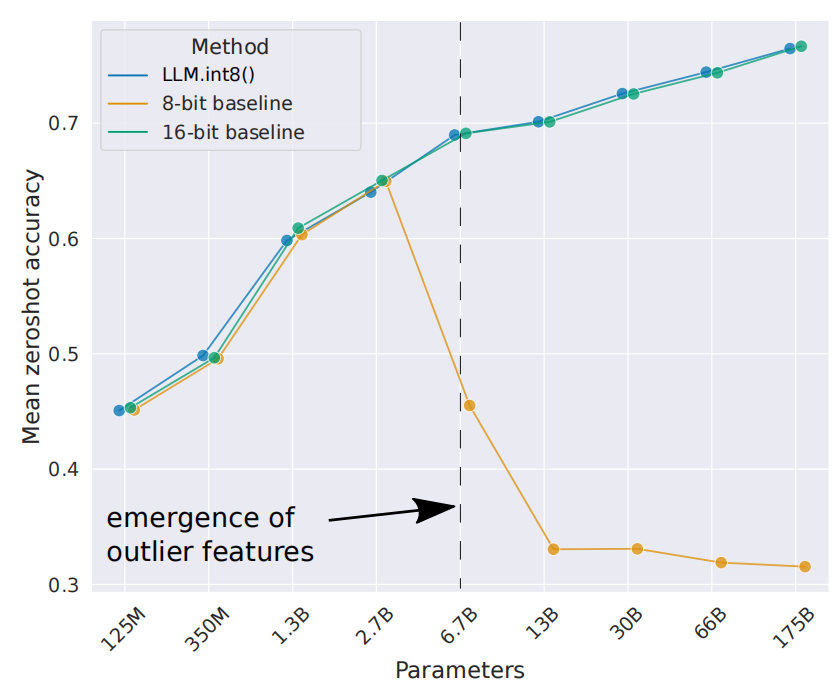
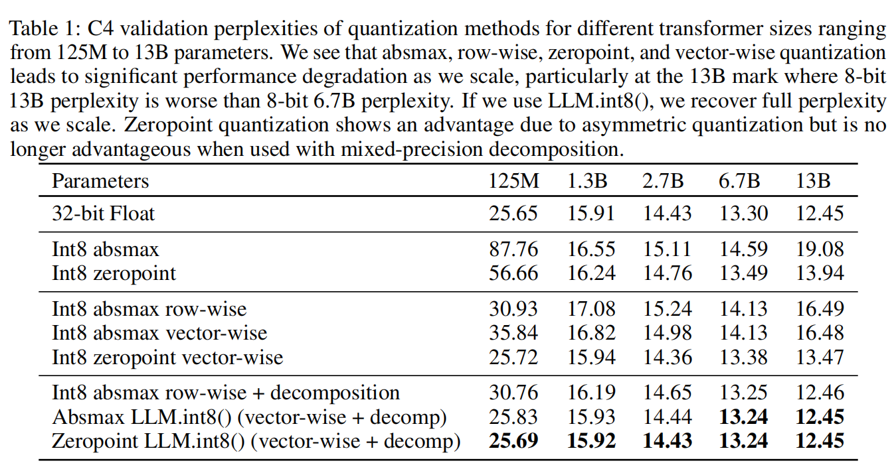
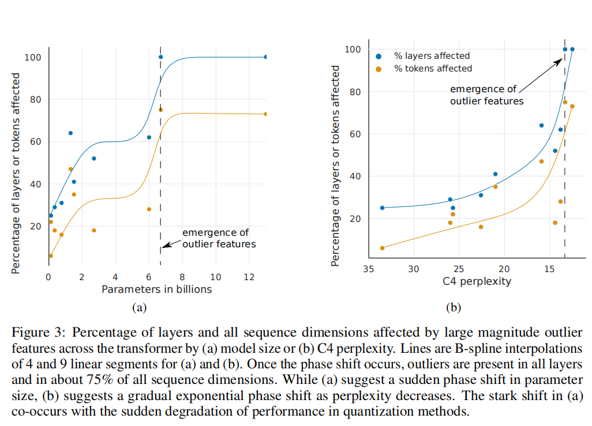
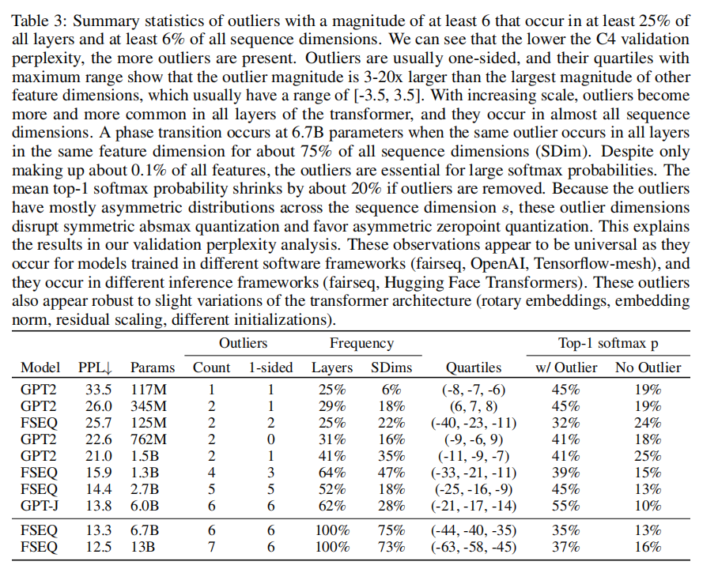
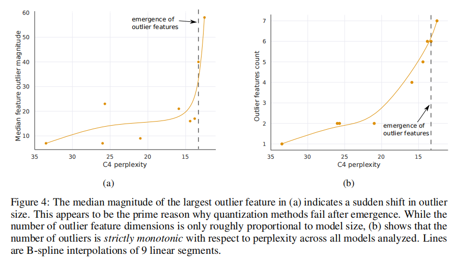
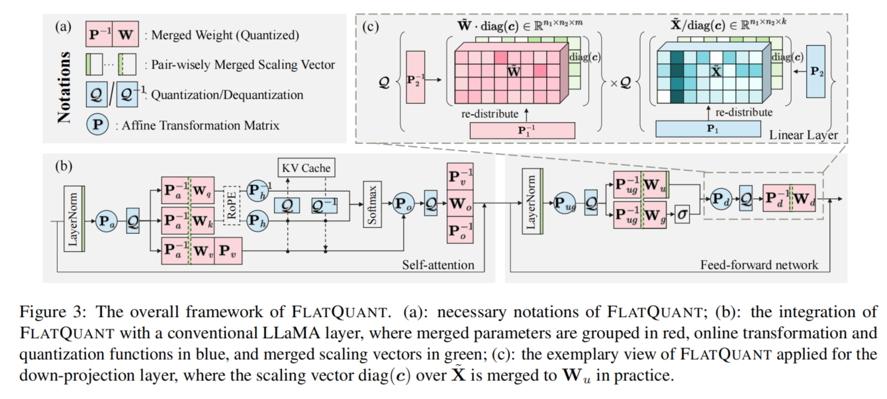
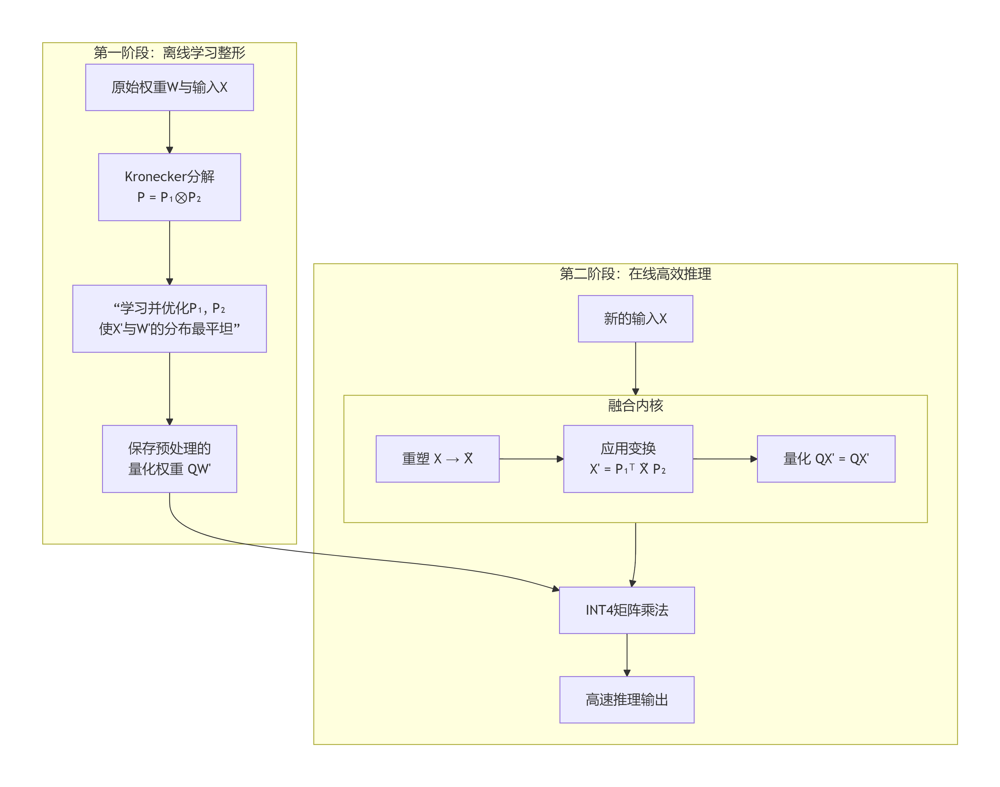

# 大模型量化：低精度量化

模型量化是一种参数压缩与加速技术，其核心逻辑是将模型中的高精度浮点数（如 32 位浮点数 FP32）转换为低精度整数（如 8 位整数 INT8 或 4 位整数 INT4），从而减少存储空间、提升推理速度并降低硬件能耗。 一个拥有 70B（700 亿）参数的模型，如果用 FP32 存储，需要 70B * 4 字节 = 280 GB 的内存。将 FP32 转换为 INT8，模型大小直接降为 70B * 1 字节 = 70 GB；转换为 INT4，则仅为 35 GB。这使得大模型能够在更广泛的硬件上运行。在推理过程中，巨大的模型参数也需要从 GPU 的显存中读取到计算核心（如 CUDA Cores）中进行计算。内存带宽（如几百 GB/s）相比计算速度而言是一个更稀缺的资源，经常成为性能瓶颈。更小的数据体积意味着在相同的带宽下，每秒可以传输更多的参数。这极大地缓解了带宽压力，从而提升推理速度。此外，使用 INT8/INT4 等整数格式，硬件可以在一个时钟周期内执行更多的操作（例如，一次 INT8 运算能处理比 FP32 多 4 倍的数据）。

## 数值格式结构对比

| 格式 | 总位数 | 符号位 (S) | 指数位 (E) | 尾数/小数位 (M) | 数值范围 (近似) | 内存占用 (相对于 FP32) | 主要用途与特点 |
| :--- | :--- | :--- | :--- | :--- | :--- | :--- | :--- |
| **FP32** | 32 bits | 1 bit | 8 bits | 23 bits | ±3.4 × 10³⁸ | 1x (基准) | 高精度计算，训练和推理的基准格式 |
| **BF16** | 16 bits | 1 bit | 8 bits | 7 bits | ±3.4 × 10³⁸ | 50% | 训练加速，动态范围大，混合精度训练核心 |
| **INT8** | 8 bits | 1 bit | **无** | **7 bits (有效)** | -128 to 127 | 25% | 推理加速，最常用的量化格式，效率与精度平衡 |
| **INT4** | 4 bits | 1 bit | **无** | **3 bits (有效)** | -8 to 7 | 12.5% | 模型压缩，用于资源受限场景，需复杂量化技术 |

FP32 是标准的单精度浮点数，是原始 LLM 模型权重和激活值的默认格式。浮点数 FP 的结构包含符号位 (Sign)、指数位 (Exponent) 和尾数位 (Mantissa/Fraction) 三部分。FP32 的结构为：S(1) | E(8) | M(23)，其计算最精确，但计算速度和内存效率最低。

BF16 指数位与 FP32 保持一致（8 位），但大幅削减了尾数位（只有 7 位）。其结构为：S(1) | E(8) | M(7)。在混合精度训练中，前向和反向传播使用 BF16，以减少内存占用和加速计算，而权重更新等关键操作仍可能使用 FP32 来保持数值稳定性。它本身也是一种“量化”形式(从 FP32 到 BF16)，但通常不归入“低比特量化”的讨论范畴，后者特指 INT8/INT4。

整数 INT 用于表示离散的整数值。其设计目的是精确存储整数，没有小数部分。结构通常只包含符号位(Sign)和数值位(Value)。INT8 是非常流行的推理后量化格式，其结构为：S(1) | Value(7)。由于整数格式无法直接表示小数。为了用 INT8 来表示原本是浮点数的权重和激活值，需要引入量化参数(Scale, 有时还有 Zero Point)。INT8 量化可以将模型大小减少至原来的 1/4，并显著提升推理速度（因为整数运算比浮点运算快得多）。通常会导致极小的精度损失，对于许多任务来说是可接受的。

INT4 的结构为：S(1) | Value(3) 或使用更高级的编排方式（如 GPTQ）。INT4 量化后的每个参数只有 16 种可能的取值(-8 到 7)，其数值范围非常有限，精度损失风险极大。直接使用常规 INT4 量化会导致模型性能严重下降，在 LLM 中应用时通常需要更复杂的量化技术来弥补精度损失。

## 量化过程

模型量化的本质是通过数学映射，在精度损失可控的前提下，将模型参数从“高精度”转换为“低精度”，实现性能与效率的平衡。量化过程为：

1.确定数值的动态范围：要搞清楚数据中数值的变化范围。
2.选择缩放因子（Δ）：这个因子很关键，会影响量化的效果。
3.将浮点值映射为整数：按照规则把浮点形式的数字变成整数。
4.存储缩放因子用于反量化：方便之后把量化后的整数再变回浮点值。

## LLM.int8()量化
在 Transformer 模型中，前馈网络（FFN）和注意力投影层的矩阵乘法操作是内存消耗的主要开销来源，大概消耗了 95%的参数资源和 65%-85%的计算量。因此，降低这些线性层的内存占用是解决整个模型内存问题的关键。在现有的解决方案中，8-bit 量化是减少内存占用的直接方法（将模型权重从 16 字节降至 1 字节，理论上内存减半）。但存在一些局限：(1)之前的 8-bit 量化方法（如 Q8BERT）会导致模型性能（如准确率、困惑度）显著下降。(2)这些方法仅在小规模模型（< 350M 参数） 上被验证有效，例如 BERT。(3)这些方法量化后的模型通常需要量化感知训练或训练后微调来缓解性能损失，对于十亿级别以上的自回归模型（如 GPT），无损的 8 比特量化是一个未解决的挑战。

LLM.int8()通过初步分析指出，当模型规模扩大到约 6.7B 参数时，所有 Transformer 层中都会涌现出数量稀少但绝对值极大的异常激活值（outliers）。这些异常值会破坏现有量化方法的精度，因为它们一个值就会挤占掉整个张量的量化区间，导致其他绝大多数数值的量化误差急剧增大。这是导致传统量化方法在大模型上失败的根本原因。总结来说，论文攻克了两个随着模型规模扩大而出现的技术难题：

1. **量化粒度粗糙，精度不足**  当模型参数规模超过 10 亿（1B）后，模型对量化误差变得极为敏感。此前适用于小规模模型的粗粒度量化方案（如整个张量使用单个缩放因子）会引入过大误差，导致模型性能显著下降，具体表现为模型困惑度（PPL）上升，零样本任务准确率下降。因此，需要一种更精细、更高精度的量化策略。

2. **系统性大幅度异常值的涌现** 当模型规模达到约 67 亿（6.7B）参数时，在所有 Transformer 层中，会涌现出稀疏但系统性的异常特征值（outlier features）。这些异常值在数量上仅占所有特征值的约 0.1%，它们并非随机出现，而是高度集中并持续存在于极少数（约 6-7 个）特定的特征维度上，其数值幅度可达其他正常值的 20 倍以上。传统的量化方法无法有效处理这些异常值，一个异常值就会占据 INT8 数据类型的大部分表示范围，从而严重压缩其他绝大多数正常值的量化空间，导致量化精度整体崩溃。

### 核心创新点
LLM.int8()对 Absmax 和 Zeropoint 两种主流 8 比特量化方案进行了分析，无论是 Absmax 还是 Zeropoint，传统方法都为整个权重或激活张量使用单个缩放因子，一个异常值就会降低该张量中所有其他数值的量化精度。论文作者发现，异常值特征首次出现在约 2.7B 参数的模型中，但此时仅影响约 25%的层。而在 6.7B 参数时，发生相变，异常值迅速扩散到 100%的 Transformer 层和约 75%的序列位置。虽然每层、每个序列位置都可能出现异常值，但这些异常值都高度集中在固定的、极少数的几个特征维度上。例如，在一个6.7B的模型中，虽然每层、每个序列位置都有异常值，但所有这些异常值都来自于相同的 6 个特征维度（即 hidden state 向量中的第 i 个、第 j 个...维度）。这意味着整个模型都学会了在这几个特定的“通道”上传递和放大重要的信息。消融实验表明，这些只占 0.1%的异常值特征维度，是模型存储和传递最关键信息的关键维度。对于异常值特征的量化精度至关重要，即使是微小的误差也会极大地影响模型性能。此外，异常值的分布是高度不对称的。在一个给定的特征维度上，异常值几乎全是正数或全是负数。这个特性解释了为什么非对称的 zeropoint 量化在较小模型（6.7B 以下）上比对称的 absmax 量化表现更好，因为它能更充分地利用 INT8 的表示范围。

依据这些发现，论文提出了向量级量化 (Vector-wise Quantization)和混合精度分解以解决大规模 Transformer 模型的量化问题。主要思路为，既然只有约0.1%的特征是麻烦的异常值，那就只把它们“挑”出来，隔离到单独的通道中，用高精度（FP16）进行处理。剩下的99.9%的正常值，则使用高效的INT8处理。在异常值被分离后，对正常值的量化可以做得更精细。为矩阵乘法的每一行（输入）和每一列（权重）使用独立的缩放因子，而不是整个张量共享一个因子。这样既保证了关键信息无损，又实现了大幅的内存节省。

向量级量化将矩阵乘法视为一系列内积。为输入矩阵的每一行和权重矩阵的每一列分别分配独立的缩放因子。反量化时，使用这些因子外积的倒数进行缩放。这大大减小了量化块的大小，限制了异常值的负面影响范围。

为了处理参数规模在6.7B之上的所有Transformer中出现的大幅度异常值特征，论文中使用了混合精度分解，该方法不强迫所有计算都在8位下进行，而是将计算分解。将少量大幅值的特征维度(≈0.1%)以16-bit精度表示，而其他99.9%的正常值进行8-bit运算。由于大多数的值仍然以低比特表示，因此与16-bit相比，降低了大约50% 的显存。例如，对于BLOOM-176B，将模型的显存占用减少了1.96 倍。

LLM.int8()方法是 Absmax Vector-wise 量化和混合精度分解的组合，其结构如图1 所示。



### 计算过程

#### 1. 异常值特征检测与分解

目标：识别并分离出输入激活值中数量稀少但幅度巨大的异常值特征维度，这些维度对模型性能至关重要，但会破坏量化精度。

输入：FP16 的输入激活矩阵 $\mathbf{X}_{f16} \in \mathbb{R}^{s \times h}$ 和权重矩阵 $\mathbf{W}_{f16} \in \mathbb{R}^{h \times o}$。
检测：设定幅度阈值 $\alpha$ (论文中 $\alpha = 6.0$)。扫描 $\mathbf{X}_{f16}$，找出所有在任意序列位置上绝对值 $|\mathbf{X}_{f16}^{ij}| \geq \alpha$ 的**特征维度（列）**。这些维度被归入异常值集合 $O$。
  -**分解**：将原始的矩阵乘法分解为两部分：
  - **异常值部分**：在集合 $O$ 中的特征维度。
  - **正常值部分**：不在集合 $O$ 中的特征维度（占 99.9%）。

#### 2. 向量级 INT8 量化与计算（针对正常值部分）

此步骤旨在对 99.9%的正常值进行高精度、高效率的 INT8 计算。

a. 向量级量化

为输入矩阵的每一行和权重矩阵的每一列分配独立的缩放因子，实现更精细的量化。

**计算行/列缩放因子**：
  对于输入矩阵 $\mathbf{X}_{f16}$ 的每一行 $i$，和权重矩阵 $\mathbf{W}_{f16}$ 的每一列 $j$，分别计算其绝对值最大值，并导出缩放因子：
  $$
  c_{x_i} = \frac{127}{\max(|\mathbf{X}_{f16}[i, :]|)}
  $$
  $$
  c_{w_j} = \frac{127}{\max(|\mathbf{W}_{f16}[:, j]|)}
  $$

**量化**：
  使用各自的缩放因子对每一行和每一列进行量化（$\lfloor \cdot \rceil$ 表示四舍五入到最近的整数）：
  $$
  \mathbf{X}_{i8}[i, :] = \lfloor c_{x_i} \cdot \mathbf{X}_{f16}[i, :] \rceil
  $$
  $$
  \mathbf{W}_{i8}[:, j] = \lfloor c_{w_j} \cdot \mathbf{W}_{f16}[:, j] \rceil
  $$

b. INT8 矩阵乘法与反量化

**INT8 矩阵乘**：
  将量化后的 INT8 矩阵相乘，结果累加到 INT32 中以防止溢出：
  $$
  \mathbf{C}_{i32} = \mathbf{X}_{i8} \times \mathbf{W}_{i8}
  $$

**反量化**：
  使用缩放因子外积的倒数，将 INT32 结果反量化为 FP16 范围的近似值：
  $$
  \mathbf{C}_{normal} \approx \frac{1}{\mathbf{c}_x \otimes \mathbf{c}_w} \cdot \mathbf{C}_{i32}
  $$
  其中 $\mathbf{c}_x \otimes \mathbf{c}_w$ 是行缩放因子向量和列缩放因子向量的外积，形成一个缩放矩阵。

#### 3. 混合精度计算与结果融合

目标：将高精度处理的异常值部分与高效率处理的正常值部分合并，得到无损的最终结果。

**异常值部分（FP16 计算）**：
  仅选取异常值特征维度对应的列，进行完整的 FP16 精度矩阵乘法：
  $$
  \mathbf{C}_{outlier} = \sum_{h \in O} \mathbf{X}_{f16}^{h} \times \mathbf{W}_{f16}^{h}
  $$

**正常值部分（INT8 计算）**：
  即为上一步反量化后的结果 $\mathbf{C}_{normal}$。

**结果融合**：
  将两部分的结果相加，得到最终的 FP16 输出：
  $$
  \mathbf{C}_{f16} = \mathbf{C}_{outlier} + \mathbf{C}_{normal}
  $$


### 适用阶段及策略
LLM.int8()主要就是为推理阶段设计的。对于训练和微调，它主要作为一种辅助工具，与 LoRA 等技术结合使用，而非独立的全参数训练解决方案。

#### 例子：在资源受限的 GPU 上运行大模型
场景：在单张 RTX 3090（24GB） 上运行 OPT-30B 模型。

问题：OPT-30B 的 FP16 模型需要约 60GB 内存，无法装入 24GB 显存。

策略：使用 LLM.int8() 进行量化。

操作：

```python
from transformers import AutoModelForCausalLM

model = AutoModelForCausalLM.from_pretrained(
    "facebook/opt-30b",
    device_map="auto",  # 使用 Accelerate 进行多 GPU 自动分布
    load_in_8bit=True,  # 核心：启用 LLM.int8()量化
)

```
结果：模型内存占用降至约 30GB，可以装入两张 RTX 3090(或通过 device_map="auto" 在单张卡上加载大部分层)。

#### 适用策略
根据论文附录 D 和 E 的实验，策略如下：

1.**仅量化前馈网络层**

 发现：将 FFN 层量化为 8-bit 对性能影响很小，甚至在有些情况下能稳定训练。

 策略：在训练中，可以尝试只将 FFN 层转换为 INT8，而保持注意力层的精度为 FP16。这是一个保守但安全的起点。

2.**提高混合精度分解的比率**

 发现：在训练中，仅仅分离 0.1%的异常值维度可能不够。需要提高分解比率（例如，将前1%或2%的最大幅度特征维度都用 FP16 计算），才能稳定训练。

 策略：在训练循环中，使用一个更高的 decomposition percentage 阈值。但这需要修改底层代码，目前并非开箱即用功能。

3.**主要用于全参数微调**

 策略：对于像 LoRA 这样的参数高效微调方法，由于其本身只训练极少量参数，内存节省的主要来源是优化器状态而非模型权重。因此，使用 LLM.int8() 量化基础模型，再结合 LoRA 进行微调，是一个非常强大且推荐的组合策略，可以同时在微调和推理中节省内存。

### LLM.int8论文的实验方法分析

int8的论文中，在实验部分系统地研究了异常特征的出现、影响、系统性结构及其对量化的影响机制。具体而言，其在实验部分研究了以下几个问题：异常特征何时出现？异常特征如何影响模型性能？异常特征是否具有系统性和结构性？异常特征对量化方法的影响机制是什么？

#### 一、异常特征何时出现

实验现象：传统量化方法在模型规模达到约6.7B时突然失效。在图2中表现为，在6.7B参数规模上，基线8-bit量化方法的Zero-shot准确率暴跌。此外，表1展示了随着模型规模增大，各种量化方法（Absmax, Zeropoint, Row-wise等）的C4困惑度随参数规模扩大急剧上升。





基于以上现象，论文假设，在模型规模达到某个阈值（~6.7B）时，会涌现出一种系统性的、大幅度的异常特征，这些特征对模型性能至关重要，但会破坏标准量化过程的精度，从而导致模型性能崩溃。

论文对异常特征进行了定义，并选择了从125M到13B参数的多个预训练语言模型（包括GPT-2、Fairseq、GPT-J等）进行研究，以分析不同规模模型中异常特征的出现比例。

论文设置了三个阈值条件以限定异常特征：(1) 幅度 ≥ 6.0；(2)出现在至少25%的Transformer层中；(3)出现在至少6%的序列维度中。 在幅度阈值设置方面，模型中可能有很多数值相对较大的特征，但并非所有都会破坏量化。论文在第4.1节提到，他们通过实验发现，当对幅度≥6.0的特征进行高精度处理后，量化模型的性能退化就几乎消失了。这表明6.0是一个关键临界点，低于此值的特征对量化的破坏性较小。在层级影响阈值方面，25%这一比例是在最小的125M模型上确定的，目的是为了能捕获到那个最显著、最普遍的异常特征，同时过滤掉那些只在一两层出现的次要异常。在序列维度的阈值设置方面， 如果一个异常特征在同一个序列的多个token（即多个时间步）上都出现，这就意味着它对模型处理大多数输入都有影响，因此其量化误差会传播并影响几乎所有的预测结果，从而造成全局性的性能下降。6%这个阈值是基于对125M模型的分析，以区分针对特定内容的局部特征与全局通用特征。

在定义了异常特征后，论文对异常特征出现的层数比例、异常特征影响的序列维度比例和模型规模与性能（困惑度）之间的关系等指标进行实验。



如图3a所示，在不同参数量的模型（125M, 1.3B, 2.7B, 6.7B, 13B）上，计算其“受影响层比例”和“受影响序列维度比例”，然后以模型规模为横轴，以这些比例为纵轴进行绘图。可发现，当模型规模达到~6.7B参数时，“受影响层比例”从~65%突然跃升至100%。同时，“受影响序列维度比例”也从~35%急剧上升到75%。这种突然的转变与量化开始失效的点同时发生。

如图3b所示，将同一个模型的“受影响层比例”和“受影响序列维度比例”与其在C4验证集上的困惑度关联起来绘图。发现随着模型困惑度的降低（即性能提升），异常特征的普遍性指标平滑地、按指数趋势增长。这表明涌现并没有什么突然性，我们或许可以通过研究小模型中的指数趋势，在相变发生之前检测到涌现特征。

总结来说，图3a证明从参数量角度看，这是一个在6.7B处发生的相变。图3b证明从模型性能角度看，这是一个与困惑度相关的平滑、指数型的涌现过程。

在这一部分的实验和分析中，可以锁定异常特征的涌现时机：6.7B参数处发生“相变”。

#### 二、异常特征如何影响模型性能

在这一部分的研究中，作者进行了干预实验。将异常特征维度置零，观察注意力机制中 top-1 softmax 概率的变化和验证集困惑度的变化。并将随机选择的非异常特征维度设置为零作为对照组，比较两种情况下模型的关键输出。



作者在论文的4.2节对实验结果(表3)进行了总结和分析。实验发现，如果移除这些异常值，所有序列的平均 top-1 softmax 概率将从约40%降至约20%，验证集困惑度将增加600%-1000%，尽管异常特征维度最多只有7个。当改为移除7个随机特征维度时，top-1概率仅下降0.02-0.3%，困惑度仅增加0.1%。

#### 三、异常特征具有什么样的结构

在这个问题的研究中，作者统计了异常特征的维度分布与方向性，并进行了不同架构与不同训练框架下的跨模型验证。

表3提供了跨模型的详细异常特征数据。“Outliers-Count” 列展示了异常特征维度的数量，这个数量非常小，且随模型规模缓慢增长（从1个到7个）。以6.7B模型为例，该模型中所有异常值仅集中在6个维度上。“Frequency-Layers” 列展示了受影响的层百分比，在大型模型（6.7B, 13B）中，这个比例达到了100%。这意味着这些特定的异常特征维度在模型的每一层都持续出现。“Outliers-1-sided” 列展示了单向（不对称）分布的异常特征数量，绝大多数异常特征都是单向的（要么全是正，要么全是负）。这表明它们不是以零为中心的随机分布，而是具有稳定的、有偏向性的激活模式。在GPT-2, Fairseq, GPT-J等不同架构和训练框架的模型中都观察到相同现象。

在6.7B模型中，每个序列(2048 token)中约有150,000个异常值，但这些异常值仅集中在6个特征维度上。

论文进一步对异常特征的涌现规律进行了分析。图4b展示了异常特征的数量与模型困惑度之间的关系。结果显示，异常特征的数量随着模型困惑度的降低（即性能的提高）而严格单调地增加。



异常特征的涌现与模型表达能力密切相关，而不仅仅是参数量的函数。其涌现规律可表述为，在6B~6.7B参数之间，异常特征突然出现在所有层(从65%到100%)，序列维度覆盖率从35%跃升至75%，一旦出现，异常值的中位数幅度迅速增大(图4a)。异常特征通常为单向分布（全正或全负），适合非对称量化。

#### 四、异常特征对量化方法的影响机制是什么

这个问题连接了前面三个问题所呈现的论文分析发现与最后的方法创新。

图4a呈现的是不同规模模型中，最大异常特征的中位幅度。在模型规模达到~6.7B参数时，异常特征的幅度出现跃升。图1和表1显示量化在~6.7B突然失效。因此关联推断，异常特征幅度剧增，导致量化范围被拉宽，原始浮点数中绝大多数数值较小但至关重要的信息被映射到极少数几个整数上，造成精度损失。

表1的数据显示，在6.7B规模以下，Zeropoint量化（非对称）的性能始终优于Absmax量化（对称）。表3统计了具有不对称分布（即只取正値或只取负值）的异常特征数量，发现几乎所有的异常值都具有严格的不对称分布(单向的)。因此可推断，异常特征的不对称性是导致对称量化方法（如Absmax）早期失效的原因。

由于异常值的出现破坏了量化精度，且异常值的数量极少，具有高度稀疏且系统的特点，那么最直接的解决方案就是：将异常值与常规值分离开，用高精度（16-bit）处理异常值，用低精度（8-bit）处理常规值。这也就是 LLM.int8() 中混合精度分解的核心思想。


## FlatQuant W4A4 量化

INT4只用4个比特位来表示一个数字，4比特的动态范围仅有16个值，离群值会严重挤压有效数值的表示空间，导致巨大的量化误差。因此，INT4量化方法的要点是，依赖更复杂、更精巧的量化算法将精度损失控制在可接受的范围内。

INT4 量化过程中出现的问题可以总结如下：由于有效数值的表示空间有限，缩放因子会被离群值主导。量化缩放因子必须设置得足够大，以覆盖最大的离群值。这同时会导致绝大多数有效信息的量化精度丧失， 因为一旦缩放因子被离群值拉大，绝大多数正常数值就会被压缩到非常少的几个量化级别中。例如原本 FP16 下分布广泛的有效信息，会在 INT4 下被“挤”在底部，失去了区分度。从而导致单层量化误差巨大，而随着误差在深层网络和自回归生成过程中传播与累积，模型输出性能急剧下降。

常见的 INT4 量化方法主要包括以下几类：

| 方法类别 | 基本原理 | 代表工作 | 主要特点 |
|---------|----------|----------|----------|
| **Per-Channel Scaling** | 对每个通道使用不同的缩放因子，将激活值的离群问题转移到权重上 | SmoothQuant<br>OmniQuant | - 平滑激活值分布<br>- 权重分布可能变陡峭<br>- 无法处理跨通道离群值 |
| **Hadamard 变换** | 使用 Hadamard 矩阵对激活值和权重进行旋转变换，将离群值分散到所有通道 | QuaRot<br>SpinQuant | - 固定的变换矩阵<br>- 缺乏层间自适应<br>- 变换后仍可能存在离群通道 |
| **权重仅量化** | 只对权重进行低比特量化，激活值保持高精度 | GPTQ<br>AWQ | - 保持激活值精度<br>- 压缩效果有限<br>- 推理加速受限 |
| **仿射变换** | 学习一个完整的仿射变换矩阵来提升平坦度 | AffineQuant | - 表达能力强，理论上能找到最优的变换方式<br>- 计算存储开销大<br>- 难以应用到所有层 |
| **FlatQuant** | 使用 Kronecker 分解的可学习仿射变换，系统性地提升平坦度 | FlatQuant | - 方法相对复杂，需要额外的轻量级训练或校准 |

早期的INT4方法直接处理离群值，通过裁剪将其限制在量化范围内，或像SmoothQuant那样通过逐通道缩放在激活值和权重间“转移”量化难度。然而，研究者们很快意识到，问题的根源在于数据分布本身的不均匀。于是，思路转变为通过变换数据分布来从根本上解决问题。QuaRot首次将Hadamard旋转应用于PTQ，通过正交变换分散离群值。随后针对INT4量化的研究发展为为每个线性层学习完整的仿射变换，实现自适应的分布重塑。近两年，为了平衡效果与开销，研究转入对于高效学习的探索，如FlatQuant利用Kronecker分解等技术，以可接受的成本学习轻量而有效的变换。本文以FlatQuant为例进行分析。

### 核心创新点

FlatQuant的处理对象是大语言模型中所有线性层（包括自注意力模块和前馈网络中的投影层）的权重和激活值，其目标是处理Transformer架构中的每一个线性层的张量中存在的异常值。该方法提出了“平坦度”这一指标用于衡量张量是否易于量化，并基于此构建了一个基于Kronecker分解和内核融合的量化框架，对权重和激活值的数据分布进行重塑，实现了INT4量化在精度和速度上的平衡和提升。

具体来说，FlatQuant的理论基础是发现张量分布的平坦度与量化误差直接负相关。一个更平坦（即通道间幅度分布更均匀）的张量，能够被有限数值的INT4表示更精确地覆盖，从而显著降低舍入误差。该框架的核心是为每个线性层独立地学习一个最优的仿射变换矩阵P。其目标是找到一个变换，使得变换后的权重和激活值分布达到最平坦的状态，从而在量化时实现最小的均方误差。这个优化过程通过在一个小规模校准数据集上，以最小化层输出重构误差为目标函数进行轻量级训练来完成。然而，直接学习并应用全尺寸的仿射矩阵P会带来不可接受的计算与存储开销。为此，FlatQuant引入了Kronecker分解，将大矩阵P分解为两个轻量级矩阵$P_{1}$和$P_{2}$的Kronecker积。这种分解方式在不显著牺牲变换表达能力的前提下，将计算和内存开销降低了数个数量级，使得为模型中所有线性层应用可学习变换变得可行。为了将理论加速转化为实际的推理性能，FlatQuant进行了内核融合设计。将变换和量化两步操作融合进一个单一的内核中执行，最大限度地减少了冗余的内存读写与内核启动开销。

### 计算过程



由图5所示，FlatQuant的计算过程分为两个阶段：学习变换矩阵、应用变换矩阵与量化。假设我们正在处理模型中一个名为 model.layer1.linear 的层，X指的是当前层的输入数据，其形状为 [k, n]。k 是句子中的token数量，n 是每个token对应的特征数（隐藏层维度）。W指的是当前层的权重，形状为 [m, n]。m 是这一层输出的特征数。我们期望能够得到一个理想的仿射矩阵P，P是一个形状为[n, n]的大矩阵，它能将X和W变换成更平坦的形状。直接学习和使用全尺寸矩阵P在计算和存储上是$n^2$级别的消耗。为了解决这个问题，引入 Kronecker分解。该分解将大矩阵P表示为两个小矩阵 $P_1[n_1, n_1]$ 和 $P_2[n_2, n_2]$ 的 Kronecker积,将计算和存储成本控制在$n_1^2 + n_2^2$。此时，依据等价性质，XP的计算，也就是X 与Kronecker积$ P_1 \otimes  P_2$ 的乘法，等价于一个重塑张量后的两步模式积计算。这样我们就可以通过分步的小矩阵乘法计算XP，得到变换后的平坦数据$X^{'}$与权重$W^{'}$。最后我们通过预先处理和内核融合等技术对变换后的平坦数据与权重	进行量化。



具体的过程在下文中进行拆解。

#### 1. 学习变换矩阵

FlatQuant旨在通过一个可学习的仿射变换，将权重和激活值的分布变得更平坦，从而降低INT4量化的误差。其优化目标可形式化表现为：

对于一个线性层 $Y=XW^{T}$，寻找最优变换矩阵 P，使得：

$\mathbf{P}^* = \arg\min_{\mathbf{P}} \left\| \mathbf{Y} - Q(\mathbf{X}\mathbf{P}) Q(\mathbf{P}^{-1}\mathbf{W}^\top) \right\|_F^2$

其中：

$X \in R^{k×n}$为输入激活值，$W \in R^{m×n}$为权重矩阵，$Q(·)$为量化函数，$P \in R^{n×n}$为可逆的仿射变换矩阵。

为了解决全尺寸矩阵P计算开销大的问题，FlatQuant 使用 Kronecker 分解：

$\mathbf{P} = \mathbf{P}_1 \otimes \mathbf{P}_2$

其中,$P_1 \in R^{n_1 \times n_1}$,$P_2 \in R^{n_2 \times n_2}$,$n=n_1 \times n_2$。

此处，矩阵尺寸的最优配置通过以下方式确定：
$$
n_1^*, n_2^* = \arg\min (n_1 + n_2) \quad \text{s.t.} \quad n_1 n_2 = n \ \text{and} \ n_1 \leq n_2
$$

例如，隐藏层维度 n = 8192，则其最优分解为：(n₁, n₂) = (64, 128)。

为了具体实现这一分解，模型首先需要对输入的激活和权重张量进行重塑：

$$
\begin{aligned}
\tilde{\mathbf{X}} &= \text{reshape}(\mathbf{X}) \in \mathbb{R}^{k \times n_1 \times n_2} \\
\tilde{\mathbf{W}} &= \text{reshape}(\mathbf{W}) \in \mathbb{R}^{m \times n_1 \times n_2}
\end{aligned}
$$

之后利用 Kronecker 积的性质，对变换后的激活和权重张量进行如下计算：

$\mathbf{X}' = \mathbf{P}_1^\top \times_1 \tilde{\mathbf{X}} \times_2 \mathbf{P}_2$

$\mathbf{W}' = \mathbf{P}_1^{-1} \times_1 \tilde{\mathbf{W}} \times_2 (\mathbf{P}_2^{-1})^\top$

其中$x_i$表示在第i个模式上的张量-矩阵乘法。

这一步中依据的是大矩阵乘法与分步的小矩阵乘法之间的等价关系，这一部分在后面的张量积计算中进行详细介绍。

之后量化变化后的张量：

$$
\begin{aligned}
\hat{\mathbf{X}} &= Q(\mathbf{X}') \\
\hat{\mathbf{W}} &= Q(\mathbf{W}')
\end{aligned}
$$

以最小化重构误差为目标学习仿射变换的分解矩阵、逐通道缩放向量和可学习裁剪阈值四组参数。通过梯度下降调整所有可学习参数，直到量化后的模块输出与原始模块输出的差异（Frobenius范数的平方）最小化。

$$
\min_{\mathbf{P}_1, \mathbf{P}_2, \mathbf{c}, \alpha} \left\| \mathcal{F}_l(\mathbf{X}) - \hat{\mathcal{F}}_l(\mathbf{X}; \Theta) \right\|_F^2
$$

#### 2. 应用变换与量化

此阶段将离线学得的参数应用于实际的INT4推理。权重矩阵W的变换在离线阶段已完成计算和量化，并保存为INT4格式：

$$
\hat{\mathbf{W}}_{\text{quant}} = Q(\mathbf{P}_1^{-1} \times_1 \tilde{\mathbf{W}} \times_2 (\mathbf{P}_2^{-1})^\top)
$$

激活值的在线变换与量化遵循以下步骤：

对于每一个输入 X，FlatQuant设计了一个单一的融合内核，该内核同时执行以下操作：

1. 将X重塑为$\tilde{\mathbf{X}}$:
$$
\mathbf{X}\in\mathbb{R}^{k\times n}\quad\to\quad\tilde{\mathbf{X}}\in\mathbb{R}^{k\times n_1\times n_2}
$$

其中，$n=n_1\times n_2$。

2. 计算变换后的激活张量$\mathbf{X}^{\prime}$:
$$
\mathbf{X}^{\prime}=\tilde{\mathbf{X}}\times_1\mathbf{P}_1^\top\times_2\mathbf{P}_2
$$

3.对$\mathbf{X}^{\prime}$进行动态量化，直接输出INT4格式的$Q (\mathbf{X}')$。

4.将量化后的激活值$Q (\mathbf{X}')$与预变换并量化后的权重$\hat{\mathbf{W}}$进行高效的INT4矩阵乘法运算，得到最终的FP16输出。 

### 适用阶段及策略

INT4量化的应用场景严格限定于推理阶段，因为训练所需的反向传播在4比特精度下会因梯度消失而完全失效。在推理部署中，具体策略的选择是一场在精度、速度与易用性之间的精妙权衡。如果需要做到极致压缩与最快速度，且硬件支持完整，可选择权重与激活值全量化，但必须配备如FlatQuant这类能通过可学习变换重塑数据分布以应对异常值的先进算法来保障精度；如果优先考虑部署简便与高精度，则权重仅量化是理想的折衷方案，它能大幅减少存储占用且精度损失可控，但无法压缩激活值，加速效果有限；而比较普适的策略是混合精度量化，其通过对量化敏感的层保留高精度、对冗余层实施INT4量化，在效率与精度间寻求最佳平衡。

## 混合精度量化
### 计算过程

### 适用阶段及策略
