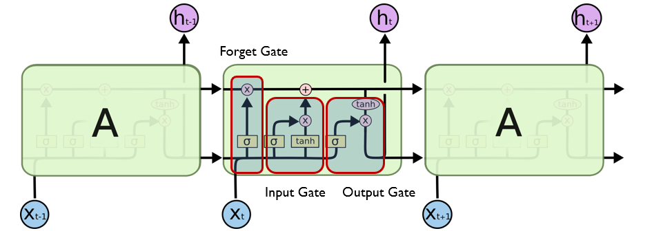
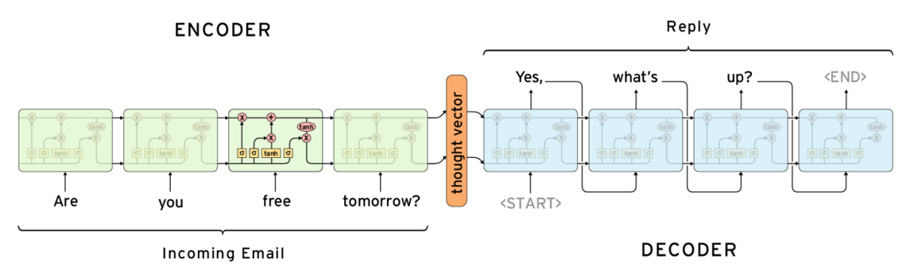
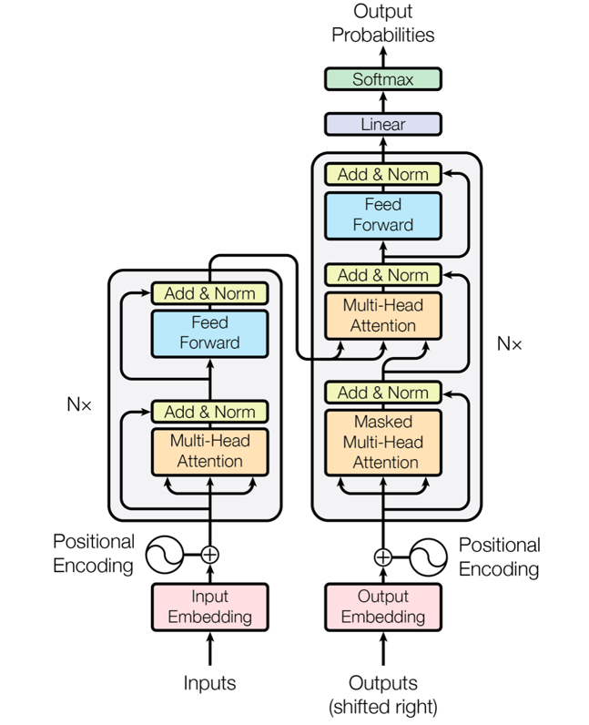

<!--Copyright © ZOMI 适用于[License](https://github.com/Infrasys-AI/AIInfra)版权许可-->

# 01.Transformer 结构介绍

解读 by: [lwh]

深度学习的浪潮中，**Transformer** 是改变自然语言处理（NLP）乃至整个人工智能领域格局的关键技术。从最初的 RNN、LSTM，到如今的 GPT、LLaMA、Qwen 等大型语言模型（LLM），Transformer 架构已经成为一切智能系统的核心。本文将系统介绍 Transformer 的发展逻辑、核心结构以及其在 BERT 与 GPT 中的演化，并讨论其在大模型生态中的重要影响。

## RNN 到 Transformer 的演进（Motivation）

### RNN 的出现与局限
循环神经网络（RNN, Recurrent Neural Network）是早期处理序列数据的重要模型。它通过引入“循环结构”，让前一时刻的隐藏状态（hidden state）参与当前输入的计算,从而具备一定的“记忆能力”，能够捕捉时间上的上下文依赖。这种特性使 RNN 在语音识别、机器翻译、文本生成等任务中得到广泛应用。这种设计虽然可以捕捉序列依赖，但也带来了以下问题：
- **训练慢**：每个时间步的计算依赖上一步结果，无法并行；
- **梯度消失 / 梯度爆炸**：长序列训练时梯度难以传播；
- **短期记忆问题**：模型对远距离信息感知能力差。
这些缺陷成为 Transformer 出现的直接动因。

### LSTM 的改进与不足

为了解决 RNN 在长序列训练中出现的 **梯度消失** 与 **梯度爆炸** 问题,研究者提出了 **LSTM（Long Short-Term Memory）** 网络结构。LSTM 在每个时间步中引入了 **遗忘门、输入门和输出门** 三个控制单元,能够有选择地保留、更新或输出信息，从而让模型在长时间序列中保持稳定的记忆能力.这种机制使 LSTM 能有效捕捉长期依赖关系，在语音识别、机器翻译等任务中取得显著效果。

LSTM 的结构如下图所示：

通过门控机制，LSTM 在一定程度上缓解了 RNN 的梯度消失问题，使模型能够在较长序列中保持信息传递。但它仍存在结构复杂、训练速度慢、并行性差等不足，对超长依赖关系的建模也不够稳定。这些局限使研究者开始探索更高效的序列建模方法，最终催生了 **Transformer** ——一种彻底摒弃循环结构、完全基于 **Attention 机制** 的新型架构。

### Encoder-Decoder 架构的提出

在 RNN 与 LSTM 之后，研究者提出了 **Seq2Seq（Sequence-to-Sequence）** 模型结构，它被广泛用于机器翻译、对话生成、摘要等任务，是 Transformer 架构的直接前身。

Seq2Seq 模型包含两个主要部分：
- **Encoder（编码器）**：负责读取并理解输入序列，将其转换为一个语义向量；
- **Decoder（解码器）**：根据该语义向量逐步生成目标输出序列。

下图展示了经典的 Encoder-Decoder 结构：

在这个结构中，编码器将输入句子（如 “Are you free tomorrow?”）编码为一个固定长度的“思维向量”（thought vector），再由解码器根据该向量生成目标句子（如 “Yes, what’s up?”）。
虽然 Seq2Seq 能在一定程度上建模序列关系，但由于将整句信息压缩为单一向量，长句易导致语义丢失；同时模型仍依赖 RNN/LSTM 的顺序计算，无法实现高效并行，对远距离依赖关系的建模能力也较为有限。这些缺陷直接促成了 **Transformer** 的诞生，它通过注意力机制实现了对整个序列的全局建模。

###  Transformer 的诞生
Transformer 摒弃循环结构，完全基于 **Attention** 来学习序列间的依赖。它的核心思想是：“让模型自己学习输入中哪些部分彼此相关”，从而实现全局建模与高效并行。

---

## Transformer 的核心结构（TODO）
Transformer 模型由 Vaswani 等人在 2017 年提出，首次完全舍弃循环结构，以自注意力机制为核心构建了一个可并行计算的 Encoder-Decoder 架构。

如上图所示，Transformer 由 **编码器（Encoder）** 和 **解码器（Decoder）** 组成：

- **Encoder（左侧）**：包含多层自注意力与前馈网络，用于提取输入序列的上下文表示；
- **Decoder（右侧）**：在生成每个输出 Token 时，既关注之前生成的内容，也关注 Encoder 的输出；
- **位置编码（Positional Encoding）**：为模型提供序列的位置信息；
- **残差连接（Add & Norm）**：保证深层结构的稳定训练；
- **输出层（Softmax）**：生成下一个最可能的 Token。

这张图是理解 Transformer 的关键框架，它揭示了模型在 Encoder-Decoder 层面如何通过 Attention 实现信息流动。接下来，我们将对每个组成模块（Embedding、Attention、Feed Forward、Add&Norm 等）进行详细讲解。

### 1. 输入层（Tokenization 与 Embedding）

在 Transformer 的输入层中，首先要对文本进行 **Tokenization（分词）**，将句子拆解成若干基本单元（token），再为每个 token 分配唯一的索引编号。随后，这些编号会映射到一个高维向量空间中，形成 **词嵌入（Word Embedding）**，用于表示每个词在语义空间中的位置。由于 Transformer 不再具有 RNN 那样的时序结构，因此模型需要额外加入 **位置编码（Positional Encoding）**，用以描述序列中各词的相对与绝对位置关系。位置编码通过固定或可学习的向量形式，与词嵌入逐元素相加，使模型能够在并行计算的同时保留顺序信息。最终，经过嵌入与位置编码的融合，输入文本被转换为连续的数值矩阵，成为后续 **自注意力层（Self-Attention）** 建模的基础。

上图直观展示了 Transformer 在输入层中的数据处理过程。最底部的句子 *“I ate an women”* 代表原始输入文本，首先经过 **Tokenize（分词）** 操作，被拆解为若干基本单元 —— *I*、*ate*、*an*、*apple*、*<eos>*。每个蓝色方块代表一个 token，经分词后被送入橙色的 **Embedding Layers（词嵌入层）**。在该层中，每个 token 会被映射为一个高维向量，用绿色方块矩阵表示，每个向量的维度大小为 *d_model*。这些高维向量不仅捕捉了词语的语义信息，也使模型能够在连续空间中处理文本。随后，模型会在这些嵌入上叠加 **位置编码（Positional Encoding）**，以显式引入词序信息。通过这种方式，Transformer 在实现高效并行计算的同时，仍能理解句子中各单词的相对顺序。最终，这些融合了语义与位置信息的嵌入矩阵将作为输入，送入后续的 **自注意力层（Self-Attention）** 进行上下文建模。

### 2. 自注意力机制（Self-Attention）

Attention 的核心思想是：  
> “让模型根据上下文动态决定哪些词对当前词更重要。”

## 本节视频

<html>
<iframe src="https://player.bilibili.com/player.html?isOutside=true&aid=1801208097&bvid=BV1rt421476q&cid=1455010750&p=1&as_wide=1&high_quality=1&danmaku=0&t=30&autoplay=0" width="100%" height="500" scrolling="no" border="0" frameborder="no" framespacing="0" allowfullscreen="true"> </iframe>
</html>
