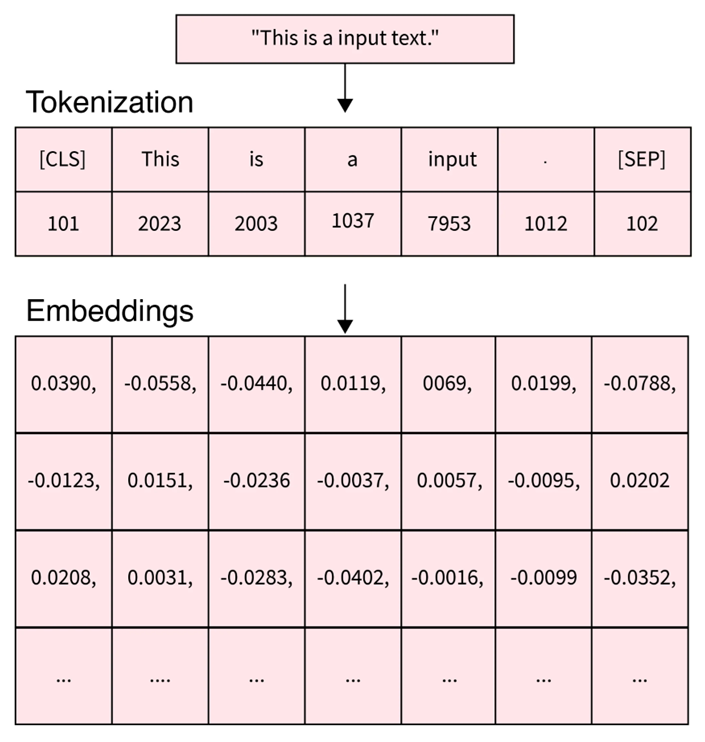
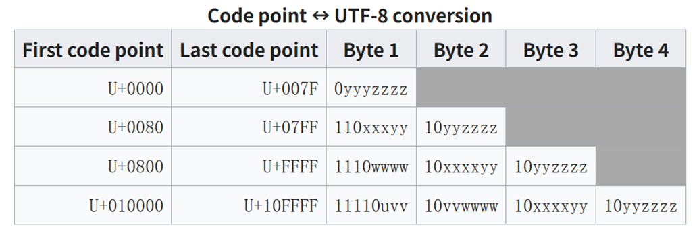
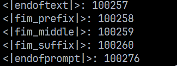

<!--Copyright © ZOMI 适用于[License](https://github.com/Infrasys-AI/AIInfra)版权许可-->

# 02.大模型 Tokenizer 算法

Author by:  张麒宁

人类的语言组成一般是连续的文本文字，对于连续文本的阅读，人类通常会将句子拆分为一个个单词来进行理解，计算机也是如此，对于一段复杂的文字，计算机首先需要将其拆分为模型可以处理的**最小可计算单位**，而这就是大模型领域经常听说的 token。

## Token 是什么？

人类语言是连续的文本，对于连续文本的阅读，我们通常会将句子拆分为一个个单词来进行理解，但是计算机无法处理文字，它的媒介是数字，因此需要将文本拆分成**计算机可处理的最小单元 token（词元）**。在大模型内部会存储一个**词表（vocabulary）**，记录词元与某个无符号整形数的对应关系。对于拆分的每一个**token**通过词汇表都能找到唯一的一个**token id**与之对应，**token id**通常使用无符号整型数进行表示，通过**文本 -> Token -> token id**的方式，能够将文本信息转化为数字表示，从而传递给计算机进行后续处理。

### token 长什么样？

Token 按照文本拆分的方式不同，可以有多种表示。从文本拆出的每一个“碎片”都是一个 token。下面几种方式都可以称作 token：

* **整词/高频片段**：中文字词：“你好”、"的"、“苹果”、英语单词：”dog“、”cat“、常用后缀“-ing”、“-tion”
* **单个字符（per character）**：”a“、”b“、”c”、“TAB”、“SPACE” ......（ASCII 码）
* **词的一部分（子词，per subword）**：比如对于生僻词或者长词 "Understanding" 可能被拆成 "Under" + "stand" + "ing" (其中每一部分就是一个 Token)。中文词 "乒乓球" 可能被拆成 "乒乓" + "球"。
* **符号或标点**：比如 "，"、"！"、"?"......
* **表情文字（emoji）**：😀
* **特殊 token**： <|endoftext|>

> **上述描述仅仅是 token 本身的一些可能表达，在实际分词过程中，单个 token 也可以是一些无意义的字节编码（在分词算法章节会进行解释），通过多个 token 的组合才能表示一个汉字或是一个子词。一个词常被拆成多个 token；反过来，多个字也可能合成 1 个 token。**

如果对于整段文字，如果**仅仅**使用单个字符作为 token 的方式进行表示，可以发现输入序列会过长；而如果**仅仅**使用完整的字词进行表示，则会发现词表会很大，并且对于一些新词或者英文变形没有办法表示。因此现有的 token 都是包含了整词、字符、子词等一些列形式，这种分词方式在长度、此表规模和覆盖率之间取得了这种，并且结合现有的分词算法也能有效避免**超出词表（Out-of-Vocabulary，OOV）**的发生。

> OOV 指“超出词表”的单位。早期按整词建词表的模型（或词向量）遇到没见过的新词、人名、拼写变体等时，无法直接用词表表示，这些词就是 **OOV**。常见处理是映射成一个统一的未知符号（如 **[UNK]**）

### token 在大模型领域的作用

token 作为大模型领域随处可见的术语，贯穿了大模型从训练到应用的全过程。

* **数据阶段**：不论是什么语言，或者是 emoji 等表情，最终都会映射到同一套 token id，映射方法将在后续算法章节介绍。对于数据集的统计现在也经常会使用多少个 token 作为最终的计量单位。
* **训练阶段**：大模型的训练本质就是对于前面所有的给定词元，最大化下一个 token 的概率。同时在模型微调的过程中也需要加入一些特殊 token，用于区分问题和答案的边界，以及回答的结束，常见的有<|endoftext|>、\<|endofprompt|\>等等。
* **推理阶段**：大模型产生输出的本质可以说与 token 息息相关，其推理本质可以理解为 next token prediction，通过不断对下一个 token 的预测，可以生成最终的答案。同时，在推理阶段我们经常可以看到上下文窗口，通常用 64k、128k 等，表示模型一次能看到的最大 token 数。
* **评估阶段**：对于大模型的评估很多都是在 token 层面进行评估，困惑度（perplexity）以及一些任务型指标都需要在 token 的层面进行对模型进行评价

可以发现，对于人类来说，想要理解文本，需要理解其中的字或者词，而对于大模型来说其可处理的最小单元变为了 token，因此，对 token 有一个深入了解可以帮助我们进一步理解大模型。

## Tokenizer 和 Tokenization

在讲解分词器（Tokenizer）和分词过程（Tokenization）之前，需要了解分词这个操作发生在大模型处理的哪一个阶段。



上图展示了对于一段文本“This is a input text.”，在大模型中是如何进行处理，并转化为深度学习中的矩阵输入。可以看到，这段文本首先进入了**分词器（tokenizer）**进行**分词操作（tokenization）**，通过分词操作之后，这段文本被拆分为了“[CLS]”、"This"、"is"、"a"、"input"、"."、"[SEP]"这六个 token，其在词汇表中对应的 token id 分别为“101”、“2023”、“2003”、“1037”、“7953”、“1012”、“102”，token id 是一个由词汇表定义，从 0 开始到词汇表大小的正整数。

> 上述 token id 仅仅是一个示例，正常情况会将[CLS]、[SEP]等特殊 token 作为词汇表的最后几个 token

在得到 token id 后，需要经过嵌入（Embedding）操作，得到每一个 token id 所对应的词向量，也就是上图中下面所展示的每一列浮点数向量。通过将每一个 token 对应的词向量进行组合，就可以得到输入 Transformer 的矩阵。

在上文，详细说明了文本转化为矩阵的全过程，token 作为计算机可以处理的最小单元，在上面的例子中展示为了单个单词、符号；但是其实际表现形式可以是整词、单个字符、子词，甚至在一些时候只是一些没有实际意义的字节组合。这就带来了一个新的问题，现有的大模型是如何确定哪些词、哪些字符是一个 token 的？词汇表究竟是如何构建的？

### 分词算法：BPE

在大模型里，分词的目标不是做“最像语言学”的切词，而是找到一种**稳定、可泛化**的表示。现有的大模型中，**BPE** 算法就是最常使用的，构建词汇表的方法——从很小的单位出发，**反复把最常见的相邻片段合并**，学出一套高频词汇表。

为什么我们需要 BPE？在大模型的分词中存在两个极端：

1. **按整词构建词表**，词表会爆炸，遇到新词、人名等没有记录到的单词，就会出现**OOV**；
2. **按字符切分**，虽然不会出现 OOV，但是会出现两个问题，一方面，分词后的序列的长度会很长，对于每个字符都需要指定一个 token id，转化为一个词向量，Transformer 计算量会激增；另一方面，每一个字符所代表的含义太过丰富，很难通过一个词向量学习，模型训练的成本和时间势必会增加。

这时候就需要一种分词方式：既要覆盖任意文本，又要把序列长度控制在工程可接受的范围，还要让模型能从片段中学习到可复用的模式。

**BPE（Byte-Pair Encoding）**提供了这样一条路。它最初来自文本压缩，但思想非常适合分词：把文本先拆分为可以表示的最小单元，然后统计“相邻两单元”的出现频率，反复把“最常见的一对”合并为更长的片段。久而久之，语料里真正高频的组合会被“收编”进词表。这让模型既能用较短的 token 序列表达常见模式，又能通过更小的片段去覆盖从未见过的词。

[BPE](https://en.wikipedia.org/wiki/Byte-pair_encoding)的实际操作我们使用维基百科的例子进行解释：

```text
对于原始字符串：aaabdaaabac

第一步：最高频相邻对是 "aa"（出现 2 次），把所有 "aa" 合并成新符号 Z
    aaabdaaabac  →  ZabdZabac
    规则表：Z = "aa"

Step 2：此时最高频相邻对是 "ab"（出现 2 次），合并为新符号 Y
    ZabdZabac    →  ZYdZYac
    规则表：Z = "aa",  Y = "ab"

Step 3：此时最高频相邻对是 "ZY"（出现 2 次），合并为新符号 X
    ZYdZYac      →  XdXac
    规则表：Z = "aa",  Y = "ab",  X = "ZY" = "aaab"

停止条件：没有任何一对相邻片段再次出现超过 1 次，停止。
```

上述例子中，最终形成的词汇表将会包含“a”、“b”、“c”、“Z”、“Y”、“X”六个 token，我们可以通过 0、1、2、3、4、5 这五个数来表示对应的 token，这六个数就成为 token id，词表中还会将对应关系一并记录其中。

BPE 算法一直会进行到没有任何一堆相邻片段再次出现超过 1 次。但是在实际构建分词器的过程中，语料库异常丰富，因此如果使用这个条件，构建的词表将会巨大。因此，一般会设定一个词表大小，目前主流词表一般为 10k~20k 大小，通过上述的不断合并，将词表扩充至最大，随后停止合并，并产生最终的词表和对应的分词器。

### 主流分词算法：BBPE

既然已经学会了**BPE**的分词方式，让我们看看对于一个词“苹果”，在进行分词的时候，不同的模型到底是分为“苹”和“果”，还是作为一个 token“苹果”来进行表示呢？

答案是：对于不同的**分词器（tokenizer）**，对“苹果”存在不同的分词方式，我们通过分词器网站[Tokenizer 示例](https://tiktokenizer.vercel.app/)进行分词的尝试，输入“苹果”这个词，看看产生了哪些**token id**：

* **GPT-2**：164, 233, 117, 162, 252, 250 **被拆分为了 6 个 token！**
* **GPT-4**：51043, 117, 28873 **被拆分成了 3 个 token！**
* **GPT-4o**：32176 **仅仅只需要一个 token 就可以表示！**

对于 GPT-4o 的分词方式，可以比较容易理解，“苹果”这个单词在 GPT-4o 使用的词汇表中 token id 为 32176，通过使用这个 token id 在嵌入矩阵中进行检索，可以找到表示“苹果”这个单词的。但是 GPT-2 和 GPT-4 却使用了 6 个以及 3 个 token 来进行表示，这看起来非常有悖常理。“苹果”这个字再怎么划分都最多只能分成两个字，但是为什么分词器却可以将其分为 3 个甚至是 6 个 token？

其实答案很简单，对于人类来说，“苹果”这个中文，是通过一个一个字来进行表示的，但是对于计算机来说，汉字是通过字节进行存储的，而现在最常用的就是 UTF-8 格式的数据。UTF-8 几乎涵盖了地球上的任何语言以及表达方式，电脑上展示的任意文本都可以使用 UTF-8 解码为字节的形式。下图展示了 UTF-8 编码的格式。



下面展示了一些词汇 UTF-8 编码的结果，所有的文字、表情等等都可以表示为一些列字节的组合。

* 中文：你好 [228, 189, 160, 229, 165, 189]

* 英文：Hello [72, 101, 108, 108, 111]

* emoji：😀 [240, 159, 152, 128]

> 可以简单的说，BBPE 就是针对计算机的 BPE 算法，也是目前最主流的分词算法

**TODO 还需进行内容补充**

### Unigram LM (TODO)


### 特殊 token（Special Token）

以 GPT-4 使用的分词器 cl_100k_base 为例，该分词器使用的特殊 token 一共有 5 个，如下所示：



接下来会对这五个特殊 token 进行解释，现有的大模型基本也都使用类似的特殊 token，但是会依据自身实际需求增加或删减一些特殊 token。

**\<|endoftext|\>**：表示文章的结束标志，告诉大模型后续的预测不需要考虑 endoftext 前面的内容，通常用于终止文本生成（模型遇到该标记时停止），以及在训练数据当中分隔不同文档。

**\<|endofprompt|\>**：表示提示（prompt）的结束，通常用于分隔用户输入和模型的生成

前面两个特殊 token 非常容易理解，就和英文表示的意思一样，剩下的几个特殊 token 都包含**fim**。因此，接下来，首先说明一下 fim 是什么。

**FIM**的全称是**fill-in-the-middle**，是一种训练或推理策略，目的是让模型能够根据文本的**前缀（prefix）**和**后缀（suffix）**，生成中间缺失的内容（middle）。它主要用于解决传统自回归模型（如 GPT）只能从左到右生成文本的局限性，增强模型对上下文的理解和补全能力。

FIM 通过以下步骤实现：

1. **输入重组**：将原始文本拆分为三部分：
   - **Prefix**：文本的开头部分。
   - **Middle**：需要模型填充的中间部分（训练时会被随机遮盖）。
   - **Suffix**：文本的结尾部分。
2. **插入特殊标记**：使用特殊标记（如 `<FIM_PREFIX>`、`<FIM_SUFFIX>`、`<FIM_MIDDLE>`）标识各部分。
   - 输入格式示例：`<FIM_PREFIX> [prefix] <FIM_SUFFIX> [suffix] <FIM_MIDDLE> [middle]`
3. **模型训练**：调整模型的注意力机制，使其能同时关注前缀和后缀，并生成中间内容。
4. **推理阶段**：给定前缀和后缀，模型生成中间部分。

通过上述解释，可以轻松知道剩下的三个特殊 token 的作用。

**\<fim-prefix\>**：标识前缀（已知的上下文开头）。

**\<fim-middle\>**：标识后缀（已知的上下文结尾）。

**\<fim-suffix\>**：标识模型需要生成的位置。

剩下的三个特殊 token 可以理解成是 GPT-4 的一个 DLC，用以实现这种生成中间内容的功能。不同的 tokenizer 当中的 special tokens 的定义会有些差别，这些特殊 token 都是可以自己定义的。如果你有一些特别的想法，也可以通过在现有的词表的末尾添加新的 special token 来实现。

## 词表对模型的影响 (TODO) 

### 


## 本节视频

<html>

<iframe src="https://player.bilibili.com/player.html?isOutside=true&aid=114625194497651&bvid=BV16pTJz9EV4&cid=30319903448&p=1&as_wide=1&high_quality=1&danmaku=0&t=30&autoplay=0" width="100%" height="500" scrolling="no" border="0" frameborder="no" framespacing="0" allowfullscreen="true"> </iframe>
</html>
