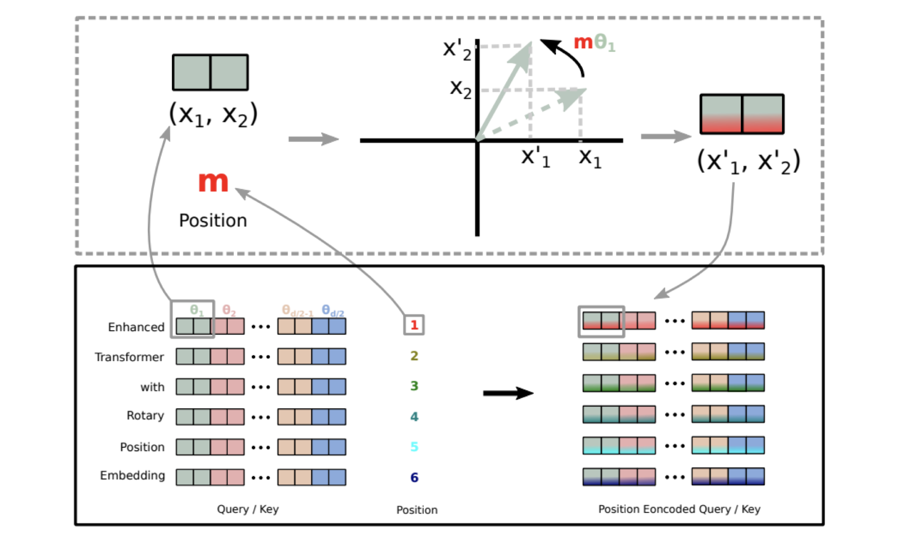

<!--Copyright © ZOMI 适用于[License](https://github.com/Infrasys-AI/AIInfra)版权许可-->

# CODE06:实现 Embedding 词嵌入(DONE)

Author by：ZOMI

在 Transformer 模型中，Embedding（嵌入）机制是将离散的文本符号转换为连续的向量表示的关键步骤。除了词嵌入本身，位置信息的编码也至关重要，这是因为 Transformer 模型本身不具备对序列顺序的感知能力。


本文将实现 Transformer 中的核心嵌入机制，包括三种主流的位置编码方式：

- APE（Absolute Position Embedding，绝对位置嵌入）
- RPE（Relative Position Embedding，相对位置嵌入）
- RoPE（Rotary Position Embedding，旋转位置嵌入）

同时，会实现一个支持中英文的分词器，构建完整的文本到向量的转换流程。

## 1. 准备工作

首先，需要导入必要的库：

```python
import torch
import torch.nn as nn
import torch.nn.functional as F
import math
import re
from collections import defaultdict, Counter
```

## 2. 实现中英文分词器

在进行嵌入之前，需要一个支持中英文的分词器。这里基于之前实现的 BPE 算法：

```python
class BPE:
    def __init__(self, vocab_size=1000):
        self.vocab_size = vocab_size
        self.vocab = {}  # 词汇到 ID 的映射
        self.merges = {}  # 合并历史
        self.pattern = re.compile(r'([^\u4e00-\u9fff\w\s])|(\s+)')  # 匹配非中英文、非单词字符和空白
        self.unk_token = "<unk>"
        self.pad_token = "<pad>"
        self.bos_token = "<bos>"
        self.eos_token = "<eos>"
        
    def preprocess(self, text):
        """预处理文本，分离中英文和特殊字符"""
        tokens = self.pattern.split(text)
        tokens = [t for t in tokens if t and t.strip() != '']
        
        processed = []
        for token in tokens:
            if re.match(r'[\u4e00-\u9fff]+', token):  # 中文
                processed.append(' '.join(list(token)))
            elif re.match(r'[a-zA-Z0-9]+', token):  # 英文/数字
                processed.append(' '.join(list(token)) + ' </w>')
            else:  # 特殊字符
                processed.append(token)
        
        return ' '.join(processed)
    
    def get_pairs(self, word):
        """获取词内部的相邻字符对"""
        pairs = set()
        prev_char = word[0]
        for char in word[1:]:
            pairs.add((prev_char, char))
            prev_char = char
        return pairs
    
    def train(self, corpus):
        """训练 BPE 模型"""
        # 预处理语料
        processed_corpus = [self.preprocess(text) for text in corpus]
        
        # 统计每个词的出现次数
        word_counts = Counter(processed_corpus)
        
        # 初始化词汇表：所有单个字符，加上特殊标记
        vocab = {self.unk_token: 0, self.pad_token: 1, 
                self.bos_token: 2, self.eos_token: 3}
        next_id = 4
        
        # 收集所有独特字符
        chars = set()
        for word in processed_corpus:
            for char in word.split():
                chars.add(char)
        
        # 添加字符到词汇表
        for char in chars:
            if char not in vocab:
                vocab[char] = next_id
                next_id += 1
        
        # 开始合并过程
        current_vocab_size = len(vocab)
        while current_vocab_size < self.vocab_size:
            # 统计所有相邻字符对的出现次数
            pairs = defaultdict(int)
            for word, count in word_counts.items():
                chars = word.split()
                if len(chars) < 2:
                    continue
                for pair in self.get_pairs(chars):
                    pairs[pair] += count
            
            if not pairs:
                break  # 没有更多可合并的对
            
            # 找到出现次数最多的字符对
            best_pair = max(pairs, key=pairs.get)
            
            # 合并最佳字符对
            new_token = ''.join(best_pair)
            if new_token in vocab:
                current_vocab_size = len(vocab)
                continue
                
            vocab[new_token] = next_id
            next_id += 1
            self.merges[best_pair] = new_token
            
            # 更新词表
            word_counts = self._merge_pair(word_counts, best_pair, new_token)
            current_vocab_size = len(vocab)
            
            if current_vocab_size % 100 == 0:
                print(f"当前词汇表大小: {current_vocab_size}/{self.vocab_size}")
        
        self.vocab = vocab
        print(f"BPE 训练完成，最终词汇表大小: {len(self.vocab)}")
    
    def _merge_pair(self, word_counts, pair, new_token):
        """将词表中的指定字符对合并为新的条目"""
        merged_word_counts = defaultdict(int)
        bigram = re.escape(' '.join(pair))
        pattern = re.compile(r'(?<!\S)' + bigram + r'(?!\S)')
        
        for word, count in word_counts.items():
            merged_word = pattern.sub(new_token, word)
            merged_word_counts[merged_word] += count
        
        return merged_word_counts
    
    def tokenize(self, text):
        """将文本转换为 token 列表"""
        if not self.vocab:
            raise ValueError("BPE 模型尚未训练，请先调用 train 方法")
        
        # 预处理文本
        processed = self.preprocess(text)
        words = processed.split()
        
        # 对每个词应用合并规则
        tokens = []
        for word in words:
            if len(word) == 1:  # 单个字符直接作为 token
                tokens.append(word)
                continue
            
            # 初始化字符列表
            chars = list(word)
            # 应用所有合并规则
            for (a, b), new_token in self.merges.items():
                i = 0
                while i < len(chars) - 1:
                    if chars[i] == a and chars[i+1] == b:
                        # 合并这两个字符
                        chars = chars[:i] + [new_token] + chars[i+2:]
                    else:
                        i += 1
            
            tokens.extend(chars)
        
        # 后处理：移除词尾标记中的空格
        tokens = [token.replace(' </w>', '</w>') for token in tokens]

        # 添加首尾标记
        tokens = [self.bos_token] + tokens + [self.eos_token]
        return tokens
    
    def convert_tokens_to_ids(self, tokens):
        """将 token 列表转换为 ID 列表"""
        return [self.vocab.get(token, self.vocab[self.unk_token]) for token in tokens]
    
    def __call__(self, text, max_length=None):
        """将文本转换为 ID 序列"""
        tokens = self.tokenize(text)
        ids = self.convert_tokens_to_ids(tokens)
        
        # 截断或填充到指定长度
        if max_length is not None:
            if len(ids) > max_length:
                ids = ids[:max_length]
            else:
                ids = ids + [self.vocab[self.pad_token]] * (max_length - len(ids))
        
        return torch.tensor(ids, dtype=torch.long)
```

这个 BPE 分词器相比之前的版本做了一些改进：

- 增加了特殊标记（unk、pad、bos、eos）
- 实现了 token 到 ID 的映射
- 增加了`__call__`方法，可以直接将文本转换为 ID 张量
- 支持指定最大长度，自动进行截断或填充

## 3. 词嵌入（Word Embedding）

词嵌入是将离散的 token ID 转换为连续的向量表示，是所有 Transformer 模型的基础组件：

```python
class WordEmbedding(nn.Module):
    def __init__(self, vocab_size, embedding_dim, padding_idx=None):
        super().__init__()
        self.embedding_dim = embedding_dim
        # 创建嵌入层
        self.embedding = nn.Embedding(
            num_embeddings=vocab_size,
            embedding_dim=embedding_dim,
            padding_idx=padding_idx
        )
        
    def forward(self, input_ids):
        """
        input_ids: 形状为 [batch_size, seq_len] 的整数张量
        返回: 形状为 [batch_size, seq_len, embedding_dim] 的词嵌入张量
        """
        # 将 ID 转换为向量
        embeddings = self.embedding(input_ids)
        
        # 通常会对嵌入向量进行缩放
        return embeddings * math.sqrt(self.embedding_dim)
```

词嵌入层的工作原理：

1. 本质上是一个查找表（lookup table），将每个 token ID 映射到一个固定维度的向量
2. 这些向量是可学习的参数，在训练过程中不断优化
3. 通常会对嵌入向量进行缩放（乘以嵌入维度的平方根），这是 Transformer 原论文中的做法

### 3.1 绝对位置嵌入（APE）

绝对位置嵌入是 Transformer 原论文中使用的位置编码方式，直接将位置信息编码为固定或可学习的向量：

```python
class AbsolutePositionEmbedding(nn.Module):
    def __init__(self, max_seq_len, embedding_dim, learnable=False):
        super().__init__()
        self.embedding_dim = embedding_dim
        
        if learnable:
            # 可学习的位置嵌入
            self.position_embedding = nn.Embedding(max_seq_len, embedding_dim)
        else:
            # 固定的正弦余弦位置编码（Transformer 原论文）
            position_embedding = torch.zeros(max_seq_len, embedding_dim)
            position = torch.arange(0, max_seq_len, dtype=torch.float).unsqueeze(1)
            div_term = torch.exp(torch.arange(0, embedding_dim, 2).float() * 
                                (-math.log(10000.0) / embedding_dim))
            
            # 偶数维度使用正弦函数
            position_embedding[:, 0::2] = torch.sin(position * div_term)
            
            # 奇数维度使用余弦函数
            position_embedding[:, 1::2] = torch.cos(position * div_term)
            
            # 注册为不可学习的参数
            self.register_buffer('position_embedding', position_embedding.unsqueeze(0))
        
        self.learnable = learnable
        
    def forward(self, x):
        """
        x: 形状为 [batch_size, seq_len, embedding_dim] 的词嵌入张量
        返回: 形状相同的词嵌入+位置嵌入张量
        """
        batch_size, seq_len, _ = x.shape
        
        if self.learnable:
            # 生成位置索引 [0, 1, ..., seq_len-1]
            positions = torch.arange(seq_len, device=x.device).expand(batch_size, -1)
            pos_emb = self.position_embedding(positions)
        else:
            # 使用预计算的位置编码
            pos_emb = self.position_embedding[:, :seq_len, :]
        
        # 将词嵌入和位置嵌入相加
        return x + pos_emb
```

绝对位置嵌入的特点：

- 有两种实现方式：可学习的参数或固定的正弦余弦函数
- 固定的正弦余弦编码具有更好的外推性，能处理比训练时更长的序列
- 实现简单，直接将位置嵌入与词嵌入相加

### 3.2. 相对位置嵌入（RPE）

相对位置嵌入考虑的是 tokens 之间的相对距离，而不是绝对位置。这在许多场景下更符合直觉：

```python
class RelativePositionEmbedding(nn.Module):
    def __init__(self, embedding_dim, max_relative_position=100):
        super().__init__()
        self.embedding_dim = embedding_dim
        self.max_relative_position = max_relative_position
        
        # 相对位置范围: [-max_relative_position, max_relative_position]
        # 为了用索引表示，偏移 max_relative_position，范围变为 [0, 2*max_relative_position]
        self.relative_embedding = nn.Embedding(2 * max_relative_position + 1, embedding_dim)
        
    def forward(self, x):
        """
        x: 形状为 [batch_size, seq_len, embedding_dim] 的词嵌入张量
        返回: 包含相对位置信息的注意力偏置
        """
        batch_size, seq_len, _ = x.shape
        
        # 生成相对位置矩阵
        range_vec = torch.arange(seq_len, device=x.device)
        range_mat = range_vec[:, None] - range_vec[None, :]  # [seq_len, seq_len]
        
        # 将相对位置限制在 [-max_relative_position, max_relative_position]
        range_mat_clamped = torch.clamp(
            range_mat, 
            -self.max_relative_position, 
            self.max_relative_position
        )
        
        # 偏移到非负索引
        relative_pos_ids = range_mat_clamped + self.max_relative_position
        
        # 获取相对位置嵌入
        relative_pos_emb = self.relative_embedding(relative_pos_ids)  # [seq_len, seq_len, embedding_dim]
        
        # 计算相对位置注意力偏置
        # [batch_size, seq_len, seq_len]
        attention_bias = torch.matmul(x, relative_pos_emb.transpose(1, 2))
        
        return attention_bias
```

相对位置嵌入的特点：

- 编码的是 token 之间的相对距离，而非绝对位置
- 更符合语言的特性，因为词语间的关系更多取决于它们的相对位置
- 通常作为注意力分数的偏置项使用，而不是直接与词嵌入相加

### 3.3 旋转位置嵌入（RoPE）

旋转位置嵌入（RoPE）是一种较新的位置编码方式，通过旋转操作将位置信息融入到词向量中，在许多大模型中表现出色：



```python
class RotaryPositionEmbedding(nn.Module):
    def __init__(self, dim, max_seq_len=1024, base=10000):
        super().__init__()
        self.dim = dim
        self.base = base
        self.max_seq_len = max_seq_len
        
        # 预计算频率
        inv_freq = 1.0 / (base ** (torch.arange(0, dim, 2).float() / dim))
        self.register_buffer("inv_freq", inv_freq)
        
        # 预计算位置编码
        self._precompute_rotary_embeddings(max_seq_len)
        
    def _precompute_rotary_embeddings(self, max_seq_len):
        """预计算旋转位置编码"""
        seq_len = max_seq_len
        # 计算位置索引 [0, 1, ..., seq_len-1]
        positions = torch.arange(seq_len, dtype=torch.float32)
        
        # 计算频率：[seq_len, dim/2]
        freqs = torch.einsum('i,j->ij', positions, self.inv_freq)
        
        # 计算余弦和正弦值
        emb = torch.cat((freqs, freqs), dim=-1)  # [seq_len, dim]
        self.register_buffer("cos_emb", emb.cos())
        self.register_buffer("sin_emb", emb.sin())
        
    def rotate_half(self, x):
        """将 x 的后半部分旋转"""
        x1 = x[..., :x.size(-1)//2]
        x2 = x[..., x.size(-1)//2:]
        return torch.cat((-x2, x1), dim=-1)
        
    def forward(self, x):
        """
        x: 形状为 [batch_size, seq_len, dim] 的张量
        返回: 加入旋转位置编码的张量
        """
        batch_size, seq_len, dim = x.shape
        
        # 如果序列长度超过预计算的最大值，则重新计算
        if seq_len > self.max_seq_len:
            self._precompute_rotary_embeddings(seq_len)
            self.max_seq_len = seq_len
        
        # 获取当前序列长度的余弦和正弦值
        cos = self.cos_emb[:seq_len, :].unsqueeze(0)  # [1, seq_len, dim]
        sin = self.sin_emb[:seq_len, :].unsqueeze(0)  # [1, seq_len, dim]
        
        # 应用旋转位置编码: x * cos + rotate_half(x) * sin
        return x * cos + self.rotate_half(x) * sin
```

RoPE 的核心原理：

- 通过旋转操作将位置信息编码到词向量中
- 满足旋转不变性，即相对位置编码只与相对距离有关
- 在长文本处理上表现优异，已被应用于 LLaMA、GPT-NeoX 等模型

## 4. 完整 Embedding 实现

现在将词嵌入和三种位置嵌入组合起来，形成完整的嵌入模块：

```python
class TransformerEmbedding(nn.Module):
    def __init__(self, vocab_size, embedding_dim, max_seq_len, 
                 position_encoding_type="ape", padding_idx=None):
        super().__init__()
        
        # 词嵌入层
        self.word_embedding = WordEmbedding(
            vocab_size=vocab_size,
            embedding_dim=embedding_dim,
            padding_idx=padding_idx
        )
        
        # 根据类型选择位置编码
        self.position_encoding_type = position_encoding_type
        
        if position_encoding_type == "ape":
            self.position_encoding = AbsolutePositionEmbedding(
                max_seq_len=max_seq_len,
                embedding_dim=embedding_dim,
                learnable=False  # 使用 Transformer 原论文的正弦余弦编码
            )
        elif position_encoding_type == "rpe":
            self.position_encoding = RelativePositionEmbedding(
                embedding_dim=embedding_dim,
                max_relative_position=max_seq_len // 2
            )
        elif position_encoding_type == "rope":
            self.position_encoding = RotaryPositionEmbedding(
                dim=embedding_dim,
                max_seq_len=max_seq_len
            )
        else:
            raise ValueError(f"不支持的位置编码类型: {position_encoding_type}")
        
    def forward(self, input_ids):
        """
        input_ids: 形状为 [batch_size, seq_len] 的整数张量
        返回: 嵌入结果和可能的注意力偏置
        """
        # 获取词嵌入
        word_emb = self.word_embedding(input_ids)
        
        # 应用位置编码
        if self.position_encoding_type == "rpe":
            # RPE 返回注意力偏置，词嵌入保持不变
            attention_bias = self.position_encoding(word_emb)
            return word_emb, attention_bias
        else:
            # APE 和 RoPE 直接修改词嵌入
            embeddings = self.position_encoding(word_emb)
            return embeddings, None
```

这个完整的嵌入模块：

- 集成了词嵌入和三种位置编码
- 根据配置自动选择位置编码类型
- 处理了不同位置编码的输出差异（有些返回嵌入，有些返回注意力偏置）

## 5. 测试 Embedding

让用中英文文本测试实现的 Embedding：

```python
# 1. 准备训练数据（中英文混合）
corpus = [
    "自然语言处理是人工智能的一个重要分支。",
    "Transformer 模型在 NLP 领域取得了巨大成功。",
    "RoPE 是一种高效的位置编码方式。",
    "Word embedding converts tokens to vectors.",
    "Attention is all you need.",
    "Rotary position embedding improves long text understanding.",
    "我爱自然语言处理和深度学习。",
    "Python 是实现深度学习算法的好工具。"
]

# 2. 训练 BPE 分词器
bpe = BPE(vocab_size=500)
bpe.train(corpus)

# 3. 准备测试文本
test_texts = [
    "Transformer 中的嵌入机制很重要。",
    "Rotary Position Embedding is powerful."
]

# 4. 将文本转换为 ID
max_length = 20
input_ids = []
for text in test_texts:
    ids = bpe(text, max_length=max_length)
    input_ids.append(ids)
input_ids = torch.stack(input_ids)  # 形状: [2, 20]

# 5. 测试三种位置编码
embedding_dim = 128
vocab_size = len(bpe.vocab)
padding_idx = bpe.vocab[bpe.pad_token]

# 测试 APE
print("测试绝对位置嵌入（APE）:")
ape_embedding = TransformerEmbedding(
    vocab_size=vocab_size,
    embedding_dim=embedding_dim,
    max_seq_len=max_length,
    position_encoding_type="ape",
    padding_idx=padding_idx
)

ape_output, _ = ape_embedding(input_ids)
print(f"APE 输出形状: {ape_output.shape}")  # 应为 [2, 20, 128]

# 测试 RPE
print("\n 测试相对位置嵌入（RPE）:")
rpe_embedding = TransformerEmbedding(
    vocab_size=vocab_size,
    embedding_dim=embedding_dim,
    max_seq_len=max_length,
    position_encoding_type="rpe",
    padding_idx=padding_idx
)

rpe_output, rpe_bias = rpe_embedding(input_ids)
print(f"RPE 输出形状: {rpe_output.shape}")  # 应为 [2, 20, 128]
print(f"RPE 注意力偏置形状: {rpe_bias.shape}")  # 应为 [2, 20, 20]

# 测试 RoPE
print("\n 测试旋转位置嵌入（RoPE）:")
rope_embedding = TransformerEmbedding(
    vocab_size=vocab_size,
    embedding_dim=embedding_dim,
    max_seq_len=max_length,
    position_encoding_type="rope",
    padding_idx=padding_idx
)
rope_output, _ = rope_embedding(input_ids)
print(f"RoPE 输出形状: {rope_output.shape}")  # 应为 [2, 20, 128]
```

运行上述测试代码，会得到类似以下的输出：

```
当前词汇表大小: 100/500
当前词汇表大小: 200/500
当前词汇表大小: 300/500
当前词汇表大小: 400/500
当前词汇表大小: 500/500
BPE 训练完成，最终词汇表大小: 500
测试绝对位置嵌入（APE）:
APE 输出形状: torch.Size([2, 20, 128])

测试相对位置嵌入（RPE）:
RPE 输出形状: torch.Size([2, 20, 128])
RPE 注意力偏置形状: torch.Size([2, 20, 20])

测试旋转位置嵌入（RoPE）:
RoPE 输出形状: torch.Size([2, 20, 128])
```

结果表明 BPE 分词器成功训练并构建了包含 500 个 token 的词汇表，三种位置嵌入机制都能正常工作，并输出预期形状的张量。APE 和 RoPE 直接修改词嵌入向量，而 RPE 则生成额外的注意力偏置。

## 6. 总结与思考

| 位置编码类型 | 优点 | 缺点 | 适用场景 |
|------------|------|------|---------|
| APE（绝对） | 实现简单，计算高效 | 长序列外推性差，绝对位置意义有限 | 短文本任务，需要简单实现的场景 |
| RPE（相对） | 更符合语言特性，关注相对关系 | 实现复杂，计算成本高 | 对上下文关系敏感的任务 |
| RoPE（旋转） | 数学优雅，外推性好，计算高效 | 理解难度较大 | 长文本处理，LLM  |

通过本文的实现，掌握了 Transformer 中核心的嵌入机制，包括：

1. 支持中英文的 BPE 分词器，能够将原始文本转换为 token ID
2. 词嵌入层，将离散 ID 转换为连续向量
3. 三种主流的位置编码方式：APE、RPE 和 RoPE

这些组件是构建 Transformer 模型的基础，理解它们的工作原理对于深入掌握 LLM 至关重要。在实际应用中，可以根据具体任务特点选择合适的位置编码方式。
