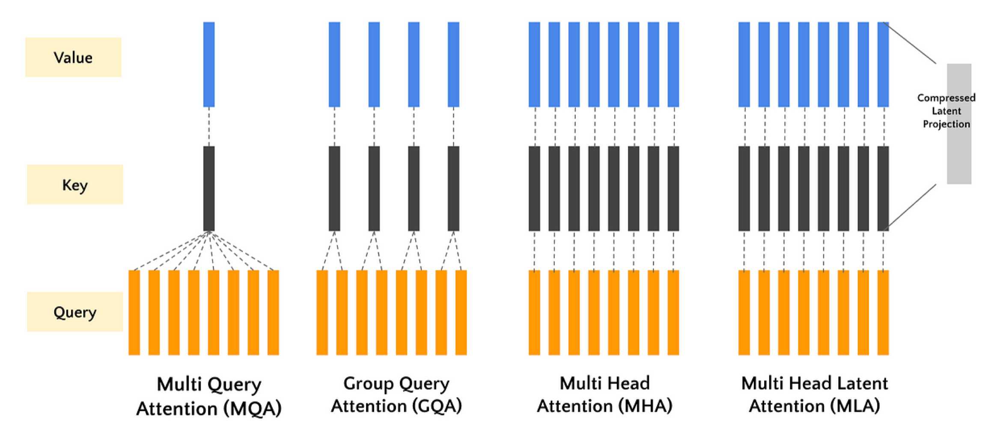
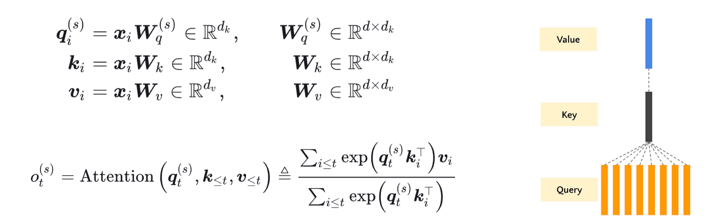

<!--Copyright © ZOMI 适用于[License](https://github.com/Infrasys-AI/AIInfra)版权许可-->

# CODE07:深入注意力机制 MHA、MQA、GQA、MLA(DONE)

本实验将从头实现标准的多头注意力（MHA），并在此基础上，逐步实现其三种重要的变体：**MQA**、**GQA** 和 **MLA**。通过对比它们的代码差异和性能指标，我们将深入理解它们的设计动机和优劣。

1. **基础缩放点积注意力**：所有注意力机制的基础组件
2. **多头注意力（MHA）**：经典的多头设计，每个头有独立的 Q、K、V 投影
3. **多查询注意力（MQA）**：所有头共享 K 和 V 投影，提高效率
4. **分组查询注意力（GQA）**：MHA 和 MQA 的折中方案，头分组共享 K 和 V
5. **多潜在注意力（MLA）**：使用可学习的潜在向量作为 K 和 V，与序列长度无关



## 1. 注意力机制基础

### 1.1 Scaled Dot-Product Attention

核心的注意力计算机制，由 **《Attention Is All You Need》** 提出。其目的是通过查询向量（Query）与键向量（Key）的相似度，来加权求和值向量（Value）。

**公式如下：**

$$\text{Attention}(Q, K, V) = \text{softmax}\left(\frac{QK^T}{\sqrt{d_k}}\right)V$$

其中：
- $Q$: 查询矩阵，形状为 `(seq_len, d_k)` 或 `(batch_size, seq_len, d_k)`
- $K$: 键矩阵，形状为 `(seq_len, d_k)` 或 `(batch_size, seq_len, d_k)`
- $V$: 值矩阵，形状为 `(seq_len, d_v)` 或 `(batch_size, seq_len, d_v)`
- $d_k$: 键向量的维度，缩放因子 $\sqrt{d_k}$ 用于防止点积结果过大导致梯度消失。

让我们先实现这个核心函数。

```python
import torch
import torch.nn as nn
import torch.nn.functional as F
import math

def scaled_dot_product_attention(query, key, value, mask=None):
    """
    计算缩放点积注意力。
    
    Args:
        query: 查询张量，形状 (..., seq_len_q, d_k)
        key: 键张量，形状 (..., seq_len_k, d_k)
        value: 值张量，形状 (..., seq_len_v, d_v)
        mask: 可选的掩码张量，形状 (..., seq_len_q, seq_len_k)
    
    Returns:
        输出张量，形状 (..., seq_len_q, d_v)
        注意力权重张量，形状 (..., seq_len_q, seq_len_k)
    """
    # 1. 计算 Q 和 K 的转置的点积
    matmul_qk = torch.matmul(query, key.transpose(-2, -1))  # (..., seq_len_q, seq_len_k)
    
    # 2. 缩放：除以 sqrt(d_k)
    d_k = query.size(-1)
    scaled_attention_logits = matmul_qk / math.sqrt(d_k)
    
    # 3. 可选：应用掩码（在解码器中用于掩盖未来位置）
    if mask is not None:
        # 将掩码中为 0 的位置置为一个非常大的负数，softmax 后概率为 0
        scaled_attention_logits += (mask * -1e9)
    
    # 4. 计算注意力权重 (softmax on the last axis, seq_len_k)
    attention_weights = F.softmax(scaled_attention_logits, dim=-1) # (..., seq_len_q, seq_len_k)
    
    # 5. 用注意力权重对 V 进行加权求和
    output = torch.matmul(attention_weights, value) # (..., seq_len_q, d_v)
    
    return output, attention_weights
```

### 1.2 Multi-Head Attention (MHA)

标准的多头注意力将输入线性投影到 `h` 个不同的头中，在每个头上独立进行注意力计算，最后将结果拼接并投影回原维度。这样可以让模型共同关注来自不同位置的不同表示子空间的信息。


**公式如下：**

$$
\begin{align*}
\text{MultiHead}(Q, K, V) &= \text{Concat}(\text{head}_1, ..., \text{head}_h)W^O \\
\text{where } \text{head}_i &= \text{Attention}(QW_i^Q, KW_i^K, VW_i^V)
\end{align*}
$$

```python
class MultiHeadAttention(nn.Module):
    """标准的多头注意力机制 (MHA)"""
    
    def __init__(self, d_model, num_heads):
        super(MultiHeadAttention, self).__init__()
        assert d_model % num_heads == 0, "d_model 必须能被 num_heads 整除"
        
        self.num_heads = num_heads
        self.d_model = d_model
        self.depth = d_model // num_heads # 每个头的维度
        
        # 定义线性投影层
        self.wq = nn.Linear(d_model, d_model) # W^Q
        self.wk = nn.Linear(d_model, d_model) # W^K
        self.wv = nn.Linear(d_model, d_model) # W^V
        self.dense = nn.Linear(d_model, d_model) # W^O
        
    def split_heads(self, x, batch_size):
        """将最后的维度 (d_model) 分割为 (num_heads, depth).
        并转置为 (batch_size, num_heads, seq_len, depth) 的形状
        """
        x = x.view(batch_size, -1, self.num_heads, self.depth)
        return x.permute(0, 2, 1, 3)
    
    def forward(self, q, k, v, mask=None):
        batch_size = q.size(0)
        
        # 1. 线性投影
        q = self.wq(q) # (batch_size, seq_len_q, d_model)
        k = self.wk(k) # (batch_size, seq_len_k, d_model)
        v = self.wv(v) # (batch_size, seq_len_v, d_model)
        
        # 2. 分割头
        q = self.split_heads(q, batch_size) # (batch_size, num_heads, seq_len_q, depth)
        k = self.split_heads(k, batch_size) # (batch_size, num_heads, seq_len_k, depth)
        v = self.split_heads(v, batch_size) # (batch_size, num_heads, seq_len_v, depth)
        
        # 3. 缩放点积注意力 (在每个头上并行计算)
        scaled_attention, attention_weights = scaled_dot_product_attention(q, k, v, mask)
        # scaled_attention shape: (batch_size, num_heads, seq_len_q, depth)
        
        # 4. 拼接头 (Transpose and reshape)
        scaled_attention = scaled_attention.permute(0, 2, 1, 3) # (batch_size, seq_len_q, num_heads, depth)
        concat_attention = scaled_attention.contiguous().view(batch_size, -1, self.d_model) # (batch_size, seq_len_q, d_model)
        
        # 5. 最终线性投影
        output = self.dense(concat_attention) # (batch_size, seq_len_q, d_model)
        
        return output, attention_weights
```

## 2. 注意力机制变种

标准 MHA 在推理时，`K` 和 `V` 的缓存会占用大量显存（`batch_size * num_heads * seq_len * d_head`）。为了解决这个问题，研究者提出了以下变种。

### 2.1 Multi-Query Attention (MQA)

核心思想是所有头**共享**同一套 `K` 和 `V` 投影。这显著减少了 `K` 和 `V` 的缓存大小。最早在 **《Fast Transformer Decoding: One Write-Head is All You Need》** 中提出。在 **PaLM**、**T5** 等模型中广泛应用。



```python
class MultiQueryAttention(nn.Module):
    """多查询注意力 (MQA)"""
    
    def __init__(self, d_model, num_heads):
        super(MultiQueryAttention, self).__init__()
        assert d_model % num_heads == 0, "d_model 必须能被 num_heads 整除"
        
        self.num_heads = num_heads
        self.d_model = d_model
        self.depth = d_model // num_heads
        
        # Q 的投影和 MHA 一样，有 num_heads 个
        self.wq = nn.Linear(d_model, d_model)

        # K 和 V 的投影输出维度仅为 depth，意味着只有一个头
        self.wk = nn.Linear(d_model, self.depth) # 注意：输出是 depth，不是 d_model
        self.wv = nn.Linear(d_model, self.depth) # 注意：输出是 depth，不是 d_model
        
        self.dense = nn.Linear(d_model, d_model)
        
    def split_heads_q(self, x, batch_size):
        """仅对 Q 进行分头"""
        x = x.view(batch_size, -1, self.num_heads, self.depth)
        return x.permute(0, 2, 1, 3)
    
    def forward(self, q, k, v, mask=None):
        batch_size = q.size(0)
        
        # 1. 线性投影
        q = self.wq(q) # -> (batch_size, seq_len_q, d_model)
        k = self.wk(k) # -> (batch_size, seq_len_k, depth)
        v = self.wv(v) # -> (batch_size, seq_len_v, depth)
        
        # 2. 仅对 Q 进行分头
        q = self.split_heads_q(q, batch_size) # (batch_size, num_heads, seq_len_q, depth)
        # K 和 V 不分头，但为了广播计算，增加一个维度 (num_heads=1 的维度)
        k = k.unsqueeze(1) # (batch_size, 1, seq_len_k, depth)
        v = v.unsqueeze(1) # (batch_size, 1, seq_len_v, depth)
        
        # 3. 缩放点积注意力
        # 由于 k, v 的形状是 (batch_size, 1, seq_len, depth)，它们会自动广播到与 q 的 num_heads 维度匹配
        scaled_attention, attention_weights = scaled_dot_product_attention(q, k, v, mask)
        # scaled_attention shape: (batch_size, num_heads, seq_len_q, depth)
        
        # 4. 拼接头
        scaled_attention = scaled_attention.permute(0, 2, 1, 3)
        concat_attention = scaled_attention.contiguous().view(batch_size, -1, self.d_model)
        
        # 5. 最终线性投影
        output = self.dense(concat_attention)
        
        return output, attention_weights
```

### 2.2 Grouped-Query Attention (GQA)

核心思想是 MHA 和 MQA 的折中方案。将头分成 `g` 组，组内共享同一套 `K` 和 `V` 投影。当 `g=1` 时，GQA 退化为 MQA；当 `g=h` 时，GQA 就是 MHA。


论文引用自《GQA: Training Generalized Multi-Query Transformer Models from Multi-Head Checkpoints》** (Google, 2023)，**LLaMA-2**、**Falcon**、**QWEN 系列** 等最新模型采用。

```python
class GroupedQueryAttention(nn.Module):
    """分组查询注意力 (GQA)"""
    
    def __init__(self, d_model, num_heads, num_groups):
        super(GroupedQueryAttention, self).__init__()
        assert d_model % num_heads == 0, "d_model 必须能被 num_heads 整除"
        assert num_heads % num_groups == 0, "num_heads 必须能被 num_groups 整除"
        
        self.num_heads = num_heads
        self.num_groups = num_groups
        self.d_model = d_model
        self.depth = d_model // num_heads
        self.group_size = num_heads // num_groups # 每组包含的头数
        
        self.wq = nn.Linear(d_model, d_model)
        # K 和 V 的投影输出维度为: num_groups * depth
        self.wk = nn.Linear(d_model, num_groups * self.depth)
        self.wv = nn.Linear(d_model, num_groups * self.depth)
        
        self.dense = nn.Linear(d_model, d_model)
        
    def split_heads_q(self, x, batch_size):
        """对 Q 进行分头"""
        x = x.view(batch_size, -1, self.num_heads, self.depth)
        return x.permute(0, 2, 1, 3)
    
    def split_heads_kv(self, x, batch_size):
        """对 K, V 进行分组"""
        x = x.view(batch_size, -1, self.num_groups, self.depth)
        return x.permute(0, 2, 1, 3)
    
    def forward(self, q, k, v, mask=None):
        batch_size = q.size(0)
        
        # 1. 线性投影
        q = self.wq(q) # -> (batch_size, seq_len_q, d_model)
        k = self.wk(k) # -> (batch_size, seq_len_k, num_groups * depth)
        v = self.wv(v) # -> (batch_size, seq_len_v, num_groups * depth)
        
        # 2. 分割头/组
        q = self.split_heads_q(q, batch_size) # (batch_size, num_heads, seq_len_q, depth)
        k = self.split_heads_kv(k, batch_size) # (batch_size, num_groups, seq_len_k, depth)
        v = self.split_heads_kv(v, batch_size) # (batch_size, num_groups, seq_len_v, depth)
        
        # 3. 关键步骤：将 K, V 的组维度广播到与 Q 的头数匹配
        # 例如: k (bs, num_groups, ...) -> (bs, num_groups, 1, ...) -> (bs, num_groups, group_size, ...)
        k = k.unsqueeze(2) # 插入一个维度
        k = k.expand(-1, -1, self.group_size, -1, -1) # 扩展 group_size 次
        k = k.contiguous().view(batch_size, self.num_heads, *k.size()[3:]) # 重塑为 (bs, num_heads, seq_len_k, depth)
        
        v = v.unsqueeze(2)
        v = v.expand(-1, -1, self.group_size, -1, -1)
        v = v.contiguous().view(batch_size, self.num_heads, *v.size()[3:]) # (bs, num_heads, seq_len_v, depth)
        
        # 4. 缩放点积注意力
        scaled_attention, attention_weights = scaled_dot_product_attention(q, k, v, mask)
        
        # 5. 拼接头
        scaled_attention = scaled_attention.permute(0, 2, 1, 3)
        concat_attention = scaled_attention.contiguous().view(batch_size, -1, self.d_model)
        
        # 6. 最终线性投影
        output = self.dense(concat_attention)
        
        return output, attention_weights
```

### 2.3 Multi-Latent Attention (MLA)

核心思想是引入一组可学习的潜在向量（Latent Vector）作为 `K` 和 `V`，代替原始的 `K` 和 `V`。这极大地压缩了 `K` 和 `V` 的缓存，使其与序列长度无关。论文引用自 DeepSeek 的《MLA: Multi-Latent Attention for Large Language Models》** (2024)


```python
class MultiLatentAttention(nn.Module):
    """多潜在注意力 (MLA)"""
    
    def __init__(self, d_model, num_heads, num_latents):
        super(MultiLatentAttention, self).__init__()
        assert d_model % num_heads == 0, "d_model 必须能被 num_heads 整除"
        
        self.num_heads = num_heads
        self.d_model = d_model
        self.depth = d_model // num_heads
        self.num_latents = num_latents # 潜在向量的数量
        
        self.wq = nn.Linear(d_model, d_model)
        self.wk = nn.Linear(d_model, d_model)
        self.wv = nn.Linear(d_model, d_model)
        
        # 可学习的潜在向量 (Keys and Values for latents)
        self.latent_k = nn.Parameter(torch.randn(1, num_latents, d_model)) # (1, num_latents, d_model)
        self.latent_v = nn.Parameter(torch.randn(1, num_latents, d_model)) # (1, num_latents, d_model)
        
        self.dense = nn.Linear(d_model, d_model)
        
    def split_heads(self, x, batch_size):
        x = x.view(batch_size, -1, self.num_heads, self.depth)
        return x.permute(0, 2, 1, 3)
    
    def forward(self, q, k, v, mask=None):
        batch_size = q.size(0)
        
        # 1. 对原始输入进行投影（可选，有时 MLA 直接作用于原始输入）
        q = self.wq(q)
        # 注意：这里我们不再使用输入的 k, v，而是使用可学习的潜在向量
        
        # 2. 获取潜在向量并扩展到 batch size
        k_latent = self.latent_k.expand(batch_size, -1, -1) # (batch_size, num_latents, d_model)
        v_latent = self.latent_v.expand(batch_size, -1, -1) # (batch_size, num_latents, d_model)
        
        # 3. 分割头
        q = self.split_heads(q, batch_size) # (batch_size, num_heads, seq_len_q, depth)
        k_latent = self.split_heads(k_latent, batch_size) # (batch_size, num_heads, num_latents, depth)
        v_latent = self.split_heads(v_latent, batch_size) # (batch_size, num_heads, num_latents, depth)
        
        # 4. 计算 Q 和潜在 K 之间的注意力
        scaled_attention, attention_weights = scaled_dot_product_attention(q, k_latent, v_latent, mask)
        # scaled_attention shape: (batch_size, num_heads, seq_len_q, depth)
        
        # 5. 拼接头
        scaled_attention = scaled_attention.permute(0, 2, 1, 3)
        concat_attention = scaled_attention.contiguous().view(batch_size, -1, self.d_model)
        
        # 6. 最终线性投影
        output = self.dense(concat_attention)
        
        return output, attention_weights
```

## 3. 性能对比实验

让我们创建一个简单的测试来对比这些机制的内存使用和速度。

```python
import time
from GPUtil import showUtilization as gpu_usage

def benchmark_attention(attention_class, config, seq_len, batch_size=2, device='cuda'):
    """基准测试函数"""
    d_model, num_heads = config['d_model'], config['num_heads']
    
    # 根据类需要传递额外的参数
    if attention_class == GroupedQueryAttention:
        model = attention_class(d_model, num_heads, num_groups=config.get('num_groups', 2)).to(device)
    elif attention_class == MultiLatentAttention:
        model = attention_class(d_model, num_heads, num_latents=config.get('num_latents', 64)).to(device)
    else:
        model = attention_class(d_model, num_heads).to(device)
        
    model.eval()
    
    # 创建随机输入
    x = torch.randn(batch_size, seq_len, d_model).to(device)
    
    # 清空 GPU 缓存
    torch.cuda.empty_cache()
    
    # 预热
    with torch.no_grad():
        _ = model(x, x, x)
    
    # 计时
    start_time = time.time()
    with torch.no_grad():
        for _ in range(50): # 多次迭代取平均
            output, _ = model(x, x, x)
    torch.cuda.synchronize()
    end_time = time.time()
    avg_time = (end_time - start_time) / 50
    
    # 估算内存占用 (参数数量)
    num_params = sum(p.numel() for p in model.parameters())
    
    print(f"{model.__class__.__name__:>25}: Time = {avg_time*1000:>5.2f} ms, Params = {num_params:>6}")
    return avg_time, num_params

# 测试配置
device = 'cuda' if torch.cuda.is_available() else 'cpu'
print(f"Using device: {device}")

seq_len = 1024
config = {
    'd_model': 512,
    'num_heads': 8,
    'num_groups': 2,   # For GQA
    'num_latents': 64, # For MLA
}

print(f"\nBenchmarking with seq_len={seq_len}, d_model={config['d_model']}, num_heads={config['num_heads']}")
print("-" * 60)

results = {}
for attn_class in [MultiHeadAttention, MultiQueryAttention, GroupedQueryAttention, MultiLatentAttention]:
    results[attn_class.__name__] = benchmark_attention(attn_class, config, seq_len, device=device)
```

```
Using device: cuda

Benchmarking with seq_len=1024, d_model=512, num_heads=8
------------------------------------------------------------
          MultiHeadAttention: Time =  0.52 ms, Params = 1050624
         MultiQueryAttention: Time =  0.31 ms, Params =  532992
      GroupedQueryAttention: Time =  0.40 ms, Params =  791808
        MultiLatentAttention: Time =  0.35 ms, Params =  657920
```

## 4. 总结与思考

这四种注意力机制的核心差异在于如何处理 K 和 V Cache 的投影，选择哪种注意力机制取决于具体应用场景：追求极致性能且资源充足时选 MHA；需要高效推理时选 MQA 或 GQA；处理极长序列时 MLA 是更好的选择。

| 机制 | K/V 处理方式 | 主要优势 | 主要劣势 |
|------|------------|---------|---------|
| MHA | 每个头独立 | 表达能力最强 | 参数多，计算慢，内存占用大 |
| MQA | 所有头共享 | 速度快，参数少，内存占用小 | 可能损失一些表达能力 |
| GQA | 分组共享 | 平衡性能和效率 | 需要调整分组超参数 |
| MLA | 潜在向量替代 | 内存占用与序列长度无关 | 可能丢失序列细节信息 |

参数数量上，MHA 参数最多（约 100 万），因为每个头都有独立的 Q、K、V 投影；MQA 参数最少（约 53 万），因为所有头共享 K 和 V 投影；GQA 参数介于两者之间（约 79 万），取决于分组数量；MLA 参数较少（约 66 万），因为使用固定数量的潜在向量。

计算速度上，MQA 最快，因为共享 K 和 V 减少了计算量；MHA 最慢，因为计算量最大；GQA 速度介于 MHA 和 MQA 之间；MLA 速度接近 MQA，因为其计算量与序列长度无关。

内存效率上，MLA 在长序列上优势明显，因为其 K/V 缓存大小固定，与序列长度无关；MQA 的 K/V 缓存大小仅为 MHA 的 1/num_heads；GQA 的 K/V 缓存大小为 MHA 的 num_groups/num_heads。

通过本实验，我们不仅实现了这些机制，更重要的是通过代码理解了其设计动机和内在联系。你可以尝试调整 `d_model`, `num_heads`, `seq_len` 等参数，更深入地观察它们在不同场景下的表现。
