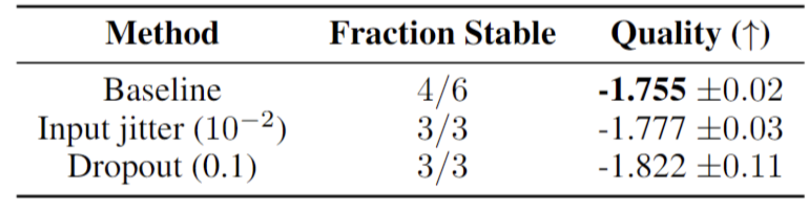

<!--Copyright © ZOMI 适用于[License](https://github.com/Infrasys-AI/AIInfra)版权许可-->

# GLaM & ST-MOE 解读

解读 by: 张晓天

虽然说稀疏专家可以大幅度提升模型容量，同时使得推理的成本不显著增加。但如果专家负载不均衡依然会出现少数几个“强势”专家会学到所有东西，而大部分专家得不到训练，导致模型退化的问题。其次，在训练中发现，损失函数会出现突然的、不可逆的尖峰（loss spikes），导致模型崩溃，需要重启训练，成本极高。

即使预训练模型表现良好，在下游任务上进行**全模型微调**时，性能会急剧下降。这是因为微调数据量小，容易破坏预训练中学到的精细路由策略，导致模型“遗忘”通用知识。比如在 Switch Transformer 里面，作者训练了一个 1.6T 参数量的稀疏模型，但是在 SuperGLUE 等常见基准上进行微调时，其性能却落后于较小的模型。

虽然 MoE 算法的发展一直在进步，但在大模型领域一直没有可以在性能上媲美**甚至超越顶尖的稠密模型的稀疏参数模型。GLaM 论文提出了一种基于稀疏激活专家混合架构的通用语言模型，通过优化路由机制和负载均衡策略，在保持高性能的同时大幅降低了训练和推理的能耗。例如，GLaM 的训练能耗仅为 GPT-3 的 **1/3**，推理时所需的计算量（FLOPs）也只有 GPT-3 的 **一半**。**

本章节，我们将从 ST-MOE 和 GLaM 两篇论文的工作展开，详细的讲解下 MoE 的发展路径。

## ST-MOE **稀疏专家模型的稳定与迁移**

### 稳定预训练的探索：结构上的微调

稀疏模型通常会受到训练不稳定性的影响。

ST-MoE 的作者发现，许多来自 **T5** 和 **PaLM** 等先进稠密模型的最佳实践，虽然能提升最终模型性能，但与 MoE 架构结合时，会放大其不稳定性。所以作者引入了一些 Transformer 模型的改进，这些改进会**提高 MoE 模型的质量。**

**1. GEGLU**

GEGLU 是前馈神经网络层的一个变体，它使用门控机制（通过 GELU 激活函数）来控制信息流动。其形式通常为 `FFN(x) = (GELU(xW1) ⊗ (xV)) W2`。

这个 `⊗` 是逐元素乘法，起到了门控作用。这种门控机制让模型的前馈层具备了更精细、更强大的非线性变换能力，通常能带来更好的性能。但同时门控机制可能会放大路由器输出的微小差异，导致专家负载急剧变化或梯度异常，从而引发训练损失尖峰。

**2. Root Mean Square 缩放参数**

RMS Norm 是 LayerNorm 的一个简化版本。它只对输入进行**缩放**（基于均方根），而**移除了 LayerNorm 中的重新中心化（减去均值）和偏置项**。在某些情况下，不进行“重新中心化”可能使得激活值的分布在不同专家和不同样本间更具一致性。对于 MoE 模型这种存在动态路由的系统来说，一个更“简单”和“一致”的归一化操作可能更容易稳定训练。

RMSNorm 的前向计算定义为：

$$
y = \frac{x}{\text{RMS}(x)} \cdot \gamma
$$

其中：

- $x$ 是输入向量
- $y$ 是输出向量
- $\gamma$ 是可学习的缩放权重参数
- $\text{RMS}(x)$ 是输入向量的**均方根**：

$$
\text{RMS}(x) = \sqrt{\frac{1}{n} \sum_{i=1}^{n} x_i^2 + \epsilon}
$$

1. **仅缩放**：仅根据均方根进行缩放，**不减去均值；**
2. **简化的仿射变换**：通常**只保留**可学习的缩放权重 γ**γ**，**移除了偏置项 β。**

ST-MoE 论文发现，**追求极致的性能（质量）往往需要引入更复杂、更强大的组件（如 GEGLU, LayerNorm），但这些组件在复杂的动态系统中也更容易引入不稳定性。而为了追求训练的鲁棒性和稳定性，有时不得不转向更简单、更保守的架构选择，但这通常会以牺牲一部分性能潜力为代价。**

### 稳定预训练的探索：**训练时加噪声**

作者还尝试了一些训练时加噪声的方法，比如输入抖动 (Input jitter) 和 Dropout。输入抖动是指给输入随机乘以 [1−10−2,1+10−2] 的随即变量。

可以发现：输入抖动和 Dropout 都提高了稳定性，但会导致模型质量显着下降。

这是因为，虽然 Dropout 和噪声等防止神经元之间复杂的共适应，但 Dropout 和噪声的随机性直接与 MoE 的专家专业化目标是相冲突的。

我们知道路由器根据输入的表示来为其选择最佳专家。Dropout 随机改变了输入的表示，导致同一个输入在不同训练步中呈现给路由器的“面貌”略有不同。输入抖动同样使得牺牲了 MoE 模型执行**精细路由**的能力。

### 稳定预训练的探索：**Router Z-Loss**

Router Z-Loss 的成功在于它没有像前两种方法那样“头痛医头、脚痛医脚”或进行盲目正则化，而是**精准地分析了问题根源并设计了对应的损失函数**。

在训练过程中，Router 层的输入（logits）可能会产生绝对值非常大的值。这会导致在计算 Softmax $p = \text{Softmax}(z)$ 时，会出现极大的指数值，容易引发数值溢出或梯度爆炸。其次，当 Router 的输出非常“自信”（某个 logit 远大于其他）时，微小的输入变化会导致路由概率的剧烈变化，从而产生巨大的梯度，这就是训练损失曲线出现尖峰（Spike）的主要原因。

Router Z-Loss 的公式为：

$$
L_z = \frac{1}{N} \sum_{i=1}^{N} \left( \log \sum_{j=1}^{E} \exp(z_{i,j}) \right)^2
$$

- $N$: 一个批次中的 token 数量
- $E$: 专家数量
- $z_{i,j}$: 第 $i$ 个 token 对于第 $j$ 个专家的 router logit
- $\log \sum_{j=1}^{E} \exp(z_{i,j})$: Log-Sum-Exp (LSE) 函数

Router Z-Loss 直接惩罚 Router 输入向量 $z$ 的 **Log-Sum-Exp (LSE)** 的平方：

- LSE 是 Softmax 函数计算中的关键组成部分：
  $$
  \text{Softmax}(z_i)_j = \frac{\exp(z_{i,j})}{\sum_{k=1}^{E} \exp(z_{i,k})} = \frac{\exp(z_{i,j})}{\exp(\text{LSE}(z_i))}
  $$
- 当 $z$ 中任何一个分量 $z_{i,j}$ 的绝对值过大时，LSE 的值会显著增大
- 通过对 LSE 的平方进行惩罚，间接约束了 router logits 的数值范围

通过抑制 LSE 的大小，Router Z-Loss 实现了：

- **防止梯度爆炸**：过大的 router logits 会导致 Softmax 输出接近 one-hot 向量，此时梯度变得极不稳定；
- **改善优化稳定性**：保持 Softmax 函数在“ softer” 的区域工作，梯度变化更加平缓；
- **减少训练尖峰**：有效避免了由于 router 梯度突变引起的损失函数剧烈波动。

Router Z-Loss 并非一个通用正则项，而是专门针对 Router 机制在训练中的脆弱性设计的，它通过温和地约束 Router 的输入 logits，从根本上提升了训练的稳定性，从而使得模型能够安全地利用那些高性能但“不稳定”的组件（如 GEGLU），最终实现**质量与稳定性的兼得**。

## **GLaM **超越 GPT-3** 的能效标杆**

模型性能与模型规模（参数量）呈强正相关，而规模的增长又必然导致计算成本的飙升。这一范式在 GPT-3 上达到了一个高潮，但其惊人的训练和推理成本也预示着一条不可持续的发展路径。

谷歌在 2021 年提出的 GLaM 模型，其革命性并不在于它创造了另一个“万亿参数”的庞然大物，而在于它成功地将“模型容量”与“计算成本”这两个曾经紧密耦合的概念进行了解耦。

### 模型结构

跟 `GShard`类似, 如下图所示, GLaM 总共有 64 个 expert, 门控网络每次从中选择 2 个 expert 进行计算. 另外还有几点改动:

1. 采用来自 Transformer-XL 的**相对位置偏置**，替代了标准的位置嵌入方法。这使得模型能够更灵活地捕获序列中元素的相对距离关系，提升了其对长序列的建模能力。
2. 在非 MoE 的标准 Transformer 层中，使用**门控线性单元（GLU）** 与**高斯误差线性单元（GeLU）** 等激活函数，替代了原有的首个线性层与激活结构。
3. GLaM 模型训练中权重和计算的切分使用 2 维的切分算法(From [GSPMD](https://arxiv.org/abs/2105.04663))：

* 把不同 MoE layer 上相同位置(具有相同的 index 值)的专家放到同一个 device 设备上, 使得不同的 MoE layer 得到相同的计算图；
* 使用 `while_loop`控制语句 wrap 重复性的 MoE layer；
* 要使得模型效果好, expert 要足够大. 如果一个 expert 足够大时一个 expert 就对应多个 core 来分配, 也就是一个 expert 对应 NE 个 device. expert 的权重 shape 为 [E,M,H], 按专家维度 E 和 hidden 维度 H 来切分; `input activation tensor` 的 shape 大小为 [B,S,M], 按 batch 维度 B 和 model 维度 M 来进行切分；
* 同时也依赖 `GSPMD`的编译 pass 过程来决定剩下 tensor 的切分策略。

### 路由机制与负载均衡的协同优化

GLaM 模型中的每个**MoE 层**都配备了一个**门控网络**（Gating Network）。对于输入的每个**token**，这个门控网络会计算其与所有**专家**的匹配度，然后**选择匹配度最高的两个专家**进行处理。该 token 的最终输出是这两个专家输出的加权组合。这种方式使得模型可以根据输入内容灵活选择不同的计算路径，提供了 `E×(E-1)` 种不同的前馈网络组合，大大增强了模型的表达能力。

在 MoE 模型训练中，一个常见的挑战是门控网络可能倾向于持续选择少数几个表现好的专家，导致其他专家得不到充分训练，即所谓的**专家负载不均衡**问题。为了解决这个问题，GLaM 在损失函数中引入了一个**辅助的负载均衡损失项**。这个损失项会鼓励门控网络更均匀地分配任务给所有专家，确保大多数专家都能被激活并参与训练，从而充分利用模型的全部容量。

GLaM 在 29 个自然语言理解和生成任务的广泛评测中，其整体表现**优于 GPT-3**。具体来说，它在约 80%的零样本任务和约 90%的单样本任务上表现持平或更佳。更重要的是，GLaM 在达成相同甚至更优性能时，在**训练能耗和推理 FLOPs 上实现了巨大的优势**（训练能耗降至 1/3，推理 FLOPs 降至 1/2）。这强有力地证明了，单纯比较模型的总参数量是片面甚至具有误导性的，真正应该关注的是**单位计算成本所能换取的性能**。

## 小结

ST-MoE 与 GLaM 的工作，远非仅仅是两个性能卓越的大型语言模型，它们更代表着一条通往更高效、更可持续人工智能未来的清晰路径。

**ST-MoE** 精准地识别并攻克了稀疏模型在训练稳定性和迁移学习中的核心瓶颈。其提出的**路由器 Z-Loss**等技术，并非通用正则化，使得万亿参数模型能够被安全、稳定地训练，并高效地迁移至下游任务。这标志着稀疏模型从实验室原型走向实际应用的关键一步。

GLaM 的核心贡献，在于它成功地将 **“模型容量”与“计算成本”这两个曾经紧密耦合的概念进行了解耦**。它通过稀疏激活的混合专家模型架构，以仅激活少量参数处理每个输入的“条件计算”方式，证明了**规模扩张未必等同于能耗的线性飙升**。

未来模型的竞争，将不再是参数的单纯堆砌，而是转向更精巧的架构设计。静态、固定的计算图或许并非智能的唯一形态。像 MoE 这样根据输入动态分配计算资源的“条件计算”范式，更能模拟智能系统对资源的灵活调配。在算力成为稀缺资源的今天，主动追求能耗的降低，这对于 AI 技术的普惠与可持续发展具有深远意义。

## 引用

https://zhuanlan.zhihu.com/p/653796685

https://www.mltalks.com/posts/847141942/

https://www.cnblogs.com/ExMan/p/18709928

## 本节视频

<html>
<iframe src="https://player.bilibili.com/player.html?isOutside=true&aid=114097265906379&bvid=BV1L59qYqEVw&cid=28667087820&p=1&as_wide=1&high_quality=1&danmaku=0&t=30&autoplay=0" width="100%" height="500" scrolling="no" border="0" frameborder="no" framespacing="0" allowfullscreen="true"> </iframe>
</html>

