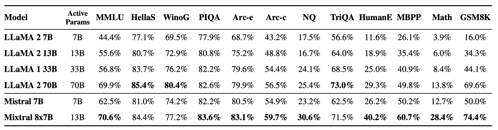
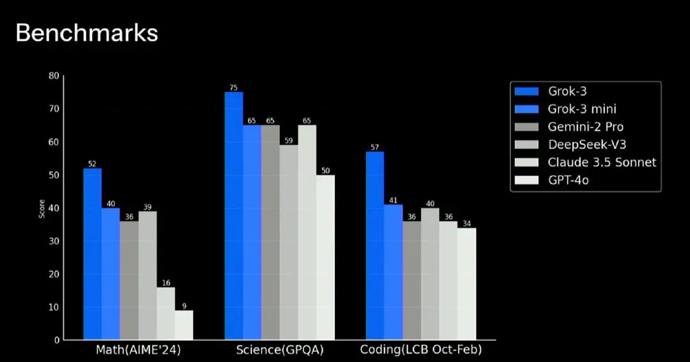
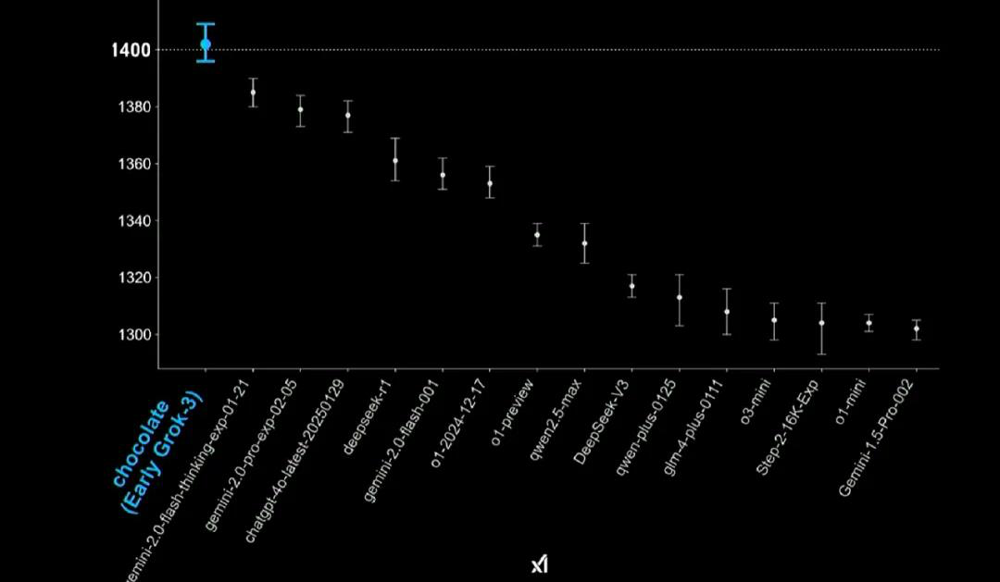
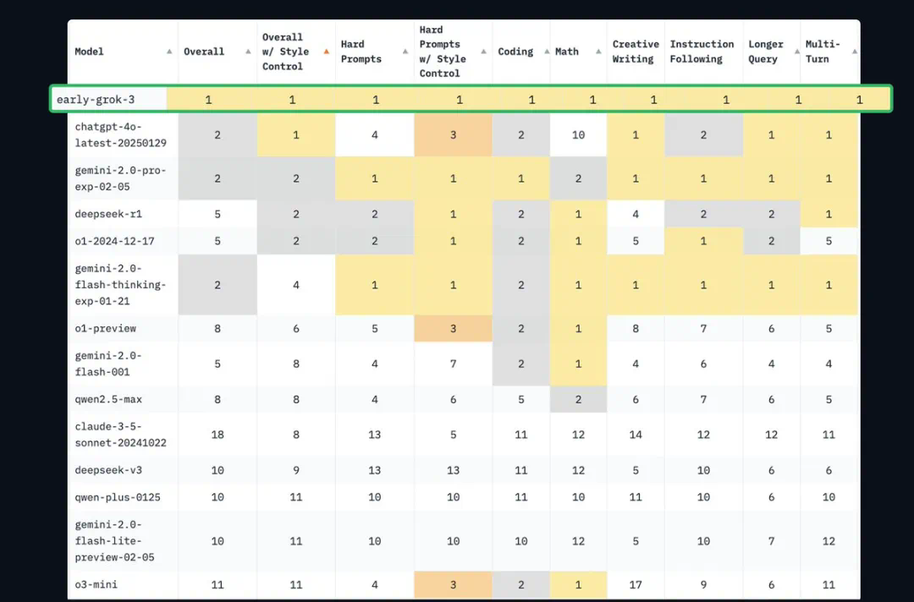

<!--Copyright © ZOMI 适用于[License](https://github.com/Infrasys-AI/AIInfra)版权许可-->

# 10. MoE 参数与专家

Author by: 束子涵

在人工智能大模型迅速演进的当下，**MoE（Mixture of Experts，混合专家）** 已成为推动模型性能与效率提升的重要方向。本文将围绕大模型与 MoE 的结合趋势展开分析，并重点讨论从“大参数、少专家”到“小参数、多专家”的转变及其意义。

## MoE 与大模型结合的演进趋势

从 GPT-4 的 Mistral 8×7B，到 DeepSeek 系列、DBRX 以及 Grok，再到最新的 DeepSeek V3，可以明显观察到大模型与 MoE 架构的结合趋势愈发明显。与此同时，MoE 模型内部也出现了结构性演进，从参数量、激活方式到专家数量，都在不断优化。

MoE 的引入不仅是算力扩展的结果，更是算法演进的必然趋势。通过在不同子网络之间实现稀疏激活，MoE 模型在提升计算效率的同时，降低了整体的推理开销，为更大规模模型的训练与部署提供了可能。

## 典型模型介绍

### Mistral AI：8×7B 与 8×22B 模型

Mistral AI 是一家成立于 2023 年初的法国人工智能公司，由前谷歌 DeepMind、Meta 等科技巨头的研究人员创立，总部位于巴黎。作为欧洲 AI 领域的代表性企业，Mistral 被称为“欧洲版 OpenAI”， 致力于开发高效、开源的大语言模型（LLMs）和多模态模型，目标是与美国 AI 巨头竞争。

该公司在 2023 年底发布了 Mixtral 8×7B 模型，并于 2024 年 4 月推出了更大规模的 Mixtral 8×22B 模型，具体参数如下：

| 特性           | Mixtral-8x22B                        | Mixtral-8x7B                         |
| -------------- | ------------------------------------ | ------------------------------------ |
| **总参数量**   | 1760 亿参数                          | 46.7 亿参数                          |
| **激活参数量** | 约 390 亿参数（稀疏激活）            | 约 12.9 亿参数（稀疏激活）           |
| **专家数量**   | 8 个专家，每个专家 220 亿参数        | 8 个专家，每个专家 7 亿参数          |
| **上下文窗口** | 64K tokens                           | 32K tokens                           |
| **多语言支持** | 英语、法语、意大利语、德语、西班牙语 | 英语、法语、意大利语、德语、西班牙语 |
| **推理效率**   | 比密集 70B 模型更快，成本效率更高    | 推理速度比 Llama 2 70B 快 6 倍       |
| **开源许可**   | Apache 2.0                           | Apache 2.0                           |

Mixtral 系列模型是大模型时代社区中首个开源的 **LLM MoE（Mixture of Experts）** 模型，它的 MoE 架构在 Mistral 7B 基础上进行升级，将 Transformer Block 中的 FFN 结构替换为 MoE 架构，采用 8 个专家，每个 token 路由到 2 个专家进行处理，激活参数量为 13B，Mistral 8x7B 总参数量为 47B。

**Mixtral 8×7B** 在所有基准测试（benchmark）中都优于或与 Llama 2 70B 表现相当，尤其在 **数学** 和 **代码生成** 方面表现出显著的优势，同时，在推理过程中 Mixtral 8×7B 仅激活了 Llama 2 70B 大约五分之一的参数量。

此外，Mixtral 系列模型遵循 **Apache 开源协议**，训练语料来源广泛，覆盖了多种 **欧洲小语种**，具有良好的多语言泛化能力。

### xAI 的 Grok 系列

2023 年 7 月，埃隆·马斯克宣布创立的 xAI 公司，目标是打造具备高阶数理推理能力的人工智能模型。

xAI 发布的 Grok 系列模型主要基于混合专家模型（Mixture of Experts, MoE）架构，当前已发布至第三代（Grok 3），并在训练规模上创造了新的纪录。

| 特性           | Grok-1                  | Grok-2                   | Grok-3                   | Grok-3 mini          |
| -------------- | ----------------------- | ------------------------ | ------------------------ | -------------------- |
| **发布时间**   | 2024 年 3 月            | 2024 年                  | 2025 年 2 月             | 2025 年 2 月         |
| **参数规模**   | 3140 亿参数             | 未明确，推测更大         | 未明确，推测更大         | 未明确，轻量级版本   |
| **专家数量**   | 8 个专家，每次激活 2 个 | 未明确，可能优化路由机制 | 未明确，可能优化路由机制 | 未明确，轻量级版本   |
| **上下文窗口** | 8,192 tokens            | 128,000 tokens           | 支持多模态任务           | 未明确，适合实时应用 |
| **资源需求**   | 628 GB GPU 显存         | 未明确，推测更高         | 20 万块 H100 GPU         | 未明确，资源需求较低 |
| **应用场景**   | 通用语言任务            | 复杂推理任务             | 多模态任务（图像、文本） | 实时推理任务         |

在 Math（AIME 24）、Science（GPQA）和 Coding（LCB Oct-Feb）三方面，Grok-3 大幅超过 Gemini-2 Pro、DeepSeek-V3、Claude 3.5 Sonnet 和 GPT-4o。

Chatbot Arena（LMSYS）中，早期 Grok-3 版本的得分取得了第一，达到 1402 分，超过了包括 DeepSeek-R1 在内的所有其他模型。Grok-3 也成为有史以来首个突破 1400 分的模型。

早期 Grok-3 版本在编程、数学、创意写作、指令遵循、长查询、多轮对话等场景中的排名都是第一名。

Grok-3 训练使用了多达 20 万张 H100 GPU，并采用**多阶段训练策略**：第一阶段持续 **122 天**，使用约 **10 万张 GPU**；第二阶段再扩展至 **20 万张 GPU**，持续 **92 天**。

相比之下，**DeepSeek V3** 在端到端训练中仅使用了 **约 2000 张 GPU**，却取得了相当出色的性能表现。这种巨大差距引发了业界对“**算力投入与性价比**”的广泛讨论。随着 **DeepSeek 的开源**，越来越多的业界观点认为，未来的发展方向不只是堆叠算力，而是要通过 **提升集群性能与利用率**，将有限的算力资源 **压榨到极致**，从而实现更高效的大模型训练。

### DeepSeek：从 MoE 到 V3

DeepSeek（深度求索）是一家成立于 2023 年的中国人工智能公司，由量化私募巨头幻方量化创立。公司专注于开发高性能、低成本的大语言模型（LLM），致力于推动通用人工智能（AGI） 的发展。

DeepSeek 的独特之处在于其“基础研究-技术转化-产业应用”三位一体的发展模式，以及通过 量化投资业务为 AI 研发提供持续资金支持的“以战养战”策略。公司不仅在技术上实现了多项 突破，还通过开源策略和低成本训练模式，推动了 AI 技术的普惠化。

| 特性               | DeepSeek MoE                                                                                  | DeepSeek V2                                                                           | DeepSeek V3                                                                           | DeepSeek R1  |
| ------------------ | --------------------------------------------------------------------------------------------- | ------------------------------------------------------------------------------------- | ------------------------------------------------------------------------------------- | ------------ |
| **发布时间**       | 2024 年 1 月                                                                                  | 2024 年 5 月                                                                          | 2024 年 12 月                                                                         | 2025 年 1 月 |
| **参数量**         | 2B / 16B / 145B                                                                               | 236B                                                                                  | 671B                                                                                  | 671B         |
| **激活参数量**     | /                                                                                             | 21B                                                                                   | 37B                                                                                   | 37B          |
| **架构特点**       | 整合了专家混合系统（MoE）、改进的注意力机制和优化的归一化策略，采用动态路由机制和专家共享机制 | 基于 MoE 架构，采用多头潜在注意力（MLA）和 DeepSeekMoE 架构，每个 token 激活 21B 参数 | 基于 MoE 架构，采用多头潜在注意力（MLA）和 DeepSeekMoE 架构，每个 token 激活 37B 参数 | /            |
| **训练数据量**     | /                                                                                             | /                                                                                     | 14.8 万亿个 token                                                                     | /            |
| **训练成本**       | /                                                                                             | /                                                                                     | 278.8 万 H800 GPU 小时                                                                | /            |
| **层数**           | /                                                                                             | 60                                                                                    | 61                                                                                    | 61           |
| **隐藏维度**       | /                                                                                             | 5120                                                                                  | 7168                                                                                  | 7168         |
| **中间维度**       | /                                                                                             | 12288                                                                                 | 18432                                                                                 | 18432        |
| **MoE 中间维度**   | /                                                                                             | 1536                                                                                  | 2048                                                                                  | /            |
| **共享专家数量**   | /                                                                                             | 2                                                                                     | 1                                                                                     | /            |
| **路由专家数量**   | /                                                                                             | 160                                                                                   | 256                                                                                   | /            |
| **token 激活专家** | /                                                                                             | 6                                                                                     | 8                                                                                     | /            |
| **词汇表大小**     | /                                                                                             | 102400                                                                                | 129280                                                                                | /            |

DeepSeek 的发展节奏非常规律，几乎每隔约半年发布一次全新版本。从 V1 到 V3，DeepSeek 系列模型的总参数量持续上升（从 145B 提升到 671B），但激活参数量和激活专家数量未显著上升，体现出“小参数，多专家”的设计思路。这种设计使得模型在维持性能提升的同时，有效降低了推理阶段的显存压力与能耗消耗。

## 思考与小节

MoE 架构的核心在于如何平衡模型容量、计算效率与算力消耗。当前的发展趋势，正在从“大参数、少专家”转向“小参数、多专家”。

### 早期 MoE 架构：大参数少专家

- 早期 MoE 模型采用少量专家（如 8–16 个），每个专家参数量较大（如数十亿参数）。

- 专家模型设计复杂，基于稠密 Transformer FFN 层，每个专家需要处理广泛的输入数据。

- 门控网络（Gating Network）设计相对简单，主要通过 softmax 函数分配权重。

**代表模型：**

**Mixtral 8x7B：** 由 Mistral AI 发布的 MoE 模型，包含 8 个专家，每个专家 7B 参数，通过稀疏激活实现高效推理。

**优点：**

- **提高计算效率：** 通过增加专家数量，每个专家的参数量减少，（相比于多专家模型）降低单专家的计算复杂度，提高了整体的计算效率。

- **容易训练：** 少专家更容易训练，不同专家可以更好地利用计算资源，降低了训练成本和难度，专家数越多越不利于计算的均衡负载。

**缺点：**

- **计算成本高：** 稀疏激活减少了计算量，但每个专家的参数量大，导致内存和显存需求高。

- **专家负载不均衡：** 部分专家可能被过度使用，其他专家未被充分利用，影响模型性能。

- **专家利用率低：** 少专家使得每个专家需要处理更多任务，导致专家专精化程度不够。

### 当前趋势：小参数多专家

- 现代 MoE 模型倾向于采用更多专家（128/256），每个专家参数量较小。

- 专家模型更加轻量化，基于细粒度划分的任务或数据特征，不同专家专注于特定领域。

- 门控网络的设计更加复杂，引入了动态路由、负载均衡等技术，优化专家的激活和计算效率。

**代表模型：**

**DeepSeek-V3：** 采用 细粒度专家划分 和 动态路由机制，每个专家参数量较小，但专 家数量更多，显著降低了计算成本。

**优点：**

- **计算效率更高：** 小参数多专家减少每次推理计算量，同时通过动态路由优化了专家负载均衡。

- **扩展性更强：** 更多专家可以覆盖更广泛任务和数据特征，提升模型的泛化能力和专业化水平。

- **部署成本更低：** 小参数专家设计降低了内存和显存需求，适合在资源有限的环境中部署。

### 大参数少专家 to 小参数多专家

本质模型规模与计算效率间寻求平衡 ，通过**细粒度专家分工**和**稀疏激活**机制，实现：

1. **更高参数量：** 提升模型容量上限

2. **更低推理成本：** 仅激活必要参数，降低单次计算开销

3. **更强任务适配性：** 覆盖多样化场景，逼近“专家即服务”（Expert-as-a-Service）的理想架构

未来，随着路由算法和硬件优化，MoE 模型可能进一步向超大规模小专家集群发展，成为 AGI 的关键路径之一。

## 本节视频

<html>
<iframe src="https://player.bilibili.com/player.html?isOutside=true&aid=114115938881668&bvid=BV1UERNYqEwU&cid=28726726639&p=1&as_wide=1&high_quality=1&danmaku=0&t=30&autoplay=0" width="100%" height="500" scrolling="no" border="0" frameborder="no" framespacing="0" allowfullscreen="true"> </iframe>
</html>
