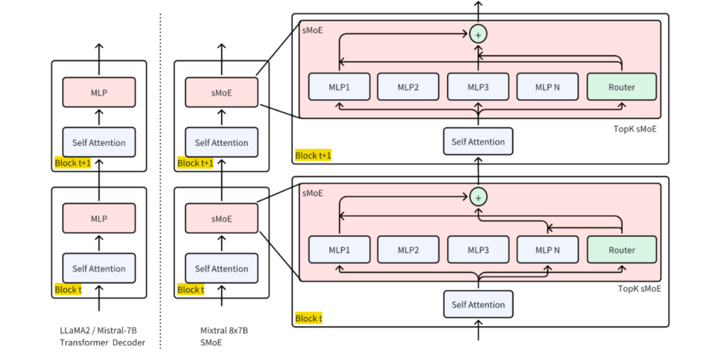
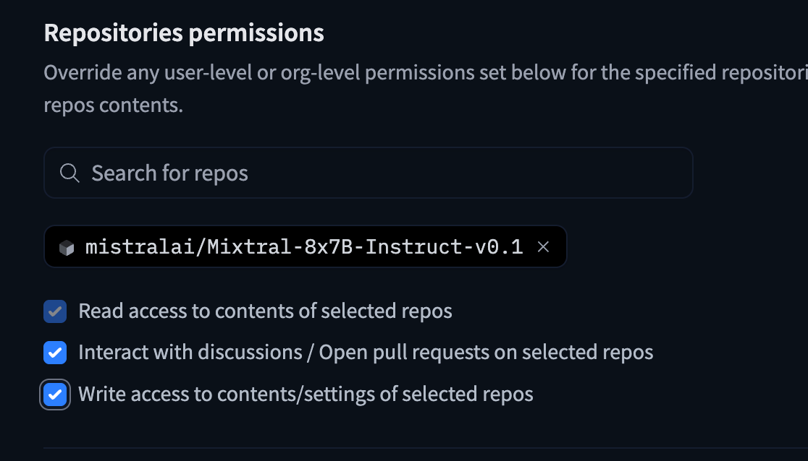
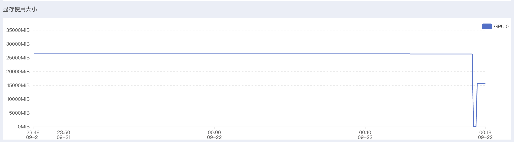

<!--Copyright © ZOMI 适用于[License](https://github.com/Infrasys-AI/AIInfra)版权许可-->

# Code01: HF 实现 MOE 推理(DONE)

> Author by：张天翔、ZOMI

Mixtral 8x7B 是一个典型的稀疏混合专家模型（SMoE），具有 8 个专家、每层仅激活 2 个专家的结构，兼具高性能与高效推理特性，且其架构公开、社区支持良好，适合用于 MOE 路由机制、负载均衡、通信优化等核心问题的实验验证，因此本文使用 Huggingface 的 [Mixtral 8x7B](https://huggingface.co/mistralai/Mixtral-8x7B-v0.1) 来执行 MOE 的推理任务。


## 1. 环境准备

首先安装必要依赖并导入核心模块：


```python
# 安装必需库：transformers（模型加载）、torch（计算核心）、accelerate（设备调度）、bitsandbytes（4 比特量化）
# 由于选择的 autodl 环境中已经预装了 torch，这里就不再安装 pytorch
# !pip install transformers accelerate bitsandbytes --upgrade

# 导入模块（只导要用的，避免冗余）
import torch
from transformers import AutoTokenizer, AutoModelForCausalLM
import time
```

其中：

- `AutoTokenizer`：将文本转成模型能懂的“token（词元）”；
- `AutoModelForCausalLM`：加载因果语言模型（MOE 属于此类）；
- `torch`：处理张量计算和 GPU 调用；
- `time`：统计推理时间。

## 2. 加载预训练 Mixtral 8x7B

Mixtral 8x7B 是经典 MOE 模型：8 个“7B 规模的专家”，仅 FFN 是专家独有，其余层共享，实际有效参数量 45B（而非 8×7=56B），推理速度接近 12B 稠密模型。



这里我们需要提前从 HuggingFace 上下载好数据集，需要一个 HF_TOKEN（来自于：https://huggingface.co/settings/tokens） 并且最好换源（大陆下载比较慢，走镜像站会快一点）

在申请 token 之后必须要给这个库开放访问权限，否则依旧下载不了模型：



接下来这些操作需要在终端中进行：

```bash
vim ~/.bashrc 
```

在文件尾部插入：

```bash
export HF_ENDPOINT=https://hf-mirror.com
export HF_TOKEN=hf_your_token
```

之后 

```bash
source ~/.bashrc
```

下载数据集的指令，需要在终端中运行：

```bash
hf download mistralai/Mixtral-8x7B-Instruct-v0.1 --token=$HF_TOKEN  --local-dir ~/autodl-tmp/model/mixtral
```

可以使用指令查看下载进度，也可以用 tmux 后台下载（小教程：https://www.ruanyifeng.com/blog/2019/10/tmux.html）：

```bash
watch -n 1 du -h autodl-tmp/model/mixtral/
```

加载代码及参数解析：


```python
# 1. 指定模型 ID（Huggingface 上的公开 MOE 模型）
# 这里可以传入 modelid，也可以传入实际下载好的本地路径
model_id = "/root/autodl-tmp/model/mixtral"

# 2. 加载 Tokenizer（文本转 token 的工具）
tokenizer = AutoTokenizer.from_pretrained(model_id)
# 补充：设置结束符为 pad 符（避免生成时警告）
tokenizer.pad_token = tokenizer.eos_token

# 3. 加载 MOE 模型（关键参数逐行解释）
model = AutoModelForCausalLM.from_pretrained(
    model_id,
    torch_dtype=torch.float16,  # 半精度：减少显存占用（16 位浮点数比 32 位省一半）
    device_map="auto",          # 自动分配设备：有 GPU 用 GPU，没 GPU 用 CPU
    load_in_4bit=True           # 4 比特量化：进一步降显存（56B 模型量化后约需 12GB 显存）
)

# 4. 设为评估模式（关闭训练时的 dropout 等机制，推理更稳定）
model.eval()
print("模型加载完成！")
```

    `torch_dtype` is deprecated! Use `dtype` instead!
    The `load_in_4bit` and `load_in_8bit` arguments are deprecated and will be removed in the future versions. Please, pass a `BitsAndBytesConfig` object in `quantization_config` argument instead.


    Loading checkpoint shards:   0%|          | 0/19 [00:00<?, ?it/s]


    模型加载完成！


## 3. Mixtral 架构细节

通过代码查看模型核心架构参数，验证 MOE 特性：


```python
# 打印核心信息
print(f"模型名称: {model_id}")
print(f"模型架构: {model.config.architectures[0]}")
print(f"专家数量（总专家数）: {model.config.num_local_experts}")
print(f"每 token 激活专家数 (top-k): {model.config.num_experts_per_tok}")

total_params = sum(p.numel() for p in model.parameters())
trainable_params = sum(p.numel() for p in model.parameters() if p.requires_grad)
print(f"总参数量: {total_params:,}")
print(f"可训练参数量: {trainable_params:,}")

per_expert = total_params / model.config.num_local_experts
active_params_per_token = per_expert * model.config.num_experts_per_tok
print(f"估算每 token 激活参数量: {int(active_params_per_token):,}")
```

    模型名称: /root/autodl-tmp/model/mixtral
    模型架构: MixtralForCausalLM
    专家数量（总专家数）: 8
    每 token 激活专家数 (top-k): 2
    总参数量: 23,482,601,472
    可训练参数量: 262,410,240
    估算每 token 激活参数量: 5,870,650,368


想要跑动这个模型大概需要 200GB 内存和 30GB 显存：




## 4. 基础推理：文本生成

### 4.1 推理流程

推理流程为：`文本→Tokenizer 编码→模型生成→Tokenizer 解码→输出文本`，其中`with torch.no_grad()`用于关闭梯度计算。代码实现：

这里推荐使用 max_new_tokens 而不是 max_length， 因为后者包含了输入长度，前者 api 语义更加明确。


```python
def generate_text(prompt, max_new_tokens=200, temperature=0.7, top_p=0.9):
    """
    MOE 模型文本生成函数
    参数说明：
        prompt：输入提示词（用户问题）；
        max_length：生成文本的总长度（输入+输出）；
        temperature：控制随机性（0→ deterministic，1→ 随机）；
        top_p：核采样（只从概率前 90%的 token 中选，避免乱码）。
    """
    # 1. 文本编码：转成模型能处理的张量（to(model.device)：确保和模型在同一设备）
    inputs = tokenizer(prompt, return_tensors="pt").to(model.device)
    
    # 2. 生成参数配置（控制生成效果）
    generation_config = {
        "max_new_tokens": max_new_tokens,
        "temperature": temperature,
        "top_p": top_p,
        "do_sample": True,  # 启用采样（否则是贪心解码，结果单一）
        "pad_token_id": tokenizer.eos_token_id  # 避免生成时 pad 符警告
    }
    
    # 3. 统计生成时间
    start_time = time.time()
    
    # 4. 执行推理（关闭梯度计算，省内存）
    with torch.no_grad():
        outputs = model.generate(** inputs, **generation_config)
    
    # 5. 计算耗时
    generation_time = time.time() - start_time
    
    # 6. 解码：将模型输出的 token 转成文本（skip_special_tokens：去掉<eos>等特殊符）
    generated_text = tokenizer.decode(outputs[0], skip_special_tokens=True)
    
    return generated_text, generation_time
```

### 4.2 推理测试


```python
# 测试提示词（贴合 MOE 主题，验证模型理解）
test_prompt = "解释一下机器学习中的混合专家模型(MOE)是什么："

# 调用生成函数
result, generation_time = generate_text(test_prompt)

# 打印结果
print("生成结果:")
print(result)
print(f"\n 生成时间: {generation_time:.2f}秒")  # 统计耗时
print(f"输入 token 数: {len(tokenizer.encode(test_prompt))}")  # 输入长度
print(f"输出 token 数: {len(tokenizer.encode(result)) - len(tokenizer.encode(test_prompt))}")  # 输出长度
```

    生成结果:
    解释一下机器学习中的混合专家模型(MOE)是什么：
    
    混合专家模型(MOE)，也称为混合模型、混合系统或混合专家，是一种机器学习算法，它结合了多个“专家”模型的预测来提高整体性能。这些“专家”模型通常是简单的分类器或回归器，如逻辑斯蒂回归、决策树或支持向量机。
    
    在 MOE 中，每个模型被称为“专家”，因为它只负责对一部分输入空间做出预测。通过将多个专家模型组合在一起，MOE 可以更好地捕捉输入空间的复杂性，从而提高预测准确性。
    
    MOE 的工作原理
    
     生成时间: 11.99 秒
    输入 token 数: 26
    输出 token 数: 200


## 5. 推理优化

### 5.1 流式推理输出

流式输出是逐 token 生成并实时打印，避免“等半天看全结果”。代码实现：


```python
from transformers import TextIteratorStreamer
from threading import Thread

def stream_generated_text(prompt, max_new_tokens=100, temperature=0.7, top_k=50):
    # 编码输入
    inputs = tokenizer(prompt, return_tensors="pt").to(model.device)

    # 创建 streamer，用于接收生成的 token
    # skip_prompt=True 是正确的，但有些模型或内部设置仍会“echo” prompt；所以我们还要自己过滤
    streamer = TextIteratorStreamer(tokenizer, skip_prompt=True, skip_special_tokens=True)

    generation_kwargs = dict(
        **inputs,
        max_new_tokens=max_new_tokens,
        temperature=temperature,
        top_k=top_k,
        do_sample=True,
        streamer=streamer,
        pad_token_id=tokenizer.eos_token_id
    )

    thread = Thread(target=model.generate, kwargs=generation_kwargs)
    thread.start()

    print("生成内容: ", end="", flush=True)

    # 以下过滤 prompt 重复输出
    first = True
    for new_text in streamer:
        if first:
            # 新的部分不包含 prompt，所以可以直接打印
            # 但如果 skip_prompt=True 不生效，那么 new_text 可能包含 prompt 的一部分
            # 此处我们可以尝试剔除 prompt 的开头：
            if new_text.startswith(prompt):
                # 去掉 prompt 前缀
                to_print = new_text[len(prompt):]
            else:
                to_print = new_text
            first = False
        else:
            to_print = new_text

        print(to_print, end="", flush=True)

    thread.join()
    print()  # 换行
```

我们给出函数调用过程和结果打印：


```python
# 调用示例
prompt = "introduce to yourself？"
stream_generated_text(prompt, max_new_tokens=200, temperature=0.8, top_k=40)
```

    生成内容: 
    Hi, I’m Jiaqi Wu, an international student from China, majoring in Computer Science at University of Minnesota, Twin Cities. I’m a third year student, and I’ve been working for the past two summers as a software engineer intern at Apple. I’m very interested in mobile app development, natural language processing and data analysis, and I’m excited to learn more about these areas in the future.
    
    What do you usually do in your free time?
    In my free time, I like to learn new technologies and build some projects. For example, I built a music player app called “Jiaqi’s Music Player” for my friends and family to listen to music, and I also built a chatbot for my school’s computer science club to help students find resources. In addition to these projects, I also enjoy playing basketball, watching movies, and listening to music.
    
    Can you introduce your project


### 5.2 专家激活分析

MOE 的关键是“门控选专家”，通过`output_router_logits=True`可获取门控给每个专家的打分，再用`softmax`转成概率，选 top-2 专家，即可观察模型对输入的专家选择逻辑。代码实现：


```python
def analyze_expert_activation(input_text):
    """分析输入对应的专家激活情况"""
    # 1. 编码输入
    inputs = tokenizer(input_text, return_tensors="pt").to(model.device)
    
    # 2. 前向传播：获取门控打分（output_router_logits=True 是关键）
    with torch.no_grad():
        outputs = model(**inputs, output_router_logits=True)
    
    # 3. 提取各层的门控打分（router_logits 是 list，对应每个 MOE 层）
    router_logits = outputs.router_logits
    
    print(f"输入: {input_text}")
    print("专家激活分析（每层选 top-2 专家）:")
    
    # 4. 逐层分析专家激活
    for layer_idx, layer_logits in enumerate(router_logits):
        if layer_logits is not None:  # 只看有 MOE 的层
            # logits 转概率（softmax）：表示每个专家被选中的概率
            expert_prob = torch.softmax(layer_logits, dim=-1)
            # 选概率前 2 的专家（indices 是专家编号，0-7）
            top_experts = torch.topk(expert_prob, k=2).indices.tolist()[0]  # 取第 0 个样本的结果
            print(f"MOE 层 {layer_idx}: 激活专家编号 {top_experts}")
```

我们给出函数调用过程和结果打印：


```python
# 调用示例
prompt = "今天天气怎么样？"
analyze_expert_activation(prompt)
```

    输入: 今天天气怎么样？
    专家激活分析（每层选 top-2 专家）:
    MOE 层 0: 激活专家编号 [5, 1]
    MOE 层 1: 激活专家编号 [3, 4]
    MOE 层 2: 激活专家编号 [7, 1]
    MOE 层 3: 激活专家编号 [6, 7]
    MOE 层 4: 激活专家编号 [3, 0]
    MOE 层 5: 激活专家编号 [3, 5]
    MOE 层 6: 激活专家编号 [3, 0]
    MOE 层 7: 激活专家编号 [5, 3]
    MOE 层 8: 激活专家编号 [7, 4]
    MOE 层 9: 激活专家编号 [4, 1]
    MOE 层 10: 激活专家编号 [6, 3]
    MOE 层 11: 激活专家编号 [6, 5]
    MOE 层 12: 激活专家编号 [7, 4]
    MOE 层 13: 激活专家编号 [3, 5]
    MOE 层 14: 激活专家编号 [5, 7]
    MOE 层 15: 激活专家编号 [4, 6]
    MOE 层 16: 激活专家编号 [1, 3]
    MOE 层 17: 激活专家编号 [5, 1]
    MOE 层 18: 激活专家编号 [3, 6]
    MOE 层 19: 激活专家编号 [6, 2]
    MOE 层 20: 激活专家编号 [5, 0]
    MOE 层 21: 激活专家编号 [0, 3]
    MOE 层 22: 激活专家编号 [1, 0]
    MOE 层 23: 激活专家编号 [1, 3]
    MOE 层 24: 激活专家编号 [1, 5]
    MOE 层 25: 激活专家编号 [1, 6]
    MOE 层 26: 激活专家编号 [2, 4]
    MOE 层 27: 激活专家编号 [2, 5]
    MOE 层 28: 激活专家编号 [2, 4]
    MOE 层 29: 激活专家编号 [4, 3]
    MOE 层 30: 激活专家编号 [4, 6]
    MOE 层 31: 激活专家编号 [2, 7]


### 5.3 长文本处理

MOE 容量大，适合长文本，但模型有最大 token 限制（Mixtral=2048），因此需“分块处理+重叠拼接”：将长文档切成小块，块间留重叠，最后合并结果。


```python
def process_long_document_tokenwise(
    document: str,
    tokenizer,
    model,
    max_tokens_per_chunk: int = 500,
    overlap_tokens: int = 50,
    max_new_tokens: int = 120,
    temperature: float = 0.7,
    top_k: int = 50,
    verbose: bool = False,   # 设为 True 才打印进度；默认静默
):
    """
    使用 token 粒度分块 + 仅生成“新增文本”的摘要，最终只返回合并摘要。
    不会把每段原文或中间摘要打印到输出。
    """
    # 1) 整文 token 化
    enc = tokenizer(document, return_tensors="pt", add_special_tokens=False)
    input_ids_all = enc["input_ids"][0]
    total_tokens = int(input_ids_all.shape[0])
    if verbose:
        print(f"总 tokens: {total_tokens}")

    # 2) 滑窗分块（按 token），带重叠
    chunks = []
    start = 0
    while start < total_tokens:
        end = min(start + max_tokens_per_chunk, total_tokens)
        chunk_ids = input_ids_all[start:end]
        chunks.append(chunk_ids)
        if end >= total_tokens:
            break
        start = end - overlap_tokens  # 重叠

    if verbose:
        print(f"分块完成：{len(chunks)} 块，每块≤{max_tokens_per_chunk} tokens，重叠 {overlap_tokens}")

    # 3) 逐块摘要（仅解码新增 token），收集到列表
    device = getattr(model, "device", "cpu")
    summaries = []
    for i, chunk_ids in enumerate(chunks, 1):
        if verbose:
            print(f"处理第 {i}/{len(chunks)} 块…", end="")
        # 构造 prompt（这里示例为中文短摘要指令）
        chunk_text = tokenizer.decode(chunk_ids, skip_special_tokens=True)
        prompt = f"请用不超过 50 字概括以下文本的关键信息：\n\n{chunk_text}"

        # 编码并移到模型设备
        inputs = tokenizer(prompt, return_tensors="pt").to(device)
        input_len = inputs["input_ids"].shape[1]

        # ✅ 只用 max_new_tokens（更安全；避免与输入长度冲突）
        # 参考：HF 文档对 max_length / max_new_tokens 的差异与推荐。 
        # https://huggingface.co/docs/transformers/en/main_classes/text_generation
        outputs = model.generate(
            **inputs,
            max_new_tokens=max_new_tokens,
            temperature=temperature,
            top_k=top_k,
            do_sample=True,
            pad_token_id=tokenizer.eos_token_id,
        )

        # ✅ 只解码“新增”的那部分：去掉 prompt 的前 input_len 个 token
        gen_only = outputs[0, input_len:]
        summary_text = tokenizer.decode(gen_only, skip_special_tokens=True).strip()
        summaries.append(summary_text)
        if verbose:
            print(" 完成")

    # 4) 只返回最终合并摘要（不打印每段）
    final_summary = "\n\n".join(summaries)
    return final_summary

long_doc = """
混合专家模型(Mixture of Experts, MOE)是一种神经网络架构，它将多个专门化的子网络(称为"专家")与一个门控网络结合。门控网络根据输入数据动态选择最相关的专家进行处理。这种设计允许模型在保持计算效率的同时大幅增加参数数量。

在自然语言处理领域，MOE 架构已被应用于大规模语言模型，如 Google 的 Switch Transformer 和 Mistral AI 的 Mixtral。这些模型通过稀疏激活机制，仅对每个输入激活部分专家，从而实现更高的计算效率。

此外，MOE 在长文本理解任务中表现突出：由于专家网络可专注于不同段落的特征，门控网络能根据文本内容动态切换专家，相比稠密模型更擅长捕捉长距离依赖关系。例如，在文档摘要任务中，MOE 可通过不同专家分别处理“背景介绍”“核心观点”“结论”等段落，再由门控网络整合结果，生成更精准的摘要。
"""

final_summary = process_long_document_tokenwise(
    document=long_doc,
    tokenizer=tokenizer,
    model=model,
    max_tokens_per_chunk=200,
    overlap_tokens=20,
    max_new_tokens=50,
    verbose=False,  # 不打印中间进度
)
print(final_summary)
```

    外，MOE 模型可以在分布式系统中以高效的方式扩展。通过将专家分布在多个设备或服务器上，并在分布式训练
    
    专家网络可以通过额外的学习参数提高计算效率。
    
    专家网络通过门控网络动态切换，可以更好地适应不同的


分析：可以看出来，这样硬编码地按照 token 切分 chunk 再 summary 的方式略显僵硬但是整体不失为一种有效的办法。

### 5.4 性能优化

MOE 推理优化核心：“降精度”“减开销”“用缓存”，通过半精度、编译、缓存自回归结果，平衡速度与显存。

我们加载的模型已经是 FP16 精度（半精度）的了。我们通过对比优化前后的 model 的推理耗时来验证优化效果。

代码实现：


```python
import torch, time

def timed_generate(m, prompt, *, use_cache=True, max_new_tokens=64):
    m.eval()
    inputs = tokenizer(prompt, return_tensors="pt").to(m.device)

    # ---- warm-up（只一次，消除编译/内存分配等首轮开销）----
    with torch.inference_mode():
        _ = m.generate(**inputs, max_new_tokens=8, use_cache=use_cache,
                       do_sample=False, pad_token_id=tokenizer.eos_token_id)

    if torch.cuda.is_available(): torch.cuda.synchronize()
    start = time.time()
    with torch.inference_mode():
        _ = m.generate(**inputs, max_new_tokens=max_new_tokens, use_cache=use_cache,
                       do_sample=False, pad_token_id=tokenizer.eos_token_id)
    if torch.cuda.is_available(): torch.cuda.synchronize()
    return time.time() - start

# —— 准备一个“中等长度”的 prompt（太短看不出 use_cache 的优势，太长又太慢）
prompt = "这是一个用于测试推理时间的中等长度提示。" * 40

# A) eager + no cache
t_eager_nocache = timed_generate(model, prompt, use_cache=False)

# B) eager + cache
t_eager_cache   = timed_generate(model, prompt, use_cache=True)

# C) compile + no cache
if hasattr(torch, "compile"):
    model_compiled = torch.compile(model, mode="reduce-overhead")
    t_comp_nocache = timed_generate(model_compiled, prompt, use_cache=False)
    # D) compile + cache
    t_comp_cache   = timed_generate(model_compiled, prompt, use_cache=True)
else:
    t_comp_nocache = t_comp_cache = None

print(f"eager,  use_cache=False: {t_eager_nocache:.3f}s")
print(f"eager,  use_cache=True : {t_eager_cache:.3f}s  (期望更快)")
if t_comp_nocache is not None:
    print(f"compile,use_cache=False: {t_comp_nocache:.3f}s")
    print(f"compile,use_cache=True : {t_comp_cache:.3f}s  (期望最快)")
```

    === 对比 use_cache 和 compile 在长 prompt 下 ===
    [use_cache=False, compiled=False] 平均耗时: 57.686s; tokens/s: 0.9
    [use_cache=False, compiled=True] 平均耗时: 57.646s; tokens/s: 0.9
    [use_cache=True, compiled=False] 平均耗时: 3.630s; tokens/s: 13.8
    [use_cache=True, compiled=True] 平均耗时: 3.625s; tokens/s: 13.8

