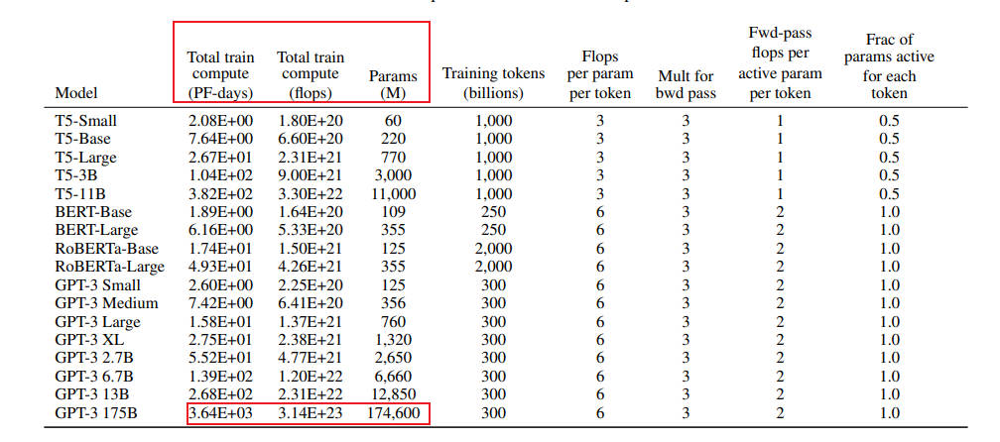
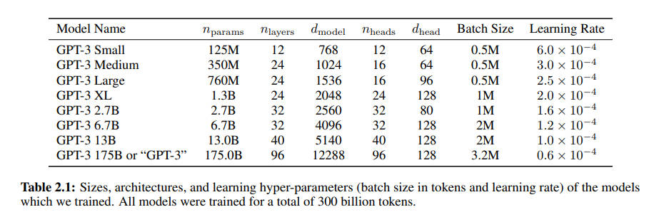
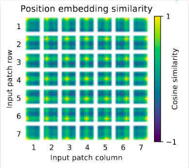
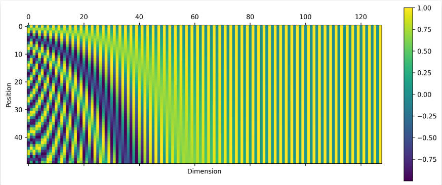
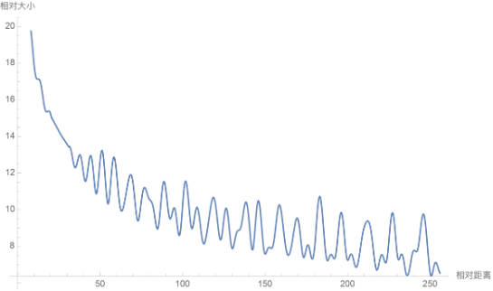
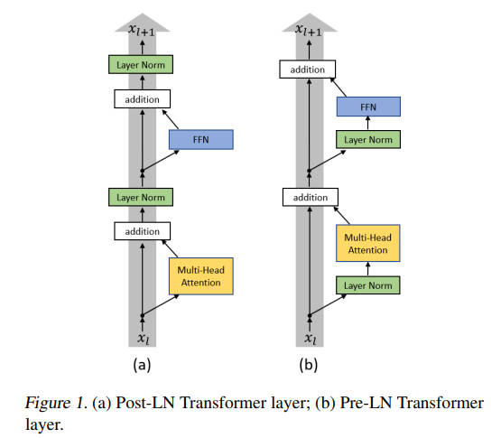

<!--Copyright © ZOMI 适用于[License](https://github.com/Infrasys-AI/AIInfra)版权许可-->

# 01.Transformer 回顾与挑战

> Author by: 张嘉瑶

## Transformer 概览与关键改进

Transformer 是现代大语言模型（如 GPT）的底层架构，诞生于 2017 年的论文《Attention Is All You Need》。
它的核心突破是自注意力机制，彻底抛弃了慢速、易“遗忘”的 RNN/CNN 顺序处理方式。想象一下：自注意力能一次性看清全局，直接捕捉任意远距离的依赖，极大地提高了并行计算能力和长距离建模的稳定性。


它主要有这四大核心利器：
1. 多头自注意力： 实现全局依赖和并行计算。

2. 残差与归一化： 保持深度网络训练稳定（如主流的 Pre-LN）。

3. 前馈网络： 负责非线性复杂转换和“思考”。

4. 位置表示： 用数字标记（如 RoPE/ALiBi 等相对编码）来补充单词的顺序信息，提升长文本外推性。

现代 Transformer 的重要路线是 MoE (专家混合模型)。它允许模型拥有巨大容量（总参数多），但每次计算只激活少数“专家”进行条件计算，巧妙地实现了容量与计算量的解耦，是扩展万亿级大模型的关键秘诀。

> 一句话总结：自注意力带来并行与长依赖；Pre-LN 解决深训练；RoPE/ALiBi 解决位置外推；MoE 解决“更多参数但不多算”。

##  Transformer 模型的核心挑战与研究前沿

尽管 Transformer 取得了巨大成功，但仍面临计算效率、信息表示、训练动态、可解释性和数据依赖等多方面挑战。

**表 1：Transformer 模型主要挑战总结**

| 挑战领域 | 具体问题 | 影响 | 主要研究方向/解决方案 |
| :--- | :--- | :--- | :--- |
| 计算成本与内存 | 自注意力机制的二次方复杂度 (O(n²)) | 限制了可处理的序列长度，增加硬件成本 | 高效 Transformer (稀疏/线性注意力)；内存优化技术 (激活重计算、KV 缓存优化) |
| 位置信息表示 | 标准位置编码的局限性，如外推能力差 | 在长序列或复杂任务上性能下降 | 高级位置编码方法 (RoPE, ALiBi)；针对特定数据的 PE |
| 训练动态 | 深度和大规模 Transformer 训练不稳定 | 训练困难，限制模型扩展 | 改进的归一化策略 (Pre-LN)；稳定的初始化；优化学习率调度 |
| 可解释性 | 模型决策过程不透明，“黑箱”特性 | 限制在关键领域的应用，难以调试 | 可解释性 AI (XAI) 技术 (注意力可视化, 机制可解释性) |
| 数据依赖性 | 高度依赖大规模、高质量的训练数据 | 数据获取成本高，易受数据偏见影响 | 数据高效学习方法 (少样本/零样本学习)；数据增强 |

###  计算复杂性与内存约束

注意力机制的显存消耗，大致可以分为两大部分，**静态模型参数的存储**和**动态中间计算张量的存储**。虽然模型参数的显存消耗是恒定的，但动态张量的消耗会随着输入序列的长度而显著变化。

其中**张量存储开销**包含了

-   **模型参数**
    存储模型参数（如投影矩阵 $W^{Q}$、$W^{K}$、$W^{V}$、$W^{O}$）所需的显存量与序列长度无关，仅取决于模型尺寸（$d_{model}$ 和头数 $h$）。

-   **激活值**
    存储输入张量 $Q$、$K$、$V$ 和最终输出所需的显存量与序列长度 $n$ 和批处理大小 $B$ 呈线性关系，即 $\propto B \times n \times d_{model}$。这些开销是可预测且相对容易管理的。

**中间计算张量**的瓶颈核心在于它包含了**注意力分数矩阵 $(QK^{T})$ 的存储。**

- 这个矩阵的维度是 $(B, h, n, n)$
- 其存储开销与序列长度 $n$ 的平方成正比，即 $O(B \times h \times n^{2})$
- 当 $n$ 变得很大时，这个二次方项会迅速成为总显存消耗中占据主导地位的部分，成为显存瓶颈


####  以 GPT3 为例的二次方增长的量化

Transformer 模型的核心优势之一是其自注意力机制，它能够捕捉序列中任意两个词元之间的依赖关系。然而，这种能力的代价是巨大的计算复杂性和内存需求。标准自注意力机制需要计算序列中所有词元对之间的交互，这意味着其计算复杂度和内存占用均与输入序列长度 n 的平方成正比，即 $O(n^2)$


接下来我们以训练 GPT3-175B 为例深入分析计算量与参数量之间的关系。对于 GPT3，每个 token，每个参数进行了 6 次浮点数运算，再乘以参数量和总 tokens 数就得到了总的计算量。GPT3 的模型参数量为 174600M，训练数据量为 300B tokens。

$$
6 \times 174600 \times 10^{6} \times 300 \times 10^{9} = 3.1428 \times 10^{23} \text{ flops}
$$




在给定训练 tokens 数、硬件环境配置的情况下，训练 transformer 模型的计算时间为：

$$
训练时间  \approx \frac { 8 \times tokens 数 \times 模型参数量}{ GPU 数 \times GPU 峰值 flops \times GPU 利用率} 
$$

那么在 1024 张 40GB 显存的 A100 上，在 300B tokens 的数据上训练 175B 参数量的 GPT3。40GB 显存 A100 的峰值性能为 312TFLOPS，设 GPU 利用率为 0.45，**计算结果显示，预计训练时间约为 34 天。**

$$
\frac{8 \times (300 \times 10^{9}) \times (175 \times 10^{9})}{1024 \times (312 \times 10^{12}) \times 0.45} \approx 2921340 \text{ seconds} \approx 34 \text{ days}
$$

我们来直观地对比下模型参数与中间激活的显存大小。GPT3 的模型配置如下。我们假设采用混合精度训练，模型参数和中间激活都采用 float16 数据类型，每个元素占 2 个 bytes。继续以 GPT3-175B 为例，直观比较一下模型参数与中间激活的显存大小。



GPT3 的模型参数量为 1750 亿 (175B)，其占用的显存大小为：
$ 2 \times 175 \times 10^{9} \ \text{bytes} = 350 \ \text{GB} $

GPT3 的序列长度 $ s $ 为 2048。对比不同的批次大小 $ b $ 下，中间激活占用的显存情况如下,可以看到随着批次大小 
 的增大，中间激活占用的显存远远超过了模型参数显存：

> 每个 transformer 层需要保存的中间激活占用显存大小可以近似为 $ (34bsh + 5bs^{2}a) \times l $
- **当 $ b = 1 $ 时**，中间激活占用显存为：
  $ (34bsh + 5bs^{2}a) \times l = 275,414,777,856 \ \text{bytes} \approx 275 \ \text{GB} $
  约占模型参数显存的 **0.79 倍**。

- **当 $ b = 64 $ 时**，中间激活占用显存为：
  $ (34bsh + 5bs^{2}a) \times l = 17,626,545,782,784 \ \text{bytes} \approx 17.6 \ \text{TB} $
  约占模型参数显存的 **50 倍**。

- **当 $ b = 128 $ 时**，中间激活占用显存为：
  $ (34bsh + 5bs^{2}a) \times l = 35,253,091,565,568 \ \text{bytes} \approx 35.3 \ \text{TB} $
  约占模型参数显存的 **101 倍**。

可以看到随着批次大小的增大，中间激活占用的显存远远超过了模型参数显存。

在推理过程中，Key-Value Cache 的显存占用计算公式为：

$$ \text{KV Cache 显存} = 4 \times b \times l \times h \times (s + n) $$

其中：
- $ b = 64 $：批次大小（batch size）
- $ s = 512 $：输入序列长度
- $ n = 32 $：输出序列长度
- $ l $：层数
- $ h $：隐藏层维度

**计算结果**：
$ 4 \times 64 \times l \times h \times (512 + 32) = 164,282,499,072 \ \text{bytes} \approx 164 \ \text{GB} $

由此可见自注意力机制的 O(n2) 复杂度是 Transformer 架构的“阿喀琉斯之踵”，从根本上限制了其在处理超长序列时的可扩展性。这一瓶颈直接阻碍了模型在许多重要的长序列应用领域的直接应用，并催生了大量关于“高效 Transformer”的研究，形成了一个多样化的近似技术生态系统。


####  应对效率挑战：稀疏、线性及其他近似方法

为缓解 O(n²) 瓶颈，研究界提出了多种“高效 Transformer”：

* **稀疏注意力（Sparse Attention）**：限制每个词元只关注一个子集，如局部窗口注意力（Longformer）或组合模式（Big Bird）。
* **线性化注意力/低秩近似（Linearized Attention）**：通过核方法或低秩分解将复杂度降至线性 O(n)，如 Linformer、Performer 等。

尽管线性注意力等方法在理论复杂度上具有优势（$O(n)$ vs $O(n^2)$），但它们在实际应用中往往面临**性能-效率的权衡（Performance-Efficiency Trade-off）**：

1.  **近似误差**：许多线性注意力机制通过核函数近似或低秩分解来实现线性化，这会引入近似误差，可能导致模型表现略逊于标准注意力。
2.  **表达能力限制**：严格的稀疏模式或低秩假设可能限制模型捕捉某些复杂依赖关系的能力。
3.  **实现复杂度与常数因子**：某些高效注意力算法的实际加速效果受到实现质量、硬件特性和问题规模常数因子的显著影响，有时在中等序列长度上优势并不明显。

因此，选择高效注意力机制需要根据具体任务、序列长度和硬件环境进行仔细评估。没有一种方法在所有场景下都是最优解。

### B. 位置信息表示：局限与创新

#### 1. 标准位置编码在复杂任务中的不足

Transformer 模型凭借其并行处理和自注意力机制，实现了对序列依赖关系的高效建模，但同时也丧失了捕捉序列顺序的固有能力。位置编码作为弥补这一缺陷的关键组件，以“附加”方式为模型注入顺序信息，其设计优劣直接影响模型性能。然而，在处理复杂任务或非常规序列结构时，标准位置编码的局限性日益凸显——例如难以泛化到训练外长度、对结构性数据的适应能力弱等。这些不足催生了大量旨在提升位置感知能力的新方法研究。

#### 2. 先进及替代性位置编码方法

为克服标准位置编码的局限，研究者提出了多种更先进、更灵活的位置编码方法，致力于更有效地表征序列中的顺序与结构信息。从早期的绝对位置编码，到能够融入注意力权重的相对位置编码（如 RoPE、ALiBi），再到面向特定数据类型的专用编码方案，位置信息的表示方式正逐步从静态、独立向动态、与注意力机制深度融合的方向演进。这一趋势不仅是为了弥补 Transformer“顺序感知缺失”的初始缺陷，更是为了让模型真正内化序列与空间关系，从而在长文本、跨模态等复杂任务中表现出更强的泛化与推理能力。

**可学习位置编码**

可学习位置编码原理简单，实现方便，但是缺点也很明显：一是位置编码是模型隐式地学习出来的，因此不能保证具有相对性和远程衰减性；二是位置编码的数量固定为训练时设置的数量，因此无法在测试时外推到更长的序列上。

在视觉领域，ViT 就是用的可学习位置编码。下图展示了预训练的 ViT 中可学习位置编码互相之间的 cosine 相似度：

<div align="center">
  
</div>

可以看见，模型确实学习到了合理的位置编码——距离越近，编码相似度越高。另外，由于图像数据是 2D 的，上图还显现出了有趣的行结构与列结构，也证明了可学习位置编码的有效性。


**Sinusoidal 位置编码**

Sinusoidal 位置编码依然是直接加在 embedding 序列上，但有着特别的设计：

$$
p_{i,2j} = \sin\left( \frac{i}{10000^{2j/d}} \right), \quad
p_{i,2j+1} = \cos\left( \frac{i}{10000^{2j/d}} \right)
$$

其中 $p_{i,k}$ 表示 $\mathbf{p}_{i}$ 的第 $k$ 个分量。这个式子看起来有点抽象，我们不妨可视化一下：

<div align="center">
  
</div>

图中共有 50 个位置编码，每个编码是 128 维的向量。第 $i$ 行代表位置编码 $\mathbf{p}_{i}$ 这个向量，第 $k$ 列代表所有位置编码在第 $k$ 维上的取值。


可以看见，对于第 $k=2j$ 或 $k=2j+1$ 维，各位置编码在这一维度上连起来形成一条周期为 $ 2\pi \cdot 10000^{2j/d} $ 的正弦/余弦曲线。


-   **当 $j=0$ 时**，曲线周期为 $2\pi$，即上图第一列形成一条周期为 $2\pi$ 的正弦曲线。
-   **当 $j=d/2$ 时**，曲线周期为 $20000\pi$，即上图最后一列形成周期为 $20000\pi$ 的余弦曲线。不过此时周期太大，所以看不出变化。


可见，sinusoidal 位置编码的设计思路与二进制编码非常像——**低位周期小频率高、高位周期大频率低**。因此在某种程度上，sinusoidal 位置编码可以看作是二进制编码的连续化。


**RoPE 旋转位置编码**

RoPE 是目前唯一一种可以用于线性 Attention 的相对位置编码。这是因为其他的相对位置编码，都是直接基于 Attention 矩阵进行操作的，但是线性 Attention 并没有事先算出 Attention 矩阵，因此也就不存在操作 Attention 矩阵的做法，所以其他的方案无法应用到线性 Attention 中。而对于 RoPE 来说，它是用绝对位置编码的方式来实现相对位置编码，不需要操作 Attention 矩阵，因此有了应用到线性 Attention 的可能性。

RoPE 形式上和 Sinusoidal 位置编码有点相似，只不过 Sinusoidal 位置编码是加性的，而 RoPE 可以视为乘性的。在 $\theta_{i}$ 的选择上，我们同样沿用了 Sinusoidal 位置编码的方案，即 $\theta_{i}=10000^{-2i/d}$，它可以带来一定的**远程衰减性**。

第一步：复数表示
将 $q,k$ 两两分组后，它们加上 RoPE 后的内积可以用复数乘法表示为：

$$
\left(\mathcal{R}_{m}q\right)^{\top}\left(\mathcal{R}_{n}k\right)=\mathrm{Re}\left[\sum_{i=0}^{d/2-1}q_{[2i:2i+1]}k_{[2i:2i+1]}^{*}e^{\mathrm{i}\left(m-n\right)\theta_{i}}\right]
$$

第二步：Abel 变换（分部求和法）。
记 $h_{i}=q_{[2i:2i+1]}k_{[2i:2i+1]}^{*}$, $S_{j}=\sum_{i=0}^{j-1}e^{\mathrm{i}\left(m-n\right)\theta_{i}}$，并约定 $h_{d/2}=0,S_{0}=0$，那么由 **Abel 变换（分部求和法）** 可以得到：

$$
\sum_{i=0}^{d/2-1}h_{i}e^{\mathrm{i}\left(m-n\right)\theta_{i}}=\sum_{i=0}^{d/2-1}h_{i}\left(S_{i+1}-S_{i}\right)=-\sum_{i=0}^{d/2-1}S_{i+1}\left(h_{i+1}-h_{i}\right) 
$$

第三步：不等式推导，所以：

$$
\begin{align*}
\left|\sum_{i=0}^{d/2-1}q_{[2i:2i+1]}k_{[2i:2i+1]}^{*}e^{\mathrm{i}\left(m-n\right)\theta_{i}}\right|&=\left|\sum_{i=0}^{d/2-1}S_{i+1}\left(h_{i+1}-h_{i}\right)\right|\\
&\leq\sum_{i=0}^{d/2-1}\left|S_{i+1}\right|\left|h_{i+1}-h_{i}\right|\\
&\leq\left(\max_{i}\left|h_{i+1}-h_{i}\right|\right)\sum_{i=0}^{d/2-1}\left|S_{i+1}\right|
\end{align*} 
$$

衰减性分析，因此我们可以考察 $\frac{1}{d/2}\sum_{i=1}^{d/2}\left|S_{i}\right|$ 随着相对距离的变化情况来作为衰减性的体现。

**Mathematica 代码如下：**
```text
d = 128;
\[Theta][t_] = 10000^(-2*t/d);
f[m_] = Sum[
    Norm[Sum[Exp[I*m*\[Theta][i]], {i, 0, j}]], {j, 0, d/2 - 1}]/(d/2);
Plot[f[m], {m, 0, 256}, AxesLabel -> {相对距离, 相对大小}]
```

<div align="center">
  
</div>
    

从图中我们可以可以看到随着相对距离的变大，内积结果有衰减趋势的出现。

**表 2：位置编码技术对比**

| 方法 | 原理 | 主要优势 | 主要局限性 |
| :--- | :--- | :--- | :--- |
| 绝对正弦 PE | 使用正余弦函数生成固定编码 | 计算简单，无需学习 | 固定性强，外推能力有限 |
| 学习式绝对 PE | 将位置编码视为可学习参数 | 可自适应数据 | 训练开销，泛化能力依赖训练 |
| 基础相对 PE | 在注意力中编码相对距离 | 更好地处理变长序列 | 可能丢失绝对位置信息 |
| 旋转位置嵌入 (RoPE) | 对 Q/K 向量旋转，使其点积依赖于相对位置 | 良好的长度外推性，平滑编码 | 相对复杂 |
| 线性偏置注意力 (ALiBi) | 在注意力分数上添加距离偏置 | 极强的长度外推能力 | 偏置是预设的，不够灵活 |
| 二维位置编码 (2D PE) | 独立编码行和列位置 | 显式捕捉二维空间关系 | 仅适用于网格状数据 |
| 无 PE (涌现式) | 依赖机制从嵌入中隐式学习位置 | 无需额外 PE 模块 | 机制尚不完全清楚 |

### C. 训练动态：确保稳定性与加速收敛

训练深度和大规模 Transformer 是一项艰巨任务，常面临不稳定和收敛慢的问题。
* **挑战**：Post-LN 在深层模型中易导致梯度消失；不稳定的训练过程可能与陡峭的损失地形有关。
* **技术**：采用更优的权重初始化（如 StableInit）、归一化策略（Pre-LN）、学习率调度（预热+衰减）、正则化（Dropout）等技术来改善训练动态。

下面我们就 Post-Norm 和 Pre-Norm 进行深入探讨


<div align="center">
  
</div>
    

Post-Norm 的意思是先进行函数映射，再进行 normalization，其公式化表示如下：

$$
x_{t+1} = \text{Norm}(x_{t} + F_{t}(x_{t}))
$$

Pre-Norm 的意思是先进行 Normalization 再进行函数映射，其公式化表示如下：

$$
x_{t+1} = x_{t} + F_{t}^{+}\left( \text{Norm}(x_{t})\right) 
$$

这里的 $F_{t}(\cdot)$ 在 Transformer 中可以是 Multi-Head Attention，也可以是 FFN（前馈神经网络）。

层归一化（Layer Normalization, LN）在 Transformer 中扮演着稳定训练和加速收敛的关键角色。原始 Transformer 采用的是“Post-Norm”（或 Post-LN）结构，即 LN 应用在残差连接之后。然而，当模型层数加深时，Post-Norm 结构容易导致训练不稳定和梯度消失问题，因为残差路径上的信号在累加后其方差可能变得很大，经过 LN 后梯度可能被不当缩放，阻碍有效反向传播。

为了解决这一问题，“Pre-Norm”（或 Pre-LN）结构应运而生，并迅速成为现代深度 Transformer 的主流选择。在 Pre-Norm 中，LN 操作被移至每个子层（自注意力或 FFN）的输入端，即对送入子层的残差分支进行归一化。

Pre-Norm 的主要优势在于：
* 改善梯度流：通过保持主残差路径是一个直接的跨层累加，梯度可以更顺畅地反向传播到网络的早期层，即使子层内部的 LN 导数较小，也不会严重削弱整体梯度信号。
* 提升训练稳定性：确保每个子层始终接收到分布良好、方差受控的输入，从而使得训练过程更加稳定，尤其对于非常深（例如数十甚至上百层）的 Transformer 模型至关重要。
* 支持更大模型：Pre-Norm 的稳定性使得训练更大、更深的模型成为可能，这对于实现当前 SOTA 的大规模语言模型至关重要。

尽管 Pre-Norm 在深层模型中表现更优，但 Post-Norm 在浅层模型中有时也能取得不错的性能。一些现代 Transformer 实现（如 GPT-3, PaLM, LLaMA）默认采用 Pre-Norm 结构。 此外，一些研究还探索了对残差连接进行小幅缩放等技巧，以进一步维持前向和后向传播信号的稳定性 


### D. 可解释性困境：解包"黑箱"

Transformer 为什么像“黑箱”？打个比方：你给它一篇长文，它给你一个答案，但中间到底“看重了谁”，很难一句话说清。注意力热力图看起来像解释，但很多时候更像“情绪板”——好看不一定有用。

换个落地视角，说说我们在项目里踩过的点和能用的招：
- 先问“给谁解释”：给老板/监管要“可讲故事”，给研发要“能复现结论”，给产品要“能做阈值”。解释对象不同，方法就不一样。
- 注意力可视化的正确打开方式：不要只看一头、不要只看一层，也别只看一张图。我们会做“多头叠加 + 层级对比 + token 掩码敏感性”，用打分曲线而不是截图拍脑袋。
- Probe（探针）比你想的更实用：在每层后面接个小分类器，问问“这一层能不能分出句法/实体/情感”。这不一定是“真机理”，但它能定位“信息在哪一层出现、在哪一层消失”，特别适合排查“模型背了但没会”的问题。
- 机制可解释性（Mechanistic Interpretability）别神化：小模型能“拆导线”，大模型就当“方向盘”。我们常用的方法是“定点干预 + 行为对比”：替换中间张量的一部分，观察输出偏转方向，用来判断哪一簇通道跟任务强相关。
- 事前可解释 > 事后补救：比如结构化任务（表格、代码审计），与其事后画注意力，不如一开始就把“字段级别的可见性”“跨列约束”放进架构或数据模板里，天然更容易讲清楚。

团队小清单：
- 产出三件套：一页因果路径示意（可视化）、一组敏感性曲线（遮蔽/替换/扰动）、一段可复现实验脚本（种子固定）。
- 在高风险场景（医疗/金融）引入“解释失败兜底”：当解释置信度低时，触发人工复核或降级策略，而不是“硬上”。

### E. 数据依赖与泛化能力

Scaling Law 的朴素解读：给模型“吃得多、练得勤”，成绩就会涨。但现实里，数据像米，其实分“新米、陈米、掺砂米”。

我们更关注三件事：哪里找米、怎么淘米、怎么配餐。

1) 去哪儿找“新米”
- 行业私域数据才是长效壁垒。公开数据把底座练起来，私域数据决定“能不能落地赚钱”。
- 合成数据不是“赝品”，是“调味料”。用大模型写草稿、人类修订，再把“修订前后差分”当成教学信号，常常比纯人工更稳。

2) 怎么“淘米”
- 去重与相似性过滤别偷懒。长上下文训练对重复极其敏感，重复样本让模型学会“背诵”，一推长就跑偏。
- 标注一致性是低配“对齐”。我们做过一个小实验：只提升 10% 的标注一致性，最终线上错误率跌了 20%+。
- 别让脏数据“绑架”评估。建立“难例集”（hard set），里头放行业边角料，线上问题常常就长在这里。

3) 怎么“配餐”（配比与预算）
- 记住一句话：在给定算力下，“更小的模型 + 更多的数据”经常比“更大的模型 + 更少的数据”更划算（Chinchilla 思路）。
- Token 预算怎么分？粗略拿“6 × 参数 × token = 固定算力”这条经验式，锁住总账，再做五五开或六四开试验，哪边边际回报高往哪边加。
- 课程学习很接地气：先喂“容易而常见”的，再慢慢加“困难而关键”的，收敛更稳，对长尾也更友好。

上线前，我们会做这几道“家常菜”评估：
- 外推测试：训练 4k，测试 32k，不追指标，只看崩不崩。能跑通再谈精细调参。
- 偏见/安全基线：一页 checklist，红线问题触发“拒答/转人工/降级”。
- 数据-能力闭环：每次线上跌倒，追溯到数据集位置，补齐“对症样本”，而不是只改提示词。

一句话收尾：模型像船，数据像水。水深一点，船自然能开得更远；但遇到暗礁（脏/偏/旧数据），再大的船也得翻。与其只换更大的发动机，不如把航线（数据）先画对。

### E. 数据依赖与泛化能力

Transformer 的成功及其对数据的依赖，可以通过**缩放定律（Scaling Laws）** 来深刻理解。缩放定律指出，模型性能（如测试损失）与模型参数量（N）、训练数据量（D）和计算量（FLOPs，C）之间存在可预测的幂律关系：

$$ L(N, D) = \left(\frac{N_c}{N}\right)^{\alpha_N} + \left(\frac{D_c}{D}\right)^{\alpha_D} + L_\infty $$

其中 $L$ 是测试损失，$N_c$, $D_c$, $\alpha_N$, $\alpha_D$, $L_\infty$ 是拟合参数。

这一定律揭示了：
1.  **可预测性**：投入更多计算、数据或模型参数，可以可靠地获得更好的性能。
2.  **资源分配**：为指导如何高效分配计算预算以最小化损失提供了理论依据（例如，是否应该扩大模型还是收集更多数据）。
3.  **双重边缘**：它既是 Transformer 扩展成功的**原因**（提供了清晰的扩展路径），也**加剧**了其数据与计算依赖的**挑战**，因为按此定律追求极致性能必然走向超大模型和海量数据。

由于 Transformer 的成功严重依赖大规模、高质量的训练数据，这带来了成本和偏见问题。
* **需求**：LLM 的性能与数据量和质量密切相关，但数据获取困难且成本高昂，模型也易学习并放大数据偏见。
* **策略**：为了降低数据依赖，研究者们积极探索数据高效学习策略，如少样本/零样本学习（FSL/ZSL）、数据增强、迁移学习和课程学习，以提升模型在数据稀疏场景下的泛化能力。

##  Transformer 的变革性影响：跨领域的广泛应用

过去几年，我们基本见证了“注意力=新的通用计算模块”。它先从语言出道，但很快“出圈”。

- 在 NLP 里，Transformer 已经成了“默认选项”。翻译、摘要、问答不再需要为每个任务单独造轮子，预训练一个大模型，换个指令就能干不同活儿。你可以把它理解成“语言的瑞士军刀”，刀片多，而且越来越锋利。
- 到了视觉，ViT 把图像切成小块当“词”，把卷积多年的“归纳偏置”换成了更通用的注意力。它的天赋是“可扩”，数据给够、算力给够，性能就水涨船高。代价是：它挑食（数据要多），而且有点“内向”（可解释性一般）。
- 语音方向则是另一种惊喜：长时依赖本就是强项，ASR/TTS 都吃到了红利。统一的序列范式，让音频、文本、图像之间的桥梁一下变得顺理成章。
- 真正改变范式的是多模态。CLIP 用一句话把图像和文字扭在一起，检索和理解像打通任督二脉；而“把视觉特征当特殊词元喂给 LLM”的思路，直接把“看图说话”做成了“看图思考”。

一句话总结：Transformer 不只是一个模型家族，而是一个“把世界离散成序列再统一处理”的方法论。统一，就意味着可复用、可扩展、可演化。


接下来几年，方向很现实：既要更快，也要更专。落到地上，大致是这几条路：

- 效率优先：O(n²) 是“硬痛”。社区已经在用稀疏/线性注意力、FlashAttention、重计算等办法“挤牙膏式”提速。更进一步，会是“算法+硬件”协同：编译器、内核、显存管理一起上。
- 模型专业化：通才很强，但行家更值钱。训练一个通用底座，再做领域适配（医疗、金融、工业控制），既省钱又更可靠。
- 数据当作一等公民：Scaling Law 告诉我们：算得多、看得多，确实更强。但数据质量的回报越来越关键。清洗、合成、蒸馏、课程学习，这些“看似工程”的活，决定了上限。
- 可信与可解释：落地到高风险行业，解释路径和安全护栏是入场券。除了“事后解释”，更值得投入的是“事前可解释”的结构设计。
- 新路线并行：SSM/Mamba 给了一个不必依赖注意力的新视角——线性复杂度、扫描友好、硬件亲和。未来大概率是“注意力系”和“状态空间系”并行发展，分场景各擅胜场。

给团队的“落地建议”：
- 做通用能力：沿用主流 RoPE、Pre-LN、FlashAttention，别逆潮流。
- 做长上下文服务：优先上 KV 量化 + Paged KV + GQA，先把成本打下来。
- 做行业模型：把数据打磨当成第一性工程，用小算力把“数据→能力”的杠杆撬足。
- 评测与对齐：构建“任务-数据-指标”的闭环，少讲故事，多看曲线。

##  结论

Transformer 的成功不神秘：并行、长依赖、统一范式，踩中了时代的所有红利。它改变了我们“造模型”的方式——从“单点方案”转向“通用底座+轻定制”。  
但它的短板也很清楚：算力吃紧、显存焦虑、外推风险、可解释性欠账。这也是为什么我们看到一整套“工程化降本”（FlashAttention、重计算、并行切分、KV 量化）和“结构化提效”（稀疏/线性注意力、SSM）的组合拳。

如果只带走三句话：
1) 训练账按“6 × 参数 × token”来算，八九不离十；  
2) 显存峰值在中段，FlashAttention+检查点基本是“白给优化”；  
3) 推理解码的生死线在 KV Cache：量化+分页+GQA/限窗，先把服务稳住，再谈性能上限。

这不是终点，而是一个开始。把技术做“稳”，把应用做“深”，才是真正的壁垒。

## 参考文献

1. Vaswani, A., Shazeer, N., Parmar, N., Uszkoreit, J., Jones, L., Gomez, A. N., Kaiser, Ł., & Polosukhin, I. (2017). Attention Is All You Need. In Advances in Neural Information Processing Systems (NeurIPS). 

2.  Xiong, R., Yang, Y., He, D., Zheng, K., Zheng, S., Xing, C., Zhang, H., Lan, Y., Wang, L., & Liu, T. (2020). On Layer Normalization in the Transformer Architecture. In International Conference on Machine Learning (ICML).
3. Su, J., Lu, Y., Pan, S., Murtadha, A., Wen, B., & Liu, Y. (2024).RoFormer: Enhanced Transformer with Rotary Position Embedding. Neurocomputing. 

4. Press, O., Smith, N. A., & Lewis, M. (2022). Train Short, Test Long: Attention with Linear Biases Enables Input Length Extrapolation. In International Conference on Learning Representations (ICLR). 

5. Shazeer, N., Mirhoseini, A., Maziarz, K., Davis, A., Le, Q., Hinton, G., & Dean, J. (2017). Outrageously Large Neural Networks: The Sparsely-Gated Mixture-of-Experts Layer. In International Conference on Learning Representations (ICLR). 

6. Dosovitskiy, A., Beyer, L., Kolesnikov, A., Weissenborn, D., Zhai, X., Unterthiner, T., Dehghani, M., Minderer, M., Heigold, G., Gelly, S., Uszkoreit, J., & Houlsby, N. (2021). An Image is Worth 16x16 Words: Transformers for Image Recognition at Scale. In International Conference on Learning Representations (ICLR). 

7. Tay, Y., Dehghani, M., Bahri, D., & Metzler, D. (2022). Efficient Transformers: A Survey. ACM Computing Surveys. 

8. Lin, T., Wang, Y., Liu, X., & Qiu, X. (2022). A Survey of Transformers. AI Open. 

9. Brown, T. B., Mann, B., Ryder, N., Subbiah, M., Kaplan, J., Dhariwal, P., Neelakantan, A., Shyam, P., Sastry, G., Askell, A., Agarwal, S., Herbert-Voss, A., Krueger, G., Henighan, T., Child, R., Ramesh, A., Ziegler, D. M., Wu, J., Winter, C., … Amodei, D. (2020). Language Models are Few-Shot Learners. In Advances in Neural Information Processing Systems (NeurIPS). 

10. Devlin, J., Chang, M.-W., Lee, K., & Toutanova, K. (2019). BERT: Pre-training of Deep Bidirectional Transformers for Language Understanding. In Conference of the North American Chapter of the Association for Computational Linguistics (NAACL). 

11. Raffel, C., Shazeer, N., Roberts, A., Lee, K., Narang, S., Matena, M., Zhou, Y., Li, W., & Liu, P. J. (2020). Exploring the Limits of Transfer Learning with a Unified Text-to-Text Transformer. Journal of Machine Learning Research (JMLR). 

12. Zaheer, M., Guruganesh, G., Dubey, K. A., Ainslie, J., Alberti, C., Ontanon, S., Pham, P., Ravula, A., Wang, Q., Yang, L., & Ahmed, A. (2020). Big Bird: Transformers for Longer Sequences. In Advances in Neural Information Processing Systems (NeurIPS). 

13. Kitaev, N., Kaiser, Ł., & Levskaya, A. (2020). Reformer: The Efficient Transformer. In International Conference on Learning Representations (ICLR). 

14. Child, R., Gray, S., Radford, A., & Sutskever, I. (2019). Generating Long Sequences with Sparse Transformers. arXiv preprint arXiv:1904.10509. 

15. Hendrycks, D., & Gimpel, K. (2016). Gaussian Error Linear Units (GELUs). arXiv preprint arXiv:1606.08415. 
