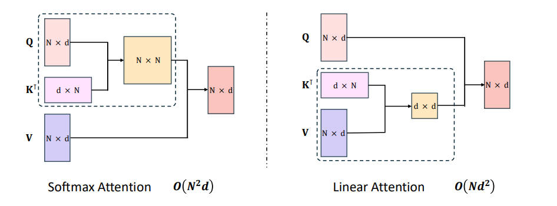
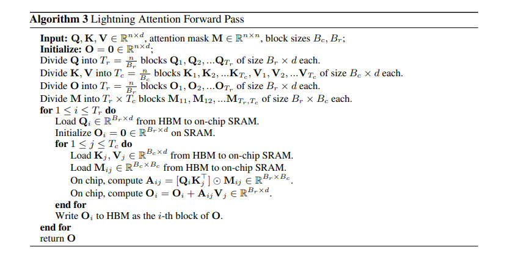
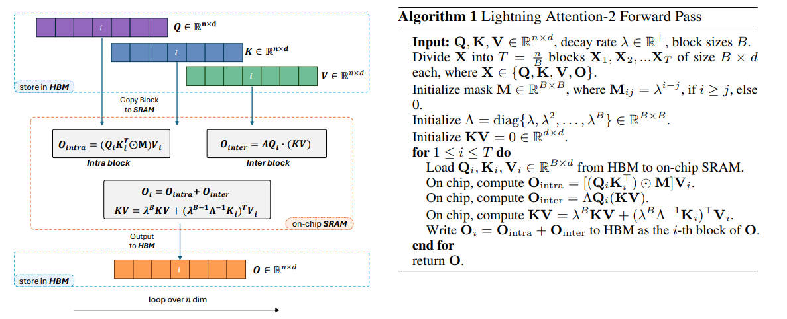
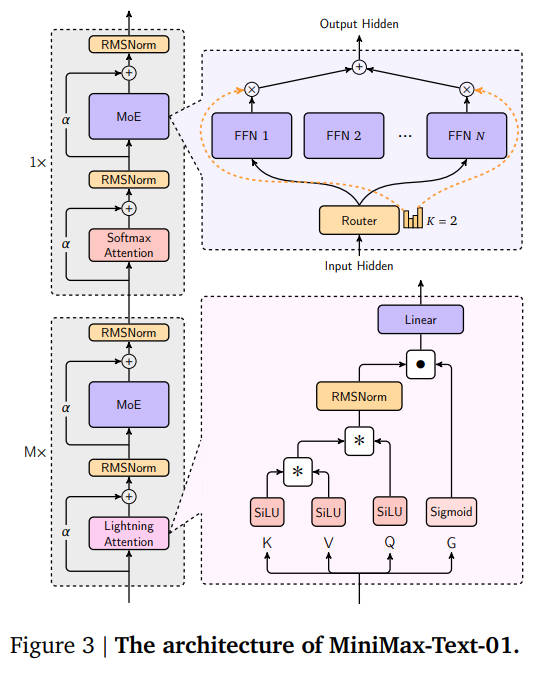
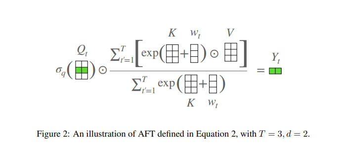
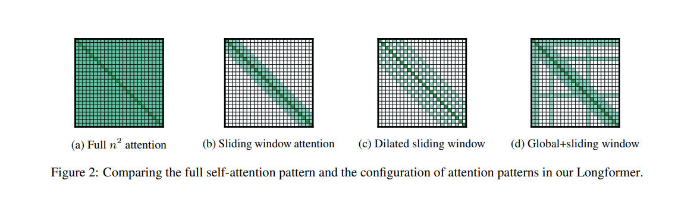
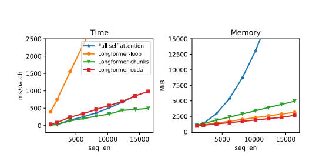
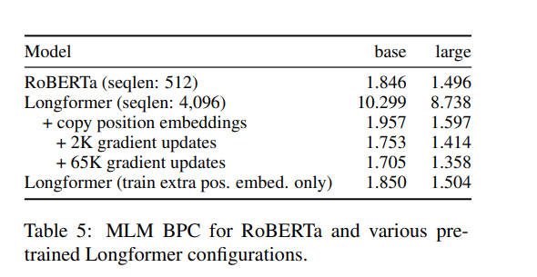

<!--Copyright © ZOMI 适用于[License](https://github.com/Infrasys-AI/AIInfra)版权许可-->

# Efficient Transformer 结构

> Author：张嘉瑶

## 引言：高效 Transformer 的兴起与挑战

自注意力是 Transformer 的关键能力，但它要为“人人和人人都打招呼”付出代价：时间和显存随序列长度 L 呈平方增长，因为需要算一张 L×L 的分数矩阵。序列一长（长文、高分辨率、长时序），成本就压上来了，标准做法很难扩展到真实的长上下文场景。为把效率抬起来，大家开始找更聪明的路子：在尽量不丢效果的前提下，降低计算和内存占用。本文聚焦的三条代表性路线各有侧重——Linear Attention 从数学上“换顺序”把复杂度压到近似线性；Attention Free Transformer 用可递推/卷积式加权替代全配对的注意力；Longformer 则用窗口化加少量全局位做结构化稀疏。这三种思路分别对应公式重写、机制替代和模式优化，为“长上下文、低成本”的落地提供了可操作的选项。

##  Linear Attention 理论基础与数学解析 

线性注意力可以把“算不动的 n²”重写成“基本线性的 n”，思路并不神秘：换一下矩阵乘法的次序，就能绕开显式的 N×N 注意力图，算力和显存压力都下来了。真正的难点在工程侧——因果掩码带来的前缀累加不利于并行、GPU I/O 也容易卡吞吐。Lightning Attention 等工作给出了不错的落地方案，而不少实战模型（如 Minimax-Text-01）干脆走“混搭”：该用线性注意力抢吞吐的地方就上，关键层保留 Softmax 注意力扛表达力，在效率和效果之间找平衡。换句话说，线性注意力不是银弹，但在超长序列和成本敏感场景里，它是个值得放进工具箱的可靠部件。
**线性注意力公式推导与计算复杂度分析**

线性注意力机制通过用一个非负的激活函数 ϕ 替代 softmax，并利用矩阵乘法的结合律来改变计算顺序。其公式可以表示为：
$$ \phi(Q) (\phi(K)^T V) $$

这里的关键在于改变运算的顺序：

1. 首先计算 $ϕ(K)^{T}$ 和 $V$ 的乘积。$ϕ(K)^{T}$ 是 $d×n$ 矩阵，$V$ 是 $n×d$ 矩阵，它们的乘积结果是一个 $d×d$ 的小矩阵。这一步的计算量为 $nd^{2}$。然后将 $ϕ(Q)$（一个 $n×d$ 矩阵）与上一步得到的 $d×d$ 矩阵相乘。这一步的计算量为 $nd^{2}$。 

2. 由于 $d$ 通常远小于 $n$，因此整个计算的复杂度从 $O(n^2d)$ 降低到了 $O(nd^2)$ 。这一理论上的巨大飞跃，使得模型在处理超长序列时变得可行。 

  

  

然而，必须认识到，这种复杂度分析主要关注的是理论上的浮点运算（FLOPs）数量。在实际的 GPU 硬件上，性能不仅仅取决于运算次数，还受到内存访问模式、数据局部性以及缓存命中率等因素的严重影响。即使理论上运算量减少，如果计算过程需要频繁地在不同层级的 GPU 内存（如片上缓存和显存）之间移动数据，整体速度也可能受到严重制约。因此，理论上的复杂性优势并不一定会自动转化为实际的性能提升，这需要精心的工程设计来弥合理论与实践之间的鸿沟。

**激活函数（如 $ϕ$ 函数）在其中的关键作用**

线性注意力机制用激活函数 $ϕ$ 替代了 $softmax$, 将 $ϕ$ 设置为 $elu(⋅)$ 函数，而非常见的 $relu(⋅)$。

这个选择乍看之下似乎是微不足道的，但它背后蕴含着对深度学习模型训练稳定性的深刻理解。$relu$ 函数在输入为负数时输出为零，这可能导致所谓的“神经元死亡”问题，即一旦某个神经元的输入变为负数，其梯度将永远为零，从而停止学习。在线性注意力的公式中，如果 $relu$ 导致 $ϕ(K)$ 矩阵的某一列或某几列全为零，那么对应的注意力机制将完全失效，无法从数据中提取信息。相比之下，$elu$ 函数在负数输入时会输出一个平滑、非零的值，从而始终保持非零梯度 。这个特性能够避免“神经元死亡”，保障模型的训练稳定性和有效性。这一选择表明，在构建高性能 LLM 时，最终的成功往往取决于一系列看似细小但至关重要的数学和工程决策，而非仅仅依赖于单一的宏大架构创新。

### Linear Attention 从理论到实践

**线性注意力在因果掩码和并行计算中的局限性**

在自回归文本生成等任务中，模型需要应用因果掩码 $（Causal Masking）$，确保当前词元只能关注到它之前的词元，而不能“偷看”未来的词元。在传统注意力中，这通过在 $QK^{
T}$ 矩阵上应用掩码来实现，这是一种高度并行的操作。

然而，在线性注意力中，因果掩码的实现变得复杂。其计算过程需要引入累积求和 $（cumsum）$ 操作。 

$cumsum$ 本质上是一个顺序操作，每个元素的计算都依赖于前一个元素的结果，这与 GPU 擅长的并行计算模式相悖 。因此，尽管线性注意力在理论上大大减少了计算量，但这种串行化的计算需求使其在因果生成任务中的速度并不理想。

**GPU 内存访问（I/O）对性能的影响分析**

如前所述，理论上的复杂度降低并不等同于实际的速度提升。线性注意力机制虽然将计算量从 $n^2d$ 降低到 $nd^2$ ，但如果计算过程中生成的大量中间张量（尤其是 $ϕ(K)^TV）$ 无法完全存储在高速的片上缓存中，而必须频繁地在片上内存和较慢的显存之间进行数据传输，那么 I/O 瓶颈将成为新的性能制约因素 。这种数据移动的开销有时甚至会超过浮点运算本身的耗时，从而导致线性注意力的实际性能未达预期。

针对上述两大挑战，Lightning Attention 模型系列提供了实用的工程解决方案。

**Lightning Attention V1：I/O 问题的优化策略**

Lightning Attention V1 旨在解决 GPU 内存访问问题 。值得注意的是，这个版本并没有完全采用线性注意力的公式，而是在训练阶段保留了传统的左乘法（Left-Multiplication）计算。然而，它借鉴了 FlashAttention 的思路，通过一种新的算法来优化 I/O 交互性，从而有效地减少了内存传输开销 。这表明，为了在实践中获得性能，研究者们采取了务实的态度，不拘泥于理论公式，而是优先解决实际的系统级瓶颈。

  

  

**Lightning Attention V2：突破因果掩码的瓶颈**

Lightning Attention V2 则直接瞄准了 $cumsum$ 带来的因果掩码效率问题。该版本通过将序列划分为更小的块（block），并设计了专门的块内（intra-block）和块间（inter-block）计算方法。文章中详细推导了其公式，展示了如何在不依赖全局 Learn More
$cumsum$ 的情况下，通过块级别的并行计算来有效地实现因果掩码。这种从理论架构创新到系统级工程优化的演进历程，是高性能计算领域的一个典型缩影。它揭示了一个深刻的道理：一个优雅的数学思想只有辅以强大且为之量身定制的工程实现，才能真正发挥其变革性潜力。

  

  
### Minimax-Text-01 模型架构深度解析

Minimax-Text-01 模型是线性注意力成功应用的典范 。该模型没有采用纯粹的线性注意力，而是开创性地设计了一种混合注意力架构，将 Lightning Attention（线性注意力）与传统的 Softmax Attention 有机地结合在一起 。这种设计体现了一种务实的哲学：取长补短，而不是非此即彼。

该模型总共包含 80 个层，其架构遵循一种特定的模式：每 7 个使用 Lightning Attention 的 transnormer 块之后，跟随一个使用 Softmax Attention 的 Transformer 块。

  

Minimax-Text-01 的混合架构并非简单的堆叠，而是一种战略性的分工。线性注意力凭借其卓越的效率，可以有效地处理长序列中的全局依赖关系，为模型提供“广阔的视野”，捕捉上下文的宏观轮廓。而 Softmax 注意力，尽管计算成本高昂，却拥有更强大的表达能力，能够捕捉细粒度的、微妙的局部模式和依赖关系。

通过周期性地插入 Softmax 注意力层，模型能够利用其高分辨率的注意力机制来“精炼”由线性层提供的长程上下文。这种混合设计旨在结合两者的优点：线性注意力提供了处理大规模上下文所需的效率，而 Softmax 注意力则确保了模型在处理复杂、精细的语言任务时所需的表达能力。这暗示着，未来 LLM 的架构可能不会是单一注意力机制的天下，而会转向更智能、异构化的混合注意力设计，以在性能和效率之间实现更佳的平衡。

Minimax-Text-01 模型的案例研究提供了重要的启示：在实践中，纯粹的线性注意力可能不足以实现最顶尖的性能。将高效的线性注意力与表达能力更强的传统 Softmax 注意力相结合的混合架构，为平衡效率和性能提供了一条有前景的道路 。这种设计理念可能代表了未来超大规模模型的主流发展方向。

##  无注意力机制 Transformer（AFT）：连接范式的转变

Attention Free Transformer (AFT) 代表了高效 Transformer 研究中的一个激进方向——完全抛弃注意力机制。AFT 的核心动机源于一个大胆的假设：也许我们并不需要复杂的注意力计算来实现有效的序列建模。相反，通过精心设计的位置偏置和可学习的特征交互机制，可能就足以捕获序列中的依赖关系。

AFT 模型的中心创新在于其解决了二次方复杂度问题的优雅方案：它完全消除了点积自注意力机制。AFT 没有计算庞大的 $n \times n$ 注意力图，而是首先将键（Key）矩阵 $K$ 和值（Value）矩阵 $V$ 与一组可学习的位置偏置相结合，然后用查询（Query）矩阵 $Q$ 执行简单的元素级乘法。对于序列中位置 $t$ 的特定令牌，其输出是所有值 $V$ 的加权和，而权重则由键向量和可学习的位置偏置共同决定。

### AFT 的核心计算

AFT 用一种极其简单的加权平均机制替代了复杂的注意力计算。其核心操作可以表示为：

$$
y_t = \sum_i w_{t,i} \odot x_i
$$

其中：
- $x_i$ 是位置 $i$ 的输入特征
- $w_{t,i}$ 是位置 $t$ 对位置 $i$ 的可学习权重
- $\odot$ 表示逐元素乘法
- $y_t$ 是位置 $t$ 的输出

关键创新在于权重 $w_{t,i}$ 的设计，它由两部分组成：
1. **全局可学习权重**：为每对位置学习一个固定的权重
2. **位置偏置**：基于相对位置的预定义或可学习的偏置

它允许模型“维持语境中任意两点之间的直接交互”，这是传统点积注意力的一大优势，而许多线性模型却失去了这一特性。通过学习这些偏置，AFT 成为了一个强大的替代方案，而不仅仅是一个简单的近似。

  

### 位置感知的特征融合

AFT 通过以下方式实现位置感知：

$$
w_{t,i} = \sigma(q_t \odot k_i + b_{t-i})
$$

其中：

- $q_t$ 和 $k_i$ 类似于注意力机制中的查询和键，但使用方式更简单
- $b_{t-i}$ 是基于相对位置 $(t-i)$ 的偏置项
- $\sigma$ 是 sigmoid 激活函数，确保权重在 $[0, 1]$ 范围内

由此可见**Attention Free Transformer**并未完全消除注意力的概念；它只是用一种全新的机制取代了计算注意力权重的方式。这种命名很可能是一种修辞手法，旨在强调其与标准 Transformer 的根本性架构差异。然而这种区别又至关重要：AFT 是一种新形式的注意力，而不是注意力的缺失。它在不使用点积的情况下实现了注意力，从而巧妙地解决了计算瓶颈。

### 计算和内存复杂度：协调矛盾的主张

**时间与内存的细微差别** 

为什么说相互矛盾？因为论文指出核心操作的内存复杂度，如果计算以特定的、非矩阵方式进行，其内存复杂度确实是线性的。关键的考量是 AFT 机制重新排序了计算。它没有执行二次方成本的 $(QK^T)V$ 操作，而是执行 $Q \odot (\text{sum over } t' \text{ of } \exp(K + w) \odot V)$。在一个天真的 PyTorch 实现中，这个求和操作可能仍然涉及一个大的矩阵乘法，特别是在 $w$ 矩阵为 $T \times T$ 的情况下。AFT 的时间复杂度和 Transformer 的时间复杂度一致，都是 $O(T^2 d)$，因为涉及 $w$ 矩阵的操作仍然以二次方扩展。

AFT 的效率并不在于其计算步骤的魔术式减少，而在于对操作进行了更节省内存和更易并行化的重新排序，这可能对硬件（尤其是在推理时）更为友好。线性内存的主张似乎对于前向传播是成立的，特别是如果求和是以增量或流式方式计算的话；但根据具体实现以及是否显式计算或存储完整的 $w$ 矩阵，二次方的时间复杂度可能仍然存在。

### AFT 模型变体：机制的定制

**AFT-Local 局部约束与全局感知**

AFT-Local 变体通过将位置编码 $w$ 矩阵中特定窗口大小 $s$ 之外的值设置为零来修改 AFT-Full 模型。这使得 $w$ 矩阵实际上成为一个带状矩阵。但报告指出一个矛盾：虽然它约束了 $w$ 矩阵，但这种改变并不能减少计算负荷，因为零值仍然是完整计算的一部分。然而，原始论文声称它提供了更好的“参数和计算效率”并提高了性能。这表明，尽管理论复杂度可能没有改变，但由于数据局部性和稀疏性，在特定硬件上的实际性能可能有所提高。

**AFT-Conv：利用卷积原理处理图像数据**

AFT-Conv 变体专为图像数据设计，利用了 CNN 中局部感知和参数共享的原理。它使用一维卷积核来实现位置编码，其中偏置 $w$ 仅依赖于相对位置 $t - t'$ 。这使得 $w$ 矩阵成为一个 Toeplitz 矩阵。AFT-Conv 采用类似于 CNN 多通道方法的多头注意力概念，并行化计算而不需头与头之间交互。

**AFT-Simple：无位置偏置的情况**

AFT-Simple 是一个简化版本，其中位置编码矩阵 $w$ 被设为零。这个变体被认为与线性注意力相似。通过比较 AFT-Full 和 AFT-Simple，可以凸显 $w$ 矩阵的核心作用。AFT-Simple 失去了全局连接性，因为令牌之间的交互被简化为一个元素级的全局池化操作。这表明位置偏置不仅仅是一个附加物；它是提供全局、长距离依赖的核心机制，而这正是 Transformer 的标志性特征。
### AFT 的设计哲学与启示

AFT 不是要“干掉注意力”，而是提醒我们：很多任务并不需要“全民互联”。把交互做得简单一点、稳一点、算得起一点，往往更接近工程答案。

几条做事方法论：
- 先画“依赖地图”：任务靠局部还是靠长程？若 80% 的价值在局部，就别为那 20% 的长程去交双倍的算力税。
- 以部署为反推：当你需要移动端/大并发，AFT 的“无 KV cache + 小状态”是天然优势。
- 组合而非对立：把 AFT 做底座打局部模式，关键层再插几层注意力/SSM，常常能拿到两头的好处。
- 用“够用”做目标函数：确定业务的合格线和上线时延，把参数/窗口/核形当作拨杆，先满足 SLA，再追指标小数点。

>一句话总结：AFT 更像“工具箱里的扳手”，不是所有螺丝都该用电钻去拧。选对工具，比把工具吹成“银弹”更重要。

## Longformer：长文档 Transformer 的稀疏注意力机制与工程优化

Longformer，即“长 Transformer”，正是为了解决上述二次复杂度瓶颈而提出的。Longformer 的核心目标在于设计一种全新的注意力机制，使得模型的计算复杂度能够随序列长度呈线性缩放，从而有效地处理数千甚至上万个 Token 的长文档，如法律文书、科研论文或长篇报告。   

Longformer 由 Allen Institute 于 2020 年推出，其关键创新在于引入了稀疏注意力（Sparse Attention）机制。该机制旨在作为标准自注意力机制的“即插即用”替代方案（drop-in replacement），这意味着它可以在现有 Transformer 架构的基础上轻松集成。   

在长文本处理模型的生态位中，Longformer 被明确归类为稀疏注意力专家（Sparse Attention Specialist）。它与 Reformer（专注于内存优化）和 BigBird（另一种稀疏注意力模型）等构成了处理长文档的成熟替代方案。Longformer 的成功使得 Transformer 架构能够满足处理真实世界复杂文档的应用需求，其在 WikiHop 和 TriviaQA 等需要复杂长距离推理的长文档问答数据集上的优异表现，进一步巩固了其作为长文本模型里程碑的地位。

### 核心机制解析：稀疏注意力架构

**从全自注意力到稀疏注意力的范式转变**

标准 Transformer 模型中的全自注意力要求计算完整的注意力矩阵 $A \in \mathbb{R}^{n \times n}$，其中 $A_{ij}$ 表示 Token $i$ 对 Token $j$ 的注意力权重。

在 Longformer 中，这一范式被彻底改变。Longformer 通过预设的“注意力模式”(attention pattern)来稀疏化这个完整的 $n \times n$ 矩阵，即只计算注意力矩阵中的一部分元素。这种方法显著减少了所需的计算资源和内存占用。

**线性复杂度实现：从 $O(n^2)$ 到 $O(n \times w)$ 的理论推导**

Longformer 实现计算复杂度线性化的关键在于，它将每个 Token 的注意力范围限制在其邻近的一个固定大小的**窗口 w** 内。

假设序列长度为 `n`，且窗口大小固定为 `w`。在 Longformer 的**滑动窗口注意力**机制中，每个 Token `i` 只需要计算其对周围 `w` 个 Token 的注意力。因此，总的计算复杂度可以被计算为：

**Complexity = n (tokens) × w (attention width)**

即复杂度为 $O(n \times w)$。由于 `w` 是一个远小于 `n` 的固定常数（例如，在实验中 `n` 可以达到 4096 或更高，而 `w` 可能固定在 512），因此计算复杂度近似于序列长度 `n` 的线性函数 $O(n)$。

这种**线性缩放**的工程价值是巨大的。它使得模型能够处理长度可以扩展到 4096 个 Token 或更长的文本，而不会导致内存需求呈爆炸式增长。这降低了处理长文档所需的硬件成本和部署难度，使得长文本 NLP 技术在商业和学术应用中更具可行性。

**稀疏矩阵实现的工程依赖性**

尽管稀疏注意力机制在理论上实现了 O(n) 的复杂度，但在实际的 GPU 硬件上高效执行这种不规则的稀疏矩阵操作并非易事。标准的硬件和深度学习框架通常针对稠密矩阵乘法进行了高度优化。

为了弥合理论效率与实际性能之间的差距，Longformer 的开发团队不得不转向底层工程优化。他们利用 Tensor Virtual Machine (TVM) 构建了定制的 CUDA kernel 。这种低级别的优化对于 Longformer 的商业和实际部署至关重要。TVM 确保了稀疏注意力操作的速度能够与传统的全自注意力操作“几乎一样快”，同时显著降低了显存占用 。这一事实强调了架构创新与底层硬件优化之间的共生关系：没有 TVM 提供的定制高性能内核，Longformer 的核心架构突破将无法转化为实用的高吞吐量系统。

### Longformer 的三重注意力模式详解

Longformer 通过协同组合三种稀疏注意力模式，在效率、局部上下文捕获和任务全局关联性之间取得了精妙的平衡。该设计旨在克服固定窗口注意力固有缺陷——即可能错失重要的长距离依赖——同时保持整体的线性计算复杂度 。

  

**局部上下文构建：滑动窗口注意力 (Sliding Window Attention)**

滑动窗口注意力是 Longformer 稀疏机制的基础。其原理是为序列中的每个 Token 设定一个固定大小的窗口 $w$。每个 Token 仅在其窗口内的 $w$ 个邻近 Token 之间计算注意力。这一机制有效地建立了稳健的局部上下文表示。

虽然单层滑动窗口的关注范围是局部的，但 Transformer 架构是由多层堆叠而成的。通过层层传递和累积，顶层 Token 的感受野可以扩大到 $l \times w$（假设每层的窗口大小 $w$ 固定）
。这意味着即使是纯粹的局部注意力，只要层数足够多，也能够在更高的抽象层中隐式地捕获长距离依赖，但其效率和覆盖范围仍有局限。

**长距离依赖捕获：空洞滑动窗口 (Dilated Sliding Window)**

为了在不增加计算复杂度 $O(n \times w)$ 的情况下进一步扩大模型的感受野，Longformer 借鉴了卷积神经网络（CNN）中的**空洞卷积** 概念，引入了**空洞滑动窗口**。

空洞滑动窗口通过在固定窗口中引入一个**缝隙因子 d (dilation factor)**，使得注意力窗口可以跳跃式地关注非相邻但距离较远的 Token。这种机制极大地增强了 Longformer 的长距离依赖捕获能力。通过空洞设计，顶层 Token 的感受野能够扩大到 $l \times d \times w$，从而更有效地聚合遥远的信号。

在**多头注意力机制 (Multi-head Attention)** 中，Longformer 采取了一种混合策略，以优化模型的整体表现：
-   一些注意力头被设置为传统的**无空洞模式 ($d=1$)**，专注于严格的局部上下文。
-   而另一些头则使用**空洞模式 ($d > 1$)**，专注于捕获较长的、跳跃式的上下文。

这种混合策略通过在局部和长距离信息流之间进行权衡，提高了模型的整体表示能力。

**任务导向的全局信息聚合：全局注意力 (Global Attention)**

对于诸如问答（QA）或文本分类这类任务，仅仅依靠局部注意力通过多层堆叠捕获全局信息是不够的。例如，在 QA 任务中，模型必须确保问题中的关键 Token 与文档中的所有潜在答案片段都进行充分的交互。
因此，Longformer 引入了全局注意力（Global Attention），这是一种任务驱动的（task-motivated）机制。全局注意力作用于序列中预先选择的关键位置。在这些被选中的位置上，Token 会计算对整个序列 $n$ 个 Token 的全自注意力；同时，序列中的所有其他 Token 也必须计算对这些关键全局 Token 的注意力。

全局注意力所施加的位置取决于具体的下游任务：
1. **分类任务**： 全局注意力通常施加于签上 。这确保了最终用于分类的向量聚合了整个长文档的全局信息。
2. **问答（QA）任务**： 全局注意力施加于整个问句 (Query) 上，确保问题能够指导模型在文档中的搜索过程。

这种选择性的全局机制通过仅在少数关键 Tokens 上计算 $O(n^2)$ 复杂度，确保了关键信息流的完整性，同时保持了整体架构的线性复杂度。实践证明，这种方法比现有简单地进行文档“截断”或“分块”的做法更为简单和有效 。

### 训练与优化工程

Longformer 不只赢在稀疏注意力，训练路线和底层工程同样关键。团队先用阶段式训练稳住基本功：从较短序列和小窗口起步，逐阶段把序列与窗口翻倍、学习率减半，先学扎实的局部表征，再平稳放大上下文，长序列的重负被放在最后处理。预训练直接接在 RoBERTa 检查点上继续做 MLM，并把位置嵌入从 512 扩到 4096（按块复制初始化），既继承了短文本语义，又快速适配长文本。为解决稀疏算子在 GPU 上的低效，作者用 TVM 定制了 CUDA kernel，把窗口/全局位的稀疏模式编译成高效内核，实测速度逼近全注意力，显存却显著下降。整体看，这是“架构创新+课程式训练+编译器优化”的组合拳：先稳、再长、再提效，才把长文能力真正落到可用的吞吐与成本上。

工程实现里面有很多可圈可点的地方，比如速度和 full self-attention 一样快，但是显存占用少了很多。

  

Longformer 的预训练结果显示，随着训练步数的增加（从两千步一直到六万五千步），模型的性能持续且稳定地提高 。这一趋势直接证明了 Longformer 的稀疏注意力机制能够有效利用更长的上下文信息来优化其语言表示能力。预训练的成功验证了 Longformer 的设计原则：即通过滑动窗口注意力，模型能够学习如何更好地聚合和利用长距离依赖。

  

尽管 Longformer 表现亮眼，固定窗口的稀疏注意力天生有边界：即便配合空洞与少量全局位，滑动窗口仍可能漏掉稀疏且跨段分布的关键依赖；而性能对窗口大小 w、空洞因子 d 等超参十分敏感，实务中常要在“看得远”和“跑得快”之间反复试探、按数据集做额外搜索。把它放回同代方法来看，Reformer 通过 LSH 改写匹配方式，主打内存友好；BigBird 用窗口+全局 token+随机块的混合稀疏并给出等价性理论担保。Longformer 的优势在于机制直观、与 RoBERTa 等权重兼容性好，迁移成本低。整体趋势也很清晰：单一的“纯局部”或“纯随机”都不够用，长上下文建模需要同时兼顾两点——邻近 token 的紧耦合以保持语义连贯，以及对少数关键 token 的全局直达以聚合任务信号。Longformer 以“三重注意力”给出了一条清晰路径，但未来空间仍在于更自适应的全局位选择、更稳健的超参策略，以及与硬件友好的实现协同。

##  区分 Linear Attention、AFT 与 Longformer：通往效率的不同路径

Linear Attention、AFT 和 Longformer 代表了解决标准 Transformer 效率瓶颈的三种截然不同的策略。理解它们的根本区别对于选择合适的模型至关重要。

- **Linear Attention**：其核心在于**修改注意力计算的数学公式本身**。通过使用核函数近似 Softmax 或利用矩阵乘法的结合律，Linear Attention 避免了显式构造和存储 N×N 的注意力矩阵，从而将计算复杂度降低到 O(N)。从原理上讲，注意力仍然是"稠密"的（即每个查询理论上可以与所有键交互），但这种交互是通过一种计算上更高效的方式实现的。

- **AFT**：采用了最激进的方法，**完全抛弃注意力机制**。它使用简化的加权平均和位置偏置来实现序列建模，虽然牺牲了一定的表达能力，但获得了极致的计算效率。

- **Longformer**：它**保留了标准自注意力的计算方式**（即缩放点积注意力），但将其**稀疏地应用于输入序列**。通过结合滑动窗口（局部）注意力、空洞滑动窗口注意力和任务驱动的全局注意力，Longformer 只计算一部分最重要的注意力分数，从而将整体复杂度降低到 O(N)。

**表 1：Transformer 架构比较概览**

| 特征 | 标准 Transformer | Linear Attention | AFT | Longformer |
|------|------------------|------------------|-----|------------|
| **注意力复杂度** | O(N²) | O(N) | O(N)（无注意力） | O(N) |
| **内存占用（随序列长度）** | O(N²) | O(N) | O(N) | O(N) |
| **核心效率机制** | 无（完全自注意力） | 核函数近似 Softmax，矩阵乘法结合律 | 位置偏置+加权平均 | 稀疏注意力模式 |
| **主要优势** | 强大的上下文建模能力 | 极快的自回归推理速度，理论基础扎实 | 极致简单高效，硬件友好 | 有效处理极长文档，性能损失小 |
| **主要局限性** | 无法处理长序列 | Softmax 近似可能导致性能下降 | 表达能力受限，长距离依赖建模弱 | 全局注意力配置依赖任务 |
| **典型应用场景** | 机器翻译，文本摘要 | 极长序列的自回归语言建模 | 资源受限场景，实时推理 | 长文档分类、问答、摘要 |

此表清晰地展示了这四种架构在关键特性上的差异。标准 Transformer 作为基准，其强大但昂贵的特性催生了对效率的追求。Linear Attention 通过数学上的革新实现了根本性的复杂度降低，尤其在生成任务上表现突出。AFT 则选择了完全不同的道路，牺牲部分性能换取极致效率。而 Longformer 通过一种更工程化的稀疏化方法，成功地将 Transformer 的能力扩展到了以往难以企及的长文档领域。

### 置于高效 Transformer 的更广阔图景中

Linear Attention、AFT 和 Longformer 只是高效 Transformer 的几种常见路线。放到更大的技术图景里看，还有不少可搭配的选项：
- 稀疏注意力家族：BigBird 把窗口、全局 token 和随机块拼在一起，并给出不错的理论保证；Sparse Transformers 早期就探索了跨步/固定稀疏。
- 基于哈希：Reformer 用 LSH 近似匹配，把复杂度降到 O(N log N)，并配合可逆层省显存。
- 线性注意力变体：Performer 用随机特征（FAVOR+）重写核函数，Cosformer 换成余弦相似度，FNet 干脆用傅里叶变换替代注意力。
- 实现层加速：FlashAttention 不改公式，靠 IO 感知和核融合把精确注意力跑快、跑省，常和稀疏/线性方案叠用。
- 模型压缩：蒸馏、剪枝、量化是降低成本的“通用三件套”，不依赖特定架构。
- RNN/SSM 路线：Mamba、RetNet、RWKV 等用状态空间或保留式结构，把时序建模做成线性复杂度，长序列上很有竞争力。

没有放之四海而皆准的答案，更多是按任务、序列长度和硬件预算做组合：比如用 Linear Attention 抢生成吞吐，用 Longformer 盯长文段落结构，边缘侧引入 AFT 控成本；实现层再叠 FlashAttention 或量化，把吞吐和显存进一步压到位。未来的空间，很可能也在这些模块的“拼装术”上。
### 高效序列建模的演进格局

我们正以更精细的算力策略，破解“长序列”与“低成本”的双重约束。Linear Attention 通过数学重构将注意力复杂度由 n² 压至近似线性，但需关注核近似的精度与稳定性；AFT 采用可递推/卷积式加权替代全连接注意力，训练开销低、解码无需 KV cache，适合边缘与高并发场景，但复杂推理的上限受限；Longformer 以结构化稀疏（窗口+少量全局位）筛选关键依赖，长文档表现突出，但全局位配置依赖经验。当前挑战集中在效率-效果权衡、位置信息稳健编码与跨模态/跨任务泛化。面向未来，更可能的路径是混合架构（稀疏×线性×SSM/Mamba）、可学习稀疏与核形，以及软硬件协同（编译器/内核/显存管理），共同将“少算、算准、算稳”推向极致。落地选型建议：先梳理依赖结构（局部/长程）与 SLA（吞吐/时延/显存），以 Longformer 处理长文理解、以 Linear Attention 提升生成吞吐、以 AFT 控制边缘部署成本，并在关键层插入标准注意力兜底；避免“银弹”心态，按场景组合最合适的工具。

## 参考与引用

1. Vaswani, A., Shazeer, N., Parmar, N., Uszkoreit, J., Jones, L., Gomez, A. N., ... & Polosukhin, I. (2017). Attention is all you need. Advances in neural information processing systems, 30. 

2. Katharopoulos, A., Vyas, A., Pappas, N., & Fleuret, F. (2020). Transformers are RNNs: Fast autoregressive transformers with linear attention. In International Conference on Machine Learning(pp. 5156-5165). PMLR.

3. Beltagy, I., Peters, M. E., & Cohan, A. (2020). Longformer: The long-document transformer. arXiv preprint arXiv:2004.05150.

4. Zaheer, M., Guruganesh, G., Dubey, K. A., Ainslie, J., Alberti, C., Ontanon, S., ... & Ahmed, A. (2020). Big bird: Transformers for longer sequences. Advances in Neural Information Processing Systems, 33, 17283-17297.

5. Choromanski, K., Likhosherstov, V., Dohan, D., Song, X., Gane, A., Sarlos, T., ... & Weller, A. (2020). Rethinking attention with performers. arXiv preprint arXiv:2009.14794.

6. Kitaev, N., Kaiser, Ł., & Levskaya, A. (2020). Reformer: The efficient transformer. arXiv preprint arXiv:2001.04451.

7. Child, R., Gray, S., Radford, A., & Sutskever, I. (2019). Generating long sequences with sparse transformers. arXiv preprint arXiv:1904.10509.

8. Dao, T., Fu, D., Ermon, S., Rudra, A., & Ré, C. (2022). FlashAttention: Fast and memory-efficient exact attention with IO-awareness. Advances in Neural Information Processing Systems, 35, 16344-16359.

9. Gu, A., & Dao, T. (2023). Mamba: Linear-time sequence modeling with selective state spaces. arXiv preprint arXiv:2312.00752. 

10. Zhai, S., Talbott, W., Srivastava, N., Huang, C., Goh, H., Zhang, R., & Susskind, J. (2021). An attention free transformer. arXiv preprint arXiv:2105.14103.
