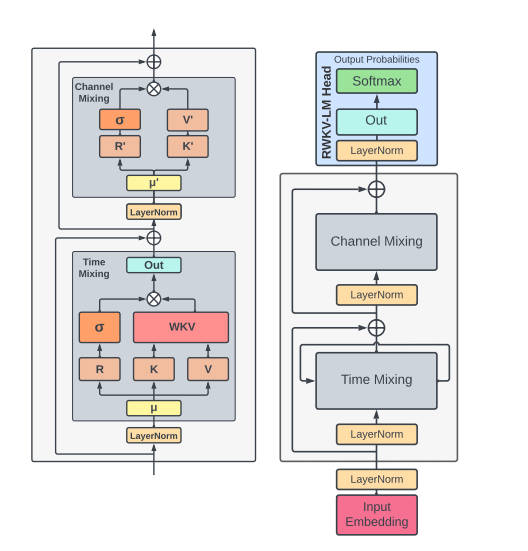
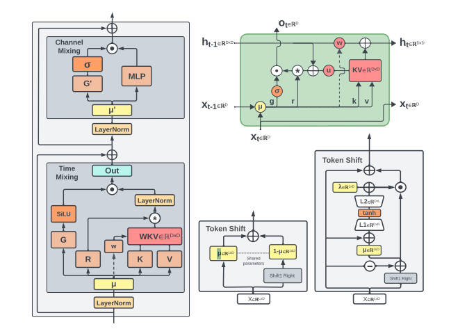
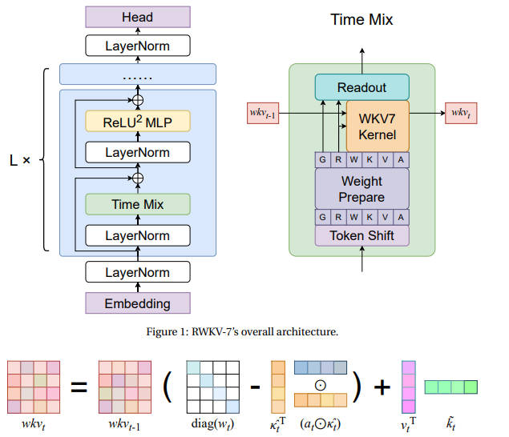
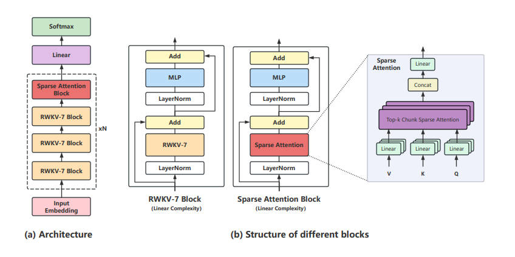
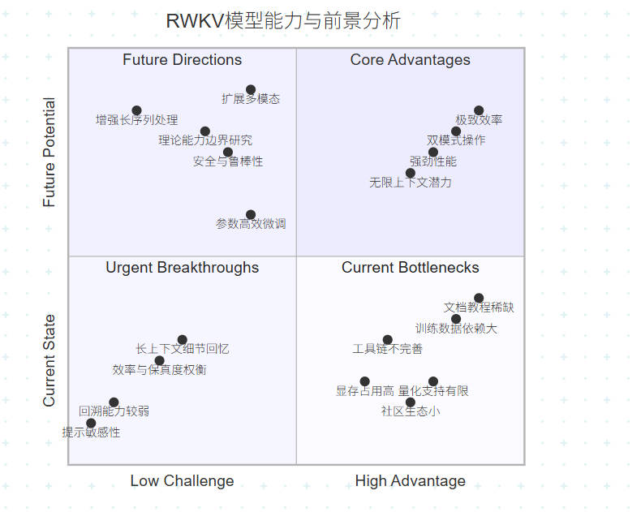

<!--Copyright © ZOMI 适用于[License](https://github.com/Infrasys-AI/AIInfra)版权许可-->

# RWKV 模型架构的深度技术分析

> Author by: 张嘉瑶

## RWKV 架构核心机制：WKV 与内部状态拟合

自注意力让 Transformer 能一次看全局，训练并行也很舒服，但代价是开销跟序列长度成平方增长 $O(L^2)$。一旦上下文拉到很长，这个成本就会蹭蹭往上走，显存、算力、费用都扛不住。这也是为什么今天大家做超长上下文，总会撞到一堵“又贵又慢”的墙。

$RWKV$ 的定位：把 RNN 和 Transformer 的好处糅在一起。$RWKV$ 就是冲着这个痛点来的。思路很直接：训练时尽量学 Transformer 的并行友好，推理时借 RNN 的线性效率省算力。它用了一种“线性注意力”的设计，让序列计算更像 O(L) 的流水线，目标是在不牺牲太多效果的前提下，把长序列的成本打下来。简单说，就是想要“训练快、推理省、上下文还长”的平衡解。

## RWKV 的核心架构原理

**RWKV(Receptance Weighted Key Value)机制解析**
名称揭示其核心组件：
*   **R(Receptance-感受态)**：向量，控制允许多少过去信息影响当前状态，充当信息门控。
*   **W(Weight-权重)**：可学习参数，包含位置相关衰减因子，对信息衰减建模至关重要。
*   **K(Key-键)**：类似传统注意力中的“键”，代表当前词元的信息。
*   **V(Value-值)**：类似传统注意力中的“值”，代表与“键”关联的信息内容。

该机制取代了 Transformer 的点积注意力，以线性方式选择性地回忆和加权过去信息。其中**R(Receptance-感受态)** 尤为关键，它是一个动态学习机制，决定新信息与旧信息的整合比例。

**第一性原理：内部模型 S 的持续拟合**

- 核心想法
  RWKV 的底层信念很朴素：模型的“内心世界”（内部状态 S）要一直去贴合“外部世界”。这有点像早期的 fast weights 思路，把 RWKV 放在了更先进的循环网络家族里。

- 把内部状态当“线性映射”
  可以把 S 理解成一个线性变换矩阵，目标是学会“从 key 到 value 的映射”。训练时，模型不断用梯度下降去微调 S，让预测出来的 value 更像真实的 value，说白了就是不停对齐外部信号的变化。

- 会“分维度”地记忆和遗忘
  在更新 S 的公式里，每个维度都有自己的“遗忘速度”（衰减率 $w_t$）和“学习速度”（学习率 $η_t$）。这意味着模型能针对不同特征，学不同的记忆时长和更新节奏：该长期记的留久一点，该短期记的过一会儿就淡掉。正因为这种“非均匀”的记忆机制，RWKV 才能在保持线性复杂度的同时，还把效果做得不错。

>一句话总结：RWKV 一边把内部状态当作可学习的线性映射去持续贴合外部，一边用“按维度自适应的记忆/遗忘”来管控信息流，从而做到又省算力、又不太掉性能。

**时间混合(Time-Mixing)模块:捕捉时间依赖性**

简单说，RWKV 模型用了一个叫“时间混合”的模块来代替 Transformer 里的“自注意力”机制。这个模块的核心是 WKV 机制，它的好处是能高效地压缩和处理历史信息，有点像线性注意力。但用了更高效的方法，它能把之前所有的信息压缩成一个固定大小的“状态”，不用每次都回顾历史所有信息，所以效率很高。同时它通过一个带“时间衰减”的公式，让靠近当前的信息权重高，远的信息权重低，来融合过去和现在的信息，下面的公式就是把这个思想数学化了，其中 $w$ 控制衰减速度，$u$ 给当前词一个额外的权重加成，其中。最后，再用一个叫“接受度”的门控信号，像开关一样调节输出多少有用的内容,而不是全盘接收。

我们可以把下面这个公式理解成一个“智能加权平均”的过程。它的核心思想是：在理解当前这个词的时候，离得近的词更重要，离得远的词重要性会衰减。

$$ wkv_{t}=\frac{\sum_{i=1}^{t-1}e^{-(t-1-i)w+k_{i}}\odot v_{i}+e^{u+k_{t}}\odot v_{t}}{\sum_{i=1}^{t-1}e^{-(t-1-i)w+k_{i}}+e^{u+k_{t}}} $$

它会根据信息的新旧程度（由 $w$ 控制）和信息本身的重要性（由 $k$ 决定），巧妙地混合过去的信息 ($v_1$ 到 $v_{t-1}$)和当前的信息 ($v_t$)，最终合成一个代表“到现在为止我都知道了什么”的总结 $wkv_t$。

**通道混合(Channel-Mixing)模块:特征优化**

在 RWKV 模型中，Token Shift 负责在时间维度上传递信息（纵向，词与词之间），而通道混合负责在特征维度上处理信息（横向，一个词内部的各个特征之间）。它们俩配合，共同替代了 Transformer 中复杂的自注意力机制，实现了既高效又能理解上下文的序列建模。

我们可以把通道混合想象成 Transformer 里的“前馈网络”。在同一个时间点上，对模型内部所有的特征通道进行信息交互和重新整合。就好像你在消化一个词的信息时，大脑里不同的区域（比如理解语义的、分析语法的、感受情绪的区域）需要立刻开个会，互相沟通一下，最终形成一个更丰富的综合理解。通道混合干的就是这个“内部开会消化”的活儿。

Token Shift，负责“传递接力棒”，目的是让信息在时间上平滑流动，这是 RWKV 一个很有特色的设计。这就像一场接力赛。当前这个词 $（x_t）$ 在起跑时，并不是从零开始，而是从上一个词 $（x_{t-1}）$ 手里接过接力棒（一部分信息）再继续跑。参数 $μ$ 就像是控制交接棒力度的手

这种方式非常简单高效，确保了模型在处理序列时拥有平滑的“记忆流”，知道刚刚发生了什么，从而更好地理解上下文。

### RWKV 核心优势的技术

**核心优势一：长文本也能又快又省**
- 效率可预测（线性复杂度）：RWKV 处理文本的开销是“匀速涨”的。文本翻一倍，时间和内存大概也就翻一倍。对比之下，Transformer 是“加速涨”，文本一长成本就爆表。
- 记忆更聚焦（状态表示）：RWKV 不用背着整包历史对话走，它只保留一个不断更新的“精简记忆包”（隐藏状态），里面都是后面推断真正需要的关键信息。

**核心优势二：训练像并行怪兽，推理像高效译员**
- 训练时（并行模式）：像超算一样，能同时看一大堆文本，学得快。
- 推理时（循环模式）：像实时翻译器，每次只看最新输入和自己的“记忆包”，马上给结果。

这套“双重模式”带来三件真好处：
- 响应速度稳：聊多久都行，每个字出来的速度都差不多，不拖泥带水。
- 资源占用小：不需要成堆历史缓存，内存用量小而且基本固定。
- 上下文理论无上限：对话可以一直续，不被长度卡脖子。

>一句话总结： RWKV 的双模式设计，把 Transformer 的“学得快”和 RNN 的“用得省”合到了一起，是个很有潜力、很接地气的架构。

### RWKV 的演进:版本逐代分析
RWKV 的发展反映了持续的迭代优化过程，每一版本都致力于解决前版的局限性或增强特定能力（如表达能力、长上下文处理）。

#### 表 1: RWKV 版本演进概要
| 版本(昵称)        | 主要架构变更/改进                                                                 | 主要关注点/显著性能提升                                                                 | 主要论文/发布信息                     |
|-------------------|-----------------------------------------------------------------------------------|-----------------------------------------------------------------------------------------|---------------------------------------|
| RWKV-4 (Foundation/Raven) | 线性注意力,时间/通道混合,R,W,K,V 机制,相对位置偏置 w 和当前位置处理 u                   | 建立高效的 RNN/Transformer 混合模型基线                                                   | arXiv:2305.13048 (EMNLP 2023)        |
| RWKV-5(Eagle)     | 多头**矩阵值状态**,**动态循环**,重构感受态,辅助门控机制,lerp 词元转移                 | 增强表达能力,提升多语言处理能力                                                         | "Eagle and Finch" arXiv:2404.05892 |
| RWKV-6(Finch)     | 数据驱动的时间混合和词元转移(ddlerp),**LoRA 动态增强**学习参数,数据依赖衰减因子 wt     | 进一步增强表达能力和自适应性,提升多语言处理能力                                         | "Eagle and Finch" arXiv:2404.05892 |
| RWKV-7(Goose)     | **广义化 Delta 法则**,向量值门控,上下文学习率,宽松值替换规则,**动态状态演化**          | 3B 规模多语言/英语 SOTA,理论能力提升(识别正则语言),增强状态追踪能力                       | "Goose" arXiv:2503.14456             |
| RWKV-X(Hybrid)    | RWKV-7 核心模块 + **稀疏注意力机制** (时间块组织:压缩粗粒度/保留细粒度/滑动窗口)      | **超长上下文优化**,64K passkey 检索近乎完美,可处理**百万级词元序列**,保持线性复杂度       | "RWKV-X" arXiv:2504.21463             |

#### RWKV-4:奠定基础

- 首发版就把路数定下来了：一层层堆残差块，里面有两个小单元——时间混合和通道混合。
- 时间混合这块用 $R/W/K/V$ 四个向量，在“循环”的套路里把自注意力那种效果给模拟出来。
- 两个关键小招：相对位置偏置 $w$，和一个专门处理“当前位置”的参数 $u$。
- 复杂度很友好：计算是 $ O(T·d)$，内存是 $O(d)$，又快又省。
- “Raven”是官方的微调版本。顺带说一句，$RWKV-4$ 系列已经停更了。

  

  
####  RWKV-5(Eagle)与 RWKV-6(Finch):增强表达能力与自适应性

- 矩阵化的状态表示：不再只是“一个向量装所有记忆”，而是改成“多头的矩阵状态”，表达更丰富，维度之间也能更好互动。
- 更灵活的循环机制：更新方式更聪明、跟输入贴得更紧。像 Finch 里，衰减因子 $w_t$ 不再是固定的，而是随数据变化。
- 时间混合和信息传递升级：Eagle 重做了“感受态”，加了辅助门控和 lerp 插值；Finch 则上了数据驱动的 ddlerp，让混合更聪明。
- Finch 加了 LoRA：用更低的成本去“加速学习、改结构”，调参更轻便。
- 规模和训练：Eagle 覆盖 460M 到 7.5B；Finch 有 1.6B 和 3.1B。都在一个超大的多语言语料（约 1.12 万亿 token）上练过。
- 表现怎么样：多语言任务上能打过 Llama-2-7B；英语这边也在稳步涨（比如 EagleX 7B v2 英语 54.95%）；RWKV-6 1.5B 在同等体量里，多语言/英语都很能打。

  

 
其中：

- 左边这块：展示了 RWKV 的两大模块——时间混合（time-mixing）和通道混合（channel-mixing）。
- 右上角：把时间混合模块当成 RNN 单元用。
- 底部中间：这是 RWKV-V5 在前向计算里用的 token-shift 小模块，负责“挪一挪”上下文信息。
- 右下角：这是 RWKV-V6 版本的 token-shift，前向里用的升级版。
- 虚线箭头：这些是 V6 才有的连接，V5 里没有。

#### RWKV-7(Goose):推进状态动态与能力边界

- 核心点子：
    - 更通用的 Delta 更新法：状态怎么改更灵活。
    - 向量级的门控：信息流精细控，想放谁进来、放多少都能调。
    - 上下文学习率：根据语境自动调“敏感度”，该快快、该稳稳。
    - 更松的值替换：更新信息更自由，不死板。

- 理论上更能打：能做状态追踪，还能识别所有正则语言，理论能力比标准 Transformer 更强。
- 规模与训练：从 1.9 亿到 29 亿参数，在 3.1 万亿多语言 token 上练过。
- 表现：
    - 2.9B 模型在同量级多语言任务上拿到 SOTA，英语也能跟顶尖打平。
    - 只用 4k 上下文训练，实际能跑到 8k～16k，外推不错。

  

#### RWKV-X:混合架构赋能超长上下文处理

- 核心想法：短距离用 RWKV-7，长距离用稀疏注意力，整体还保持接近线性复杂度。
    - 稀疏怎么做：把 token 分成时间块，既有粗粒度压缩，也保留细粒度，再加滑窗，既远观也近看。

- 解决什么痛点：补上纯 RNN（比如早期 RWKV/Mamba）在超长上下文“记不牢、理解难”的短板。
- 效率：
    - 训练 O(N)，推理每个 token O(1)。
    - 处理 128K 上下文时，比 FlashAttention v3 还快约 1.37 倍。

- 表现：
    - 在 64K 上下文的 passkey 检索几乎满分。
    - 长上下文显著优于 RWKV-7；短上下文也能跟上。
    - 能稳定解码百万级 token 的超长序列。

- 训练套路：
    1. 先做对齐预训：只训稀疏注意力，RWKV-7 冻住；
    2. 再做长上下文持续预训：拉长到比如 64K，整体微调，损失用动态权重。

- 一句话：开源社区的快迭代，是它越跑越快的关键。

  

### IV. 性能、应用与对比分析
#### A. 各版本及任务的基准性能
*   **语言模型困惑度**：RWKV-6 1.5B 优于同等规模 Mamba 和 Transformer；RWKV-5/6 表现有竞争力。
*   **长上下文任务**：
    *   RWKV-7 (2.9B)：28K 内 passkey 高准确率，超长性能下降。
    *   **RWKV-X**：64K passkey 近乎完美，可处理**百万词元**。
*   **多语言性能**：
    *   RWKV-5/6 优于 Llama-2-7B。
    *   RWKV-6 1.5B 达同规模 SOTA；RWKV-7 (2.9B)创 3B 规模新 SOTA。
*   **英语语言基准**：
    *   RWKV-5/6 初期落后 Mistral-7B，EagleX 7B v2 提升显著(Eng 54.95%)。
    *   RWKV-7 (2.9B)与 3B SOTA 持平；RWKV-X 保持短上下文强性能。
*   **通用基准**：涵盖指令遵循、数学、知识内化等 17 项测试。

RWKV-X 的**百万词元处理能力**重新定义了长上下文边界。

#### B. 主要应用领域
*   **NLG**：小说生成、聊天机器人、角色扮演、FAQ、RAG 系统。
*   **NLU**：机器翻译、文本分类、虚拟助手、PDF 查询、知识图谱。
*   **计算机视觉**：Vision-RWKV, RWKV-CLIP, VisualRWKV-7, 医学图像恢复, 3D 点云处理。
*   **时间序列分析**：临床预测、光伏预测、股价预测、通用时序模型(RWKV-TS)。
*   **其他 AI 任务**：代码补全、内容审核、强化学习(Decision-RWKV)、稀疏激活(SpikeGPT)。

**架构进步与大规模数据集（如 RWKV World v2, 3.1 万亿多语言语料）共生**。

#### C. RWKV 与 Transformer:效率与能力的正面对比

**表 2: RWKV 与标准 Transformer 对比概览**

| 特性                          | RWKV (通用, RWKV-X 特性已注明)                             | 标准 Transformer (Vaswani et al.)               |
|-------------------------------|----------------------------------------------------------|-----------------------------------------------|
| **核心机制**                  | 时间/通道混合(R,W,K,V); RWKV-X 含稀疏注意力               | 自注意力 + FFN                                |
| **计算复杂度(训练)**          | 线性 O(N·d²) 或类似                                      | 二次 O(N²·d)                                  |
| **计算复杂度(每词元推理)**    | 线性 O(d²) (状态更新)                                    | 依赖上下文 O(N·d) (完整注意力)                |
| **内存复杂度(生成式推理)**    | 恒定 O(d) 或 O(d²) (存储状态)                            | 线性 O(N·d) (KV 缓存)                          |
| **上下文长度扩展性**          | 线性扩展, **理论上无限** (RWKV-X 达**百万级**)             | 二次扩展, 受限                               |
| **并行训练能力**              | 是 (时间并行模式)                                        | 是                                            |
| **推理模式**                  | 循环/串行                                                | 对完整上下文并行                              |
| **回溯能力**                  | 通过状态实现, 可能受限; **RWKV-X 增强**                   | 直接访问所有词元                             |
| **极长序列适用性**            | **高** (尤其 RWKV-X)                                     | 极具挑战性                                    |

RWKV 在多语言环境和长上下文处理（尤其 RWKV-X）展现出**战略领先潜力**。

###  优势、局限性与未来展望
好的，最后我们在来总结一下。RWKV 这个模型，就像一个天赋异禀但还有点小个性的年轻人，它的优缺点都非常鲜明。

它的优势相当硬核： 核心就一个字——“省”。它消耗的计算资源特别少，处理长文本的效率比 Transformer 模型能高出 10 到 100 倍，而且文本越长，这个效率优势越明显。更厉害的是，它在如此节省的情况下，性能一点也不差，最新版本在英语和多语言任务上的表现已经能媲美顶尖模型了。它最大的梦想就是拥有“无限内存”，最新的 RWKV-X 版本真的能处理长达百万词的文本，堪称“过目不忘”。

不过，它也有些小毛病和局限： 它有时会“小脾气”，你提问的方式稍微一变，它的回答可能就差很远。它的“记性”是线性的，擅长记住前后顺序，但如果你突然让它回溯很久以前的一个小细节，它可能就有点吃力了。在面对需要复杂空间推理或者处理知识图谱中特别冷门的信息时，它也会犯糊涂。所以，它的“无限内存”在真正用起来时，还需要一些技巧来避免它遗忘或记混信息。

那它的未来会怎样呢？ 研究人员正在想办法帮它改掉小毛病，让它变得更稳重、更聪明。同时，也在努力让它从“语言天才”变成“全能 ACE”，争取能看懂图片、听懂声音。还有一个重点就是为它量身定做更高效的“微调”工具，让它能快速适应各种具体任务。

总而言之， RWKV 可不是一个普通的模型，它巧妙地融合了两种经典模型的优点，成了一个在效率上极具诱惑力的替代方案。尤其在需要处理长文本、又希望节省资源的场景下，它几乎是不二之选。它的开源和社区驱动模式，也让它成为了推动 AI 技术更加平民化、可持续化的一股重要力量。

  

### 参考文献
1. Peng, B., Alcaide, E., Anthony, Q., et al. (2023). RWKV: Reinventing RNNs for the Transformer Era. arXiv:2305.13048.
2. Peng, B., Goldstein, J., Alcaide, E., et al. (2024). Eagle and Finch: RWKV with Matrix-Valued States and Dynamic Recurrence. arXiv:2404.05892.
3. Peng, B., Zhang, D., Goldstein, J., et al. (2025). Goose: A Recurrent Model with Vector-Valued Gates and Delta Rule-based State Updates. arXiv:2503.14456.
4. Lin, Y., Zhu, Z., Zhang, D., et al. (2025). RWKV-X: Beyond the Quadratic Barrier in Language Modeling with Hybrid RNN-Attention Architecture. arXiv:2504.21463.
5. Vaswani, A., Shazeer, N., Parmar, N., et al. (2017). Attention Is All You Need. Advances in Neural Information Processing Systems, 30.
6. Gu, A., & Dao, T. (2023). Mamba: Linear-Time Sequence Modeling with Selective State Spaces. arXiv:2312.00752.
7. Team, R. (2024). RWKV World v2: A 3.1 Trillion Token Multilingual Corpus. RWKV Project Documentation.
8. Su, J. (2021). RoFormer: Enhanced Transformer with Rotary Position Embedding. arXiv:2104.09864.
