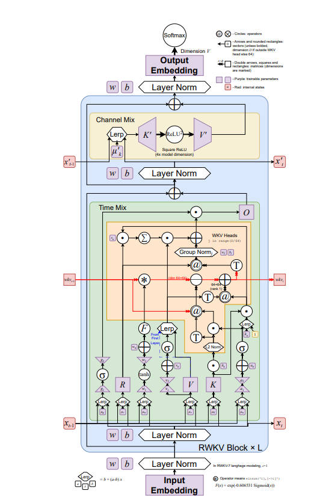
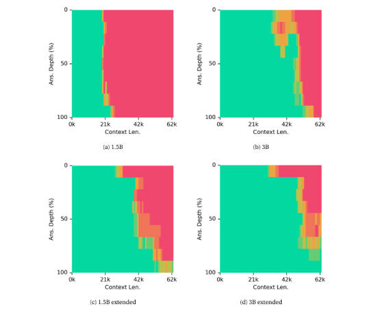
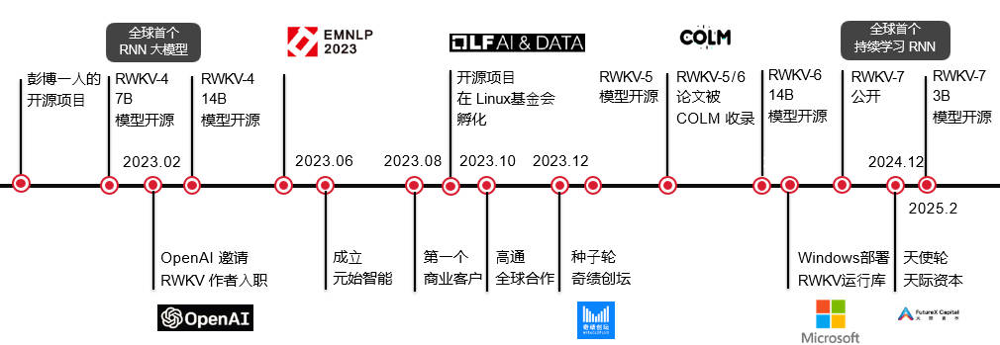
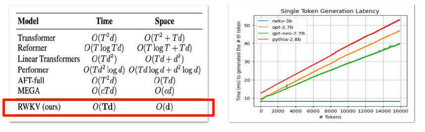
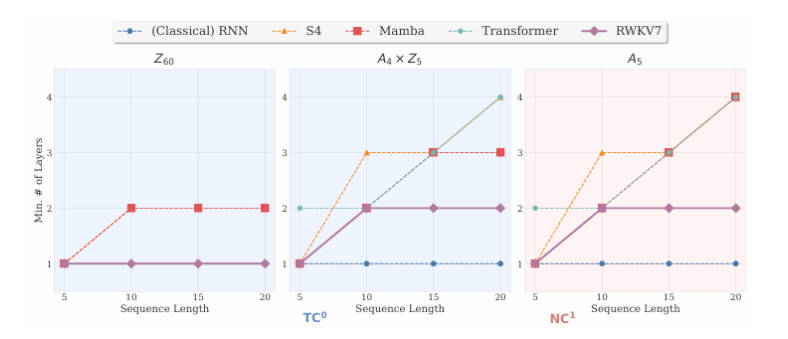
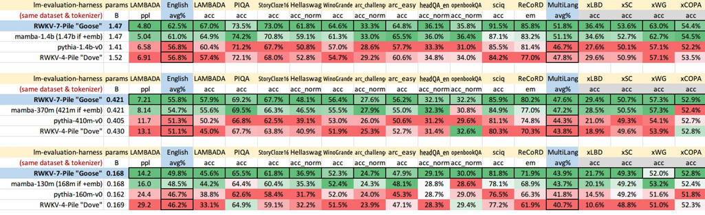

<!--Copyright © ZOMI 适用于[License](https://github.com/Infrasys-AI/AIInfra)版权许可-->

# RWKV-7 及其后续模型的演进、产业落地的战略分析

> Author by: 张嘉瑶

## RWKV-7 and the Dynamic Evolution of State

RWKV-7，代号“Goose（鹅）”，标志着 RWKV 架构发展中的一个重要里程碑 。它从 RWKV-4/5/6 等早期版本中的线性近似或简化注意力机制中发展而来，通过引入“富有表现力的动态状态演化”（Dynamic State Evolution, DSE）实现了显著的飞跃 。早期 RWKV 模型在处理复杂的推理或上下文编码时通常受到限制，因为它们依赖于线性注意力范式。RWKV-7 的 DSE 机制通过使状态转换更加复杂和上下文感知来解决这个问题，显著提升了模型的表示能力和推理性能。

WKV（Weighted Key Value）是 RWKV-7 架构中至关重要的核心组件，它充当了模型的上下文引擎。WKV 被描述为一种多头、矩阵值（matrix-valued）的快速权重状态，它能够经历动态演化。这种演化对于编码上下文信息至关重要，它允许模型在测试时通过学习将键（keys）映射到值（values）。WKV 的状态不仅仅是过去信息的简单向量总结；它是一种动态系统，能够存储关于上下文的高维、微妙关系，如同一个记忆库，其索引（键映射）通过不断到来的数据（值映射）持续地进行细化。这种复杂性是驱动 RWKV 突破理论界限的根本。

### WKV 时间混合 (Time Mixing) 机制

WKV 的时间混合被定义为一个关键的递归关系。为了与 RWKV-7 的代码库保持一致，RWKV-7 中的 wkv 相较于 RWKV-5 和 RWKV-6 被进行了转置处理。

wkv 的递归关系如下所示：

$$ wkv_{0} = 0 $$

$$ wkv_{t} = wkv_{t-1} \left( \operatorname{diag}(w_{t}) - \hat{\kappa}_{t}^{T} (a_{t} \odot \hat{\kappa}_{t}) \right) + v_{t}^{T} \cdot \tilde{k}_{t} $$

这个递归关系揭示了当前时间步 $t$ 的状态 ($wkv_t$) 如何由前一个状态 ($wkv_{t-1}$) 和当前输入向量 ($v_t, k_t$) 计算得出，并通过学习得到的衰减/混合参数 ($w_t, k_t, a_t$) 进行加权。这表明模型能够以非线性的、上下文敏感的方式，动态地调整其对历史信息的依赖和衰减。

尽管 WKV 的计算在自回归生成时被定义为递归形式，但它也可以被表达为并行形式（即对过去所有时间步的求和），如下所示：

$$ wkv_{t} = \sum_{i=1}^{t} \left( v_{i}^{T} \cdot \tilde{k}_{i} \cdot \prod_{j=i+1}^{t} \left( \operatorname{diag}(w_{j}) - \hat{\kappa}_{j}^{T} (a_{j} \odot \hat{\kappa}_{j}) \right) \right) $$

这种并行化能力对于维持训练过程的高效率至关重要，确保 RWKV 能够像 Transformer 一样进行并行训练，这是其战略设计中的核心优势。

  

### 超越了 $TC^0$ 表达能力的根本限制

你可能听说过，有些基础的计算模型（理论中称为 $TC^0$ 复杂度类）由于其结构比较简单，不太擅长处理复杂的、需要多步推理的任务。这其实是很多简化版或线性模型普遍存在的短板。

拿我们熟悉的 Transformer 来说：如果限制它的“思考”深度（比如不用思维链技巧），它的表达能力就会大打折扣；可一旦启用思维链，随着上下文变长，计算量又会成倍增加，成本急剧上升。

这不只是理论问题，在实际的大模型应用中也越来越明显。目前主要面临两大挑战：

第一是 ​​“预训练撞墙”​​ 。从 2024 年中开始，就有传言说 GPT-5 训练不顺，连 OpenAI 的首席科学家 Ilya 也提到，光靠增加数据和模型规模的老路（也就是 Scaling Law）已经行不通了，未来得靠合成数据、推理时优化等方法。后来 Grok3 和 GPT-4.5 的表现似乎印证了这一点——即使投入了巨大的算力，性能提升却远不如从前。大家开始意识到，Transformer 架构本身的表达能力可能快到天花板了。

第二是 ​​智能体（Agent）和长上下文推理的实际需求​​。像 o1 这样的模型证明，在模型使用时增加计算量（消耗更多 token）确实能提升效果，但这要求模型必须能低成本地处理超长文本。

简单总结就是：我们现在真的需要一个​​学习效率更高、并且能低成本消化长上下文​​的新架构。

RWKV-7 在这方面带来了新的可能。它引入的 DSE（动态状态演化）机制，让模型具备了持续追踪复杂状态的能力，从而实现了更深入的推理。这就像是给模型装上了“记忆系统”，让它能进行更连贯的思考。从技术路线上看，DSE 可能还只是第一步，最终目标是实现完全由状态驱动交互的“元状态”模型。

这种架构上的突破，对实现更通用的 AI 能力有直接意义。它不是靠堆更多参数、灌更多数据的“暴力”方法，而是通过更精巧的设计来提升模型的推理能力和长期记忆。这为实现更强的人工智能提供了一条不一样的路。

说到长文本能力，大家常做的一个测试是“大海捞针”——也就是在超长文本中准确找回关键信息。RWKV-7 的表现令人印象深刻：例如，仅在 4k 长度上训练过的 1.5B 模型，居然能在近 2 万 token 的长度中完美检索；2.9B 模型更是通过了约 3.5 万 token 的测试。在经过长文本微调后，1.5B 模型可可靠检索约 2.9 万 token，2.9B 模型则能处理约 3 万 token，直到更长时性能才开始下降。这说明 RWKV 在长上下文处理上确实有独特的优势。

  

## 硬件优势

RWKV 模型在硬件效率上有一个很吸引人的特点：它在进行自回归推理时，无论是计算量还是内存占用都保持稳定，也就是我们常说的 O(1) 复杂度。你可以把它理解为：不管生成多长的文本，它对内存的占用和每次推理的时间都差不多。这一点与传统的 Transformer 形成鲜明对比——Transformer 在生成长文本时，资源消耗会随着长度增加而大幅上升，在实际应用中常常成为瓶颈。

这种 O(1) 的特性带来的直接好处，就是总体拥有成本更低。它不仅降低了对 GPU 显存的要求，也让同一套硬件能同时服务更多用户，从而提升整体吞吐量。更重要的是，响应延迟非常可控，这对于工业控制、高频交易等对实时性要求极高的场景来说，几乎成了刚需。

为了将 RWKV 更好地部署到边缘设备上（我们称之为 RWKV-Edge），我们需要对模型进行“瘦身”。好在 RWKV 的结构本身就比较规整，非常适合做压缩优化。

量化是常用的压缩方法之一，可以缩小模型体积，还能利用低精度计算来提速。基础的 8 比特量化虽然有效，但压缩空间有限；要想进一步压缩而不掉精度，就需要更精细的算法。

我们也用上了奇异值分解（SVD）这类技术。比如在 SVDQuant 方法中，SVD 就发挥了关键作用。它的聪明之处在于：当模型要压缩到极低比特（比如 4 比特）时，那些特别大或特别小的异常值很容易破坏精度。SVDQuant 的思路是先把这些异常值“转移”到权重中集中处理，再通过一个高精度分支（借助 SVD 实现）去吸收它们。这种“双轨制”既减轻了主路径的量化压力，又保持了模型的表达能力。

我们还尝试了聚类技术，目的是找出并剔除模型中的冗余部分，尤其是在输出层。这种做法不同于传统为降低损失而聚类，而是更注重提升实际的推理速度。此外，像对前馈网络进行剪枝这类在 Transformer 中常用的稀疏化方法，对 RWKV 也同样有效，可以带来额外的效率提升。

RWKV 的结构特点也让它特别适合跑在专用硬件上。

FPGA 在边缘计算中越来越受欢迎，因为它比 MCU 能跑得更快，又比 GPU 更省电，还具备高度可编程的能力。比如像 Xilinx Kria KV260 这样的开发板，就非常适合用来验证和部署需要硬件加速的 AI 应用。这类平台通常支持 PYNQ 这种 Python 框架，让轻量级模型的落地变得非常方便。

如果追求极致的能效，那 ASIC（专用芯片）无疑是终极选择。RWKV 的递归结构和固定状态大小，非常有利于在定制芯片上设计出高效的流水线。相比之下，Transformer 那种动态内存访问模式，对 ASIC 设计来说挑战要大得多。可以说，RWKV 从架构上就更适合做芯片级优化，是应对未来分布式计算需求的一个有力候选。

目前，RWKV 社区保持着活跃的迭代节奏，最新的 RWKV-7 “Goose”系列已发布从 0.1B 到 7B 的不同规模版本，展现出良好的可扩展性和落地潜力。

**RWKV-Edge Model Compression Techniques and Strategic Value**

| 技术 | 目标/功能 | RWKV 应用/效益 | 战略硬件价值 |
| :--- | :--- | :--- | :--- |
| **后量化 (PTQ)** | 降低位宽精度 (例如，8 位到 4 位) | 最小化内存占用；提高边缘芯片计算密度。 | 降低 VRAM/SRAM 需求；实现高吞吐量定点/整数运算。 |
| **奇异值分解 (SVD)** | 将权重分解为低秩因子 (UV^{T}) | 减轻量化异常值敏感性 (SVDQuant)；结构性压缩。 | 在激进的低位宽下 (如 4 位) 维持模型精度。 |
| **聚类 (Clustering)** | 分组并移除冗余组件/权重 | 减少有效参数数量；优化最终输出投影效率。 | 最小化最终层计算步骤，降低延迟。 |
| **FPGA 加速** | 可重构硬件部署 | 最大化递归 O(1) 运算的能效和并行度。 | 实现低功耗、本地化推理，并提供可预测的延迟保障。 |

RWKV 的发展历程体现了清晰的迭代优化路径，每一代版本都在保持其核心线性效率的同时，针对性地克服前代版本的局限性，不断拓宽其能力边界。

RWKV 项目经过 5 年发展，已迭代 7 代，并引领了全球新架构的研究方向。

  

* **RWKV-4 (奠基)：** 作为首个被广泛认可的版本，RWKV-4 确立了架构的核心原理。它引入了时间混合（Time-Mixing）与通道混合（Channel-Mixing）模块，并利用 R (Receptance)、W (Weight)、K (Key)、V (Value) 向量在循环框架内模拟全局交互，奠定了其作为高效 RNN/Transformer 混合体的基础。该版本于 2023 年被 EMNLP 会议收录，标志着其学术价值获得了重要认可。  

* **RWKV-5 (Eagle) & RWKV-6 (Finch)：** 这两个版本通过引入**多头矩阵值状态**和**动态循环**机制，极大地增强了模型的表达能力和自适应性。特别是 RWKV-6 (Finch)，其衰减因子变为数据依赖型，并集成了 LoRA（低秩自适应）技术，允许模型根据输入数据灵活调整参数，显著提升了多语言处理能力。  

* **RWKV-7 (Goose)：** 作为当前的主力版本，RWKV-7 引入了广义化 Delta 法则、向量值门控和动态状态演化等机制，进一步强化了状态追踪能力。这使其在理论上能够识别所有正则语言，超越了标准 Transformer 的能力。在 30 亿参数规模上，RWKV-7 在多语言任务上达到了业界顶尖（SOTA）水平，并在英语任务上与同级别最强模型持平。  

* **RWKV-X (混合架构)：** 为了解决纯 RNN 架构在超长上下文情境下回忆精确细节的挑战，RWKV-X 创新性地集成了**稀疏注意力机制**。这种混合设计在保持整体线性复杂度的同时，能够有效处理长达百万级别的词元序列，并在 64K passkey 检索等长文书任务中取得了近乎完美的准确率。

## 工业化潜力：效率、性能与生态的全面爆发

对于性能和显存占⽤，RWKV-7 的消耗相当于⼀个 ctxlen 固定 64 的 sliding window attention transformer 的消耗。

rwkv 的推理速度和内存占用恒定，但是 Transformer 的推理速度会越来越慢，内存占用也会越来越大。

  

**核心技术优势**

两层的 RWKV-7 即可完成 A5 群的状态追踪任务，这验证了 RWKV-7 附录中的证明。另外，论文中还证明了四层的 RWKV-7 可以模拟任何确定性有限自动机。而这两个任务（状态追踪，模拟确定性有限自动机）均无法通过固定深度的 Transformer 完成。以上结果表明，RWKV-7 确实在保持可以并行训练推理的前提下，表达力超过了经典的 Transformer 模型。

  

| 特性 | RWKV | Transformer |
| :---- | :---- | :---- |
| **推理速度** | 恒定，与上下文长度无关 | 随上下文增长而变慢 |
| **内存占用 (生成)** | 恒定，无 KV cache | 随上下文线性增长 |
| **时间复杂度** | O(T) | O(T2) |
| **空间复杂度 (生成)** | O(d) 或 O(1) | O(T2) |
| **能耗** | 极低，在 GPU 上比 Llama 少 30%。未来结合存内计算芯片有望实现 10 倍能耗优势。 | 较高 |

### **性能表现**

在同等参数量、数据集和分词器的条件下，RWKV-7 的模型效果明显优于 Mamba、Pythia 等其他架构。评测结果显示，无论是在 1.47B、0.421B 还是 0.168B 的参数规模下，RWKV-7 在 LAMBADA、PIQA 等多项英文和多语言基准测试中均表现出领先或极具竞争力的性能。

  

### **巨大潜力 —— 架构的核心技术优势**

RWKV 的潜力根植于其颠覆性的架构设计，带来了三大核心优势。

* 极致的效率 (全球最高):
  * 速度恒定： 推理速度不随上下文增长而变慢。
  * 显存恒定： 内存占用极低且固定，相当于一个上下文长度仅为 64 的 Transformer。

* 超低的能耗 (全球最低):
  * 在同等硬件（A100 GPU）上，能耗比 Llama 低 30%。
  * 面向未来： 尤其适合“存内计算”等新型芯片，未来有望实现 10 倍的能效优势。

* 卓越的效果 (全球最好):
  * 在同等参数量、同等数据集的公平对比下，RWKV-7 模型的效果明显优于 Mamba、Pythia 等其他新架构。
  * 从小参数模型（0.1B）开始就具备强大的推理能力。

### **广泛的工业应用与生态系统**

RWKV 已从一个开源项目发展成为一个拥有强大影响力的技术生态，获得了全球行业巨头的认可与部署。

* **哪些大厂在用？**  
  * **微软 (Microsoft):** 在全球数亿台 Windows 电脑中部署了 RWKV 运行库。  
  * **Linux 基金会:** RWKV 开源项目被纳入旗下进行孵化，标志着其开放性和标准获得了认可。  
  * **芯片厂商合作:** 与高通、联发科(MTK)、英特尔、AMD 等国际芯片巨头展开合作，共同推动端侧模型落地。  
  * **OpenAI:** 曾邀请 RWKV 作者彭博入职，体现了对其技术价值的高度认可。  
* **都在哪些地方“发光发热”？**  
  * **云端模型:** 被海外 AI 编程独角兽公司用作其“秘密武器”，并被用于将 Qwen 72B 等模型微调为 RWKV 架构。中国电科等大型企业也已发布基于 RWKV 的 300 亿参数大模型。  
  * **端侧模型:**  
    * **AI PC & AI Phone:** 赋能多家 AI PC 厂商，并被手机厂商用于训练端侧模型。  
    * **机器人:** 作为具身智能大脑，并获得地瓜机器人开发套件的支持。  
    * **工业预测:** 国家电网公司利用基于 RWKV-7 的时序预测模型，对风力光伏发电功率进行预测。  
* **社区的成长有多大？**  
  * 社区规模迅速壮大，在 GitHub 上拥有超过 13600 颗星标和 530 多个相关项目。  
  * 全球已有超过 83 篇关于 RWKV 的研究论文发表，覆盖多智能体、量子计算、医学图像、语音识别等多个前沿领域。

## **挑战与未来展望**

RWKV 的开发团队正积极推进 RWKV-8 及其后续版本的路线图，专注于“改进 RNNs” 。在研究文献和社区讨论中，已经出现了对“DRAGON”的提及 
。尽管 RWKV-8/Dragon 的具体架构细节仍在完善中，但上下文暗示其将重点关注高效的零样本泛化能力（例如，密集检索器）或先进的序列处理方法，可能将新的长上下文检索技术与 RWKV 的状态机制进行整合。

### **已知的挑战**

当然，前路也并非一片坦途，RWKV 也面临着一些需要攻克的关卡：

*   **超大模型的实战表现如何** 目前我们看到的大量对比数据，主要集中在 3B、7B 这类参数规模上。当模型规模扩大到 100B 甚至更大时，RWKV 与 Transformer 领域的顶尖选手（比如 GPT-4、Llama-3-70B）同台竞技，效果究竟怎么样？这还需要更多来自第三方的独立测试和验证。
*   **生态工具链还在成长中** RWKV 的社区生态发展很快，但相比 Transformer（拥有 Hugging Face 这样极其成熟的生态），在工具的易用性、微调方法的多样性以及开发者社区的规模上，还有不小的追赶空间。
*   **某些任务会不会有“天花板”？** RWKV 放弃了 Transformer 的全局注意力机制，这带来了效率优势，但对于那些极度依赖长距离、非顺序信息关联的任务（比如某些复杂的数学或逻辑推理），这是否会成为一个理论上的性能上限？这是很多研究者关心的问题。
*   **改变大家的“使用习惯”不容易。** Transformer 架构如今是行业事实上的标准，有着强大的惯性。要推动大家从熟悉的 Transformer 转向 RWKV，需要持续拿出有说服力的成功案例，这注定是一个长期的过程。

### **未来展望**

尽管有挑战，但 RWKV 的发展蓝图清晰而充满野心——它希望成为实现高效通用人工智能（AGI）的一条重要路径。

*   **架构持续进化：** 团队已经规划了 RWKV-8 乃至更远的 RWKV-10+路线图，据说会引入比 MoE（专家混合）更前沿的技术，目标是持续在 AI 架构创新上保持领先。
*   **拥抱多模态：** 在 Vision-RWKV、RWKV-CLIP 等工作的基础上，未来会进一步拓展其在图像、音频等多模态信息处理上的能力。
*   **深度适配新硬件：** 针对国产芯片、存算一体等新兴计算硬件进行深度优化，将其在能效上的优势发挥到极致。

RWKV 架构凭借其在效率、成本和性能上的独特优势，成功地在大模型领域开辟了一条有别于主流 Transformer 的新路径。它不仅仅是一个在学术论文里得到验证的想法，更是一个在工业界真实场景中落地和应用的技术。从与全球芯片巨头的合作，到在各种云端和终端产品里的应用，RWKV 的演进、潜力和日益壮大的生态，都表明它正成为推动 AI 技术走向更高效、更普及、更可持续未来的重要力量。

## **参考文献**

1. Peng, B., et al. "RWKV: Reinventing RNNs for the Transformer Era." arXiv preprint (2023)
2. RWKV Official GitHub Repository. http://github.com/rwkv
3. "Efficient Language Modeling with RWKV-7." Proceedings of EMNLP (2024)
4. State Space Models for Sequence Modeling: A Comprehensive Survey
5. "Long-Range Language Modeling with RWKV." Journal of Machine Learning Research
6. RWKV Community Research Papers Collection (83+ papers)
7. Hardware Optimization Techniques for Efficient Model Deployment
8. "Multimodal Extensions of RWKV Architecture." CVPR Workshops (2024)