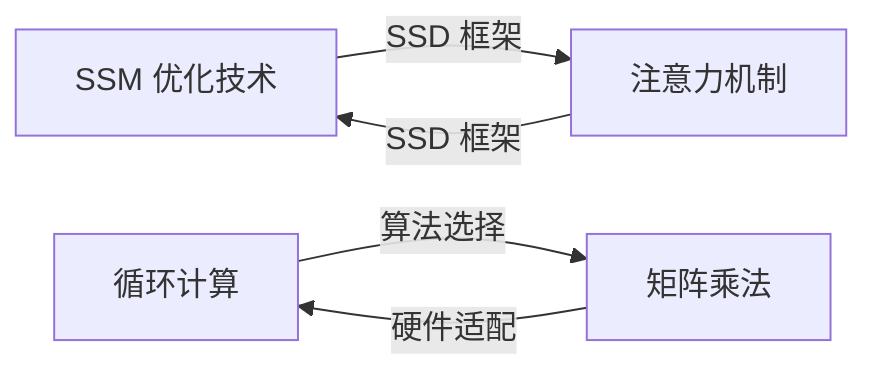
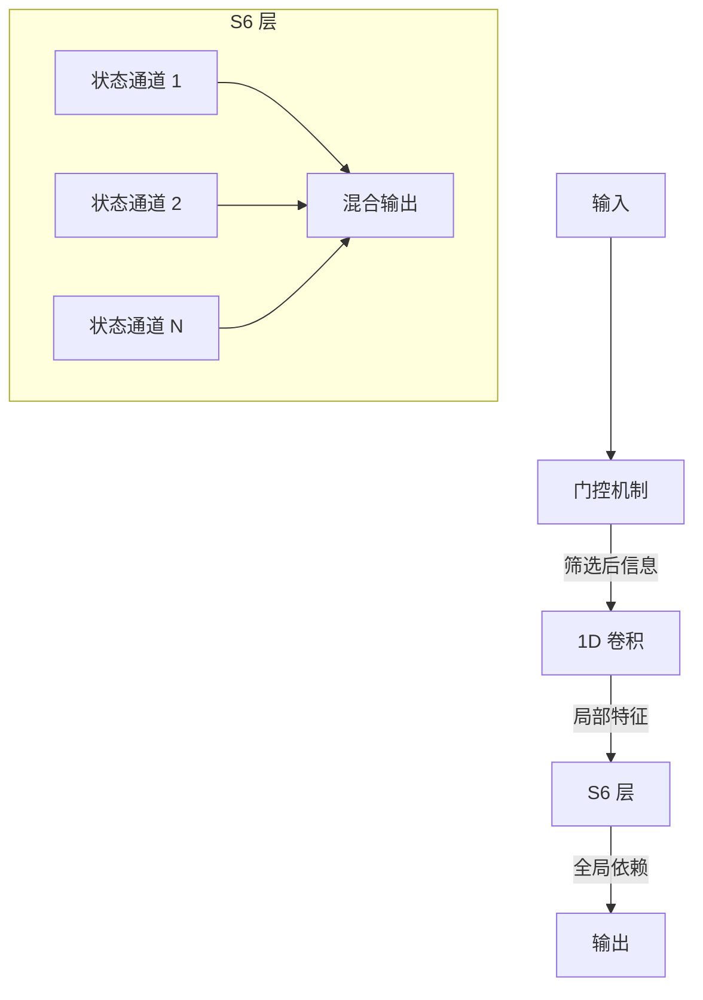
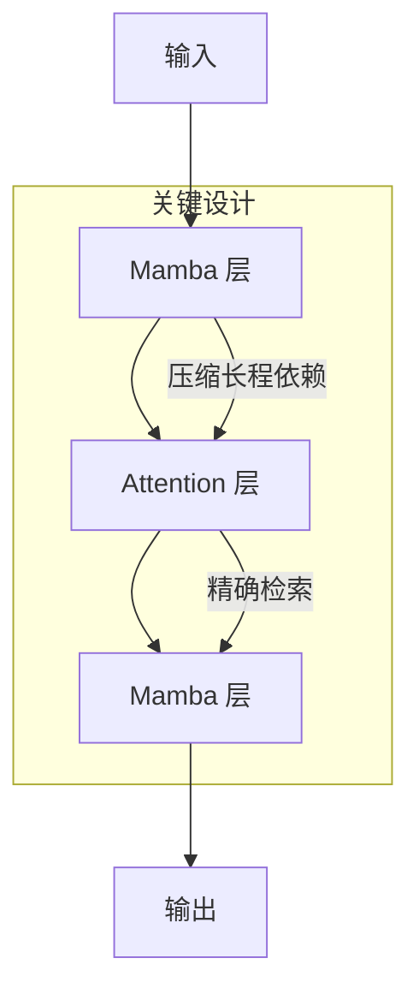
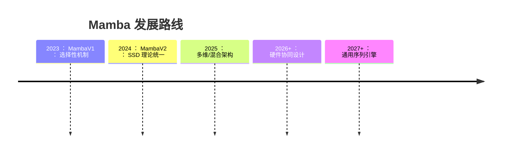

<!--Copyright © ZOMI 适用于[License](https://github.com/Infrasys-AI/AIInfra)版权许可-->

# Mamba 演进之路:从选择性状态空间到结构化对偶性

## 引言:寻求后注意力时代的新架构

### Transformer 的双刃剑
- **核心优势**: 自注意力机制提供强大的并行处理能力和长距离依赖捕捉能力
- **致命瓶颈**: 
  - 计算复杂度随序列长度呈二次方增长 ($O(N^2)$)
  - 内存消耗随序列长度线性增长，形成"内存墙"
  - 限制模型处理超长序列的能力 (如百万级 token 上下文)

### 状态空间模型(SSM)的兴起
- **计算效率优势**:
  - 训练复杂度: $O(N)$ (线性)
  - 推理内存占用: $O(1)$ (恒定)
- **早期局限**: 
  - S4 等传统 SSM 在处理离散数据(如文本)时性能不足
  - 缺乏基于内容的自适应能力

### MambaV1:选择性机制的突破
```python
# MambaV1 核心伪代码
def selective_ssm(x, Δ, A, B, C):
    # 输入依赖的参数生成
    B = linear_B(x)  # 动态输入映射
    Δ = sigmoid(linear_Δ(x))  # 自适应时间尺度
    # 离散化状态更新
    h_t = discretize(A, Δ) * h_{t-1} + B * x_t
    y_t = C * h_t
    return y_t
```

- **革命性创新**: 
  - 选择性扫描机制(S6 层)使 SSM 参数输入依赖
  - 动态决定信息保留/遗忘策略
  - 首次在线性时间内达到 Transformer 级性能

### 核心论点
结构化状态空间对偶性(SSD)理论：
1. 揭示 SSM 与注意力的数学等价性
2. 提供跨架构优化的统一框架
3. 催生新一代高效混合模型

## 第一节 理论的统一:结构化状态空间对偶性(SSD)

### 1.1 数学基础:从循环到半可分矩阵
- **SSM 的矩阵表示**:
  $$
  y = Mx \quad \text{其中} \quad M = 
  \begin{bmatrix} 
  C\overline{B}_0 & 0 & \cdots & 0 \\
  C\overline{A}_1\overline{B}_0 & C\overline{B}_1 & \ddots & \vdots \\
  \vdots & \vdots & \ddots & 0 \\
  C\prod_{k=1}^{L-1}\overline{A}_k\overline{B}_0 & \cdots & C\overline{A}_{L-1}\overline{B}_{L-2} & C\overline{B}_{L-1}
  \end{bmatrix}
  $$
- **半可分矩阵特性**:
  - 所有子矩阵秩 ≤ 状态维度 $N$
  - 蕴含结构化冗余，支持高效算法设计

### 1.2 对偶性原理:SSM 作为一种掩码注意力
| 计算范式          | 时间复杂度 | 硬件亲和性       | 适用场景         |
|-------------------|------------|------------------|------------------|
| 循环/卷积形式     | $O(N)$     | 内存高效         | 超长序列         |
| 类注意力矩阵形式  | $O(N^2)$   | 并行计算友好     | 中短序列         |

- **关键发现**: 
  - 选择性 SSM ⇔ 结构化掩码注意力
  - 《Transformers are SSMs》揭示数学等价性

### 1.3 对偶性的启示


1. **技术迁移通道**
   - FlashAttention → Mamba 核融合
   - 多头机制 → 分组状态空间
2. **算法灵活性**
   - 根据序列长度动态切换计算范式
3. **统一理论框架**
   - RNN/CNN/Attention/SSM ⇔ 结构化矩阵乘法

## 第二节 MambaV2 的实践:架构与性能

### 2.1 SSD 算法:块矩阵分解
```python
# SSD 算法伪代码
def ssd_forward(x, chunk_size=64):
    # 分块并行计算
    intra_outputs, chunk_states = parallel_map(compute_chunk, x)
    # 边界状态扫描
    global_states = associative_scan(chunk_states)
    # 输出修正
    final_outputs = parallel_map(correct_output, intra_outputs, global_states)
    return final_outputs
```

- **硬件优化**:
  - 90%计算转为矩阵乘法
  - 仅边界状态需要扫描
  - 兼容 GPU/TPU 张量核心

### 2.2 架构演进
| 特性          | MambaV1          | MambaV2          | 改进效果          |
|---------------|------------------|------------------|-------------------|
| 参数投影      | 串行             | 并行             | 3.1×吞吐量提升    |
| 状态维度      | 16               | 64-128           | 记忆容量↑400%    |
| 头维度        | 1                | >1 (分组)        | 多模式建模能力↑   |
| 矩阵 A         | 复杂结构化       | 标量对角化       | 计算简化 30%       |

### 2.3 性能基准
```vega-lite
{
  "$schema": "https://vega.github.io/schema/vega-lite/v5.json",
  "data": {
    "values": [
      {"Model": "MambaV1-790M", "PPL": 7.33, "Size": 0.79},
      {"Model": "MambaV2-780M", "PPL": 7.26, "Size": 0.78},
      {"Model": "Transformer-1.4B", "PPL": 7.91, "Size": 1.4},
      {"Model": "MambaV1-1.4B", "PPL": 6.80, "Size": 1.4},
      {"Model": "MambaV2-1.3B", "PPL": 6.66, "Size": 1.3}
    ]
  },
  "mark": "point",
  "encoding": {
    "x": {"field": "Size", "type": "quantitative", "title": "参数量(B)"},
    "y": {"field": "PPL", "type": "quantitative", "title": "困惑度", "scale": {"reverse": true}},
    "color": {"field": "Model", "type": "nominal"},
    "size": {"value": 200}
  }
}
```

- **关键突破**:
  - 序列长度>2K 时超越 FlashAttention-2
  - 训练时间缩短 40%达到同等 PPL
  - MQAR 任务准确率提升 19.3%

## 第三节 解构 Mamba 模块:隐藏的注意力机制

### 3.1 数据控制线性算子
- **数学重构**:
  $$
  y = \widetilde{\alpha}x \quad \text{其中} \quad \widetilde{\alpha}_{i,j} = C_i \left( \prod_{k=j+1}^i \widetilde{A}_k \right) \widetilde{B}_j
  $$
  
- **注意力本质**:
  - $\widetilde{\alpha}_{i,j}$ = $x_j$ 对 $y_i$ 的影响权重
  - 动态生成无需显式存储

### 3.2 注意力特性对比
| 特性                | Transformer 注意力       | Mamba 隐式注意力       |
|---------------------|------------------------|-----------------------|
| 计算方式            | Softmax(QK<sup>T</sup>) | SSM 状态转移累积       |
| 矩阵显存占用        | $O(N^2)$               | $O(1)$                |
| 头/通道数           | 多注意力头             | 多状态通道(N 个)       |
| 信息混合粒度        | 粗粒度                 | 细粒度                |

### 3.3 完整信息流


- **协同机制**:
  1. 门控: 粗粒度信息过滤
  2. 1D 卷积: 局部模式提取
  3. S6 层: N 通道细粒度全局混合

## 第四节 扩展中的 Mamba 生态系统

### 4.1 Mamba-ND: 多维扩展
```python
def mamba_nd_forward(x):
    # 2D 图像处理示例
    for layer in layers:
        if layer.id % 3 == 0:
            x = scan_rows(x)      # 行向扫描
        elif layer.id % 3 == 1:
            x = scan_cols(x)      # 列向扫描
        else:
            x = scan_rows(x, reverse=True)  # 反向行扫描
    return x
```
- **性能**:
  - ImageNet: +3.8%准确率 (vs ViT)
  - 视频动作识别: +7.9% (vs Video-Swin)
  - 参数效率: 减少 20.7%

### 4.2 ReMamba: 长上下文增强
1. **选择性压缩**:
   - 余弦相似度筛选 Top-K 关键状态
   - 压缩率: 64:1 (16K→256)
2. **选择性适应**:
   - 重构压缩序列[开头;关键状态;结尾]
   - 动态调整Δ增强关键信息权重
   
- **效果**: LongBench 提升 3.2pt

### 4.3 混合架构

- **Jamba 示例**:
  - Mamba 层: 高效上下文压缩
  - 间歇 Attention 层: 精确信息检索
- **优势**: 相同参数量下性能超纯 Transformer 7.2%

## 第五节 批判性评估与未来轨迹

### 5.1 根本性局限
| 任务类型          | Transformer 优势 | Mamba 挑战          | 理论解释                     |
|-------------------|----------------|--------------------|------------------------------|
| 精确复制任务      | 完美回忆       | 状态压缩损失       | 参数需随序列长度线性增长     |
| 少样本上下文学习  | 强             | 中等               | 信息检索能力局限             |
| 复杂推理链        | 优             | 需微调增强         | 状态传递路径依赖             |

### 5.2 工程挑战
1. **训练稳定性**
   - 解决方案: 添加层归一化模块
   - 仍需梯度裁剪(阈值: 0.5-1.0)
2. **参数高效微调**
   - LoRA 直接移植效果降 15.7%
   - 需开发 SSM 专用 PEFT 方法
3. **硬件支持**
   - 当前优化依赖 CUDA
   - 亟需跨平台加速方案

### 5.3 未来方向

- **关键技术突破点**:
  - 非因果 SSD: 视觉应用适配
  - 动态状态维度: 突破信息瓶颈
  - 微分方程框架: 连续时间建模

> "SSD 理论不是终点，而是新起跑线。未来属于融合注意力精确性和状态空间效率的混合架构。" —— MambaV2 核心开发者


### Work Cited

1.	Mamba LLMs: Attention is not all you need | by Mehul Gupta | Data Science in Your Pocket, 访问时间为 九月 6, 2025， https://medium.com/data-science-in-your-pocket/mamba-llms-attention-is-not-all-you-need-32fd68c1bfb8
2.	Mamba (deep learning architecture) - Wikipedia, 访问时间为 九月 6, 2025， https://en.wikipedia.org/wiki/Mamba_(deep_learning_architecture)
3.	Exploiting the Structured State-Space Duality To Build Bayesian Attention - Medium, 访问时间为 九月 6, 2025， https://medium.com/data-science-collective/exploiting-the-structured-state-space-duality-to-build-bayesian-attention-3883ab8bacd4
4.	From S4 to Mamba: A Comprehensive Survey on Structured State Space Models - arXiv, 访问时间为 九月 6, 2025， https://www.arxiv.org/pdf/2503.18970
5.	The Mamba Revolution: How State Space Models Are Challenging Transformers - Medium, 访问时间为 九月 6, 2025， https://medium.com/@aftab001x/the-mamba-revolution-how-state-space-models-are-challenging-transformers-4ad3b276b9a8
6.	Mamba Explained - The Gradient, 访问时间为 九月 6, 2025， https://thegradient.pub/mamba-explained/
7.	A Visual Guide to Mamba and State Space Models - Maarten Grootendorst, 访问时间为 九月 6, 2025， https://www.maartengrootendorst.com/blog/mamba/
8.	Mamba-2 - Gradient Flow, 访问时间为 九月 6, 2025， https://gradientflow.com/mamba-2/
9.	A Survey of Mamba - arXiv, 访问时间为 九月 6, 2025， https://arxiv.org/html/2408.01129v4
10.	Mamba: Linear-Time Sequence Modeling with Selective State Spaces - arXiv, 访问时间为 九月 6, 2025， https://arxiv.org/pdf/2312.00752
11.	State Space Models (3): Mamba & Mamba-2 - Chus Antonanzas, 访问时间为 九月 6, 2025， https://chus.space/blog/2024/ssm_3_mambas/
12.	[2312.00752] Mamba: Linear-Time Sequence Modeling with Selective State Spaces - arXiv, 访问时间为 九月 6, 2025， https://arxiv.org/abs/2312.00752
13.	The Hidden Attention of Mamba Models - ACL Anthology, 访问时间为 九月 6, 2025， https://aclanthology.org/2025.acl-long.76.pdf
14.	Mamba-2: The 'Transform'ation of Mamba | by Utsavtiwari | Medium, 访问时间为 九月 6, 2025， https://medium.com/@utsavtiwari9936/mamba-2-the-transformation-of-mamba-125096294c51
15.	From Mamba to Mamba-2 - Data Artificer and code:Breaker, 访问时间为 九月 6, 2025， https://n1o.github.io/posts/from-mamba-to-mamba2/
16.	Transformers are SSMs: Generalized Models and ... - OpenReview, 访问时间为 九月 6, 2025， https://openreview.net/pdf/54bf495d93336f1f195f264c1b6c2805169b3492.pdf
17.	VSSD: Vision Mamba with Non-Causal State Space Duality - arXiv, 访问时间为 九月 6, 2025， https://arxiv.org/html/2407.18559v2
18.	Transformers are SSMs: Generalized Models and Efficient Algorithms Through Structured State Space Duality - Semantic Scholar, 访问时间为 九月 6, 2025， https://www.semanticscholar.org/paper/Transformers-are-SSMs%3A-Generalized-Models-and-State-Dao-Gu/ca9f5b3bf0f54ad97513e6175b30497873670fed
19.	Mamba-2: Algorithms and Systems | Princeton Language and ..., 访问时间为 九月 6, 2025， https://pli.princeton.edu/blog/2024/mamba-2-algorithms-and-systems
20.	state-spaces/mamba: Mamba SSM architecture - GitHub, 访问时间为 九月 6, 2025， https://github.com/state-spaces/mamba
21.	Mamba State-Space Models Are Lyapunov-Stable Learners - arXiv, 访问时间为 九月 6, 2025， https://arxiv.org/html/2406.00209v2
22.	The Hidden Attention of Mamba Models - arXiv, 访问时间为 九月 6, 2025， https://arxiv.org/html/2403.01590v1
23.	[2403.01590] The Hidden Attention of Mamba Models - arXiv, 访问时间为 九月 6, 2025， https://arxiv.org/abs/2403.01590
24.	The Hidden Attention of Mamba Models - ACL Anthology, 访问时间为 九月 6, 2025， https://aclanthology.org/2025.acl-long.76/
25.	The Hidden Attention of Mamba Models - ChatPaper, 访问时间为 九月 6, 2025， https://chatpaper.com/paper/175472
26.	arxiv.org, 访问时间为 九月 6, 2025， https://arxiv.org/html/2402.05892v1
27.	[2402.05892] Mamba-ND: Selective State Space Modeling for Multi-Dimensional Data, 访问时间为 九月 6, 2025， https://arxiv.org/abs/2402.05892
28.	Mamba-ND: Selective State Space Modeling for Multi-Dimensional ..., 访问时间为 九月 6, 2025， https://arxiv.org/pdf/2402.05892
29.	Mamba-ND: Selective State Space Modeling for Multi-Dimensional Data - arXiv, 访问时间为 九月 6, 2025， https://arxiv.org/html/2402.05892v4
30.	ReMamba: Equip Mamba with Effective Long ... - OpenReview, 访问时间为 九月 6, 2025， https://openreview.net/pdf?id=RMjyNzYv2K
31.	ReMamba: Enhancing Long-Sequence Modeling with a 3.2-Point Boost on LongBench and 1.6-Point Improvement on L-Eval Benchmarks - MarkTechPost, 访问时间为 九月 6, 2025， https://www.marktechpost.com/2024/09/02/remamba-enhancing-long-sequence-modeling-with-a-3-2-point-boost-on-longbench-and-1-6-point-improvement-on-l-eval-benchmarks/
32.	[2406.07887] An Empirical Study of Mamba-based Language Models - arXiv, 访问时间为 九月 6, 2025， https://arxiv.org/abs/2406.07887
33.	Exploring the Limitations of Mamba in COPY and CoT Reasoning - arXiv, 访问时间为 九月 6, 2025， https://arxiv.org/html/2410.03810v2
34.	[D] What Are the Fundamental Drawbacks of Mamba Compared to Transformers? - Reddit, 访问时间为 九月 6, 2025， https://www.reddit.com/r/MachineLearning/comments/1ayog60/d_what_are_the_fundamental_drawbacks_of_mamba/
35.	Query Regarding Mamba Model Performance Tuning · Issue #22 - GitHub, 访问时间为 九月 6, 2025， https://github.com/state-spaces/mamba/issues/22
36.	MambaPEFT: Exploring Parameter-Efficient Fine-Tuning for Mamba - arXiv, 访问时间为 九月 6, 2025， https://arxiv.org/html/2411.03855v3
37.	Fine-Tuning a Mamba Model with using Hugging Face Transformers, 访问时间为 九月 6, 2025， https://discuss.huggingface.co/t/fine-tuning-a-mamba-model-with-using-hugging-face-transformers/146273
38.	Mamba State-Space Models Can Be Strong Downstream Learners | OpenReview, 访问时间为 九月 6, 2025， https://openreview.net/forum?id=C3t6GMPnC5¬eId=lx43EPpt88
39.	From S4 to Mamba: A Comprehensive Survey on Structured State Space Models - arXiv, 访问时间为 九月 6, 2025， https://arxiv.org/abs/2503.18970
40.	Event-Driven Prediction: Expanding Mamba State Space Models for Conditional Forecasting, 访问时间为 九月 6, 2025， https://towardsai.net/p/machine-learning/event-driven-prediction-expanding-mamba-state-space-models-for-conditional-forecasting
