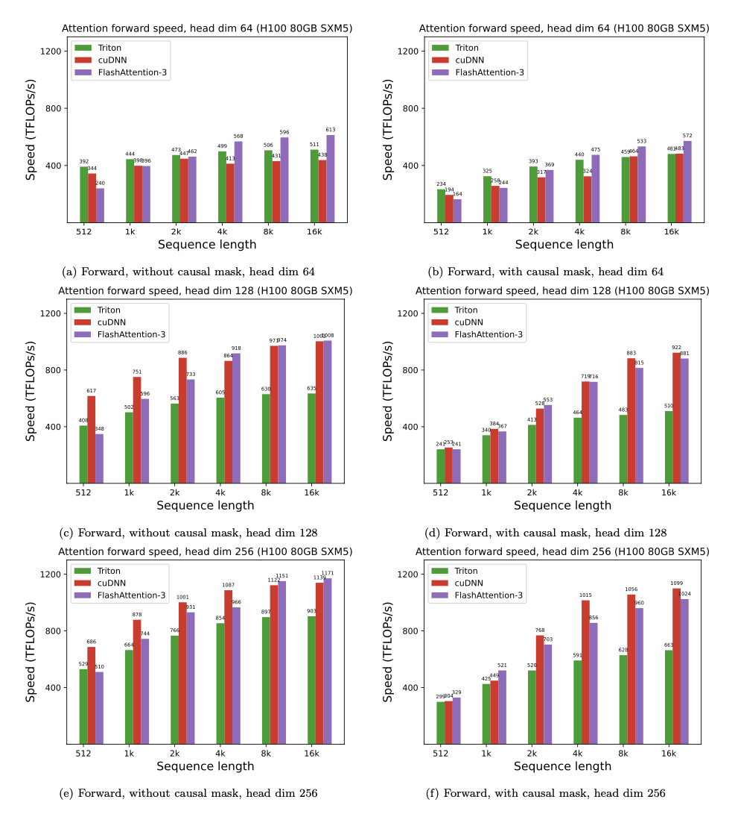
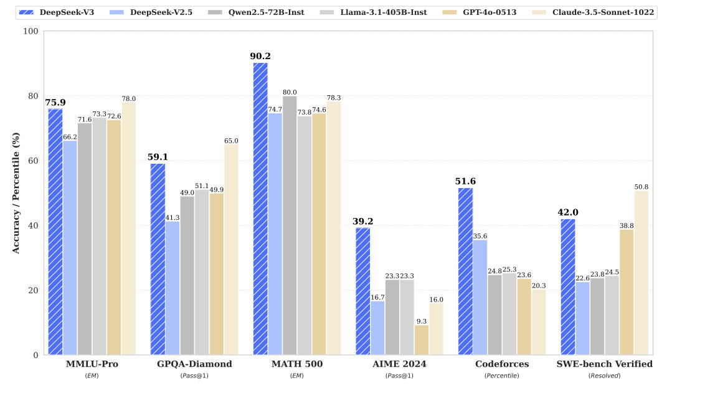
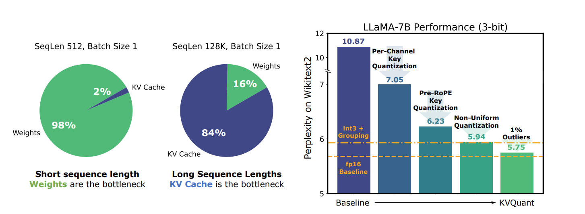
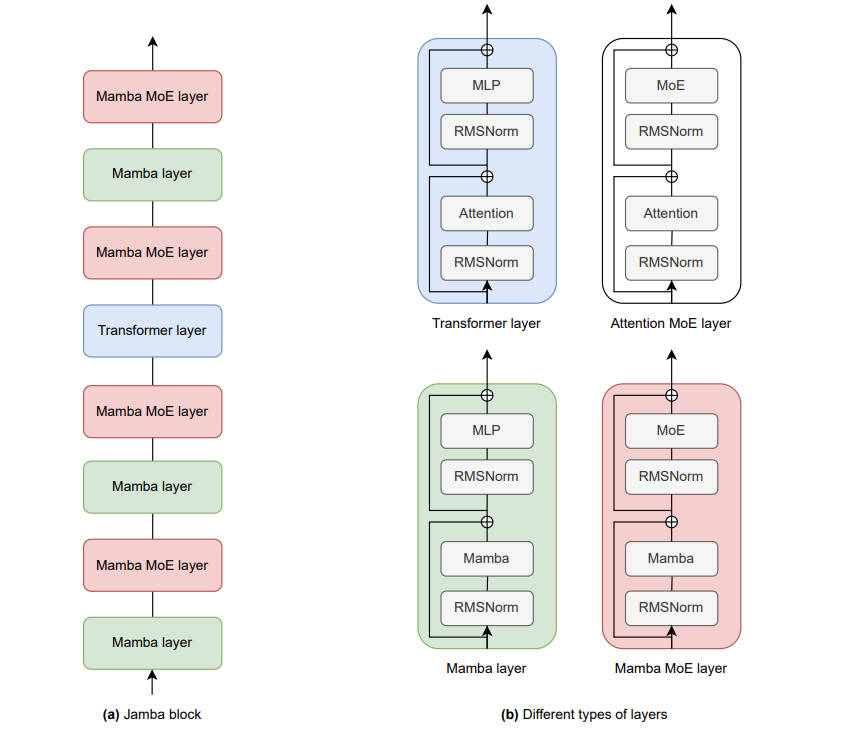
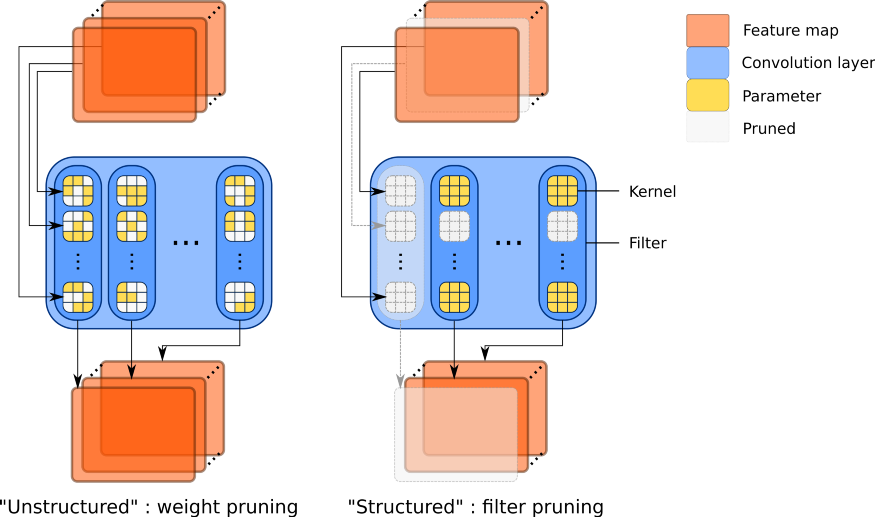
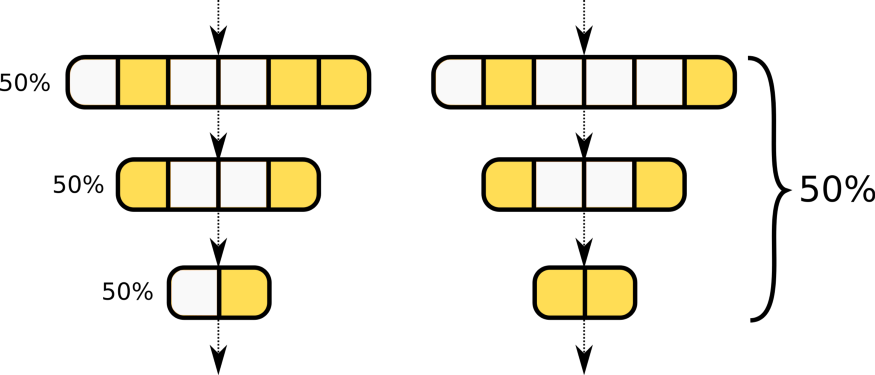
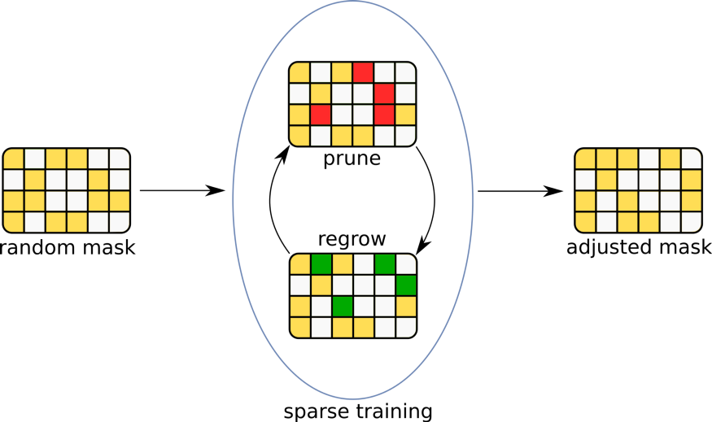
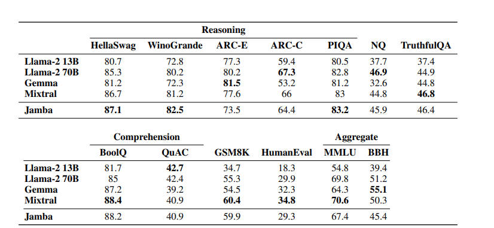
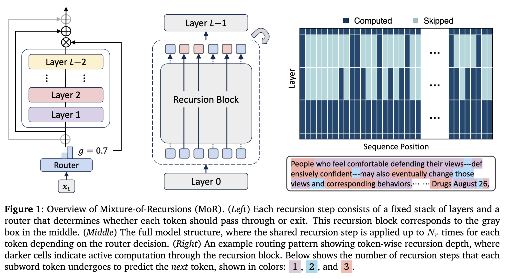

<!--Copyright © ZOMI 适用于[License](https://github.com/Infrasys-AI/AIInfra)版权许可-->

# 未来之路：Transformer瓶颈突破方向

> Author by: 张嘉瑶

自 2017 年以来占据主导地位的 Transformer 架构，目前正面临根本性的扩展限制，这推动了替代方法的爆炸式创新。尽管 Transformer 仍然在最前沿占据至高无上的地位——所有排名前十的 LLM 基准测试都是基于 Transformer 的——但随着上下文窗口扩展到数百万个 token 且模型大小接近数万亿个参数，其二次计算复杂度造成了不可持续的瓶颈。2024-2025 年期间见证了真正的突破：Flash Attention 3 实现了 75% 的 GPU 利用率（而 FA2 仅为 35%），DeepSeek-V3 尽管拥有 6710 亿参数，但训练成本仅为 560 万美元，以及基于 Mamba 的模型已部署到 15 亿台 Windows 设备上。最重要的是，该领域正在趋向于将注意力机制与状态空间模型相结合的混合架构，而不是寻求单一的替代范式。未来是架构的多元化，不同的计算原语将针对不同的计算特性进行优化。

Transformer 面临着六个制约扩展的根本性瓶颈。二次方的注意力复杂度意味着序列长度加倍会导致内存需求增加四倍——处理 128K 上下文所需的内存是 4K 上下文的 1024 倍。对于一个具有 8K 上下文的 700 亿参数模型，仅 KV 缓存就占用了 171 GB，占据了内存使用的主导地位。一个研究团队在 2023 年证明，自注意力的复杂度在理论上是二次方的，除非基本的计算机科学假设不成立，这意味着近似方法不可避免地要么牺牲准确性，要么需要改变架构。训练成本已达到惊人的水平：GPT-4 仅计算成本就高达 7800 万至 1 亿美元，在 3-6 个月内使用了 25,000 个 A100 GPU；而 Llama 3-405B 在 16,000 个 H100 GPU 上消耗了 54 天，估计成本为 1.5 亿美元。能源消耗的增长速度超过了效率的提升——GPT-4 的训练产生了 25,000-50,000 吨二氧化碳当量，而 GPT-4o 的年度推理可能消耗 391-463 GWh，足以为 35,000 个美国家庭供电。尽管声称有百万 token 的上下文窗口，但实际上仍受限于 100K-200K token，因为模型存在“中间丢失”问题，即在长上下文中信息检索能力会急剧下降。

## Flash Attention 改变了 GPU 利用率并实现了长上下文

Flash Attention 是针对 Transformer 瓶颈最成功的优化，它通过硬件感知的算法设计而非架构变更来实现。2022 年的原始版本通过分块 (tiling) 和重计算 (recomputation) 来重新排序注意力计算，将输入块从缓慢的 HBM 内存加载到快速的 SRAM 缓存中，同时避免了具象化庞大的 n² 注意力矩阵。这实现了 2-4 倍的壁钟时间 (wallclock) 加速，同时保持了精确的注意力计算。2023 年的 Flash Attention 2 通过进一步优化，在 A100 GPU 上达到了理论最大 FLOPs 的 70%（约 350 TFLOPs/s）。

Flash Attention 3 于 2024 年 7 月发布，并被 NeurIPS 接收为 spotlight 论文，它通过三项关键创新实现了量子飞跃。Warp 专精 (Warp specialization) 利用异步 Tensor Core，通过独立的生产者/消费者 warp 来重叠计算和数据移动，利用了 H100 GPU 具有 989 TFLOPs 的矩阵乘法能力，但只有 3.9 TFLOPs 的特殊函数能力这一事实。交错操作 (Interleaved operations) 以块方式并发运行矩阵乘法和 softmax，而不是顺序执行。使用块量化 (block quantization) 的非相干处理 (Incoherent processing) 通过 Hadamard 变换将 FP8 量化误差降低了 2.6 倍。其结果是：FP16 达到 740 TFLOPs/s（75% 的 H100 利用率），在 FP8 下接近 1.2 PFLOPs/s，相比 FA2 提升了 1.5-2.0 倍。

  
  <figcaption><strong>对于 FP16，速度比 FlashAttention-2 提高了约 1.6 倍至 2.0 倍</strong></figcaption>

  
  <figcaption><strong>对于 FP8，可以达到接近 1.2 PFLOPS 的运算能力</strong></figcaption>

Flash Attention 已被近乎普遍采用。PyTorch 2.2+ 包含原生支持，并且每个主要的 LLM 服务框架——vLLM、HuggingFace Transformers、TensorRT-LLM、LMDeploy——都默认集成了它。这一优化使得上下文窗口从 GPT-3 的 2-4K 跃升至 GPT-4 的 128K，并最终在实验系统中实现了百万 token 上下文。在 GPT 类型的模型上已证明可实现 3-5 倍的训练加速，每个 A100 达到 225 TFLOPs/sec（72% 利用率）。其关键洞见在于：硬件感知的算法设计可以在不牺牲使 Transformer 强大的精确注意力计算的前提下，克服瓶颈。

## KV 缓存优化以最小的质量损失实现了 5-64 倍的压缩

键值 (Key-Value) 缓存主导了推理过程中的内存占用，它随着序列长度线性增长，并限制了单个 GPU 可以服务的并发用户数量。对于一个 70B 模型，为 32 个用户（每个用户 2K 上下文）提供服务，仅 KV 缓存就需要 约 171 GB，几乎没有空间容纳额外的请求。分组查询注意力 (Grouped Query Attention, GQA) 作为 2023 年出现的第一个生产级解决方案，它将查询头分成若干组，每组共享单个键值头。Llama 2、Llama 3、Mistral 7B 和 Mixtral 都采用了 GQA，实现了 4-8 倍的 KV 缓存缩减，同时保持了接近全多头注意力的质量。

多头潜在注意力 (Multi-Head Latent Attention, MLA) 由 DeepSeek 在 2024 年 5 月引入，并在 12 月的 DeepSeek-V3 中进行了改进，代表了一种更复杂的方法。MLA 将键和值投影到低维潜在向量（通常为 512 维，而完整的 KV 为 2048+ 维），只存储这些压缩表示。解耦的 RoPE (Decoupled RoPE) 分离了位置信息，以防止干扰压缩，而矩阵吸收 (matrix absorption) 则预先合并了投影矩阵以减少计算开销。其结果是：KV 缓存比标准多头注意力小 10-16 倍，且质量持平或更优。采用 MLA 的 DeepSeek-V3 实现了 3-7 倍的吞吐量提升，并成功扩展到 6710 亿的总参数（每个 token 仅 370 亿激活参数）。

  
  <figcaption><strong>DeepSeek-V3及其同类产品的基准性能</strong></figcaption>

量化进一步推动了压缩。NeurIPS 2024 上展示的 KVQuant 通过逐通道、RoPE 前的键量化和针对非均匀激活的非均匀量化，使得 LLaMA-7B 能够以 1M 上下文在单个 A100-80GB GPU 上运行。耦合量化 (Coupled Quantization) 利用了键值通道高度相互依赖的洞见，实现了 1.4-3.5 倍的吞吐量提升，同时在低至每通道 1 比特的情况下仍保持质量。MiniCache 结合了跨层压缩和 KIVI-4bit 量化，实现了 5.02 倍的压缩率和 5 倍的推理吞吐量。这些技术正迅速从研究走向生产，各大服务框架在 2024-2025 年期间都在增加支持。

  
  <figcaption><strong>KVQuant中所使用的不同组件概述，这些组件在将LLaMA-7B模型的KV缓存量化至3位精度时，相较于fp16基准，能使困惑度下降控制在0.1以内。</strong></figcaption>

PagedAttention 在被广泛采用的 vLLM 框架中实现，它通过将 KV 缓存划分为非连续存储的固定大小页面（受操作系统虚拟内存的启发），消除了内存碎片。这实现了近乎零浪费（<4% 碎片），并在提示重叠时实现了序列间的内存共享。实际影响是：以前浪费的内存现在可以容纳更多的并发请求，通过实现更大的批量大小 (batch sizes) 来提高吞吐量。结合动态分组请求的连续批处理 (continuous batching)，在生产部署中 2-3 倍的吞吐量提升已是标准配置。

## 状态空间模型以线性复杂度和引人注目的基准挑战 Transformer

Mamba 由研究员 Tri Dao 和 Albert Gu 于 2023 年 12 月推出，是 Transformer 之外最重大的架构替代方案。其核心创新是选择性状态空间 (selective state spaces)——SSM 参数成为输入的函数，从而实现了内容感知的选择性信息传播和遗忘。与具有固定动态的传统状态空间模型不同，Mamba 可以动态过滤不相关信息，同时保留重要上下文。该架构实现了 O(L) 的时间和空间复杂度（随序列长度 L 线性增长），而 Transformer 为 O(L²)，并且其推理吞吐量比 FlashAttention-2 高 5 倍。

事实证明，硬件感知的实现对于实际性能至关重要。Mamba 使用了带有并行扫描算法的自定义 CUDA 核心，该算法比标准实现快 40 倍，使其尽管具有循环结构但仍能进行并行化训练。该核心利用了 GPU 内存层次结构，类似于 Flash Attention，将整个选择性扫描保持在快速的 SRAM 中，而不是将中间状态写入较慢的 HBM 内存。这种理论效率和实践实现的结合，解释了为什么 Mamba 能够成功，而早期的 RNN 架构却失败了。

Mamba-2 于 2024 年 5 月发布，引入了结构化状态空间对偶性 (Structured State Space Duality)，将 SSM 与注意力机制统一起来。状态扩展维度从 16 增加到 256，并且该架构与输入 X 并行计算参数（A、B、C），而不是顺序计算，从而实现了类似于多头注意力的多头结构。矩阵乘法原语带来了比 Mamba-1 快 2-8 倍的训练速度，并且根据 Chinchilla 定律，该模型具有更好的扩展性。在 2.7B 参数、在 The Pile 数据集上训练的 Mamba-2，其表现与同等规模的 Transformer 相当，同时在推理方面保持了效率优势——线性内存扩展使得百万 token 序列成为可能，而这对于 Transformer 来说是不切实际的。

RWKV (Receptance Weighted Key Value) 提供了另一种引人注目的线性注意力方法，并已实现了卓越的生产部署。RWKV 消除了 RNN 中的 token 依赖瓶颈，使得训练期间可以在 GPU 上并行化，同时保持每个 token O(1) 的推理内存。2024-2025 年发布的 RWKV-7 "Goose" 增加了元上下文学习 (meta-in-context learning)，在每个 token 处进行测试时训练和上下文梯度下降。该架构在 ML Energy Leaderboard 上实现了每 token 最节能的性能，并且由于其对非英语语言的卓越分词能力，在多语言应用中表现出色。最令人印象深刻的是，RWKV v5 已部署到 15 亿台 Windows 10/11 机器上，用于微软的设备端 Copilot，展示了其在海量规模下的生产可行性。高达 140 亿参数的模型已被训练出来，使 RWKV 成为历史上最大的密集型 RNN 架构。

RetNet (Retentive Network) 由微软研究院于 2023 年 7 月推出，通过其留存机制 (retention mechanism) 提供了第三种替代方案：$QK^T \odot D$，其中 $D$ 是一个带有时间衰减因子 $\gamma$ 的衰减矩阵。该架构支持三种计算范式——用于训练的并行模式、用于 O(1) 推理的循环模式，以及用于高效处理长序列的分块 (chunk-wise) 模式。多尺度留存 (Multi-scale retention) 对每个头使用不同的衰减率，以捕获不同时间尺度的依赖关系。RetNet 已经超越了研究阶段，日本的 PKSHA 于 2024 年 4 月使用该架构构建了第一个生产级的日英 LLM。其在高达 6.7B 参数下展现的良好扩展性以及降低的 GPU 内存需求，使其对中端部署尤其具有吸引力。

  
  <figcaption><strong>RetNet 用于推理的循环计算架构</strong></figcaption>

这些替代方案面临一个关键限制：纯粹的 SSM 难以从长上下文中精确召回信息，在“大海捞针”检索任务上，它们与 Transformer 之间存在 50+ 分的差距。这种根本性的权衡源于恒定的状态容量——具有固定大小隐藏状态的模型无法任意召回信息，而注意力机制则可以访问任何先前的 token，但代价是二次方的。这种召回-效率的权衡目前没有完美的解决方案，这也推动了混合架构的兴起。

## 混合架构结合了注意力和状态空间模型的优势

2024-2025 年研究的最重要发现是，在同等参数量下，混合架构的表现始终优于纯 Transformer 和纯 SSM。AI21 Labs 于 2024 年 3 月发布的 Jamba，提供了第一个规模化的生产级混合模型。该架构将 Transformer 层和 Mamba 层与专家混合 (Mixture-of-Experts, MoE) 交错排列，在 8 层的块中使用 1:7 的注意力-Mamba 比例，并且每 2 层应用一次 MoE。Jamba 拥有 520 亿总参数和每 token 120 亿激活参数，在长上下文上的吞吐量是 Mixtral 8x7B 的 3 倍，同时支持 256K 的有效上下文长度。

AI21 的消融研究揭示了关键的洞见。1:7 的注意力:Mamba 比例被证明是计算效率的最佳选择，而且有趣的是，尽管 Mamba-2 的独立性能更优，但在混合模型中 Mamba-1 的效果比 Mamba-2 更好。当存在 Mamba 层时，混合模型不需要显式的位置编码，而 MoE 在不按比例增加计算量的情况下提供了质量提升。Jamba 1.5 于 2024 年 8 月发布，扩展到 940 亿激活参数，通过 ExpertsInt8 量化，仅需 8×80GB GPU 即可支持 256K 上下文。

  
  <figcaption><strong>（a）单个Jamba块。（b）不同类型的层。此处展示的实现中，l=8，注意力层与Mamba层的比例为a:m=1:7，且每e=2层应用一次MoE。</strong></figcaption>

IBM 的 Granite 4.0 于 2024-2025 年发布，采用了不同的方法，包含 70% 的 Mamba-2 SSM 层和 30% 的 Transformer 层。与纯 Transformer 相比，这种设计最多可减少 70% 的内存，同时在企业任务上保持了有竞争力的性能。相对于 Transformer 的二次方增长，其线性内存扩展使得在单个 H100 GPU 上的完整生产部署成为可能，而同等的纯 Transformer 则需要多 GPU 集群。该模型获得了 ISO/IEC 42001:2023 负责任 AI 认证，表明混合架构已经达到了企业级的成熟度。

2024 年 10 月的最新研究系统地研究了混合设计的选择，发现并行混合模型优于串行排列。在并行设计中，注意力和 SSM 分支通过专门的聚合方式同时处理输入，而不是将一个的输出馈送给另一个。该研究揭示了一个令人惊讶的理解上的差距：研究人员承认“我们中没有人理解为什么一个包含状态模型和 Transformer 的混合体表现会优于两者的基线。但不知何故，当我们把两者塞在一起时，它的表现就超过了两者。” 这种尽管缺乏理论解释但在经验上的成功表明，关于这些架构原语互补性的根本性见解仍有待发现。

## 专家混合 (MoE) 实现了前所未有的扩展效率

专家混合 (MoE) 架构在 2024-2025 年获得了主流采用，从根本上改变了大型模型训练和部署的经济性。DeepSeek-V3（2024 年 12 月发布）代表了最引人注目的突破：6710 亿总参数的训练成本仅为 557.6 万美元，共计 278.8 万 H800 GPU 小时——比竞争对手便宜 10-20 倍。尽管每个 token 仅激活 370 亿参数，DeepSeek-V3 仍匹敌 GPT-4 和 Claude 3.5 Sonnet（MMLU: 88.5, MATH-500: 90.2），同时实现了 60 tokens/sec 的推理速度，比其前代产品快 3 倍。

关键创新是无辅助损失的负载均衡。传统的 MoE 架构需要一个辅助损失项来防止所有 token 都路由到少数几个专家，但这种损失会降低性能。DeepSeek-V3 在路由中增加了一个偏置项 (bias term)，该偏置项根据负载动态调整，实现了均衡的专家利用率，且没有性能下降。结合多令牌预测 (Multi-Token Prediction) 训练、贯穿训练和推理的 FP8 混合精度，以及将 MoE 的 all-to-all 通信与计算重叠的 DualPipe 算法，DeepSeek-V3 实现了几个月前似乎还不可能达到的效率水平。

Mistral AI 于 2023 年 12 月发布的 Mixtral 8x7B，推动了开源 MoE 的采用。凭借 467 亿总参数、使用 8 个专家和 top-2 路由（每个 token 129 亿激活参数），Mixtral 的性能优于 Llama 2 70B，而推理所需的计算量减少了 2-3 倍。Apache 2.0 许可证使其得以广泛实验，并且该模型证明了 MoE 可以在开创该方法的大型实验室之外稳健地工作。xAI 的 Grok-1 于 2024 年初跟进，拥有 3140 亿参数和约 25% 的激活权重，同样在 Apache 2.0 许可下发布，进一步验证了该架构。

细粒度与粗粒度 MoE 设计代表了一个关键的权衡。DeepSeekMoE 开创了细粒度方法，使用许多小型专家而不是较少的大型专家，从而实现了更好的专业化。该架构将模型维度划分给更多专家（N $\rightarrow$ mN 个专家，每个专家的维度 D $\rightarrow$ D/m），允许 token 访问更多样化的专业知识组合。共享专家与路由专家增加了另一个维度——共享专家始终被激活以捕获常识，而路由专家则负责专业化。这种组合使得预训练速度比密集模型快 4 倍，推理速度比同等质量的密集替代方案快 2-3 倍。

  
  <figcaption><strong>DeepSeekMoE 16B与开源模型在Open LLM排行榜上的对比。</strong></figcaption>

## 量化和分布式训练解决了内存和规模问题

FP8 训练已成为 2024-2025 年的主导精度格式，这得益于 Hopper 架构 GPU 的支持。两种格式服务于不同目的：E4M3（4 位指数，3 位尾数） 为权重和梯度提供了高达 $\pm 448$ 的范围，而 E5M2（5 位指数，2 位尾数） 为激活值提供了高达 $\pm 57k$ 的范围。FP8 训练相比 BF16 提供了 2 倍的训练加速和 2 倍的内存缩减，而准确性损失极小（<0.5%）。NVIDIA 的 Transformer 引擎提供了自动的张量级缩放 (tensor-wise scaling) 和格式选择，使得 FP8 无需手动调优即可使用。

生产部署验证了这种方法。Adobe Firefly 通过部署 FP8 实现了 60% 的延迟降低和 40% 的总拥有成本降低。iGenius 使用 FP8 训练 Colosseum 355B 达到了 82% 的 MMLU 准确率，证明了前沿规模的模型可以在降低的精度下进行训练。即将到来的 Blackwell 架构引入了具有块级缩放 (block-level scaling) 的 MXFP8，以改善异常值处理，而实验性的 NVFP4（4 位浮点数） 采用 E2M1 格式，有望实现 8 倍的缩减，尽管实用的训练方案仍待 2025 年开发。

训练后量化 (Post-training quantization) 实现了高效部署。GPTQ 使用 Hessian 信息执行逐层权重 量化，实现了4 位量化，准确率损失 <1%，内存缩减 4 倍。AWQ（激活感知权重 量化） 保护了由激活幅度确定的约 0.1-1% 最显著的权重，通常在相同位宽下提供比 GPTQ 更好的质量，且推理速度更快。AutoGPTQ 和 GPTQModel 等工具使这些技术易于获取，而 vLLM 等框架也原生支持它们。结合 KV 缓存量化，总内存需求可以降至原始模型的 5-10%，同时保持 95% 以上的原始质量。

Zero Redundancy Optimizer (ZeRO) 和 Fully Sharded Data Parallel (FSDP) 通过高内存效率的分布式训练，实现了前所未有的规模。ZeRO Stage 3 将参数、梯度和优化器状态分片到所有 GPU 上，实现了 N 倍的内存缩减（N 为 GPU 数量）。FSDP 目前在 PyTorch 中已经成熟，已成功训练了 1 万亿参数的模型，GPT-1T 达到了 84 TFLOPS/A100，GPT-175B 达到了 159 TFLOPS。混合分片策略——节点内完全分片，节点间复制——优化了内存与通信的权衡。

Zero Bubble Pipeline（零气泡流水线）于 2024 年引入并在 DeepSeek-V3 中使用，代表了流水线并行领域的突破。通过将反向传播解耦为两个阶段并仔细调度微批次 (microbatches)，该技术实现了 97-99% 的 GPU 利用率，而传统的 1F1B（一次前向，一次反向）流水线调度仅为 70-75%。结合通过 INT8 量化权重、分层分区和 INT4 量化梯度将通信量减少 4 倍的 ZeRO++，现代 3D 并行（数据 + 张量 + 流水线）实现了 50-60% 的模型 FLOPs 利用率和每 A100 GPU 150-180 的已实现 TFLOPS。

  
  <figcaption><strong>DeepSeek-V3基本架构示意图。继DeepSeek-V2之后，采用了MLA和DeepSeekMoE，以实现高效推理和经济的训练。</strong></figcaption>

## 稀疏注意力和分布式方法将上下文扩展至数百万 token

Ring Attention 于 2023 年 10 月发表，并被 ICLR 2024 接收，它通过巧妙的分布方式，实现了在远超单设备内存的序列上进行精确的注意力计算。该技术将长序列分布在环形拓扑中的多个设备上，执行自注意力的分块计算，同时在设备之间以循环方式传递键值块。通信与分块注意力计算完全重叠，除了块传递之外没有引入额外开销。Ring Attention 成功演示了百万 token 序列，并使大型世界模型 (Large World Model, LWM) 能够处理视频和长文档而无需截断。

Striped Attention 于 2023 年 11 月提出，它通过解决因果 Transformer 中的工作负载不平衡问题，改进了 Ring Attention。因果掩码创建了一个三角形计算模式，其中较晚的 token 会关注更多先前的 token，当块被连续分配时会导致负载不平衡。条带分布 (Striped distribution) 以循环方式 (round-robin) 在设备间分配 token，更均匀地平衡了工作负载，在 A100 GPU 上（256K 序列）实现了比 Ring Attention 快 1.45 倍的加速，在 16 个 TPUv4 芯片上（786K 序列）实现了1.65 倍的加速。

  
  <figcaption><strong>Ring Attention & Striped Attention</strong></figcaption>

稀疏注意力模式用计算效率换取了精确的注意力。OpenAI 2019 年的 Sparse Transformer 开创了步幅 (strided) 和固定 (fixed) 注意力模式，实现了 O(n√n) 复杂度，而 Transformer 为 O(n²)。谷歌的 BigBird 结合了三个组件——关注整个序列的全局 token、用于附近上下文的局部滑动窗口，以及用于远程依赖的随机注意力连接——以实现 O(n) 的线性时间复杂度。最近的研究如 SPARSEK (2024) 使用可微分的 top-k 掩码算子来学习每个查询 (query) 应该关注哪 K 个键值对，从而实现了基于梯度的稀疏模式优化，而不是手工设计。

实际的局限性在于，稀疏模式对某些任务效果很好，但对其他任务效果很差。模型必须从头开始使用稀疏模式进行训练，或者通过昂贵的持续预训练，而且许多应用需要全上下文注意力所提供的能力。这解释了为什么像 Flash Attention 这样的精确注意力优化和像 Ring Attention 这样的分布式方法比学习稀疏性获得了更广泛的采用——它们在解决计算瓶颈的同时，保持了 Transformer 的全部能力。

## 模型剪枝发现稀疏网络有时优于密集网络

2024 年的一项令人惊讶的研究发现挑战了关于网络容量的假设：稀疏模型有时在相同任务上的表现会击败密集模型，而不仅仅是大致相当。PALS (Pruning at Linearly-varying Sparsity) 框架自动寻找最佳稀疏度，并发现在 30 个测试案例中，有 12 个稀疏模型取得了比密集模型更好的 MSE（均方误差），其中 14 个案例显示出更好的 MAE（平均绝对误差）。这种情况发生的同时，还实现了 65% 的参数缩减和 63% 的 FLOPs 缩减，这表明在某些情况下，过度参数化实际上可能损害泛化能力。

结构化剪枝 (Structured pruning) 会移除整个神经元、注意力头或通道，可在标准 GPU 上提供硬件友好的加速。N:M 稀疏模式，特别是 2:4（每 4 个连续元素中有 2 个非零元素），可被 Ampere 和 Hopper 架构的 Tensor Core 直接加速。这使得在 50% 稀疏度下能够实现高达 2 倍的理论加速，同时保持密集的张量操作效率。Intel Neural Compressor 在 BERT 上展示了 90% 的稀疏度，而准确率损失 <1%，并通过结合剪枝、量化和蒸馏，在 Xeon 处理器上实现了 25 倍的加速。

  
  <figcaption><strong>unstructured & structured prune</strong></figcaption>

训练后剪枝 (Post-training pruning) 方法消除了昂贵的重新训练需求。最近的框架在单个 GPU 上不到 3 分钟内实现了 2 倍的 FLOPs 缩减，而质量损失 <1%。OATS 结合了稀疏和低秩分解以实现互补压缩，而 RECAP 则支持 CPU-GPU 混合计算，用于处理在剪枝分析期间大到无法装入 GPU 内存的模型。激活稀疏性 (Activation sparsity) 代表了另一个前沿——激活函数自然产生的稀疏性可以通过 Amber Pruner 这样的专用核心来利用，以加速 LLM 的 prefill 阶段。

  
  <figcaption><strong>partial & global prune</strong></figcaption>

动态稀疏性 (Dynamic sparsity)，即剪枝模式在推理期间根据输入而变化，提供了自适应计算的前景。需要较少处理的 token 可以激活较少的参数，将计算集中在困难的样本上。虽然初步结果令人鼓舞，但动态稀疏性需要比静态剪枝复杂得多的实现，并且与更简单的量化方法相比，其生产采用率有限。剪枝、量化和知识蒸馏的结合代表了极端压缩的实用前沿技术，使模型能够在边缘设备和 CPU 上高效运行。

  
  <figcaption><strong>dynamic sparsity prune</strong></figcaption>

## 行业采用揭示了务实的架构选择和研究与实践的差距

2024-2025 年的生产部署揭示了一个清晰的模式：前沿模型仍然基于 Transformer，而替代方案在注重效率和边缘部署方面获得了关注。LMsys Chatbot Arena 上排名前十的模型都使用了 Transformer 架构，而前沿实验室（OpenAI、Anthropic、Google）继续投资于 Transformer 的优化。GPT-4o、Claude 3.5 Sonnet 和 Gemini 2.0 都采用了 Transformer 的变体，并结合了专有优化、MoE 架构和广泛的后训练 (post-training)，而不是采用架构替代品。

边缘和中型部署的情况则截然不同。RWKV v5 运行在 15 亿台 Windows 设备上，用于微软的设备端 Copilot，这表明恒定的推理内存和线性复杂度为资源受限的环境提供了决定性的优势。在 10-15 亿参数范围内，Samba 和 RWKV-7 等替代方案的表现优于 Llama 3.2 和 Qwen 2.5，这表明在较小规模上，架构优势更为重要，因为在这些规模上，Transformer 优化基础设施所提供的优势较小。Jamba 在中端市场与 Llama 3.1 70B 竞争，同时在长上下文上提供更高的效率。

  
  <figcaption><strong>将 Jamba 与其他公开可用的模型进行比较，Jamba 在性能相近的情况下，吞吐量却远高于其他模型。</strong></figcaption>

尽管进展迅速，但研究到生产的差距依然存在。整个 AI 堆栈都是为 Transformer 优化的——CUDA 库（cuBLAS、cuDNN）、框架原语（PyTorch、TensorFlow）以及硬件（为矩阵乘法而设计的 Tensor Core）。团队在 Transformer 训练和优化方面积累了 7 年多的深厚专业知识。生产系统偏爱经过验证的架构，这造成了组织惯性，即使基准测试证明替代方案具有竞争力，也会减缓其采用速度。已经投资于 Transformer 基础设施的资本——从数据中心设计到工程师培训——创造了转换成本，纯粹的性能改进难以克服这些成本。

桥接机制正在加速变革。转换方法（如 LoLCATs）使得能够仅使用 0.2% 的参数和 0.4% 的训练 token 将已训练的 Transformer 转换为线性注意力模型，从而允许组织利用现有的检查点，同时获得效率优势。Q-RWKV6 演示了在数小时内将 Qwen 32B 转换为 RWKV 注意力，性能相当，而推理成本大幅降低。像 STAR (Synthesis of Tailored Architectures) 这样的统一框架支持跨不同原语的架构搜索，实现了混合设计探索的自动化。通过 HuggingFace 和专门的代码库 (state-spaces/mamba) 进行的开源实现，降低了实施负担，商业框架也在 2024-2025 年期间增加了对替代架构的原生支持。

## 专家共识指向架构多元化，而非 Transformer 替代品

领先的 AI 研究人员已就架构的未来达成几项关键共识。Ilya Sutskever 在创办 Safe Superintelligence Inc. 后，在 NeurIPS 2024 上宣称：“我们所知的预训练无疑将会终结。数据并没有在增长，因为我们只有一个互联网。数据是 AI 的化石燃料……2010 年代是规模化的时代，现在我们再次回到了充满奇迹和发现的时代。” 这代表了一个根本性的转变，与那个仅靠扩展计算和数据就能可靠提升能力的时代截然不同。

Anthropic 的 Dario Amodei 预测 AGI 可能会在 2030 年之前出现，他表示“在未来两三年内，我们将看到模型在几乎所有方面都比我们强”，并估计 AI 可能会消除 50% 的入门级白领工作。Sam Altman 反驳了对规模化的怀疑，坚称“没有障碍”，并表示 OpenAI“现在有信心我们知道如何构建传统意义上的 AGI”，并可能在一个总统任期内实现。Google DeepMind 的 Demis Hassabis 提供了一个稍微保守的时间表，认为 AGI“可能还有几年时间”，这反映了谷歌的资源优势降低了其紧迫感。

新兴的共识是：转变不是走向替代，而是利用一系列不断增长的专业化原语来构建灵活的系统。注意力机制擅长需要访问任意上下文项目的检索任务。SSM 以恒定的内存高效处理长序列信息。MoE 使得在没有按比例增加计算量的情况下扩展容量成为可能。专门的推理模块处理多步逻辑。未来的架构将根据特定任务和部署限制来优化组合这些元素，而不是强行采用单一方法。

2024-2025 年的架构设计洞见显示，并行混合模型优于串行排列——通过注意力和 SSM 分支，使用专门的聚合方式同时处理输入，其效果优于将一个的输出馈送给另一个。有趣的是，研究人员承认“我们中没有人理解为什么混合模型的表现会优于两者的基线”，这表明理论理解落后于经验上的成功。1:1 的 SSM-注意力比例是最常见的，但更多的 SSM 层可以提高效率，而注意力层似乎对于需要精确信息检索和复杂推理的任务是必需的。

## 下一代将优先考虑测试时计算和后训练，而非纯粹的规模化

该行业正在从预训练规模化转向可称为**“三尺度定律” (three scaling laws) 的范式**。预训练规模化（传统的更大模型-更多数据）仍在继续，但回报递减，据报道 OpenAI 的 Orion、Google 的 Gemini Ultra 和 Anthropic 的 Opus 3.5 都遇到了挑战。通过来自人类反馈的强化学习、指令调整和合成数据策展进行的后训练规模化 (Post-training scaling) 已成为同等参数量模型之间主要的质量差异化因素。以 OpenAI 的 o1 和 o3 模型为例的测试时规模化 (Test-time scaling)，通过分配更多的推理计算来生成思维链、验证解决方案和探索多种方法，从而实现了推理能力的提升——无需重新训练即可提升能力。

根据 Sutskever 的说法，超级智能 AI 将在质量上不同于当前系统。真正的能动性 (agency) 意味着追求目标，而不是遵循指示。真正的推理 (reasoning) 涉及超越模式匹配的逻辑思维。高效学习 (Efficient learning) 使得能够从有限的数据中理解概念，而不是需要海量数据集。这一愿景表明，能力需要超越当前架构的规模化，需要学习算法的根本性创新，并可能需要产生道德复杂性的自我意识。Sutskever 预测，通过算法突破，而非蛮力规模化，使用约 100 亿美元的集群就可以实现超级智能。

2025-2027 年的路线图包括几个可能的发展。Gen3 模型（GPT-5 级别，10²⁶-10²⁷ FLOPs，10-100 亿美元训练成本）将验证传统规模化是否能继续产生成效。主流的测试时计算将把 o1 风格的推理能力带给 OpenAI 之外的多个模型。首批生产级的架构混合 (Mixture of Architectures) 系统将实现在架构原语之间路由，而不仅仅是 MoE 专家。转换工具的成熟将使 Transformer 到替代方案的迁移变得容易，降低转换成本。100K+ 上下文窗口将成为标准配置，尽管考虑到“中间丢失”问题，有效利用仍然具有挑战性。

到 2027-2028 年，Gen4 模型可能会达到 10²⁷-10²⁸ FLOPs，训练成本为 100-1000 亿美元，这可能会触及能源和数据可用性方面的物理限制。结合了注意力、SSM 和专门模块的混合架构应该会主导生产，纯 Transformer 将被降级到其优势具有决定性作用的特定用例中。在最少监督下追求多步骤目标的能动 AI (Agentic AI) 将从研究演示走向生产系统。根据部署经验更新参数的自我改进系统可能会出现，从根本上将模型生命周期从静态训练转变为持续适应。为后 Transformer 架构专门设计的定制 AI 加速器可能会改变硬件-软件协同设计的平衡。

## 尽管取得了显著进展，但关键挑战仍未解决

三个根本性的限制制约着所有当前架构。召回-效率的权衡似乎不可避免：恒定状态的模型无法任意召回信息，而注意力机制以二次方代价实现完全召回。研究证明，除非基本的计算机科学假设（强指数时间假说, Strong Exponential Time Hypothesis）不成立，否则自注意力就是二次方的，这表明这种权衡可能是根本性的，而不是一个等待解决方案的工程问题。长程依赖仍然具有挑战性，尽管已具备百万 token 的能力——模型在超过一定长度后难以进行“大海捞针”式的检索，并且需要像“Just Read Twice”（多次处理序列）这样的技术，才能使循环模型达到注意力的性能。

无论算法如何进步，能源和可持续性的限制都有可能限制规模化。训练成本接近 1 亿多美元，推理能耗预计到 2020 年代末将占到美国 GDP 的 2.2%，这表明存在物理和经济上的限制。数据中心需要大量的电力和水资源——GPT-4o 的推理每年可能消耗 133-158 万立方米的水用于冷却，相当于 120 万人的饮用水量。由于杰文斯悖论 (Jevons paradox)（成本降低导致使用量增加，其增幅超过了效率提升所减少的影响），训练和推理产生的碳排放增长速度继续快于单次查询的效率提升。

可解释性和安全性仍然是所有架构都未解决的关键问题。无论是 Transformer 还是替代方案，都无法对其决策过程提供清晰的机制性理解，尤其是在规模化的情况下。随着系统变得越来越强大，这种不透明性会带来风险——模型可能会追求意想不到的目标，表现出意外的行为，或者抵制对齐 (alignment) 的努力。向测试时计算和推理的转变加剧了可解释性的挑战，因为模型生成的内部推理轨迹可能反映也可能不反映其实际决策过程。在连续空间中思考而无需语言化的潜在推理 (Latent reasoning) 模型，有可能会通过消除当前系统所提供的思维链可见性，使情况变得更糟。

随着互联网的有限内容被耗尽，训练数据稀缺问题日益加剧。据估计，高质量文本数据已达到“数据峰值”，迫使人们依赖 AI 系统生成的合成数据。合成数据的质量和多样性在规模上尚未得到证实——在 AI 生成内容上训练的模型可能会继承偏见、缺乏新概念或遭受微妙的质量下降。课程学习 (Curriculum learning) 和精心策展有所帮助，但合成数据是否能完全替代互联网来源的数据来训练前沿模型，仍然是一个悬而未决的问题，将在 2025-2027 年 Gen3 和 Gen4 模型训练时受到考验。

## 架构多样性成为 Transformer 之外的务实发展路径

2024-2025 年标志着从架构单一主义 (monism) 到多元主义 (pluralism) 的真正范式转变。虽然 Transformer 在前沿领域保持着王冠，但替代方案已在注重效率的部署中证明了其在生产规模上的可行性。Mamba 部署到 15 亿台设备，DeepSeek-V3 以不到 600 万美元的训练成本达到了 GPT-4 的性能水平，以及混合架构始终优于纯粹方法，这些都表明 Transformer 的主导地位是情境性的，而非绝对的。

未来不是单一的制胜架构，而是一个专业化解决方案的生态系统。对于需要复杂推理和精确召回，且计算成本次于能力的任务，纯 Transformer 仍然是最佳选择。对于极端效率和超长上下文，且可接受一定召回损失的场景，纯 SSM 则表现出色。像Mixture-of-Recursions 这样的混合架构代表了大多数应用的“甜点”，它们结合了优势，同时缓解了劣势。新兴的架构混合 (Mixture of Architectures) 范式将使系统能够根据任务需求在不同原语之间进行路由，从而在多样化的工作负载中实现最优。

  <figcaption><strong>如下图所示，MoR引入了一个统一的框架，直接解决了键值缓存缺失和批量推理的问题。通过一个高效的端到端训练路由机制实现了这一点，该机制能够动态地为每个词元分配最佳递归深度。此外，还引入了一种递归级键值缓存策略，该策略选择性地存储键值对，在解决缓存缺失问题的同时优化了内存使用。与标准Transformer相比，在相似的准确率下，推理吞吐量提高了2倍，同时还降低了总训练浮点运算次数和内存需求。</strong></figcaption>
  

从研究到生产的快速进展——Mamba 于 2023 年 12 月发布，Jamba 于 2024 年 3 月投入生产——表明替代方案的采用正在加速。预计到 2026 年，混合 SSM-Transformer 架构将在长上下文应用（法律、医疗、科学文档）、成本敏感型部署（小型公司、边缘设备）和实时应用（低延迟要求）中占据重要市场份额。2017 年的 Transformer 革命正在让位于一个架构复兴的时代，多种方法共存，每种方法都针对特定的计算特性和部署限制进行了优化。

最初的“Attention Is All You Need”（注意力就是你所需要的一切）正在演变为“Attention Is One Primitive Among Many”（注意力是众多原语之一）。该领域已经从寻求单一的通用架构成熟到认识到不同的计算模式需要不同的解决方案。2024-2025 年的突破——Flash Attention 3、DeepSeek-V3、Mamba-2、复杂的混合设计——并不代表 Transformer 演进的终结，而是一个更丰富的架构景观的开始。赢家将是那些掌握了这种多样性、优化选择和组合原语的组织，而不是完全致力于任何单一方法。架构的奇迹和发现时代才刚刚开始。

## 参考文献

* AI21 Labs. (2024). Jamba: A Hybrid Transformer-Mamba Language Model. AI21 Labs. https://www.ai21.com/blog/jamba-white-paper

* Ainslie, J., Lee-Thorp, J., de Jong, M., Zemlyanskiy, Y., Le, F., & Sanghai, S. (2023). GQA: Training Generalized Models with Grouped-Query Attention. arXiv preprint arXiv:2305.13245.

* Contextual AI. (2024). Mixture-of-Recursions: A 2x Faster, 2x Cheaper, and Better Reasoning LLM. Contextual AI. https://contextual.ai/blog/mor-v1

* Dao, T. (2023). FlashAttention-2: Faster Attention with Better Parallelism and Work Partitioning. Proceedings of the 40th International Conference on Machine Learning (pp. 7175-7201). PMLR.

* Dao, T., Fu, D. Y., Ermon, S., Rudra, A., & Ré, C. (2022). FlashAttention: Fast and Memory-Efficient Exact Attention with IO-Awareness. Advances in Neural Information Processing Systems, 35, 16344–16359.

* Dao, T., Fu, D. Y., & Ré, C. (2024). FlashAttention-3: Fast and Memory-Efficient Exact Attention with Better Work Partitioning. Advances in Neural Information Processing Systems, 37 (NeurIPS 2024).

* DeepSeek AI. (2024a). DeepSeekMoE: Towards Open-Source Mixture-of-Experts Language Models. arXiv preprint arXiv:2401.06066.

* DeepSeek AI. (2024b). DeepSeek-V2: A Strong, Economical, and Efficient Mixture-of-Experts Language Model. arXiv preprint arXiv:2405.04434.

* DeepSeek AI. (2024c). DeepSeek-V3: A Parameter-Efficient MoE Language Model with DeepSeek-Attention. arXiv preprint arXiv:2411.16611.

* Frantar, E., Gallow, S., Ghorbani, H., Ashkboos, S., & Alistarh, D. (2023). GPTQ: Accurate Post-Training Quantization for Generative Pre-trained Transformers. Proceedings of the 11th International Conference on Learning Representations (ICLR 2023).

* Gu, A., & Dao, T. (2023). Mamba: Linear-Time Sequence Modeling with Selective State Spaces. arXiv preprint arXiv:2312.00752.

* Gu, A., & Dao, T. (2024). Mamba-2: Structured State Space Duality. arXiv preprint arXiv:2405.21060.

* Jiang, A. Q., Sablayrolles, A., Mensch, A., Bamford, C., Chaplot, D. S., de las Casas, D., ... & Lample, G. (2024). Mixtral of Experts. arXiv preprint arXiv:2401.04088.

* Kwon, W., Geng, Z., Li, Z., & Zhu, Y. (2023). Efficient Memory Management for Large Language Model Serving with PagedAttention. Proceedings of the 29th Symposium on Operating Systems Principles (pp. 701–715).

* Lin, J., Tang, H., Geng, Z., Liu, Z., & Han, S. (2023). AWQ: Activation-aware Weight Quantization for LLM Compression and Acceleration. arXiv preprint arXiv:2306.00978.

* Liu, H., Li, O., Rabe, A., & Staats, P. (2024). Ring Attention with Blockwise Transformers for Near-Infinite Context. Proceedings of the 12th International Conference on Learning Representations (ICLR 2024).

* Liu, H., Li, O., Rabe, A., & Staats, P. (2023). Striped Attention: Faster Ring Attention for Causal Transformers. arXiv preprint arXiv:2311.09431.

* Liu, Z., Tang, H., Wang, Z., Lin, J., & Han, S. (2024). KVQuant: Towards 10 Million Context Length LLM Inference with 3-bit KV Cache Quantization. Advances in Neural Information Processing Systems, 37 (NeurIPS 2024).

* Rajbhandari, S., Rasley, J., Ruwase, O., & He, Y. (2020). ZeRO: Memory optimizations toward training trillion parameter models. Proceedings of the International Conference for High Performance Computing, Networking, Storage and Analysis (pp. 1–16).

* Sun, Y., Dong, L., Huang, S., Ma, S., & Wei, F. (2023). Retentive Network: A Successor to Transformer for Large Language Models. arXiv preprint arXiv:2307.08621.

* Vaswani, A., Shazeer, N., Parmar, N., Uszkoreit, J., Jones, L., Gomez, A. N., ... & Polosukhin, I. (2017). Attention is all you need. Advances in Neural Information Processing Systems, 30 (NeurIPS 2017).

* Zaheer, M., Guruganesh, G., Dubey, K. A., Ainslie, J., Alberti, C., Bapna, A., ... & Ahmed, A. (2020). Big Bird: Transformers for longer sequences. Advances in Neural Information Processing Systems, 33 (NeurIPS 2020).
