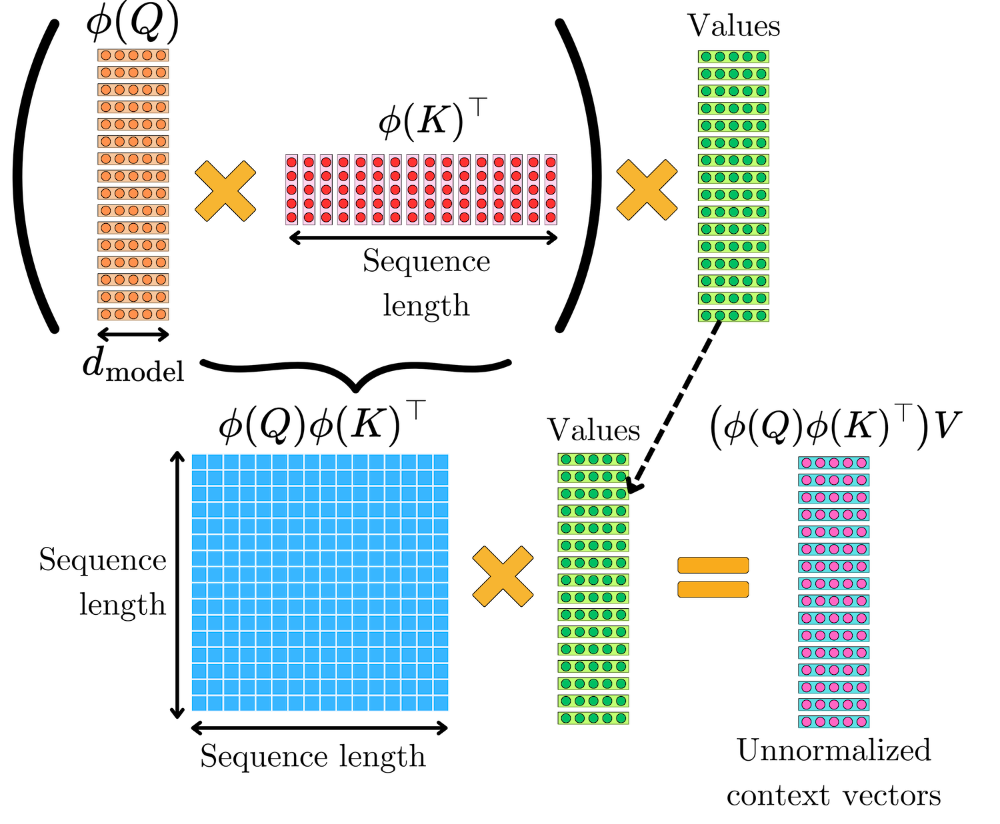

# 三种注意力机制详解

本文档详细介绍三种重要的注意力机制及其CUDA实现：
1. **Multi-Head Self-Attention** (多头自注意力)：标准全局注意力，能够捕捉长程依赖与多子空间特征；典型复杂度为时间/空间 O(N^2)，CUDA 实现关注 QK^T 的并行化、数值稳定 softmax、以及 V 的加权聚合（常配合共享内存/分块提升带宽利用）。
2. **Linear Attention** (线性注意力)：通过核方法/特征映射重排计算，将显式 N×N 相关性转化为可累积的 K,V 统计，复杂度降为 O(N·d^2) 或 O(N·d)（依实现而定）；适合超长序列与流式场景，CUDA 核心在 φ 映射的逐元素并行、K^T V 预积累与行级归一的数值稳定处理。
3. **Sliding Window Self-Attention** (滑动窗口自注意力)：限制注意范围到长度 w 的局部窗口，复杂度 O(N·w·d)，在保持局部上下文的同时显著降低显存与计算；CUDA 实现侧重窗口裁剪的高效访存、寄存器/共享内存缓存以及边界位置的分支消隐。


## 1. Multi-Head Self-Attention

### 原理介绍

<div align="center">
  
</div>
  

多头注意力是Transformer架构的核心组件，其基本思想是**将注意力计算并行化到多个"头"（heads）**，每个头学习不同的表示子空间。


给定输入矩阵 $Q$（查询）、$K$（键）、$V$（值），大小为 $N \times d_{\text{model}}$，多头注意力的计算过程如下：

$$
\text{MultiHead}(Q,K,V) = \text{Concat}(\text{head}_1,\ldots,\text{head}_h)
$$

其中每个头计算：

$$
\text{head}_i = \text{softmax}\left(\frac{Q_iK_i^T}{\sqrt{d_k}}\right)V_i
$$

这里：
- $h$ = 注意力头的数量
- $d_k = d_{\text{model}}/h$ = 每个头的维度
- $Q_i, K_i, V_i$ 是第 $i$ 个头对应的输入矩阵分区

#### 算法步骤

1. **分区（Partition）**：将 $Q$, $K$, $V$ 沿特征维度分成 $h$ 个部分
2. **注意力计算**：对每个头独立计算：
   - 计算注意力分数：$\text{scores} = Q_iK_i^T / \sqrt{d_k}$
   - 应用softmax归一化
   - 加权求和：$\text{output}_i = \text{attention} \cdot V_i$
3. **拼接（Concatenate）**：将所有头的输出拼接起来

###  CUDA实现详解

#### 核心Kernel函数

##### Kernel 1: 计算注意力分数

```cuda
__global__ void computeAttentionScores(
    const float* Q, const float* K, float* scores,
    int N, int d_model, int h, int d_k, int head_idx
) {
    int row = blockIdx.y * blockDim.y + threadIdx.y;
    int col = blockIdx.x * blockDim.x + threadIdx.x;
    
    if (row < N && col < N) {
        float sum = 0.0f;
        int head_offset = head_idx * d_k;
        
        // 计算Q[row]和K[col]的点积
        for (int i = 0; i < d_k; i++) {
            float q_val = Q[row * d_model + head_offset + i];
            float k_val = K[col * d_model + head_offset + i];
            sum += q_val * k_val;
        }
        
        // 缩放因子 1/sqrt(d_k)
        sum /= sqrtf((float)d_k);
        
        // 存储到scores矩阵
        scores[head_idx * N * N + row * N + col] = sum;
    }
}
```

**关键点**：
- 使用2D线程网格处理 $N \times N$ 的注意力分数矩阵
- `head_offset` 定位当前头在输入矩阵中的起始位置
- 缩放因子 $1/\sqrt{d_k}$ 防止点积过大导致softmax梯度消失

##### Kernel 2: Softmax归一化

```cuda
__global__ void applySoftmax(float* scores, int N, int num_heads) {
    int head = blockIdx.y;
    int row = blockIdx.x * blockDim.x + threadIdx.x;
    
    if (head < num_heads && row < N) {
        float* row_scores = scores + head * N * N + row * N;
        
        // 数值稳定性：找到最大值
        float max_val = -FLT_MAX;
        for (int i = 0; i < N; i++) {
            max_val = fmaxf(max_val, row_scores[i]);
        }
        
        // 计算exp和sum
        float sum = 0.0f;
        for (int i = 0; i < N; i++) {
            row_scores[i] = expf(row_scores[i] - max_val);
            sum += row_scores[i];
        }
        
        // 归一化
        for (int i = 0; i < N; i++) {
            row_scores[i] /= sum;
        }
    }
}
```

**关键点**：
- **数值稳定性**：减去最大值再计算exp，避免溢出
- 每个线程处理一行，独立计算softmax
- 三遍扫描：找最大值 → 计算exp和sum → 归一化

##### Kernel 3: 应用注意力权重到V

```cuda
__global__ void applyAttention(
    const float* attention, const float* V, float* output,
    int N, int d_model, int h, int d_k, int head_idx
) {
    int row = blockIdx.y * blockDim.y + threadIdx.y;
    int col = blockIdx.x * blockDim.x + threadIdx.x;
    
    if (row < N && col < d_k) {
        float sum = 0.0f;
        // 指向当前head的第 row 行注意力分布（长度 N）
        float* att_row = (float*)attention + head_idx * N * N + row * N;
        // V 矩阵中当前 head 的列偏移（把多头拼在 d_model 维中）
        int v_col = head_idx * d_k + col;
        
        // 对所有键位置 j 做加权求和：sum_j att[i,j] * V[j, head_col]
        for (int i = 0; i < N; i++) {
            sum += att_row[i] * V[i * d_model + v_col];
        }
        // 写回到输出：直接写入已拼接的模型维度 (d_model) 中对应 head 列
        output[row * d_model + v_col] = sum;
    }
}
```


```cuda
//按head聚合 + 拼接(concat)”合并到同一kernel中，避免中间临时缓冲与多次kernel launch
__global__ void applyAttentionAndConcat(
    const float* attention, const float* V, float* output,
    int N, int d_model, int h, int d_k
) {
    int row = blockIdx.y * blockDim.y + threadIdx.y;
    int head = blockIdx.x;
    int col_in_head = threadIdx.x;
    
    if (row < N && head < h && col_in_head < d_k) {
        float sum = 0.0f;
        float* att_row = (float*)attention + head * N * N + row * N;
        
        // 遍历键位置 j，累积注意力加权的 V 值（同一 head 的第 col_in_head 列）
        for (int i = 0; i < N; i++) {
            float v_val = V[i * d_model + head * d_k + col_in_head];
            sum += att_row[i] * v_val;
        }
        
        // 将每个 head 的输出直接按拼接形式写到输出张量对应位置
        output[row * d_model + head * d_k + col_in_head] = sum;
    }
}
```

**关键点**：
- 计算注意力加权的值向量和：$\text{output}[i] = \sum_j \text{attention}[i][j] \cdot V[j]$
- 直接写入最终输出矩阵的对应位置（已拼接）

#### 主函数流程

```cuda
extern "C" void solve(const float* Q, const float* K, const float* V, 
                     float* output, int N, int d_model, int h) {
    int d_k = d_model / h;
    
    // 分配中间结果内存
    float* attention_scores;
    cudaMalloc(&attention_scores, sizeof(float) * h * N * N);
    
    // 步骤1: 计算所有头的注意力分数
    for (int head = 0; head < h; head++) {
        computeAttentionScores<<<gridDim, blockDim>>>(
            Q, K, attention_scores, N, d_model, h, d_k, head
        );
    }
    
    // 步骤2: 应用softmax
    applySoftmax<<<softmaxGrid, 256>>>(attention_scores, N, h);
    
    // 步骤3: 应用注意力到V并拼接
    if (d_k <= 32) {
        // Use single kernel for small d_k
        dim3 blockDim3(d_k, 16);
        dim3 gridDim3(h, (N + blockDim3.y - 1) / blockDim3.y);
        applyAttentionAndConcat<<<gridDim3, blockDim3>>>(
            attention_scores, V, output, N, d_model, h, d_k
        );
    } else {
        // Use separate kernels for larger d_k
        dim3 blockDim2(16, 16);
        dim3 gridDim2((d_k + blockDim2.x - 1) / blockDim2.x,
                      (N + blockDim2.y - 1) / blockDim2.y);
        
        for (int head = 0; head < h; head++) {
            applyAttention<<<gridDim2, blockDim2>>>(
                attention_scores, V, output, N, d_model, h, d_k, head
            );
        }
    }
    
    // Synchronize and clean up
    cudaDeviceSynchronize();
    cudaFree(attention_scores);
}
```

### 复杂度分析

- **时间复杂度**：$O(N^2 \cdot d_{\text{model}})$
- **空间复杂度**：$O(h \cdot N^2)$（存储注意力矩阵）
- **计算瓶颈**：$N^2$ 的注意力分数计算，对长序列不友好

### 示例验证

**输入**：
- $N = 2, d_{\text{model}} = 4, h = 2$
- $Q = \begin{bmatrix} 1.0 & 0.0 & 2.0 & 3.0 \\ 4.0 & 5.0 & 6.0 & 7.0 \end{bmatrix}$
- $K = \begin{bmatrix} 1.0 & 2.0 & 3.0 & 4.0 \\ 5.0 & 6.0 & 7.0 & 8.0 \end{bmatrix}$
- $V = \begin{bmatrix} 0.5 & 1.0 & 1.5 & 2.0 \\ 2.5 & 3.0 & 3.5 & 4.0 \end{bmatrix}$

**输出**：
$$
\begin{bmatrix}
2.39 & 2.89 & 3.50 & 4.00 \\
2.50 & 3.00 & 3.50 & 4.00
\end{bmatrix}
$$

这个示例展示了**注意力权重是如何通过$Q·K^T$计算相似度的**，**Softmax**是如何通过分数转为概率分布来实现归一化的，**加权聚合**是如何根据注意力权重提取相关信息V的**，**多头并行**是通过不同头学习来不同特征子空间的，在实际应用中，这种机制让模型能够**动态地关注输入序列中的不同部分**，是 Transformer 强大表示能力的核心！


---

## 2. Linear Attention

###  原理介绍


<div align="center">
  
</div>
  


线性注意力通过**改变计算顺序**来降低复杂度，避免显式计算 $N \times N$ 的注意力矩阵。核心思想是使用特征映射函数 $\phi$ 将注意力从softmax形式转换为核函数形式。

#### 数学公式

标准注意力：
$$
\text{Attention}(Q, K, V) = \text{softmax}(QK^T)V
$$

线性注意力（来自论文 [Transformers are RNNs](https://arxiv.org/pdf/2006.16236)）：
$$
\text{LinearAttention}(Q, K, V) = \frac{\phi(Q) \left(\phi(K)^T V \right)}{\phi(Q) \left(\sum_j \phi(K_j) \right)}
$$

其中特征映射 $\phi(x)$ 定义为：
$$
\phi(x) = \text{ELU}(x) + 1 = 
\begin{cases} 
x + 1, & x > 0 \\ 
e^x, & x \leq 0 
\end{cases}
$$

#### 算法步骤

1. **应用特征映射**：计算 $\phi(Q)$ 和 $\phi(K)$
2. **计算键值乘积**：$\text{KTV} = \phi(K)^T V$（$d \times d$ 矩阵）
3. **计算键的和**：$\text{sumK} = \sum_{j=1}^M \phi(K_j)$（$d$ 维向量）
4. **计算最终输出**：
   - 分子：$\phi(Q) \cdot \text{KTV}$
   - 分母：$\phi(Q) \cdot \text{sumK}$

### CUDA实现详解

#### 核心Kernel函数

##### Kernel 1: 特征映射

```cuda
// Feature map: φ(x) = ELU(x) + 1 = max(0, x) + exp(min(0, x))
__device__ inline float phi(float x) {
    if (x > 0.0f) {
        return x + 1.0f;
    } else {
        return expf(x);
    }
}

// Kernel to apply feature map φ to a matrix
__global__ void applyFeatureMap(const float* input, float* output, int M, int d) {
    int idx = blockIdx.x * blockDim.x + threadIdx.x;
    int total = M * d;
    
    if (idx < total) {
        output[idx] = phi(input[idx]);
    }
}
```

**关键点**：
- ELU激活函数确保输出非负（类似softmax的性质）
- 逐元素并行计算，充分利用GPU

##### Kernel 2: 计算 $\phi(K)^T V$

```cuda
// Kernel to compute φ(K)^T @ V (result is d×d)
__global__ void computeKTV(const float* phiK, const float* V, float* KTV, int M, int d) {
    int row = blockIdx.y * blockDim.y + threadIdx.y;
    int col = blockIdx.x * blockDim.x + threadIdx.x;
    
    if (row < d && col < d) {
        float sum = 0.0f;
        
        // K^T[row, :] @ V[:, col]
        for (int i = 0; i < M; i++) {
            sum += phiK[i * d + row] * V[i * d + col];
        }
        
        KTV[row * d + col] = sum;
    }
}
```

**关键点**：
- 输出是 $d \times d$ 矩阵，通常 $d \ll M$
- 这是线性注意力的关键：将复杂度从 $O(M^2)$ 降到 $O(M \cdot d^2)$

##### Kernel 3: 计算键的和

```cuda
// Kernel to compute sum of φ(K) rows (result is d-dimensional)
__global__ void computeSumPhiK(const float* phiK, float* sumK, int M, int d) {
    int col = blockIdx.x * blockDim.x + threadIdx.x;
    
    if (col < d) {
        double sum = 0.0;  // 使用double提高精度
        for (int i = 0; i < M; i++) {
            sum += (double)phiK[i * d + col];
        }
        sumK[col] = (float)sum;
    }
}
```

**关键点**：
- 对每个特征维度求和
- 使用double精度避免累积误差

##### Kernel 4: 计算最终输出

```cuda
// Main kernel to compute final output
__global__ void computeLinearAttentionMain(
    const float* phiQ, const float* KTV, const float* sumK, 
    float* output, int M, int d
) {
    // Grid-stride loop pattern for better efficiency
    int idx = blockIdx.x * blockDim.x + threadIdx.x;
    int stride = blockDim.x * gridDim.x;
    int total = M * d;
    
    for (int pos = idx; pos < total; pos += stride) {
        int row = pos / d;
        int col = pos % d;
        
        if (row < M && col < d) {
            double numerator = 0.0;
            double denominator = 0.0;
            
            // Compute numerator: φ(Q_row) @ KTV[:, col]
            for (int k = 0; k < d; k++) {
                numerator += (double)phiQ[row * d + k] * (double)KTV[k * d + col];
            }
            
            // Compute denominator: φ(Q_row) @ sumK
            for (int k = 0; k < d; k++) {
                denominator += (double)phiQ[row * d + k] * (double)sumK[k];
            }
            
            // Avoid division by zero
            if (denominator != 0.0) {
                output[row * d + col] = (float)(numerator / denominator);
            } else {
                output[row * d + col] = 0.0f;
            }
        }
    }
}
```


```cuda
// Optimized version with better memory access pattern
__global__ void computeLinearAttentionOpt(
    const float* phiQ, const float* KTV, const float* sumK, 
    float* output, int M, int d
) {
    extern __shared__ float shared_mem[];
    
    int tid = threadIdx.x;
    int row = blockIdx.x;
    
    if (row >= M) return;
    
    // 加载sumK到共享内存
    for (int i = tid; i < d; i += blockDim.x) {
        shared_mem[i] = sumK[i];
    }
    __syncthreads();
    
    // 计算分母（该行只需计算一次）
    double denominator = 0.0;
    for (int k = 0; k < d; k++) {
        denominator += (double)phiQ[row * d + k] * (double)shared_mem[k];
    }
    
    // 每个线程计算多个输出元素
    for (int col = tid; col < d; col += blockDim.x) {
        double numerator = 0.0;
        
        // φ(Q_row) @ KTV[:, col]
        for (int k = 0; k < d; k++) {
            numerator += (double)phiQ[row * d + k] * (double)KTV[k * d + col];
        }
        
        if (denominator != 0.0) {
            output[row * d + col] = (float)(numerator / denominator);
        } else {
            output[row * d + col] = 0.0f;
        }
    }
}
```

**关键点**：
- 使用共享内存缓存 `sumK`，减少全局内存访问
- 分母对每行只计算一次，提高效率
- 使用double精度进行中间计算，提高数值稳定性

#### 主函数流程

```cuda
extern "C" void solve(const float* Q, const float* K, const float* V, 
                     float* output, int M, int d) {
    float *phiQ, *phiK, *KTV, *sumK;
    
    // 分配内存
    cudaMalloc(&phiQ, M * d * sizeof(float));
    cudaMalloc(&phiK, M * d * sizeof(float));
    cudaMalloc(&KTV, d * d * sizeof(float));
    cudaMalloc(&sumK, d * sizeof(float));
    
    // 步骤1: 应用特征映射
    int threadsPerBlock = 256;
    int blocks = (M * d + threadsPerBlock - 1) / threadsPerBlock;
    applyFeatureMap<<<blocks, threads>>>(Q, phiQ, M, d);
    applyFeatureMap<<<blocks, threads>>>(K, phiK, M, d);
    
    // 步骤2: 计算 φ(K)^T @ V
    dim3 blockDim2D(16, 16);
    dim3 gridDim2D((d + blockDim2D.x - 1) / blockDim2D.x,
                   (d + blockDim2D.y - 1) / blockDim2D.y);
    computeKTV<<<gridDim2D, blockDim2D>>>(phiK, V, KTV, M, d);
    
    // 步骤3: 计算 sum(φ(K))
    int sumBlocks = (d + threadsPerBlock - 1) / threadsPerBlock;
    computeSumPhiK<<<sumBlocks, threads>>>(phiK, sumK, M, d);
    
    // 步骤4: 等待之前的内核完成
    cudaDeviceSynchronize();
    
    // 步骤5: 计算最终输出
    if (M <= 1000) {
        // For smaller M, use one block per row
        int threads = min(256, d);
        size_t shared_size = d * sizeof(float);
        computeLinearAttentionOpt<<<M, threads, shared_size>>>(
            phiQ, KTV, sumK, output, M, d
        );
    } else {
        // For larger M, use grid-stride approach
        int totalElements = M * d;
        int threads = 256;
        int blocks = min(65535, (totalElements + threads - 1) / threads);
        computeLinearAttentionMain<<<blocks, threads>>>(
            phiQ, KTV, sumK, output, M, d
        );
    }
    
    // 同步并清理
    cudaDeviceSynchronize();
    cudaFree(phiQ);
    cudaFree(phiK);
    cudaFree(KTV);
    cudaFree(sumK);
}
```

### 复杂度分析

- **时间复杂度**：$O(M \cdot d^2)$（vs 标准注意力的 $O(M^2 \cdot d)$）
- **空间复杂度**：$O(M \cdot d + d^2)$（无需存储 $M \times M$ 注意力矩阵）
- **优势**：当 $M \gg d$ 时（长序列），复杂度降低显著

### 示例验证

**输入**：
- $M = 2, d = 4$
- $Q = \begin{bmatrix} 1.0 & 0.0 & 0.0 & 0.0 \\ 0.0 & 1.0 & 0.0 & 0.0 \end{bmatrix}$
- $K = \begin{bmatrix} 1.0 & 0.0 & 0.0 & 0.0 \\ 0.0 & 1.0 & 0.0 & 0.0 \end{bmatrix}$
- $V = \begin{bmatrix} 1.0 & 2.0 & 3.0 & 4.0 \\ 5.0 & 6.0 & 7.0 & 8.0 \end{bmatrix}$

**输出**：
$$
\begin{bmatrix}
2.8461537 & 3.8461537 & 4.8461537 & 5.8461537 \\
3.1538463 & 4.1538463 & 5.1538463 & 6.1538463
\end{bmatrix}
$$

上述示例显示，标准 Attention 的 Softmax 破坏了矩阵乘法的结合律：
$$\text{softmax}(QK^T)V \neq Q[\text{某函数}(K^TV)]$$

Linear Attention 通过以下方式恢复结合律：

1.用简单的归一化替代Softmax

2.利用 $\phi(Q)[\phi(K)^T V]$来实现矩阵重排计算。

Linear Attention 的成功证明**算法创新**可以突破硬件瓶颈（改变计算顺序而非硬件升级）; **复杂度优化**需要在表达能力和效率间权衡
; **Transformer 的未来**可能在于混合架构（短距离用标准 Attention，长距离用 Linear Attention）。这正是 **Mamba、RWKV、RetNet** 等新架构的核心思想来源！


---

## 3. Sliding Window Self-Attention

###  原理介绍


<div align="center">
  
</div>
  


滑动窗口注意力通过**限制每个位置只关注局部窗口内的其他位置**，在保持局部感受野的同时大幅降低计算复杂度。这在处理长序列（如文档、长文本）时特别有用。

#### 数学公式

标准注意力：
$$
\text{output}_i = \sum_{j=1}^{M} \text{softmax}(\text{score}_{i,*})_j \cdot V_j
$$

滑动窗口注意力：
$$
\text{output}_i = \sum_{j \in [i-w, i+w]} \text{softmax}(\text{score}_{i,*})_j \cdot V_j
$$

其中：
- $w$ = `window_size`
- 窗口范围：$[\max(0, i-w), \min(M-1, i+w)]$
- 注意力分数：$\text{score}_{i,j} = \frac{Q_i \cdot K_j}{\sqrt{d}}$

#### 算法步骤

1. **确定窗口边界**：对位置 $i$，计算 $[\text{start}, \text{end}]$
2. **计算局部分数**：只计算窗口内的注意力分数
3. **应用softmax**：在窗口内归一化
4. **加权求和**：只对窗口内的值向量加权

###  CUDA实现详解

#### 核心Kernel函数

##### Kernel: 滑动窗口注意力（通用版本）

```cuda
__global__ void slidingWindowAttention(
    const float* Q, const float* K, const float* V, float* output,
    int M, int d, int window_size
) {
    int i = blockIdx.x * blockDim.x + threadIdx.x;
    if (i >= M) return;
    
    // 确定窗口边界
    int window_start = max(0, i - window_size);
    int window_end = min(M - 1, i + window_size);
    int window_len = window_end - window_start + 1;
    
    // 本地数组存储分数（最大窗口：2*32+1=65）
    float scores[65];
    
    // 步骤1: 计算窗口内的注意力分数
    float sqrt_d = sqrtf((float)d);
    float max_score = -FLT_MAX;
    
    for (int j_idx = 0; j_idx < window_len; j_idx++) {
        int j = window_start + j_idx;
        float score = 0.0f;
        
        // 计算 Q_i · K_j
        for (int k = 0; k < d; k++) {
            score += Q[i * d + k] * K[j * d + k];
        }
        
        score /= sqrt_d;
        scores[j_idx] = score;
        max_score = fmaxf(max_score, score);
    }
    
    // 步骤2: 应用softmax（数值稳定版本）
    float sum_exp = 0.0f;
    for (int j_idx = 0; j_idx < window_len; j_idx++) {
        float exp_val = expf(scores[j_idx] - max_score);
        scores[j_idx] = exp_val;
        sum_exp += exp_val;
    }
    
    // 归一化
    for (int j_idx = 0; j_idx < window_len; j_idx++) {
        scores[j_idx] /= sum_exp;
    }
    
    // 步骤3: 计算加权值向量和
    for (int k = 0; k < d; k++) {
        float result = 0.0f;
        for (int j_idx = 0; j_idx < window_len; j_idx++) {
            int j = window_start + j_idx;
            result += scores[j_idx] * V[j * d + k];
        }
        output[i * d + k] = result;
    }
}
```

**关键点**：
- 每个线程独立处理一个查询位置
- 使用**寄存器数组**（`float scores[65]`）存储窗口内的注意力权重，避免共享内存冲突
- 动态窗口边界处理边界情况
- 三步流程紧凑，减少内存往返

##### Kernel: 优化版本（使用共享内存）

```cuda
__device__ float atomicMaxFloat(float* addr, float value) {
    int* addr_as_int = (int*)addr;
    int old = *addr_as_int;
    int assumed;
    
    do {
        assumed = old;
        old = atomicCAS(addr_as_int, assumed,
                        __float_as_int(fmaxf(__int_as_float(assumed), value)));
    } while (assumed != old);
    
    return __int_as_float(old);
}


__global__ void slidingWindowAttentionShared(
    const float* Q, const float* K, const float* V, float* output,
    int M, int d, int window_size
) {
    extern __shared__ float shared_mem[];
    
    int tid = threadIdx.x;
    int i = blockIdx.x;  // 每个block处理一个查询
    
    if (i >= M) return;
    
    float* scores = shared_mem;
    float* query = shared_mem + 65;
    
    // 加载查询向量到共享内存
    for (int k = tid; k < d; k += blockDim.x) {
        query[k] = Q[i * d + k];
    }
    __syncthreads();
    
    // 确定窗口边界
    int window_start = max(0, i - window_size);
    int window_end = min(M - 1, i + window_size);
    int window_len = window_end - window_start + 1;
    
    // 计算注意力分数（并行）
    float sqrt_d = sqrtf((float)d);
    float max_score = -FLT_MAX;
    
    for (int j_idx = tid; j_idx < window_len; j_idx += blockDim.x) {
        int j = window_start + j_idx;
        float score = 0.0f;
        
        for (int k = 0; k < d; k++) {
            score += query[k] * K[j * d + k];
        }
        
        score /= sqrt_d;
        scores[j_idx] = score;
        max_score = fmaxf(max_score, score);
    }
    
    // 找全局最大值（使用原子操作）
    __shared__ float max_score_shared;
    if (tid == 0) max_score_shared = -FLT_MAX;
    __syncthreads();
    
    if (max_score > -FLT_MAX) {
        atomicMaxFloat(&max_score_shared, max_score);
    }
    __syncthreads();
    
    // 应用softmax（并行）
    float local_sum = 0.0f;
    for (int j_idx = tid; j_idx < window_len; j_idx += blockDim.x) {
        float exp_val = expf(scores[j_idx] - max_score_shared);
        scores[j_idx] = exp_val;
        local_sum += exp_val;
    }
    
    __shared__ float sum_exp_shared;
    if (tid == 0) sum_exp_shared = 0.0f;
    __syncthreads();
    
    atomicAdd(&sum_exp_shared, local_sum);
    __syncthreads();
    
    // 归一化
    for (int j_idx = tid; j_idx < window_len; j_idx += blockDim.x) {
        scores[j_idx] /= sum_exp_shared;
    }
    __syncthreads();
    
    // 计算输出（并行）
    for (int k = tid; k < d; k += blockDim.x) {
        float result = 0.0f;
        for (int j_idx = 0; j_idx < window_len; j_idx++) {
            int j = window_start + j_idx;
            result += scores[j_idx] * V[j * d + k];
        }
        output[i * d + k] = result;
    }
}
```

**关键点**：
- **共享内存优化**：缓存查询向量和注意力权重
- **Block策略**：每个block处理一个查询位置，block内线程并行计算窗口内的操作
- **原子操作**：`atomicMaxFloat` 和 `atomicAdd` 用于规约操作
- 适用于较小的 $d$ 和 $w$

#### 主函数流程

```cuda
extern "C" void solve(const float* Q, const float* K, const float* V, 
                     float* output, int M, int d, int window_size) {
    if (d <= 64 && window_size <= 32) {
        // 使用共享内存优化版本
        int threadsPerBlock = 128;
        int blocks = M;
        size_t shared_mem_size = (65 + d) * sizeof(float);
        
        slidingWindowAttentionShared<<<blocks, threadsPerBlock, shared_mem_size>>>(
            Q, K, V, output, M, d, window_size
        );
    } else {
        // 使用通用版本
        int threadsPerBlock = 256;
        int blocks = (M + threadsPerBlock - 1) / threadsPerBlock;
        
        slidingWindowAttention<<<blocks, threadsPerBlock>>>(
            Q, K, V, output, M, d, window_size
        );
    }
    
    cudaDeviceSynchronize();
}
```

### 复杂度分析

- **时间复杂度**：$O(M \cdot w \cdot d)$（vs 标准注意力的 $O(M^2 \cdot d)$）
- **空间复杂度**：$O(M \cdot d)$（无需存储注意力矩阵）
- **优势**：
  - 当 $w \ll M$ 时，计算量大幅减少
  - 适合长序列处理（如长文档、代码分析）
  - 保留局部上下文信息

### 示例验证

**输入**：
- $M = 2, d = 4, w = 1$
- $Q = \begin{bmatrix} 1.0 & 0.0 & 0.0 & 0.0 \\ 0.0 & 1.0 & 0.0 & 0.0 \end{bmatrix}$
- $K = \begin{bmatrix} 1.0 & 0.0 & 0.0 & 0.0 \\ 0.0 & 1.0 & 0.0 & 0.0 \end{bmatrix}$
- $V = \begin{bmatrix} 1.0 & 2.0 & 3.0 & 4.0 \\ 5.0 & 6.0 & 7.0 & 8.0 \end{bmatrix}$

**输出**：
$$
\begin{bmatrix}
2.5101628 & 3.5101628 & 4.510163 & 5.510163 \\
3.4898374 & 4.4898376 & 5.4898376 & 6.489837
\end{bmatrix}
$$

---

##  性能对比与总结

### 三种注意力机制对比

| 特性 | Multi-Head Attention | Linear Attention | Sliding Window Attention |
|------|---------------------|------------------|-------------------------|
| **时间复杂度** | $O(N^2 \cdot d)$ | $O(N \cdot d^2)$ | $O(N \cdot w \cdot d)$ |
| **空间复杂度** | $O(h \cdot N^2)$ | $O(N \cdot d + d^2)$ | $O(N \cdot d)$ |
| **优势场景** | 标准Transformer，全局上下文 | 长序列（$N \gg d$） | 超长序列，局部依赖 |
| **劣势场景** | 长序列（内存/计算爆炸） | 短序列（$d > N$时效率低） | 需要全局上下文的任务 |
| **表达能力** | 全局最强 | 近似全局 | 局部最强 |

###  CUDA优化要点总结

#### 通用优化策略

1. **内存访问优化**
   - 合并全局内存访问（coalesced access）
   - 使用共享内存缓存频繁访问的数据
   - 减少全局内存往返次数

2. **数值稳定性**
   - Softmax计算前减去最大值
   - 使用double精度进行累加操作
   - 检查除零情况

3. **并行策略**
   - 根据问题规模选择线程/Block配置
   - 平衡线程占用率和寄存器/共享内存使用
   - 避免线程束分歧（warp divergence）

4. **算法特定优化**
   - Multi-Head：跨头并行，注意力矩阵分块计算
   - Linear：利用矩阵结合律改变计算顺序
   - Sliding Window：寄存器数组存储局部数据

#### 性能调优检查清单

- [ ] 使用 `nvprof` 或 Nsight Compute 分析瓶颈
- [ ] 检查全局内存带宽利用率
- [ ] 优化线程块大小（通常256或512）
- [ ] 最小化 `__syncthreads()` 调用
- [ ] 考虑使用Tensor Core（适用于混合精度）
- [ ] 实现多流并行（overlap计算和数据传输）


## 结语

这三种注意力机制代表了深度学习中不同的设计哲学：

- **Multi-Head Attention** 追求表达能力，牺牲计算效率
- **Linear Attention** 追求计算效率，近似全局注意力
- **Sliding Window Attention** 在局部与全局间取得平衡

在实际应用中，选择合适的注意力机制需要根据具体任务、数据特性和资源约束综合考虑。CUDA实现中的优化技巧也可以互相借鉴，例如：

- Linear Attention的计算重排思想可以应用于Multi-Head
- Sliding Window的局部处理策略可以与Linear Attention结合
- 共享内存、寄存器数组等优化手段通用

希望这份文档能帮助你深入理解这些注意力机制及其高效CUDA实现！


###  扩展阅读

- **Multi-Head Attention**: [Attention Is All You Need (Vaswani et al., 2017)](https://arxiv.org/abs/1706.03762)
- **Linear Attention**: [Transformers are RNNs: Fast Autoregressive Transformers with Linear Attention](https://arxiv.org/abs/2006.16236)
- **Sliding Window**: [Longformer: The Long-Document Transformer](https://arxiv.org/abs/2004.05150)

---

## 附录：代码文件说明

### 编译与运行

```bash
# 编译Multi-Head Attention
nvcc -o multihead multihead.cpp -arch=sm_70

# 编译Linear Attention
nvcc -o linear_attention linear-self-attention.cpp -arch=sm_70

# 编译Sliding Window Attention
nvcc -o sliding_window sliding-window-self-attention.cpp -arch=sm_70
```

**注意**：根据你的GPU架构调整 `-arch` 参数：
- Tesla V100: `sm_70`
- RTX 20 series: `sm_75`
- RTX 30 series: `sm_86`
- RTX 40 series: `sm_89`

---
