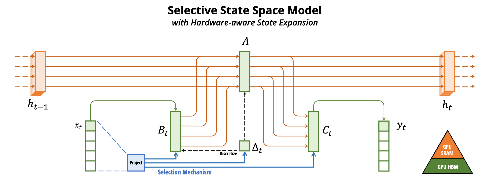
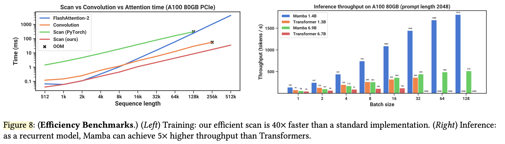

<!--Copyright © ZOMI 适用于[License](https://github.com/Infrasys-AI/AIInfra)版权许可-->

# Mamba 状态空间模型(DONE)

这个实验带你探索超越 Transformer 的下一代架构[Mamba](https://arxiv.org/abs/2312.00752)。你将动手实现 Mamba 的核心组件——硬件感知的状态空间模型和选择性扫描机制(S6)。通过代码你将看到，Mamba 如何根据输入动态调整模型参数，实现数据依赖的隐藏状态演化，并利用并行算法实现高效的训练推理。

通过该实验，你将直观感受到 Mamba 是如何通过结构化状态空间模型和硬件感知算法优化，在语言、基因等多个长序列建模领域展现出巨大潜力，成为当前最受关注的新架构之一。



## 1. 状态空间模型 SSM

近年来，Transformer 架构在深度学习领域取得了巨大成功，但其二次方的计算复杂度限制了其在超长序列任务中的应用。2023 年底提出的 Mamba 模型基于状态空间模型(SSM)，通过选择性机制和硬件感知算法，实现了线性计算复杂度，成为处理长序列任务的新范式。

状态空间模型源于控制理论，用于描述动态系统行为。其核心思想是通过隐藏状态来捕捉序列的历史信息，并根据当前输入更新状态。

### 1.1 环境设置与导入依赖

```python
import torch
import torch.nn as nn
import torch.nn.functional as F
import math
```

### 1.2 连续时间 SSM

连续时间状态空间模型用微分方程表示：

$$
\begin{align*}
h'(t) &= A h(t) + B x(t) \quad &\text{(状态方程)} \\
y(t) &= C h(t) + D x(t) \quad &\text{(输出方程)}
\end{align*}
$$

其中：

- $x(t)$: 输入信号
- $h(t)$: 隐藏状态
- $y(t)$: 输出信号
- $A, B, C, D$: 可学习参数矩阵

### 1.3 离散化过程

为了在数字系统中使用，需要将连续方程离散化。Mamba 采用零阶保持(ZOH)方法：

$$
\begin{align*}
\overline{A} &= e^{A\Delta} \\
\overline{B} &= (e^{A\Delta} - I) A^{-1} B
\end{align*}
$$

离散化后的方程：

$$
\begin{align*}
h_k &= \overline{A} h_{k-1} + \overline{B} x_k \\
y_k &= C h_k + D x_k
\end{align*}
$$

其中 $\Delta$ 为步长参数，控制状态更新频率。

### 1.4 基础 SSM 实现

```python
class BasicSSM(nn.Module):
    def __init__(self, state_dim, input_dim):
        super().__init__()
        # 初始化状态转移矩阵和输入/输出参数
        self.A = nn.Parameter(torch.randn(state_dim, state_dim))
        self.B = nn.Parameter(torch.randn(state_dim, input_dim))
        self.C = nn.Parameter(torch.randn(input_dim, state_dim))
        self.D = nn.Parameter(torch.randn(input_dim))
        
        # 控制状态更新频率的步长参数
        self.delta = nn.Parameter(torch.tensor(0.1))
        
    def discretize(self):
        """实现零阶保持离散化，将连续参数转换为离散参数"""
        A_bar = torch.matrix_exp(self.A * self.delta)
        inv_A = torch.inverse(self.A)
        A_exp_minus_I = torch.matrix_exp(self.A * self.delta) - torch.eye(self.A.size(0))
        B_bar = A_exp_minus_I @ inv_A @ self.B
        
        return A_bar, B_bar
        
    def forward(self, x):
        """循环更新隐藏状态并计算输出"""
        A_bar, B_bar = self.discretize()
        
        batch_size, seq_len, _ = x.shape
        state_dim = self.A.size(0)
        
        h = torch.zeros(batch_size, state_dim).to(x.device)
        outputs = []
        
        for i in range(seq_len):
            h = torch.tanh(A_bar @ h + B_bar @ x[:, i, :])
            y = self.C @ h + self.D * x[:, i, :]
            outputs.append(y)
            
        return torch.stack(outputs, dim=1)
```

## 2. Mamba 的核心创新

传统 SSM 的主要限制是参数固定，无法根据输入内容动态调整。Mamba 通过选择性机制解决了这一问题。

### 2.1 选择性状态空间模型

Mamba 的核心创新是使 SSM 参数成为输入的函数：

$$
\begin{align*}
B_k &= B(x_k) \\
C_k &= C(x_k) \\
\Delta_k &= \tau_{\Delta}(x_k)
\end{align*}
$$

其中 $\tau_{\Delta}$ 是一个小型神经网络，根据当前输入 $x_k$ 预测步长 $\Delta_k$。

这种设计使模型能够对重要输入延长记忆（大 $\Delta$），对无关输入缩短记忆（小 $\Delta$）。


### 2.2 选择性 SSM 实现

```python
class SelectiveSSM(nn.Module):
    def __init__(self, dim, state_dim):
        super().__init__()
        self.dim = dim  # 输入/输出维度（D）
        self.state_dim = state_dim  # 状态维度（N）
        
        # 投影层生成输入依赖的参数
        self.proj = nn.Linear(dim, 3 * dim + state_dim)
        self.A = nn.Parameter(torch.randn(dim, state_dim))
        self.out_proj = nn.Linear(dim, dim)
        
    def forward(self, x):
        batch_size, seq_len, _ = x.shape
        projected = self.proj(x)
        # 分割为Δ、B、C 和门控信号
        delta, B, C, gate = torch.split(
            projected, [self.dim, self.dim, self.state_dim, self.dim], dim=-1
        )
        
        delta = F.softplus(delta)  # 确保Δ为正数
        gate = F.silu(gate)        # 门控激活
        # 计算离散化参数
        A_bar = torch.exp(delta.unsqueeze(-1) * self.A)
        B_bar = delta.unsqueeze(-1) * B.unsqueeze(-1)
        
        # 循环更新状态并计算输出
        h = torch.zeros(batch_size, self.dim, self.state_dim, device=x.device)
        outputs = []
        for i in range(seq_len):
            h = A_bar[:, i] * h + B_bar[:, i] * x[:, i].unsqueeze(-1)
            y = (h @ C[:, i].unsqueeze(-1)).squeeze(-1)
            outputs.append(y)
        
        output = torch.stack(outputs, dim=1)
        return self.out_proj(output) * gate  # 应用门控控制
```

## 3. 硬件感知算法

Mamba 的另一个关键创新是硬件感知算法，通过优化内存访问模式在 GPU 上实现高效计算。传统 RNN 需要串行计算，而 Mamba 利用并行前缀和算法实现高效并行计算：

```python
class HardwareAwareScan(nn.Module):
    def __init__(self, chunk_size=1024):
        super().__init__()
        self.chunk_size = chunk_size
        
    def forward(self, A_bar, B_bar, x):
        batch_size, seq_len, dim, state_dim = A_bar.shape
        
        # 短序列直接使用串行扫描
        if seq_len <= self.chunk_size:
            return self.serial_scan(A_bar, B_bar, x)
        
        # 长序列分块并行处理
        return self.parallel_scan(A_bar, B_bar, x)
    
    def serial_scan(self, A_bar, B_bar, x):
        """串行状态更新"""
        batch_size, seq_len, dim, state_dim = A_bar.shape
        
        h = torch.zeros(batch_size, dim, state_dim).to(x.device)
        outputs = []
        
        for i in range(seq_len):
            h = A_bar[:, i] * h + B_bar[:, i] * x[:, i].unsqueeze(-1)
            outputs.append(h)
            
        return torch.stack(outputs, dim=1)
    
    def parallel_scan(self, A_bar, B_bar, x):
        """分块并行扫描优化内存访问"""
        batch_size, seq_len, dim, state_dim = A_bar.shape
        num_chunks = math.ceil(seq_len / self.chunk_size)
        
        outputs = []
        hidden_state = torch.zeros(batch_size, dim, state_dim).to(x.device)
        
        for i in range(num_chunks):
            start = i * self.chunk_size
            end = min(start + self.chunk_size, seq_len)
            
            chunk_len = end - start
            chunk_A = A_bar[:, start:end]
            chunk_B = B_bar[:, start:end]
            chunk_x = x[:, start:end]
            
            # 处理当前块
            chunk_output = self.process_chunk(chunk_A, chunk_B, chunk_x, hidden_state)
            outputs.append(chunk_output)
            
            # 更新隐藏状态传递给下一块
            hidden_state = chunk_output[:, -1]
            
        return torch.cat(outputs, dim=1)
    
    def process_chunk(self, A, B, x, h0):
        """处理单个块内的状态更新"""
        batch_size, chunk_len, dim, state_dim = A.shape
        
        h = h0.clone()
        outputs = []
        
        for i in range(chunk_len):
            h = A[:, i] * h + B[:, i] * x[:, i].unsqueeze(-1)
            outputs.append(h)
            
        return torch.stack(outputs, dim=1)
```



## 4. 执行实验与结果分析

### 4.1 整体 Mamba 代码

```python
class MambaBlock(nn.Module):
    def __init__(self, dim, state_dim=16):
        super().__init__()
        self.dim = dim
        self.state_dim = state_dim
        
        # 输入投影分离门控和特征路径
        self.in_proj = nn.Linear(dim, 2 * dim)
        
        # 卷积层捕捉局部特征
        self.conv = nn.Conv1d(dim, dim, kernel_size=3, padding=1)
        
        # 选择性 SSM 处理全局依赖
        self.ssm = SelectiveSSM(dim, state_dim)
        
        # 输出投影
        self.out_proj = nn.Linear(dim, dim)
        
    def forward(self, x):
        batch_size, seq_len, _ = x.shape
        
        # 分离门控和特征路径
        x_proj = self.in_proj(x)
        gate, x = torch.split(x_proj, [self.dim, self.dim], dim=-1)
        gate = F.silu(gate)
        
        # 卷积处理局部特征
        x_conv = self.conv(x.transpose(1, 2)).transpose(1, 2)
        x_conv = F.silu(x_conv)
        
        # 选择性 SSM 处理序列依赖
        x_ssm = self.ssm(x_conv)
        
        # 门控融合和残差连接
        output = self.out_proj(x_ssm * gate)
        return output + x  # 残差连接稳定训练
```

### 4.2 简单复制任务测试

```python
def test_copy_task():
    """测试模型记忆和复制序列的能力"""
    dim, state_dim, seq_len, batch_size = 32, 16, 100, 4
    
    model = MambaBlock(dim, state_dim)
    input_seq = torch.randn(batch_size, seq_len, dim)
    output = model(input_seq)
    
    print(f"输入形状: {input_seq.shape}, 输出形状: {output.shape}")
    print(f"参数数量: {sum(p.numel() for p in model.parameters()):,}")
    
    # 估计计算量(FLOPs)
    flops = estimate_flops(model, input_seq)
    print(f"估计 FLOPs: {flops / 1e6:.2f} M")
    
    return output

def estimate_flops(model, input_seq):
    """计算模型前向传播的浮点运算量"""
    batch_size, seq_len, dim = input_seq.shape
    state_dim = model.ssm.state_dim
    
    # 各组件 FLOPs 计算
    in_proj_flops = batch_size * seq_len * dim * (2 * dim)
    conv_flops = batch_size * seq_len * dim * (dim * 3)
    ssm_proj_flops = batch_size * seq_len * dim * (3 * dim + state_dim)
    state_update_flops = batch_size * seq_len * 2 * dim * state_dim
    ssm_out_flops = batch_size * seq_len * dim * dim
    
    return in_proj_flops + conv_flops + ssm_proj_flops + state_update_flops + ssm_out_flops

output = test_copy_task()
```

### 4.3 与 Transformer 对比

```python
def compare_with_transformer():
    """对比 Mamba 和 Transformer 在长序列下的性能"""
    dim, seq_len, batch_size = 32, 1000, 4
    
    mamba_model = MambaBlock(dim)
    transformer_layer = nn.TransformerEncoderLayer(dim, nhead=4)
    
    input_seq = torch.randn(batch_size, seq_len, dim)
    
    # 测量内存使用
    with torch.no_grad():
        mamba_output = mamba_model(input_seq)
        mamba_memory = torch.cuda.max_memory_allocated() if torch.cuda.is_available() else 0
        
        if torch.cuda.is_available():
            torch.cuda.reset_peak_memory_stats()
        
        transformer_output = transformer_layer(input_seq.transpose(0, 1))
        transformer_memory = torch.cuda.max_memory_allocated() if torch.cuda.is_available() else 0
    
    # 计算复杂度对比
    mamba_flops = estimate_flops(mamba_model, input_seq)
    transformer_flops = 4 * seq_len * seq_len * dim  # 自注意力二次方复杂度
    
    print(f"序列长度: {seq_len}")
    print(f"Mamba 内存: {mamba_memory/1024**2:.2f} MB, Transformer 内存: {transformer_memory/1024**2:.2f} MB")
    print(f"Mamba FLOPs: {mamba_flops/1e6:.2f} M, Transformer FLOPs: {transformer_flops/1e6:.2f} M")
    print(f"复杂度比率: {transformer_flops/mamba_flops:.2f}倍")

compare_with_transformer()
```

## 5. 总结与思考

本实验实现并验证了 Mamba 状态空间模型的核心组件，其依托选择性机制与硬件感知算法，实现线性计算复杂度，适配长序列任务。

Mamba 具备三大优势：线性复杂度适用于 DNA、高分辨率图像等长序列场景，动态记忆能依输入调整状态演化以提升语义理解，硬件友好性使算法与 GPU 内存特性深度协同；但也存在局限，如短文本效果略逊 Transformer、需专用 CUDA 内核实现最佳性能、训练数据需求比 Transformer 多。
