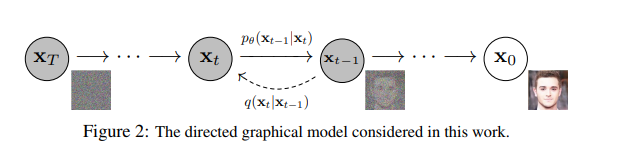

# Stable Diffusion

Author By: 李佳函

## 一、引言：AI 图像生成的革命性突破

### 1.1 为什么 Stable Diffusion 引发行业热潮？

2022 年，Stable Diffusion 的横空出世标志着 AI 行业正式迈入 AIGC（AI Generated Content）时代，成为推动行业变革的核心引擎。作为 AI 绘画领域的里程碑式模型，Stable Diffusion 不仅实现了文生图（txt2img）和图生图（img2img）等核心功能，更以全面开源的策略彻底改变了 AI 技术的传播与应用模式。

Stable Diffusion（简称 SD）是 AI 绘画领域的一个核心模型，能够进行文生图（txt2img）和图生图（img2img）等图像生成任务。并且，Stable Diffusion 完全开源（模型、代码、数据、论文、生态等），这使得其能快速构建强大繁荣的上下游生态（AI 绘画社区、基于 SD 的自训练 AI 绘画模型、丰富的辅助 AI 绘画工具与插件等），并且吸引了越来越多的 AI 绘画爱好者加入其中，与 AI 行业从业者一起推动 AIGC 领域的发展与普惠。

Stable Diffusion 的真正革命性在于它实现了 AI 技术的 ToC 普惠——让普通用户也能轻松参与内容创作，使 AI 绘画真正融入全球日常生活。这与传统深度学习时代"技术精英化"的模式形成鲜明对比，标志着 AIGC 从工业级应用迈向大众化创作的转折点。

正是这种开放、共享、共创的模式，为未来十五年 AI 技术的爆发性发展奠定了基础。当开源生态与大众创作热情相互激发，我们正见证着一个与移动互联网时代同等重要的技术变革浪潮正在形成。Stable Diffusion 不仅是一个模型，更是开启 AI 普惠新时代的钥匙，预示着 AI 将如互联网一样，成为每个人日常生活与工作中的基础工具。

### 1.2 从 DALL·E 到 Stable Diffusion：图像生成技术演进简史

图像生成技术的发展史，在近几年大模型和算力的飞速发展下，日新月异。

2021 年，OpenAI 推出的 DALL·E 及其后续版本，首次实现了文本到图像的高质量生成，但其计算需求极高，仅限于大型科技公司和研究机构使用。这些模型需要强大的计算资源，生成一张高质量图像往往需要数分钟甚至更长时间，价格也相当昂贵。

2022 年下半年，Stable Diffusion 的开源成为行业分水岭。它基于 Latent Diffusion 架构，将图像压缩到潜在空间进行扩散过程，大幅降低了计算需求。这一技术突破使得 Stable Diffusion 能在消费级 GPU 上运行，单次生成时间从分钟级缩短至秒级，成本近乎为零。

Stable Diffusion 的开源策略更是点燃了行业热情。GitHub 上短短几个月内涌现出大量基于该模型的二次开发项目，形成了完整的生态系统。这与 DALL·E 等闭源模型形成了鲜明对比，后者需要通过 API 调用，限制了开发者的自由度和创新空间。

## 二、Stable Diffusion 基础认知

### 2.1 什么是 Stable Diffusion？—— 一句话定义

### 2.2 核心优势：开源、高效、低门槛
### 2.3 与传统 AI 图像工具的关键区别

## 三、核心技术原理深度解析

### 3.1 扩散模型基础 DDPM：噪声添加与逆转过程

想象一下，你有一张清晰的图片，但想通过某种方式"忘记"它的细节，让它变成一团模糊的噪声。然后，你再尝试从这团噪声中"重建"出原来的图片。扩散模型就是通过这样的"破坏-重建"过程来学习生成新图像的。

DDPM 全称是 Denoising Diffusion Probabilistic Models，最开始提出是用于去噪领域。原始论文中数学公式比较多，需要一定的数理基础。

扩散模型的精髓在于：它不是直接学习如何生成图像，而是学习如何从噪声中恢复图像。 这种思路与传统的 GAN 或 VAE 完全不同，它通过一个渐进的过程来实现。

扩散模型包括两个过程：前向过程（forward process）和反向过程（reverse process），其中前向过程又称为扩散过程（diffusion process）。

如图所示，从 $X_0$ 到 $X_t$ 的过程，其实就是不断地给真实图片加噪声，经过 $T$ 步加噪之后，噪声强度不断变大，得到一张完全为噪声地图像。整个扩散过程可以近似看成一次加噪即变为噪声图，那么其实我们只需要搞清楚其中一步加噪就可以了。

$f(x)$ 在公式中有明确的定义：
$$X_t=\sqrt{1-\beta_t}*X_{t-1}+\sqrt{\beta_t}*Z_t\quad Z_t\sim N(0,I)$$

$t$ 是时间序列中一个值，取值范围为是 $[0, T]$ 对应时间产生的随机噪声，$β_t$ 是超参数，也是序列中的一个值，在论文的实验部分，其经验值范围是 $[10^{-4},0.02]$ 线性变化，而且一般来说，$t$ 越大，$β_t$ 的取值也就越大（一开始，加一点点噪声就能比较明显的看出和原图的区别，越到后面，图像退化的越厉害，轻微的扰动已经看不出明显的变化，所以 $β_t$ 的值需要更大）

训练的时候，为了提升训练效率，可以直接从 $X_0$ 扩散成 $X_t$。经过复杂的公式推理，即可得到

$$X_t=\sqrt{\overline{\alpha_t}}*X_0+\sqrt{1-\overline{\alpha_t}}*Z  \quad Z \sim N(\sqrt{\alpha_t}*X_0,(1-\overline{\alpha_t})*I)$$

### 3.2 Stable Diffusion 的创新架构

#### 3.2.1 U-Net 主干网络的作用
#### 3.2.2 CLIP 文本编码器的智能融合
#### 3.2.3 VAE 编码器的图像压缩机制
### 3.3 为什么它能实现高质量生成？