# BLIP 家族: 统一理解和生成的自举多模态模型

Author By: 李佳函

## 引言

### 核心挑战

在 BLIP 提出前，视觉-语言预训练领域已有 CLIP、ALBEF 等代表性工作，但仍存在两个关键瓶颈：

+ 问题一：**任务能力割裂**
  + **架构局限性**。没有一个模型既可以做检索又可以做生成。
    - **Encoder-only 模型**（如 CLIP）：  
    擅长图文检索等理解任务，但无法执行文本生成任务（如图像字幕生成）
    - **Encoder-Decoder 模型**：  
    支持生成任务，但难以有效应用于图像-文本检索任务
  + **根本矛盾**：理解任务需深度跨模态交互，生成任务需自回归建模，传统架构无法同时优化两种目标。
+ 问题二：**数据噪声污染**。过往的这些多模态 SOTA 模型，都是在网络上爬取大量的数据进行预训练的。由于数据量够大，训练效果也差强人意。但这些噪声数据对于模型的训练来说是非常不利的，如果可以提取到更纯净的数据进行训练，模型的性能还可以进一步提升。

### BLIP 的诞生

基于此问题现象，BLIP 诞生了。BLIP 的作者也是 ALBEF 的作者，因此可以在 BLIP 上看到很多 ALBEF 的影子。

该模型的核心思想主要有两个：

1. **论文提出核心架构——多模态混合编码器-解码器（Multimodal Mixture of Encoder-Decoder, MED）采用双流结构设计**，通过共享参数支持三种模式——单模态编码器（对齐全局特征）、跨模态编码器（细粒度匹配）和跨模态解码器（生成描述），联合优化图像-文本对比（ITC）、匹配（ITM）和语言建模（LM）损失，从而统一理解（如检索）与生成（如描述）任务。
2. **数据层面设计 Captioning 和 Filtering（CapFilt）方法**，利用预训练（使用网上获取的有噪声的数据）的 MED 生成合成描述（Captioner 模块）并过滤原始网络文本与合成文本中的噪声（Filter 模块），从噪声数据中提炼高质量训练样本。

## 模型架构设计

### MED

MED 全称为 Multimodal Mixture of Encoder-Decoder，是一个可以完成三个任务的复合型模型。

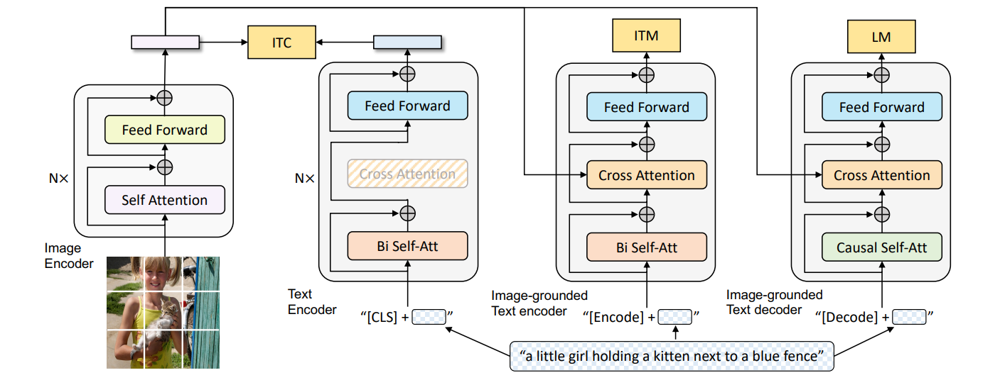

如图所示，总共有四个模块，从左往右，分别为两个单模态编码器：图像编码器和文本编码器，两个多模态编码器：基于图像的文本编码器和解码器。

#### 图像编码器（Unimodal Image Encoder）

+ 架构：基于 Transformer 的视觉编码器（ViT），将图像划分为固定大小的 patch（如 224×224 分辨率下分割为 14×14 的 196 个 patch），每个 patch 被线性嵌入为向量。
+ 关键设计：
  + 全局特征提取：在输入序列中添加一个特殊的[CLS]标记（Global Image Token），用于捕捉图像的整体语义信息。
  + 动量编码器：在对比学习（ITC 任务）中，引入了 ALBEF 的做法即动量编码器（Momentum Encoder）生成软标签，增强负样本的鲁棒性。
+ 输出：生成图像的嵌入向量序列（包括[CLS]标记的特征），作为后续多模态模块的输入。
> 软标签即为概率值，不是像硬标签那样的非 1 即 0。使用软标签可以让模型学习到更细粒度的语义信息，而不是简单地二值化判断。

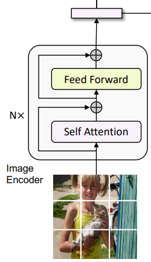

#### 文本编码器（Unimodal Text Encoder）

+ 功能：将文本序列编码为上下文感知的特征表示。
+ 架构：基于 BERT 的 Transformer 编码器，对文本进行双向自注意力建模。
+ 关键设计：
  + 文本结构化：在文本开头插入[CLS]标记，用于聚合整个文本的全局信息。
  + 单模态对齐：通过图像-文本对比损失（ITC）与图像编码器的特征空间对齐。
+ 输出：生成文本的嵌入向量序列（包括[CLS]标记的特征），用于图像-文本匹配（ITM）或跨模态交互。
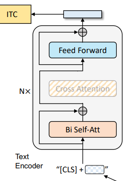

#### 基于图像的文本编码器（Image-Grounded Text Encoder）

+ 功能：融合图像信息与文本信息，生成多模态联合表示。
+ 架构：在标准文本编码器的基础上，插入交叉注意力层（Cross-Attention Layer）。
  + 结构细节：
    + 在每个 Transformer 块的自注意力层（Self-Attention, SA）和前馈网络（FFN）之间，增加一个交叉注意力层（Cross-Attention, CA）。
    + CA 层的作用：以图像编码器的输出作为 query，文本编码器的中间表示作为 key 和 value，实现视觉信息向文本的注入。
  + 任务特定标记：在文本输入中插入一个任务专用的[Encode]标记，其最终输出作为多模态表示的核心。
+ 关键任务：
  + 图像-文本匹配（ITM）：通过二分类头部（ITM Head）判断图像-文本对是否匹配。
  + 多模态检索：生成跨模态嵌入向量，用于图像与文本的相似度计算。

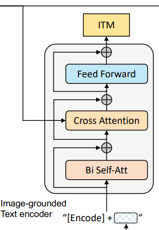

#### 基于图像的文本解码器（Image-Grounded Text Decoder）

+ 功能：以图像为条件生成连贯的文本描述（如图像字幕）。
+ 架构：基于 Transformer 的解码器，采用因果掩码自注意力（Causal Self-Attention），即 decoder 只与之前出现的 token 进行 attention 操作。
  + 结构细节：
    + 替换标准解码器的双向自注意力为因果掩码自注意力，确保生成过程的顺序性（仅依赖历史和当前 token）。
    + 跨模态注意力：在解码器中引入交叉注意力层，直接利用图像编码器的输出作为视觉上下文。
  + 任务特定标记：在文本生成时，使用[Decode]标记作为序列的起始信号。结尾需要添加一个[EOS]字符。
+ 关键任务：
  + 图像条件语言建模（LM）：通过最大化给定图像下文本序列的似然，训练模型生成与图像内容一致的描述。
  + 多任务生成：支持图像描述生成、视觉问答（VQA）等需要生成能力的任务。

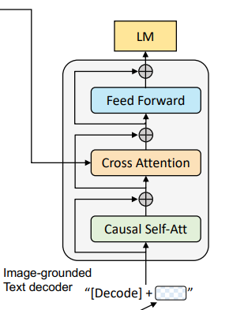

### 预训练目标

以上的四个模块，第一个作为图像编码器，另外三个作为文本的编码/解码器，共同组成了三个任务：ITC、ITM、LM。

| 损失函数            | 作用             | 对应模块 |
| :------------------ | :--------------- | :------- |
| ITC（图文对比损失） | 对齐图文特征空间 | 编码器   |
| ITM（图文匹配损失） | 细粒度图文匹配   | 编码器   |
| LM（语言建模损失）  | 生成连贯文本描述 | 解码器   |

具体的模块在上文中有具体讲解，下文中具体介绍任务。

#### 图像编码器+单模态文本编码器：ITC 任务

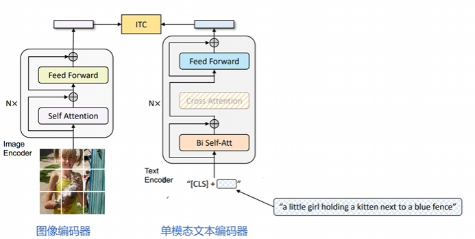

+ 核心目标：通过对比学习对齐视觉和文本特征空间，使正向图像-文本对的表征更相似，负向对的表征差异更大。
+ 图像端：采用 ViT（Vision Transformer）模型，将输入图像划分为固定大小的 patch（如 224×224 分辨率下分割为 196 个 patch），每个 patch 被线性嵌入为向量。输出包含一个全局图像标记[CLS]的嵌入向量。
+ 文本端：基于 BERT 的 Transformer 编码器，对文本进行双向自注意力建模。在文本开头插入[CLS]标记，用于聚合整个文本的全局信息。输出文本的嵌入向量序列（包括[CLS]标记的特征）。
+ 损失函数：
$$\mathcal{L}_{\mathrm{ITC}}=-\frac{1}{N} \sum_{i=1}^{N}\left[\log \frac{\exp \left(\operatorname{sim}\left(I_{i}, T_{i}\right) / \tau\right)}{\sum_{j=1}^{N} \exp \left(\operatorname{sim}\left(I_{i}, T_{j}\right) / \tau\right)}+\log \frac{\exp \left(\operatorname{sim}\left(T_{i}, I_{i}\right) / \tau\right)}{\sum_{j=1}^{N} \exp \left(\operatorname{sim}\left(T_{i}, I_{j}\right) / \tau\right)}\right]$$

其中：
$I_i$：第 $i$ 个图像的特征向量（通过 ViT 提取的[CLS]标记）。
$T_i$：第 $i$ 个图像的特征向量（通过 BERT 提取的[CLS]标记）。
$sim(⋅,⋅)$：余弦相似度函数。
$τ$：温度参数（通常设为 0.05），用于调整相似度分布的锐度。
该损失函数采用双向对比，分别计算图像到文本和文本到图像的对比损失，并取平均。

#### 图像编码器+多模态文本编码器：ITM 任务

+ 核心目标：学习图像与文本之间的细粒度对齐，判断图像-文本对是否匹配。通过二分类任务区分正样本（匹配）和负样本（不匹配）。
+ 图像端：同样采用 ViT 模型提取图像特征，但需与文本编码器联合计算交叉注意力。输出图像的嵌入向量序列，作为多模态交互的基础。
+ 文本端：基于 BERT 的 Transformer 编码器，在标准自注意力层（SA）和前馈网络（FFN）之间插入交叉注意力层（CA）。通过 CA 层将图像特征注入文本表示，实现视觉信息与文本的细粒度对齐。在文本输入中插入任务专用的[Encode]标记，其最终输出作为多模态表示的核心。
+ 损失函数：
$$\mathcal{L}_{\text {ITM }}=-\frac{1}{N} \sum_{i=1}^{N}\left[y_{i} \log p_{i}+\left(1-y_{i}\right) \log \left(1-p_{i}\right)\right]$$

其中：
$y_i∈ \{0,1\}$：第 $i$ 个图像-文本对的标签（1 表示匹配，0 表示不匹配）。
$p_i$：模型预测的匹配概率，由 ITM 头部（线性分类层）输出。
$N$：当前 batch 的样本数。
该损失函数采用交叉熵损失函数，做二分类任务，确保模型能够区分匹配与不匹配的图像-文本对。

#### 图像编码器+多模态文本解码器：LM 任务

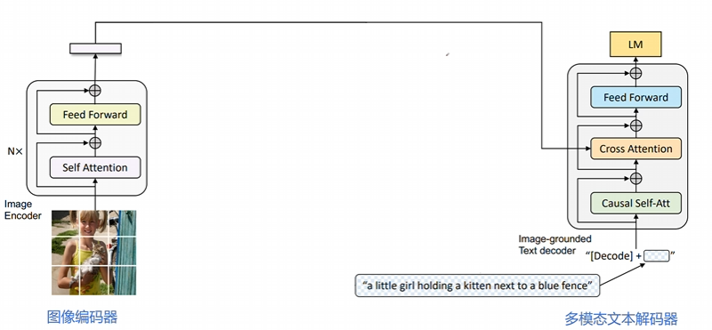

+ 核心目标：基于图像生成连贯的文本描述（如图像字幕）。通过自回归建模，最大化给定图像下文本序列的似然。
+ 图像端：采用 ViT 模型提取图像特征，作为文本生成的上下文条件。输出图像的嵌入向量序列，供解码器直接使用。
+ 文本端：基于 Transformer 的解码器架构，采用因果掩码自注意力（Causal Self-Attention），确保生成过程的顺序性。在文本生成时，使用[Decode]标记作为序列的起始信号。通过交叉注意力层（CA）直接利用图像特征作为视觉上下文，实现图像到文本的连贯生成。
+ 损失函数：
$$\mathcal{L}_{\mathrm{LM}}=-\frac{1}{L}\sum_{t=1}^{L}\log p(t_{t}\mid t_{<t},I)$$

其中：
$t_t$：第 $t$ 个时刻生成的 token（如文本中的第 t 个词）
$t_{<t}$：已经生成的前 $t-1$ 个 token
$I$：输入图像的特征向量（通过 ViT 提取的特征）。
$L$：生成文本的总长度（最大长度或实际长度）。

#### 损失函数的联合优化

BLIP 通过联合优化这三个损失函数，实现多模态理解和生成能力的统一训练：
$$\mathcal{L}_{\mathrm{Total}}=\alpha\mathcal{L}_{\mathrm{ITC}}+\beta\mathcal{L}_{\mathrm{ITM}}+\gamma\mathcal{L}_{\mathrm{LM}}$$
其中，$α,β,γ$ 是权重系数（通常设为 1 或通过实验调整）。

## 数据自举(data Bootstrapping)：CapFilt

CapFilt（Captioning and Filtering）是 BLIP 提出的一种数据清洗与生成的自举机制，旨在解决从网络爬取的图像-文本对中存在噪声的问题。CapFilt 由两部分组成：Captioner（生成器）和 Filter（过滤器）。

### Captioner（生成器）

+ 功能：为图像生成高质量文本描述。

+ 实现方式：
  + 使用图像引导的文本解码器（基于 Transformer 的解码器架构）。
  + 采用因果掩码自注意力（Causal Self-Attention），确保生成过程的顺序性。
+ 训练目标：通过 LM 损失函数，优化生成能力。

### Filter（过滤器）

+ 功能：评估图文对匹配度，过滤掉噪声样本。
+ 实现方式：
  + 使用图像引导的文本编码器（基于 BERT 的编码器架构）。
  + 采用二分类任务（ITM Loss）判断匹配性（1 表示匹配，0 表示不匹配）。
+ 训练目标：通过图文匹配损失（ITM Loss）和对比学习损失（ITC Loss）优化判别能力。

### 工作流程

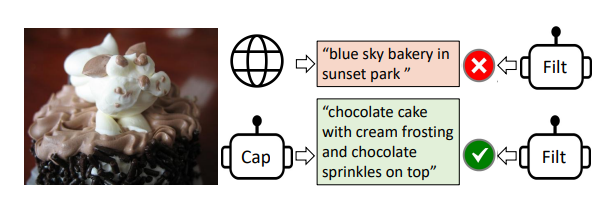

先来看一个简单的例子。
如图，Captioner 生成的描述为："chocolate cake with cream frosting and chocolate sprinkles on top".
而网络上的文本为："blue sky bakery in sunset park".
通过 Filter，判断出 Captioner 与图片匹配。于是就将原本网络文本对中的文本改变成了新生成的，再进行后续的训练操作。

接下来具体讲解该流程。

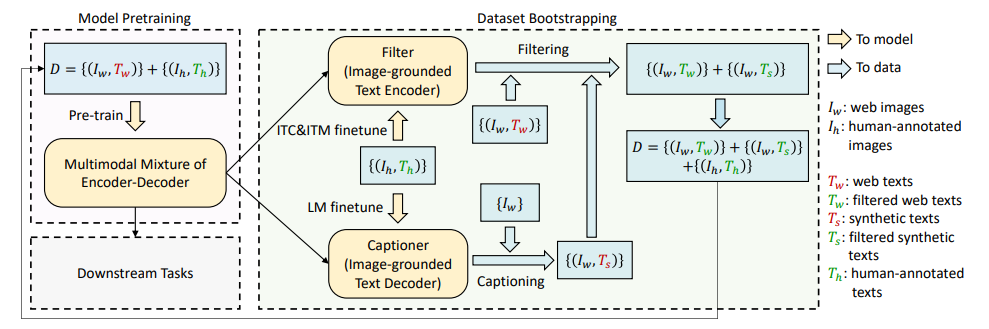

1. **初始化阶段**
Captioner 和 Filter 均从预训练的 MED 模型中初始化，确保初始参数具备一定的多模态对齐能力。
1. **数据生成与过滤阶段**
对于网络上爬取的噪声图像，使用**Captioner**生成文本描述（合成文本），同时保留原始网络文本（可能存在噪声）。
将生成的合成文本和网络文本分别输入**Filter**，过滤掉 Filter 认为不匹配的样本。
1. **数据集构建**
将以下三类样本合并，形成新的高质量训练数据集：
   + 人工标注数据（如 COCO）。图片中即 $\{I_h, T_h\}$
   + Filter 筛选后的原始网络数据。图片中即 $\{I_w, T_w\}$
   + Filter 筛选后的合成数据。图片中即 $\{I_w, T_s\}$
1. **迭代优化阶段**
使用新构建的高质量数据集重新训练 BLIP 模型（MED 架构）。重复“生成→过滤→训练”过程，逐步提升模型性能和数据质量。

### 实验结果

在 BLIP 的论文中，CapFilt 机制被验证能够显著提升模型性能：

+ **图像-文本检索**：在 COCO、Flickr30K 等数据集上，CapFilt 使 BLIP 的检索精度（Recall@K）提升 10%-15%。
+ **图像字幕生成**：在 COCO 测试集上，CapFilt 使 BLIP 的 CIDEr 得分提升 8%-12%。
+ **视觉问答**：在 VQA 2.0 数据集上，CapFilt 使 BLIP 的准确率提升 5%-7%。
+ **鲁棒性**：在噪声数据场景下，CapFilt 显著提升了模型对错误文本的容忍能力。
  
| 方法             | 数据来源               | 数据质量 | 训练成本 | 模型性能 |
| :--------------- | :--------------------- | :------- | :------- | :------- |
| 传统方法         | 人工标注数据           | 高       | 高       | 中       |
| 直接使用噪声数据 | 网络爬取数据           | 低       | 低       | 低       |
| CapFilt          | 人工+噪声数据+合成数据 | 高       | 中       | 高       |

## BLIP 的局限性

BLIP 通过**架构创新**、**数据自举**和**任务统一**的设计，重新定义了多模态预训练模型的能力边界。它不仅为视觉-语言任务提供了高效解决方案，还为多模态学习提供了可复用的技术范式。但其端到端训练方式对计算资源需求较高，需要训练多次模型。同时，BLIP 的架构限制了视觉编码器和语言模型的选择，适配性不足。

于是衍生出来了一个问题：如何**在不重新训练图像编码器和语言模型**的前提下，提升模型的效率与泛化能力？

## BLIP-2

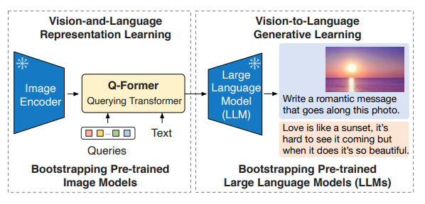

在 23 年，同作者推出了 BLIP-2。其通过冻结预训练模型（如 ViT 和 LLM），仅引入轻量级的 Q-Former（Querying Transformer）作为“桥梁”，降低训练成本。

### 核心思想设计

BLIP2 的核心创新在于解耦式架构，主要通过以下几点实现高效的训练和跨模态对齐：

+ **冻结预训练模型：**
  + 使用已有的高质量预训练模型，在预训练和推理过程中保持参数固定。
  + 仅仅引入轻量级的**Q-Former**，作为可训练模块，负责跨模态对齐。
+ **两阶段预训练策略：**
  + 第一阶段：视觉-语言表征学习（Vision-Language Representation Learning），训练 Q-Former 提取与文本相关的视觉特征。
  + 第二阶段：视觉到语言的生成学习（Vision-to-Language Generative Learning），通过 LLM 引导 Q-Former 生成自然语言描述。
+ **通用性与扩展性：**
  + BLIP2 的架构支持多种图像编码器（如 ViT、CLIP）和 LLM（如 Flan-T5、LLaMA），通过替换不同组件即可适配最新技术。

### 模型结构详解：Q-Former（Querying Transformer）

Q-Former 的核心结构如图：
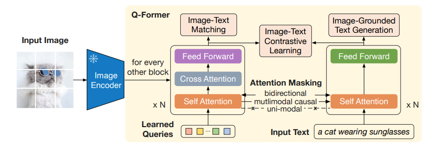

作为视觉和语言模态之间的桥梁，它共分为了两只 Transformer。

+ 图像分支（Image Transformer），即左边的 Transformer
  + 输入一组可学习的查询嵌入（Learned Queries）（默认 32 个）。
  + 图像 Transformer 负责与 Frozen Image Encoder 交互，融合 Learned Queries 和 Input Image 中的信息，提取图像特征。通过自注意力（Self-Attention）和交叉注意力（Cross-Attention）与图像编码器的输出交互，提取视觉特征。
+ 文本分支（Text Transformer），即右边的 Transformer
  + 同时处理文本输入（如问题或指令），与图像分支共享自注意力层。
  + 根据任务需求，通过不同的注意力掩码（Mask）控制图像和文本的交互方式。

**Learned Queries**

Learned Queries 是一组可学习的"查询向量"，在经过 Self Attention 后，在 Cross Attention 中作为 Q，与图像融合。在实验中，共使用了 32 个查询，每个查询有 768 维。总共参数共包含 1.88 亿个参数，远小于冻结图像特征的大小。这种瓶颈结构与预训练目标一起工作，迫使查询提取**与文本最相关的视觉信息**。

### 预训练过程

#### 第一阶段：视觉-语言表征学习

##### ITC 任务

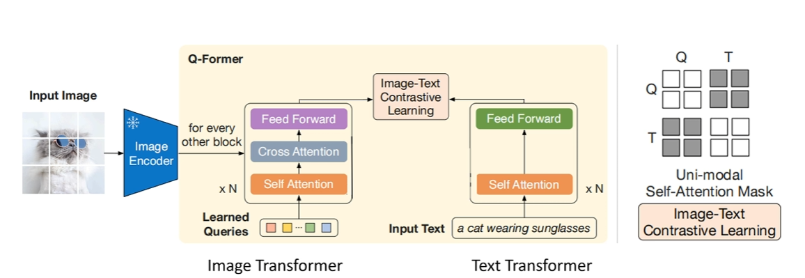

**目标**：对齐图像和文本的全局特征，最大化匹配图文对的相似度，最小化不匹配对的相似度。

**处理流程**：
+ 图像特征提取：
  + Queries 通过 Cross-Attention 与图像特征交互，生成 32 个图像特征（image_feats）。
  + 每个 Query 单独与图像交互，提取局部或全局视觉信息。
+ 文本特征提取：
  + 文本通过 Q-Former 的 Text Transformer 处理，生成文本特征（text_feat），通常取[CLS] token 的特征。
+ 对比学习：
  + 计算 32 个 image_feats 与 text_feat 的相似度（如余弦相似度）。
  + 选择最大相似度作为图文对的匹配度（避免信息泄露）。
  + 通过 InfoNCE 损失（对比损失）优化，拉近匹配对，推远不匹配对。

**掩码策略**

+ 单模态掩码（Queries 与文本互不可见）：
  + Queries 仅通过 Self-Attention 交互，文本仅通过 Self-Attention 处理。
  + 防止 Queries 直接访问文本信息，**确保特征独立提取**。

##### ITM 任务

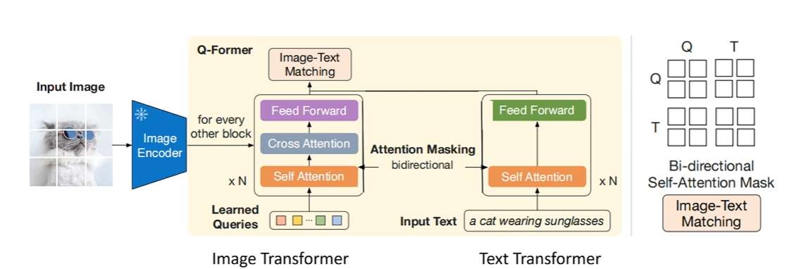

**目标**：判断图像和文本是否匹配（二分类任务，正样本为匹配，负样本为不匹配）

Learned Queries：32 个 Queries，**与文本拼接后送入 Q-Former**。

**处理流程**：
+ 多模态输入：
  + 将 Queries 与文本嵌入拼接为一个序列（Queries 在前，文本在后）。
  + 例如：`[Query_1, Query_2, ..., Query_32, Text_1, Text_2, ..., Text_n]`。
+ 双向交互：
  + Q-Former 的 Image Transformer 处理拼接后的序列，通过双向自注意掩码（Queries 与文本互可见）。
  + 允许 Queries 和文本标记之间互相感知，捕捉细粒度对齐信息。
+ 分类预测：
  + 对 Queries 的输出向量取平均（或池化），输入二分类器（线性层）。
  + 输出匹配概率（0/1），判断图文是否匹配。

**掩码策略**：**双向自注意掩码**，Queries 与文本相互可见。这样设计，可以允许 Queries 和文本标记之间互相感知，从而捕捉图像和文本的局部交互

##### ITG 任务

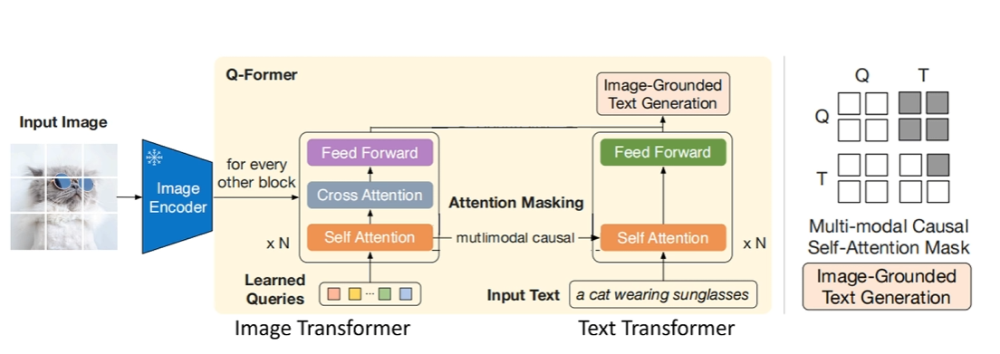

**目标**：基于图像生成文本（如图像描述），训练 Q-Former 提取图像特征并引导文本生成。

**处理流程**：
+ 图像特征提取：
    + Queries 通过 Self-Attention 和 Cross-Attention 与图像特征交互，提取视觉信息。
+ 文本生成：
  + Q-Former 的 Text Transformer 作为解码器，生成文本序列。
  + 使用多模态因果掩码（Queries 可相互感知，文本只能访问历史信息）。
  + 每个文本标记只能看到 Queries 和前面的文本标记，类似语言模型的自回归生成。
+ 语言建模损失：
  + 计算文本生成的负对数似然损失（NLL Loss），优化生成质量。

**掩码策略**：多模态因果掩码（Queries 互可见，文本只能看过去信息）。
+ 文本生成需要逐步预测下一个词，因此必须限制文本标记只能访问自身及前面的标记（Causal Attention）
+ 多模态因果掩码确保文本生成依赖 Queries 提取的图像特征和已生成的历史文本，符合语言模型的自回归特性。

#### 第二阶段：视觉到语言的生成学习

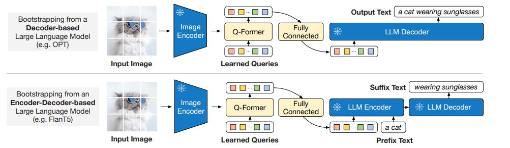

第二阶段的核心目标是：
+ **将 Q-Former 提取的图像特征转换为 LLM 可理解的输入格式**。
+ **生成与图像内容一致的文本**：通过语言建模任务（Language Modeling）训练 Q-Former，使其输出能够引导 LLM 生成高质量的文本描述（如图像描述、问答答案等）。

**训练方法**

+ **输入**：
  + 图像特征：由 Q-Former 从冻结的图像编码器中提取的视觉特征。
  + 文本：目标文本。
+ **处理流程**：
  + Q-Former 输出视觉特征：
    + Q-Former 在第一阶段训练后，已能提取与文本最相关的视觉特征。
    + 这些特征通过全连接层（FC）映射到与 LLM 输入维度一致的向量空间。
  + 论文中实验了两种 LLM：
    + **无监督训练的 OPT 作为 Decoder-based LLM**，使用语言建模损失（language modeling loss）进行预训练，冻结的 LLM 的任务是根据 Q-Former 的视觉表示生成文本，也就是说直接根据图像生成文本
    + **基于指令训练的 FlanT5 作为 Encoder-Decoder-based LLM**：使用前缀语言模型损失（Prefix Language Modeling Loss）优化生成效果。将文本分为两部分：前缀文本（作为 LLM 编码器的输入）和后缀文本（作为 LLM 解码器的生成目标）。前缀文本与 Q-Former 的视觉特征拼接，作为编码器的输入；后缀文本由解码器生成。在训练过程中，模型的任务是根据输入的前缀文本和图像表示来生成后缀文本。也就是说，模型通过 **前缀文本+视觉表示** 来生成 **后续的文本描述**。能够处理 **更复杂的多模态任务**，适合需要 **图像和文本交互理解** 的任务。

### BLIP2-总结

BLIP2 的第二阶段训练通过 Q-Former 将图像特征适配到 LLM，实现了高效的视觉-语言生成能力。其核心思想是冻结单模态模型，仅训练轻量级的 Q-Former 模块，从而降低计算成本并提升模型的零样本泛化能力。这一设计使得 BLIP2 在资源有限的场景下仍能实现 SOTA 的多模态性能，成为视觉-语言预训练的代表性方法。

## Instruct-BLIP

InstructBLIP 是 BLIP 作者团队在多模态领域的又一续作。InstructBLIP 这个工作介绍了如何把指令微调的范式做在 BLIP-2 模型上面。用指令微调方法的时候会额外有一条 instruction，如何借助这个 instruction 提取更有用的视觉特征是本文的亮点之一。所以，该模型的主要提升点在于通用性和零样本（zero-shot）泛化能力。

作者将 26 个数据集转化为指令微调的格式，把它们分成 13 个 held-in 数据集用于指令微调，和 13 个 held-out 数据集用于 Zero-Shot 能力的评估。

### 模型结构

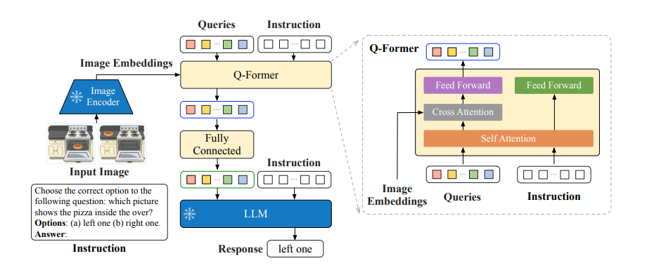

Instruct-BLIP 的结构如上图所示，基本和 BLIP2 保持一致。总共由三部分组成：
+ 冻结的图像编码器（如 CLIP 的视觉部分）：负责提取图像特征。
+ 查询转换器（Q-Former）：从图像中提取与指令相关的特征，并将其作为软提示（soft prompt）输入到语言模型。
+ 冻结的语言模型（LLM）：如 Flan-T5 或 Vicuna，负责生成文本输出。

此外，Q-Former 的输入还包括可学习的 Queries (BLIP-2 的做法) 和 Instruction。其中，可学习的 Queries 通过 Self-Attention 和 Instruction 交互，可学习的 Queries 通过 Cross-Attention 和输入图片的特征交互，鼓励提取与任务相关的图像特征。

### 训练策略

在数据集选型上，使用了 26 个公开数据集，涵盖 11 类视觉-语言任务（如图像描述、视觉问答、视觉推理、视频问答、图像分类等）。数据集划分如下：
+ 13 个 held-in 数据集：用于指令微调训练。
+ 13 个 held-out 数据集：用于零样本（zero-shot）评估，验证模型对未见任务的泛化能力。
+ 4 个完整任务类别：保留为任务级别的零样本评估（如完全未见过的任务类型）。

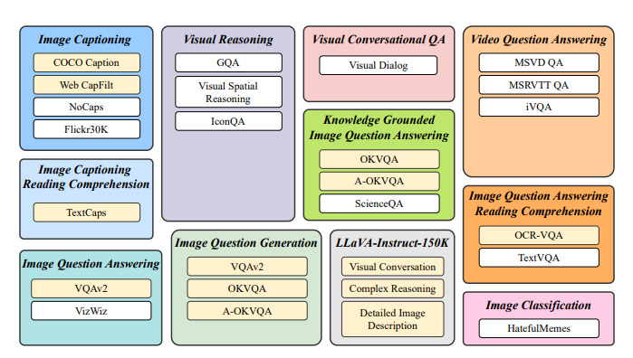

**训练的时候，分为了两个阶段**：
+ BLIP-2 预训练阶段（非指令微调）：
  + Stage 1：冻结图像编码器，预训练 Q-Former，目标是视觉语言建模（如图像描述生成）。
  + Stage 2：冻结 LLM，训练 Q-Former 和图像编码器，目标是文本生成（如看图说话）。
+ 指令微调阶段：
  + 输入格式：`<Image>` + 指令（如 "Question: What is the color of the car?"）。该文本会转换为 embedding 向量，同 queries 一起进入 self-attention。
  + 训练目标：通过语言建模损失（Language Modeling Loss）训练 Q-Former，使其生成符合指令的输出。

此外，为缓解多数据集训练中 大数据集主导训练 的问题，InstructBLIP 采用 平衡采样策略：
$$p_d=\frac{\sqrt{S_d}}{\sum_{i=1}^D\sqrt{S_i}}$$

## 总结与思考

三篇文章代表了多模态视觉-预研模型的演进路径。BLIP 奠定了基础架构，BLIP-2 通过 Q-Former 的轻量化设计与参数共享，提升了模型训练效率。InstructBLIP 则通过指令微调，进一步增强了模型的泛化能力，不仅会指导大模型生成文本，同时也会指导 image encoder 提取不同的视觉特征。