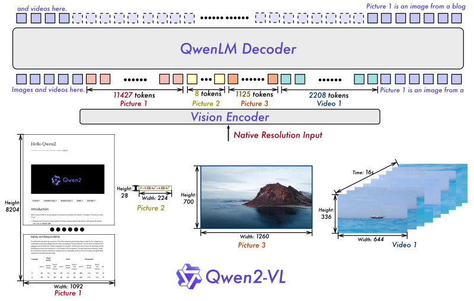
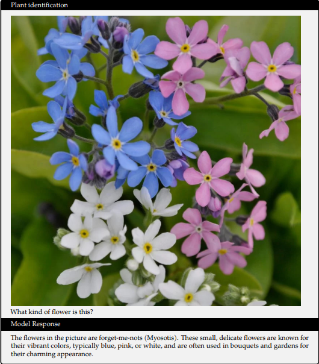
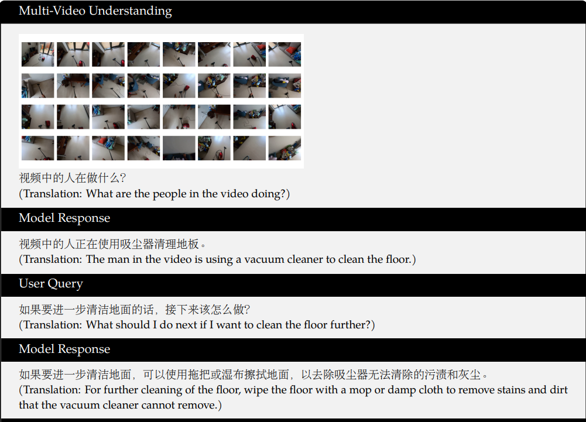
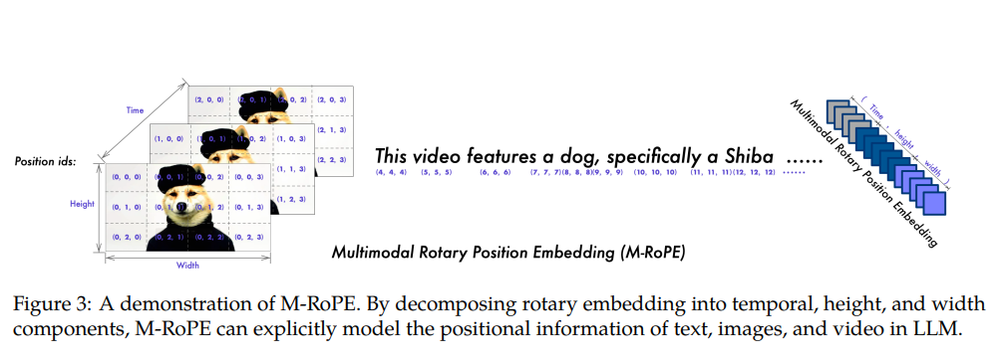
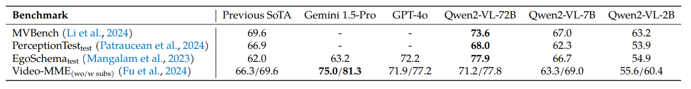
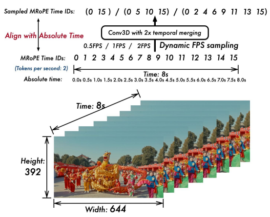
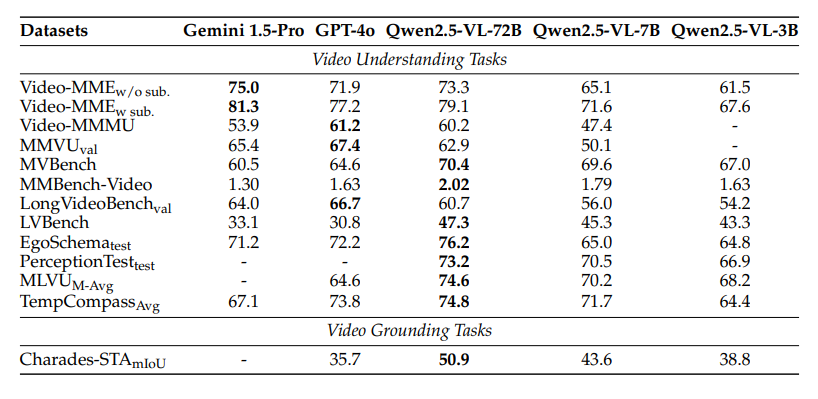
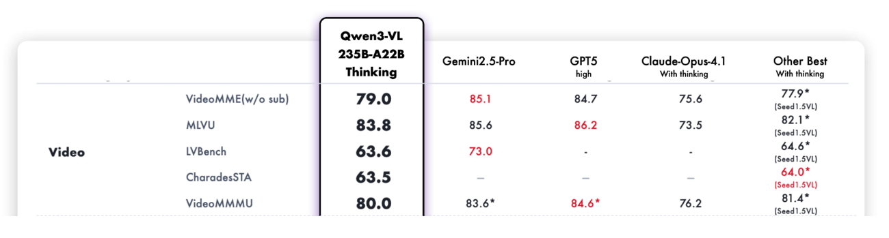
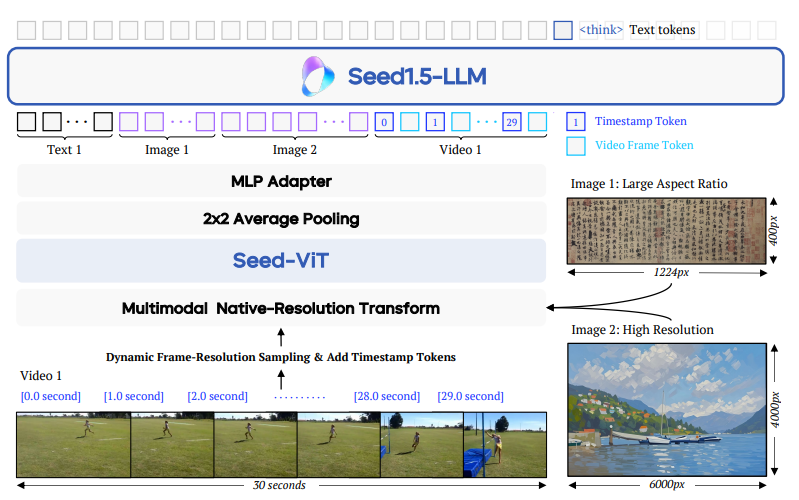
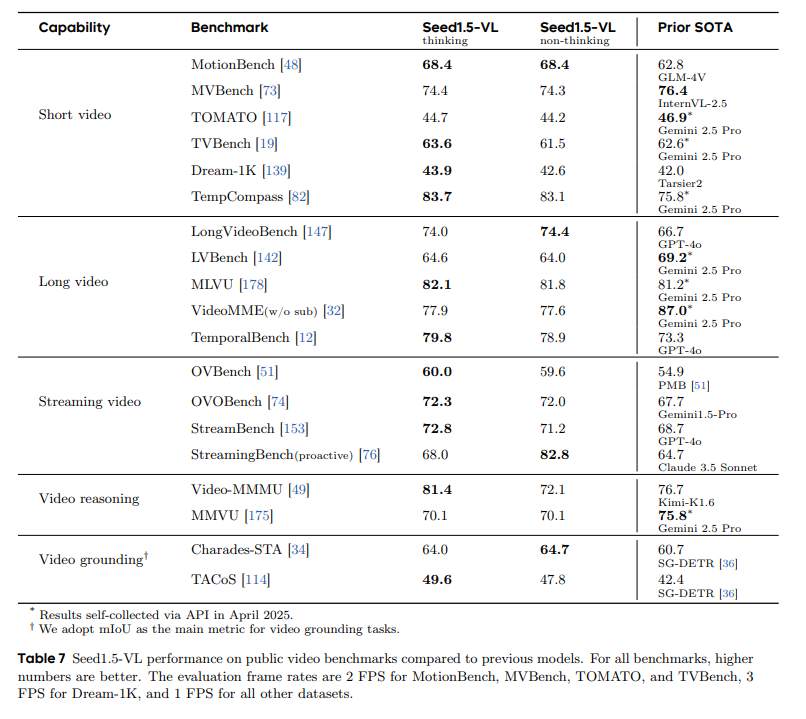

# 基于视频数据训练的视觉语言模型（VLM）在视频理解中的综述

> Author by: 李志峰

上篇文章我们回顾了视频理解从手工提特征到深度学习阶段的双流架构、3D CNN 架构、Video transformer 架构的发展，而随着多模态技术的快速发展，多模态大模型（Multimodal Large Language Models，MLLMs）在视频理解任务上表现越来越好。多模态大模型做视频理解与类似 TimeSformer 这样专门针对视频分类等任务设计的单模态模型区别在于，TimeSformer 这种单模态模型往往是在网络末端接分类头直接输出类别，而主流的 VLM 是做预测下一个 token 的生成任务，其具备的多模态能力可以结合文本实现语义级别的理解，可以通过在输入时加入“这个视频属于以下哪种类别”这样的文本 prompt 来做视频分类等任务。多模态大模型的语义级理解能力可以回答如“视频中人物为何打开冰箱”这样更复杂的问题，相较于单模态模型理解的更深。

## 1 多模态大模型结构简介

本项目有多模态大模型专属章节，本文侧重介绍多模态大模型中视频相关的部分，详细的多模态大模型内容请参照多模态大模型专属章节，这里简介以 VLM（Vision Language Model）为例多模态大模型的主要架构。 
目前主流的 VLM 结构大同小异，基本都遵循 visual encoder → cross-modal connector → LLM，即用类似 VIT 这种跨模态的结构将图、声、视频等其他模态对齐到文本模态，然后用文字模态 LLM 强大的理解能力进行自回归。主要原因有：  
 1. 文字是人类对世界语义进行结构化编码的核心载体，具备天然的精准语义锚点特性。相比图像、音频等模态依赖像素、声波等低层次特征传递信息，文字通过词汇、语法和上下文直接对应抽象概念。例如，图像中的 “狗” 需要通过像素组合间接表达，而文字 “狗” 可直接锚定该生物概念，且能通过 “棕色的拉布拉多犬” 等短语实现细粒度语义描述。这种特性使文字成为跨模态语义统一的理想中介，模型只需将其他模态特征映射到文字语义空间，即可实现不同模态间的含义关联。  
 2. 文字模态的离散化结构更适配主流深度学习架构。如 Transformer 模型天然擅长处理序列化的文字 token（如输入维度为 (bs, seq_len, d_model) 的文本数据），而图像（4 维结构）、音频（3 维结构）等模态需经过复杂转换才能适配统一框架。文字的序列特性降低了多模态融合的结构适配难度，为跨模态建模提供了便捷的技术路径。  
 3. 文字模态拥有最丰富的高质量标注数据和成熟的预训练模型生态。互联网上的文本数据（如书籍、网页、文献）不仅规模庞大，还包含大量人工标注的语义关联信息（如标题与正文、问答对），这些数据可直接用于训练模态对齐任务。相比之下，图像、视频、音频等其他模态标注数据成本极高，且规模有限。  
 4. 由于以上原因，文字模态是目前我们最擅长的模态，大模型也先从文字模态发展起来。大语言模型（LLM）经过海量文本预训练，已具备强大的语义理解和推理能力。多模态模型将其他模态对齐到文字模态，可直接复用 LLM 的语义建模能力，降低训练复杂度，无需从零构建跨模态语义体系。  

这里以结构相对较为简单的 Qwen2-VL 为例，Qwen2-VL 的结构如下图所示。
  
其中，图像、视频经过一个 Vision Encoder 编码成向量对齐到文本模态，跟文本的向量一起经过 QwenLM Decoder 进行解码做 next token prediction。输入一段文字附带图片、视频等，输出为纯文字。Qwen2-VL 输入输出示例如下图。    
图文对话：  
  
视频、文字对话：
  

## 2 主流 VLM 针对视频的优化

早期的 VLM 如 LLaVa、Qwen-VL 等 VLM，以静态图像为核心训练数据，对视频的动态时序信息捕捉能力有限，并且网络结构并非针对视频有专门的优设计，所以在视频理解任务上表现并不好。研究者开始尝试改进模型各项设计、在训练数据中加入视频数据等方式来优化。下面介绍几个 VLM 代表性工作中跟视频处理相关的内容。
 > 一些优秀的模型如 GPT5 、Gemini 系列等，其公布的报告、文档中并没有较为详细的模型结构等，因此没有在本文中列出。

### 2.1 Qwen 系列
Qwen 系列是阿里巴巴达摩院的系列开源模型。其多模态模型，第一代多模态模型 Qwen-VL 没有经过视频数据的训练，从第二代的 Qwen2-VL 开始加入了视频训练数据，并不断改进结构，使其在视频理解领域表现越来越好。

#### 2.1.1 Qwen2-VL  
Qwen2-VL 相比于 Qwen-VL 加入了视频训练数据，并针对视频改进了结构，使其能够处理超过 20 分钟的视频。

- **视频数据处理**：
 Qwen2-VL 采用混合训练方案，同时整合图像与视频数据，对视频每秒采样两帧，并使用两层 3D 卷积处理视频输入，在不增加序列长度的同时处理更多的视频帧。为保持一致性，图片被视为两个相同的帧。为平衡长视频处理的计算需求与整体训练效率，作者动态调整了每个视频帧的分辨率，将单个视频的 Token 总数限制为 16384 个。这种训练方法在模型处理长视频的能力与训练效率之间实现了平衡。

- **核心架构针对视频的改进**：
 Qwen2-VL 采用了**M-RoPE**做位置编码以增强视频处理能力。
 
 上图展示了 M-RoPE 的示意图。该机制不仅增强了位置信息的建模能力，还降低了图像与视频的位置 ID 值，使模型在推理过程中能够外推至更长的序列。其实现方式是将原始旋转嵌入分解为三个组成部分：时间维度、高度维度和宽度维度。对于文本输入，这些组件采用相同的位置 ID，使 M-RoPE 的功能等同于 1D-RoPE。处理图像时，每个视觉令牌的时间 ID 保持不变，而高度与宽度组件则根据令牌在图像中的位置分配独立 ID。对于被视为帧序列的视频，每个帧的时间 ID 递增，高度与宽度组件则遵循与图像相同的 ID 分配模式。当模型输入包含多模态数据时，各模态的位置编号通过将前一模态的最大位置 ID 递增 1 来初始化。

- **视频相关性能**：  
 Qwen2-VL 研究人员在多种视频理解任务上评估模型，相关基准涵盖从数秒短视频到长达一小时的长视频。下表展示了 Qwen2-VL 与基线模型的性能。总体而言，Qwen2-VL 在 2B、7B 和 72B 三种规模下均表现优异，其中 Qwen2-VL-72B 在 MVBench、PerceptionTest 及 EgoSchema 三项测试中均取得最佳表现。这充分展现了 Qwen2-VL 在视频理解任务中的卓越能力，且模型规模扩展能带来显著性能提升。
 

#### 2.1.2 Qwen2.5-VL    
Qwen2.5-VL 相比于 Qwen2-VL 各方面提升很大，并进一步做了一些视频相关的优化，能处理数小时的视频，在各项任务中表现更好。

- **视频数据处理**：
 为增强对不同帧率（FPS）视频数据的理解鲁棒性，作者在训练过程中动态采样帧率，使训练数据集内的帧率分布更均匀。此外，针对时长超过半小时的视频，作者通过特定合成管道整合多帧字幕，专门构建了长视频字幕集。在视频定位数据方面，作者同时采用秒制时间戳与时分秒帧（hmsf）格式，确保模型能准确理解并输出多种时间格式。

- **核心架构针对视频的改进**：
 在 Qwen2-VL 中，MRoPE 的时间位置 ID 与输入帧数绑定，未能考虑内容变化速率或视频事件的绝对时间点。为解决此局限，Qwen2.5-VL 引入关键改进：**将 MRoPE 的时间组件与绝对时间对齐**。如下图所示，通过利用时间 ID 间隔，模型能够学习不同帧率采样率视频间的一致时间对齐关系。
 

- **视频相关性能**： 
 Qwen2-VL 作者在多种视频理解任务中评估了模型，所采用的基准测试集包含时长从几秒到数小时不等的视频。在所有评估基准中，作者限制了每段视频分析的帧数上限为 768 帧，且视频标记总数不超过 24,576 个。在多个任务中，Qwen2.5-VL 都取得了卓越的成果。
 

#### 2.1.3 Qwen3-VL  
Qwen3-VL 进一步做了一些改进，视频效果更好。

- **视频相关数据与视频数据处理**： 
 关于视频数据的处理官方博客中没有提及，等官方技术报告或者论文放出，本文再跟进更新。

- **核心架构针对视频的改进**：
 Qwen3-VL 与视频相关的架构更新主要有以下两点：
 1. 采用**MRoPE-Interleave**，原始 MRoPE 将特征维度按照时间（t）、高度(h)和宽度(w)的顺序分块划分，使得时间信息全部分布在高频维度上。我们在 Qwen3-VL 中采取了 t,h,w 交错分布的形式，实现对时间，高度和宽度的全频率覆盖，这样更加鲁棒的位置编码能够保证模型在图片理解能力相当的情况下，提升对长视频的理解能力。
 2. 将原有的视频时序建模机制 T-RoPE 升级为**文本时间戳对齐机制**。该机采用“时间戳-视频帧”交错的输入形式，实现帧级别的时间信息与视觉内容的细粒度对齐。同时，模型原生支持“秒数”与“时:分:秒”(HMS)两种时间输出格式。这一改进显著提升了模型对视频中动作、事件的语义感知与时间定位精度，使其在复杂时序推理任务——如事件定位、动作边界检测、跨模态时间问答等——中表现更稳健、响应更精准。

- **视频相关性能**：  
 Qwen3-VL 的 Instruct 版和 Thingking 版在多项测评中都取得了不错的成绩，下面是视频相关评测。
 Instruct 版：
 
 Thingking 版：
 

### 2.2 Seed 系列
字节 seed1.0 没有多模态能力，Seed1.5 提供了 VL 版本模型。

#### 2.2.1 SeedVL-1.5
字节 seed 团队的首个多模态模型，针对视频做了非常多的优化，在多个榜单上都表现优异。  

- **视频数据处理**：
 视频相关预训练数据用于提升模型对视频中多帧时序图像的理解能力，包含三类核心数据。一是通用视频理解数据，涵盖视频字幕生成、视频问答、动作识别、动作定位等任务，数据来源于公开数据集和内部收集的视频 - 字幕对；二是视频时序定位与时刻检索数据，用于增强模型的时间感知能力，模型可直接根据用户提示预测视频中事件的开始和结束时间戳（默认以秒为单位）；三是视频流数据，用于理解动态连续的视频内容，包含交错字幕 / 问答数据（在视频对应时间戳插入字幕或多轮问答对）、主动推理数据（将视频问答和密集字幕数据重构为逐帧响应格式）、实时评论数据（利用时序同步的视频评论实现帧与文本的细粒度对齐）。
 视频处理策略：采用动态帧分辨率采样（Dynamic Frame-Resolution Sampling） 策略，在时间和空间维度联合优化采样方式以平衡语义丰富度与计算效率。时间维度上，根据内容复杂度和任务需求动态调整帧采样频率，默认 1 帧 / 秒，需详细时序信息的任务提升至 2 帧 / 秒，视频计数、运动跟踪等任务提升至 5 帧 / 秒，且为每个帧前置时间戳令牌（如 [1.5 second]）以增强时间感知；空间维度上，在每段视频最大 81920 令牌预算内，通过六级预定义分辨率（{640, 512, 384, 256, 160, 128}）动态分配每帧令牌数，超长视频若用最低分辨率（128 令牌 / 帧）仍超编码长度，则通过均匀采样减少总帧数，以保留关键时序信息。

- **核心架构针对视频的改进**：
 Seed1.5-VL 的架构如下图：  
    
 是主流的 VLM 结构：visual encoder → cross-modal connector → LLM 。针对视频输入，在视觉编码基础上新增动态帧分辨率采样和时间戳令牌嵌入机制，前者动态调整采样帧率与分辨率，后者在每帧前添加时间戳令牌以强化模型对视频时序关系的理解，确保模型能有效处理视频的时空动态特征。此外，模型在预训练阶段融入视频数据，使视觉编码器不仅能学习图像的空间特征，还能捕捉视频的时空动态信息，提升对动态场景和复杂视觉内容的处理能力。

- **视频相关性能**：  
Seed1.5-VL 在多项视频测评中取得优异成绩。下表是 Seed1.5-VL 技术报告中在公共视频基准测试中的性能与先前较优秀模型的对比。评估帧率设置为：MotionBench、MVBench、TOMATO 和 TVBench 采用 2 帧/秒，Dream-1K 采用 3 帧/秒，其余数据集均采用 1 帧/秒。  
    

### 2.3 Intern 系列
Intern（书生）系列是上海人工智能实验室牵头的大模型项目，其中的多模态项目 OpenGVlab 开源了一系列优秀的模型和数据集。其多模态模型 InternVL 系列和专门针对视频的 In

#### 2.3.1 InternVL3.5
InturnVL3.5 之前的 InturnVL 系列模型以及 Inturn 团队专门针对视频的 InturnVidio、InturnVideo2 在视频表现也不错，但跟前面介绍过的主流 VLM 模型区别不太大，这里不再赘述。本文重点介绍最新的 InturnVL3.5。
- **视频数据处理**：
 InternVL3.5 针对视频数据的时序性、高帧数量及分辨率差异特性，设计了分层级的数据预处理流程，确保多帧信息有效保留的同时降低冗余计算：
 1.**动态帧采样与分辨率适配**:支持多档位帧采样配置（16/32/48/64 帧），在不同视频理解基准中灵活选择最优帧数量（如 MVBench 固定采用 16 帧，VideoMME 则测试多帧配置并取最优结果），平衡时序信息完整性与计算成本。同时继承动态高分辨率策略（如将输入视频帧调整为 896×1344 等匹配 2:3 的预设宽高比），避免固定分辨率导致的细节丢失或拉伸失真。
 2.**视觉 token 压缩与一致性保障**:
 视频帧先通过 InternViT（300M/6B 参数版本）编码为 1024 维视觉 token，再经 Pixel Shuffle 模块压缩至 256 token（基础版）；针对高效版 InternVL3.5-Flash，额外引入视觉分辨率路由器（ViR） ，根据帧内语义丰富度动态选择压缩率（1/4 或 1/16，对应 256 或 64 token）—— 例如对静态背景帧采用高压缩率，对动态运动帧保留高分辨率 token，通过视觉一致性学习（ViCO）确保不同压缩率下输出分布一致，避免视频时序连贯性断裂。
 3.**跨帧信息关联预处理**:
 针对长视频（如 LongVideoBench 中的长时序场景），通过 32K 长上下文窗口支持多帧 token 的连续输入，结合文本 tokenizer 的时序标记，建立帧间语义关联，为长视频推理（如情节追踪、动作预测）提供基础。

- **训练策越改进**：
InternVL3.5 未单独设计视频专用子模块，而是通过三大核心技术创新，将基础多模态架构适配视频理解的特殊需求，解决 “长时序计算瓶颈” 与 “多帧推理精度” 问题：  
  1.**视觉 - 语言解耦部署（DvD）：突破视频并行计算瓶颈**
 视频处理中，视觉编码器（处理多帧图像）的并行计算特性与语言模型（ autoregressive 解码）的串行特性易形成计算阻塞。DvD 将视觉编码器（ViT+MLP+ViR）与语言模型（LLM）部署在独立 GPU 服务器，通过 TCP/RDMA 单向传输 BF16 格式的视觉特征：
  + 视觉服务器批量处理视频帧生成压缩特征，语言服务器专注于文本上下文融合与解码；
  + 构建 “视觉处理 - 特征传输 - 语言解码” 异步三级流水线，实现多帧视觉计算与 LLM 预填充 / 解码的并行重叠，在 1344 高分辨率视频输入下，相比传统串行部署提速 1.97~2.01 倍，且分辨率越高提速效果越显著（448 分辨率提速 1.19 倍，1344 分辨率提速 1.97 倍）。  
 2.**视觉分辨率路由器（ViR）：降低视频 token 计算量**
 视频多帧输入导致视觉 token 总量激增（如 64 帧 ×256 token=16384 token），ViR 通过二元分类器动态判断每帧 patch 的压缩必要性：
  + 计算 “高分辨率（256 token）与低分辨率（64 token）输出” 的 KL 散度，若损失增幅（ri）低于动态阈值τ（由历史滑动窗口的 k 分位数计算），则采用 1/16 高压缩率；
  + 对 InternVL3.5-Flash 的视频处理，可减少 50% 视觉 token 数量，同时保持 99% 以上的视频理解性能（如 VideoMME 基准中，8B-Flash 版与基础 8B 版分数差小于 0.5），大幅降低长视频推理的显存占用。  
 3.**级联强化学习（Cascade RL）：提升视频逻辑推理能力**
 针对视频理解中的复杂任务（如视频情节推理、多帧数学题解析），通过 “离线 MPO 预热 + 在线 GSPO 优化” 的两阶段 RL：
  + 离线阶段用 MMPR-v1.2 数据集（200K 样本对）优化视频 - 文本对齐，确保多帧信息准确映射为语言描述；
  + 在线阶段基于模型自身生成的视频推理 rollouts（如对 VideoMME 中的时序问题生成多步推理过程），用 GSPO 优化输出分布，提升视频逻辑连贯性（如 LongVideoBench 中，241B-A28B 版相比基础 SFT 模型推理分数提升 6.5%）。

- **视频相关性能**：  
InternVL3.5 在多项视频理解榜单中都取得优异的成绩。如下图：  
    
> 作者采用 16、32、48 和 64 帧四种不同设置进行测试，并报告最高结果。针对 MVBench，采用 16 帧进行测试。在计算综合评分时，MMBench-Video 的得分范围由 0-3 调整为 0-100。  

## 3 其他近期较好视频理解多模态模型

除了上述介绍的模型之外，最近较好的视频大模型工作还有：
 用 mamba 把注意力计算降低到线性来处理视频理解的的 Vamba；  
 用键值稀疏化能力压缩视觉输入从而用较低显存处理长视频的 Video-XL 系列；  
 通过动态分辨率视频编码(AVT) 和视频帧冗余压缩 (DiffFP) 来提升模型视频性能的 Video-LLama3；  
 通过提出多轮直接偏好优化（MrDPO）并搭配联合奖励完整性与事实准确性的字幕质量目标、利用 MrDPO 训练的模型生成高质量视频字幕语料用于新模型的有监督微调的 video-SALMONN2 ；  
 通过迭代感知（ITP）机制和基于 GRPO 的强化学习优化 “时空线索选择策略”来提升模型视频能力的 vedio-Chat-R1.5 等。  
由于这些模型仍是主流的 VLM 架构基础上做的修改，与上述模型类似，本文不再详述。

## 4 多模态大模型视频理解总结与思考

当前主流 VLM 通过 “视觉编码器→跨模态连接器→LLM” 架构实现视频理解，核心是将视频特征对齐到文本语义空间，复用 LLM 的推理能力。各模型围绕视频时序特性优化：Qwen 系列通过 M-RoPE 及迭代升级的时间对齐机制提升长视频处理能力；SeedVL-1.5 以动态帧采样和时间戳令牌强化时序感知；InternVL3.5 则通过解耦部署、动态压缩等技术平衡效率与性能。
这些进展凸显视频理解的核心挑战：长时序信息建模需兼顾计算成本与语义完整性，多帧率适配和时间戳对齐对复杂任务至关重要。同时，模型性能随规模扩展和视频专项数据增加而提升，验证了 “文本锚定 + 模态对齐” 路径的有效性，但如何进一步突破长视频推理瓶颈、提升细粒度事件定位精度仍是关键课题。

## 5 多模态大模型视频理解未来发展

未来发展将聚焦三方向：  
一是高效长视频处理，通过动态分辨率路由、稀疏化注意力等技术，在有限计算资源下支持数小时级视频的时序连贯理解；  
二是细粒度时空对齐，强化帧级内容与时间戳的精准绑定，提升事件定位、动作追踪等任务的精度；三是跨模态推理深化，结合强化学习等方法，增强模型对视频中因果关系、意图预测等复杂语义的解析能力。  
此外，多源数据融合（如视频与音频、文本字幕的协同建模）和低资源场景适配（如小样本视频任务迁移）也是重要方向。随着技术迭代，多模态大模型 有望从被动理解向主动推理演进，更好支撑智能监控、视频内容创作等实际应用。

## 参考与引用

https://arxiv.org/abs/2304.08485  
https://arxiv.org/abs/2409.12191  
https://arxiv.org/abs/2502.13923  
https://qwen.ai/blog?id=99f0335c4ad9ff6153e517418d48535ab6d8afef&from=research.latest-advancements-list  
https://arxiv.org/abs/2505.07062  
https://arxiv.org/abs/2508.18265  
https://arxiv.org/abs/2403.05530  
https://arxiv.org/abs/2503.11579  
https://arxiv.org/pdf/2506.19225  
https://arxiv.org/abs/2501.13106  
https://arxiv.org/abs/2506.15220  
https://arxiv.org/html/2509.21100v1