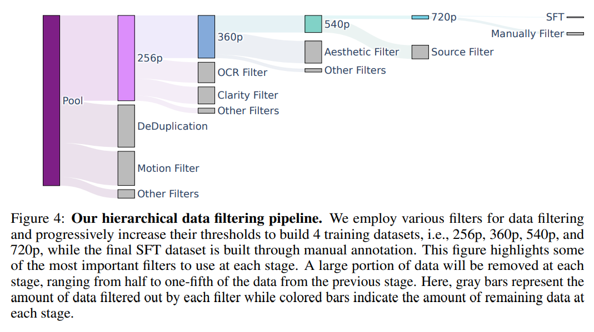
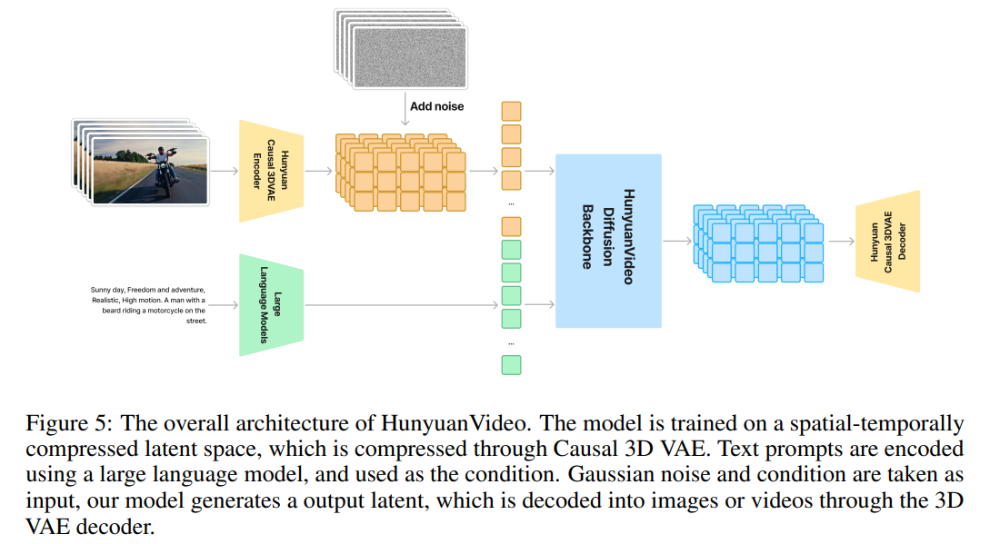
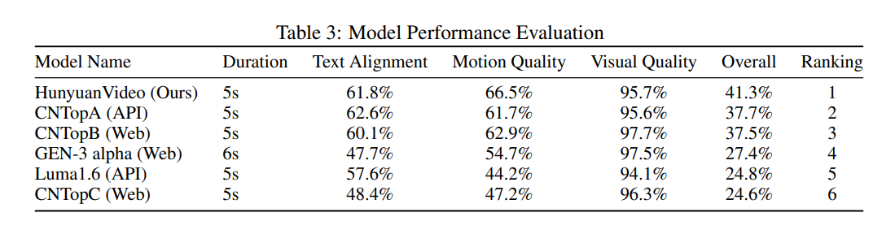
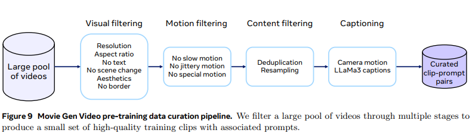
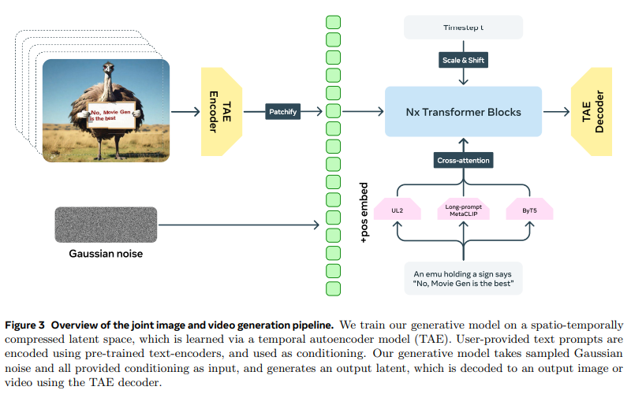
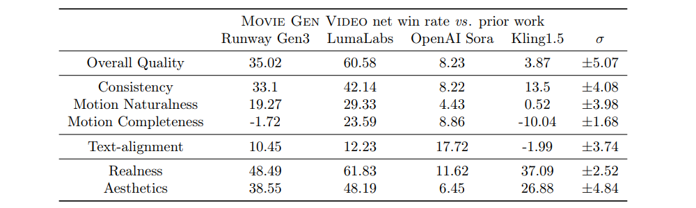

# TextToVideoGenerate

> Author by: 李志峰

视频生成技术是指通过机器自主学习视觉数据的**空间分布**（单帧图像质量）与**时间动态**（帧间运动规律），从文本、图像、音频等输入信号中生成连续、自然、符合物理规律的视频序列的技术。  
2024年以前，视频生成研究者主要通过生成式对抗网络（GAN）生成视频、通过AnimateDiff控制stable diffusion生成连续图像合成视频等方法做的视频生成效果一般，并没有引起广泛的关注，而2024年初Openai的Sora发布，端到端视频生成并且效果非常惊艳，颠覆了人们对视频生成的认知，引起了广泛的关注。随后，Meta的MovieGen、腾讯的Hunyuan-video等优秀的视频生成工作纷至沓来。 
本章节将为读者简介在sora发布后的一系列相关研究。由于视频生成工作细分领域众多，本章节将按输入类型分为Text-To-Video和Speech-to-Video。本文将主要介绍文本到视频的代表性工作，并介绍这些工作相关的如编辑视频、图像到视频、相关音频生成等。  
由于sora是闭源模型，sora发布的技术报告没有详细的训练数据、模型结构等细节信息，而MovieGen、Hunyuan-video等模型生成效果达到甚至超越了sora的水平，并公布了较为详细的技术报告，因此本文将以MovieGen、Hunyuan-video的数据准备、模型结构等为读者简介当下主流文生视频模型的主要结构与训练来了解文生视频模型。

## 1.1 HunyuanVideo
HunyuanVideo是腾讯混元实验室推出的**130亿参数开源视频生成基础模型**，采用统一图像-视频生成架构，支持文本生成视频、图像生成视频及视频编辑等核心功能，打破了传统视频生成模型的模态割裂、计算成本高、文本对齐精度不足等痛点，标志着开源视频生成技术进入实用化阶段。

### 1.1.1 数据
HunyuanVideo的训练数据采用“分层筛选+模态联合”策略，通过严格的质量控制和结构化处理，为模型性能奠定基础。

#### 1.1.1.1 预训练数据
- **数据构成**：涵盖人、动物、风景、车辆、建筑等8大类场景，包含8700万条视频-文本对及数十亿图像-文本对，其中视频数据分为5组、图像数据分为2组，每组针对不同训练阶段定制。
- **筛选标准**：设置多重阈值，包括最小时长、空间质量、宽高比合规性，以及构图、颜色、曝光等专业美学标准，通过PySceneDetect分割单镜头、拉普拉斯算子筛选清晰帧、内部模型去除水印/敏感信息等预处理流程。  
数据筛选过程如下图所示：  
  
- **结构化增强**：自研内部VLM模型生成JSON格式结构化字幕，同时训练摄像机运动分类器（支持14种运动类型），提升数据的语义信息密度。
- **训练策略**：采用两阶段图像预训练（256px低分辨率→混合比例高分辨率）和视频-图像联合训练，通过动态批次大小优化GPU资源利用率，避免灾难性遗忘。

#### 1.1.1.2 SFT数据
- 构建约**100万个人工标注高质量样本**，聚焦视觉吸引力强、运动细节复杂的视频剪辑，经过自动化过滤+人工审查双重校验。
- 数据设计针对性解决模型在复杂动态场景、精细动作还原上的短板，与预训练数据形成互补，显著提升模型的指令遵循能力和生成质量上限。

### 1.1.2 主模型结构
HunyuanVideo主模型结构如下图：  
  
模型采用“高效压缩+跨模态融合+工程优化”的系统化设计，核心架构亮点如下：
- **基础架构**：以**因果3D VAE**为核心，通过时间4倍、空间8倍、通道16倍的三级压缩，将原始视频数据量降低512倍，同时保留运动轨迹连续性，解决高维数据计算瓶颈。
- **混合模态处理**：创新“双流-单流”Transformer架构，前12层独立处理视频与文本Token（避免模态干扰），后20层通过跨层注意力（CLA）实现深度融合，文本-视频对齐精度提升18.7%。
- **文本编码模块**：采用Decoder-only架构的MLLM（多模态大语言模型）替代传统CLIP+T5组合，具备零样本学习、因果注意力适配扩散模型、细粒度语义解析三大优势，文本对齐度达61.8%。
- **位置嵌入**：扩展RoPE至三维（时间T+高度H+宽度W），支持多分辨率、多宽高比、不同时长的生成需求，增强位置关系捕捉能力。
- **训练与推理优化**：采用渐进式课程学习（低分辨率短视频→低分辨率长视频→高分辨率长视频），搭配3D并行训练、KV缓存、投机解码技术，130亿参数模型可在单张32GB GPU运行，推理速度提升2.3倍。

### 1.1.3 HunyuanVideo模型效果
在1533条多样化指令的专业盲测中（60名资深视觉工程师参与），Hunyuan-video综合得分41.3%，全面超越Runway Gen-3、Luma 1.6等主流闭源模型，对比如下表：  
  
核心表现如下：
- **核心指标领先**：运动质量66.5%（较Luma 1.6提升22.3个百分点）、文本对齐度61.8%、视觉质量95.7%，其中物理合理性指标达72.3分，在海浪拍打、人群行走等复杂运动场景中表现突出。
- **生成能力**：支持480P-720P分辨率、最长129帧视频生成，涵盖文生视频、图生视频、视频扩写、风格迁移等功能，生成5秒256x256视频仅需12秒。
- **商业落地价值**：已在广告营销、短视频制作、影视辅助等12个行业落地，某3C品牌广告制作周期从21天压缩至18小时，成本降低92%；短视频平台用户创作时长从15秒提升至47秒，完播率提高23%。

### 1.1.4 HunyuanVideo总结与思考
HunyuanVideo的核心突破在于**“开源+高性能+工程化”的三重平衡**：通过统一图像-视频架构打破模态壁垒，以3D VAE压缩和MLLM编码解决效率与精度矛盾，再经系统化工程优化降低落地门槛，成为首个比肩闭源模型的开源视频生成基础设施。  
其开源策略（Apache 2.0协议，允许商业使用）为行业提供了可复用的技术底座，不仅推动AIGC视频从实验室走向产业化，更验证了“数据分层筛选+架构创新+工程优化”的视频生成技术路径可行性，未来有望朝着“文本即导演”的目标，实现更复杂场景、更实时生成、更低硬件门槛的突破。

### 1.1.5 HunyuanVideo存在问题
- 长视频生成能力有限：当前最高支持129帧，对于分钟级长视频的时空一致性和细节保留仍需优化。
- 高分辨率生成效率不足：720P以上分辨率（如4K）生成耗时较长，显存占用仍需进一步降低（当前单卡最低需60GB）。
- 复杂场景处理短板：在多人互动、动态光影变化、微观粒子运动等场景中，存在细节模糊、动作扭曲的风险。
- 数据偏见与泛化性：训练数据覆盖场景虽广，但部分小众场景（如特殊职业动作、冷门文化场景）的生成质量有待提升，可能存在潜在数据偏见。

## 1.2 MovieGen
MovieGen是Meta于2024年10月推出的**多模态媒体生成基础模型系列**，官方公开技术细节与基准测试，涵盖视频生成、音频合成、视频编辑等核心能力，对标OpenAI Sora等主流视频生成工具，旨在打造“端到端多媒体创作解决方案”。

### 1.2.1 数据
MovieGen的性能依赖“大规模预训练+高质量微调”的数据策略，数据覆盖图像、视频、音频三大模态，经过多阶段筛选确保质量与多样性。

#### 1.2.1.1 预训练数据
- **视觉预训练数据**：包含约1亿个视频-文本对和10亿个图像-文本对，原始视频时长4秒至2分钟，涵盖人类、自然、动物、物体等多领域，60%为横屏、40%为竖屏，通过镜头分割提取4-16秒单场景片段。
- **音频预训练数据**：MovieGen Audio模型基于100万小时音频数据训练，涵盖环境音、音效、音乐等，学习视觉与音频的物理关联及心理关联。
- **数据筛选流程**：通过视觉过滤（清晰度、无敏感信息）、动作过滤（剔除低动作幅度内容）、内容过滤（去重、多样性采样）三阶段处理，还训练运镜分类器对16类运镜（如变焦、平移）进行标注，辅助模型学习电影级镜头语言。  
数据筛选流程如图：  
  

#### 1.2.1.2 SFT数据
- **视频SFT数据**：采用小规模高质量人工标注数据集，聚焦“运动流畅度”和“美学质量”优化，通过模型参数平均操作提升泛化性，避免过拟合。
- **音频SFT数据**：精选（文本-音频）和（视频-文本-音频）匹配对，重点优化音频与视频的同步性、电影级音效质感，以及背景音乐与场景情绪的适配度。
- **个性化/编辑任务数据**：个性化视频生成依赖（图像-文本-视频）匹配对，视频编辑任务则创新采用“无监督数据训练方案”，规避大规模监督编辑数据缺失的问题。

### 1.2.2 主模型结构
MovieGen由两大基础模型构成，核心架构围绕“时空压缩+跨模态对齐+高效生成”设计，借鉴Llama 3的Transformer结构优化：

- **基础模型拆分**：
  - MovieGen Video（300亿参数）：负责文本到图像/视频生成，支持16秒16FPS视频输出，最大上下文长度73K视频 tokens；
  - MovieGen Audio（130亿参数）：负责视频+文本到音频生成，支持48kHz高质量音频，可延伸至分钟级长音频。

- **核心组件设计**：
  1. **时间自编码器（TAE）**：基于图像VAE参数膨胀为3D结构（2D空间卷积+1D时间卷积、2D注意力+1D时间注意力），采用2+1D轻量化设计，将视频在时间/空间维度下采样8倍，大幅降低计算压力，通道数设为16以平衡效果与效率；  
  通过TAE联合图像和视频生成概述如下图：  
    
  2. **多文本编码器**：联合UL2（全局语义）、ByT5（局部字符级）、Long-prompt MetaCLIP（跨模态对齐）三大编码器，实现精准文本理解；
  3. **Flow Matching生成框架**：替代传统扩散模型，通过学习噪声到目标数据的“速度预测”生成样本，训练效率更高、时空连续性更好，天然支持零终端信噪比；
  4. **效率优化模块**：因子化可学习位置编码（适配任意宽高比/时长）、时间平铺（切片编码+重叠融合）、线性-二次时间步长（50步等效1000步采样）。

### 1.2.3 模型效果
MovieGen在多项任务中达到发布时（2024年10月）业界SOTA水平，核心表现如下：

- **视频生成能力**：支持1080P高清输出，可变宽高比，16秒视频画面连贯、物理规律贴合真实，能精准还原物体运动、主客体交互与相机运镜；在文本到视频、个性化视频（保有人物ID）、指令级视频编辑任务中，超越LumaLabs Dream Machine、Gen-3等模型，接近Sora水平；
下表展示了MovieGen与其他视频生成工作的人工评价比较，该比较采用两种视频生成方式：一是来自Movie Gen Video Bench提示集的生成视频（Runway Gen3、LumaLabs、Kling1.5），二是采用其官网公开发布的视频提示（OpenAI Sora）。作者测量净胜率（即本模型胜率减去负率），其取值范围为[−100%, 100%]。为评估统计显著性，作者进行了标注方差分析，上表中标注的净胜率标准差σ即为此分析结果。当净胜率超出2σ（95%置信区间）时判定为显著胜/负，1–2σ区间（68%置信区间）内为中等胜/负，1σ范围内则视为性能持平。
  

- **音频生成能力**：生成与视频同步的电影级音效/音乐，支持环境音、动作音效、情绪配乐混合，48kHz采样率，可通过延伸技术为分钟级视频生成连贯音频，即使声源不可见也能匹配场景；
- **基准测试与工具**：发布MovieGen Bench基准（含1003个视频测试prompt、527个音频测试样本），公开非精选生成结果，方便后续研究对比。

### 1.2.4 MovieGen总结与思考
MovieGen的核心价值在于**“多模态整合+架构简化+实用化落地”**：
1. 突破单一模态局限，首次实现视频、音频、编辑任务的端到端统一，降低创作门槛；
2. 架构创新高效：TAE时空压缩、Flow Matching替代扩散模型，平衡效果与计算成本，为大规模视频生成提供新范式；
3. 数据策略精准：“海量预训练打基础+高质量SFT提质感”的组合，验证了“数据质量优于单纯规模”的核心逻辑；
4. 开源生态贡献：公开92页技术报告、训练细节与基准测试，推动视频生成领域的透明化研究。

其本质是Meta对“全模态生成”的布局，将LLM的语言理解能力与视频/音频生成结合，未来有望赋能广告、影视、教育等多行业的轻量化创作场景。

### 1.2.5 MovieGen存在问题
1. **生成限制**：视频最长仅16秒，难以满足长视频创作需求；复杂动态场景（如多人快速交互）的细节还原度仍有提升空间；
2. **资源依赖**：训练需数千张H100 GPU（最高6144张），推理对硬件要求较高，普通用户难以直接使用；
3. **数据与偏见**：预训练数据可能存在文化背景偏差，对特定地域元素的理解和呈现不够准确；部分敏感内容过滤机制仍需完善；
4. **开源限制**：仅公开技术细节与基准，模型权重未开源，限制了开发者二次开发与场景定制化能力；
5. **音频细节不足**：复杂场景下的多音源混合层次感、音乐旋律原创性，与专业音频生成工具（如ElevenLabs）仍有差距。

## 2 总结与思考
视频生成技术作为AIGC领域的重要分支，已从“短低清”阶段迈入“长高清”阶段，其技术演进折射出深度学习从“空间建模”到“时空联合建模”的发展趋势。本文通过梳理技术历程、核心方法与主流模型，发现当前技术的核心矛盾在于“生成质量”与“可控性、效率”的平衡。未来，随着高效时序建模、精细控制、轻量化技术的突破，视频生成将在内容创作、数字娱乐、工业仿真等领域实现规模化应用，最终推动“机器自主创作视频”的落地。  
然而，视频生成技术仍需解决数据依赖、物理一致性等根本问题，且需关注伦理风险（如深度伪造视频的滥用），未来研究需在技术创新与伦理规范的双重框架下推进，实现技术价值与社会价值的统一。

## 参考与引用

https://arxiv.org/abs/2410.13720
https://arxiv.org/abs/2412.03603

