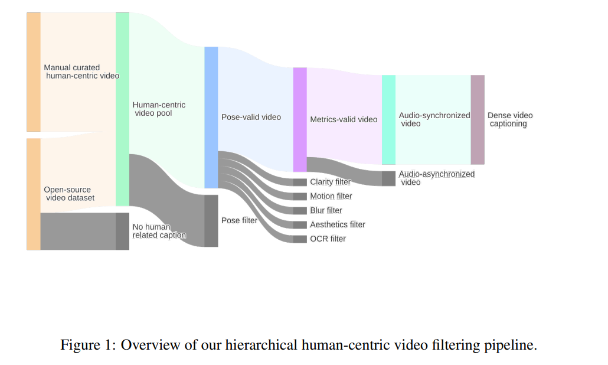
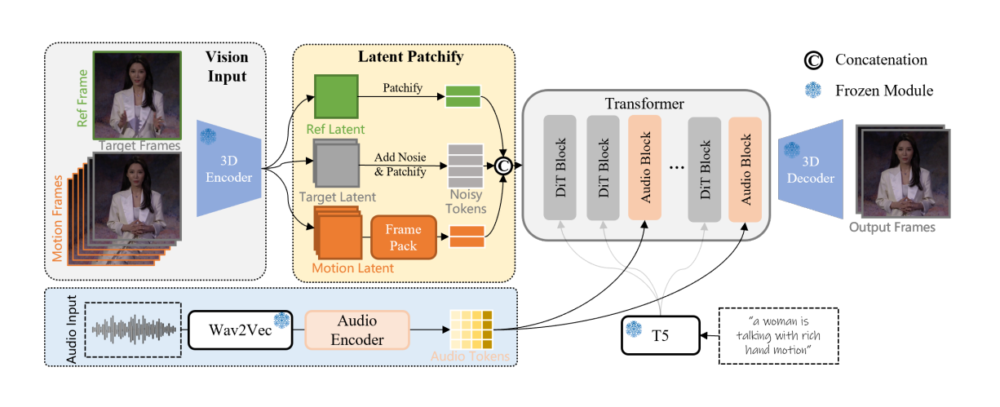
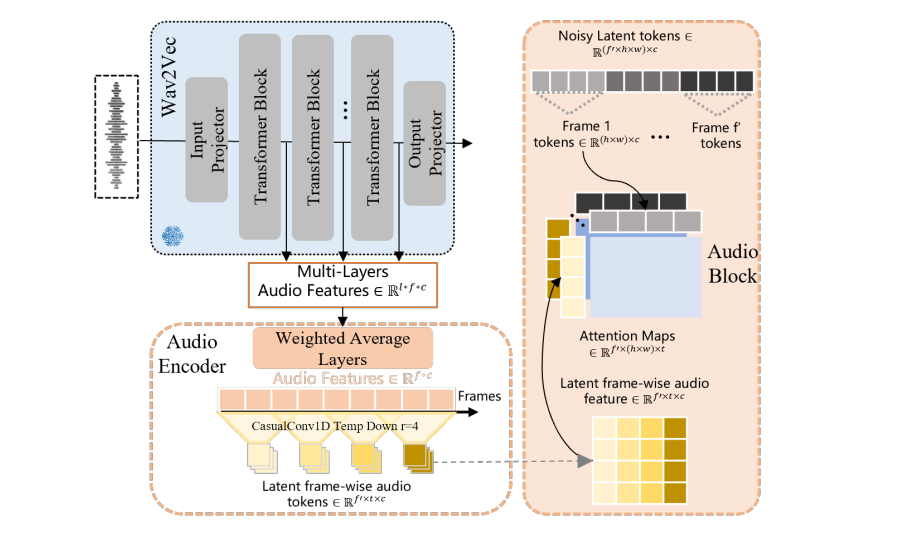
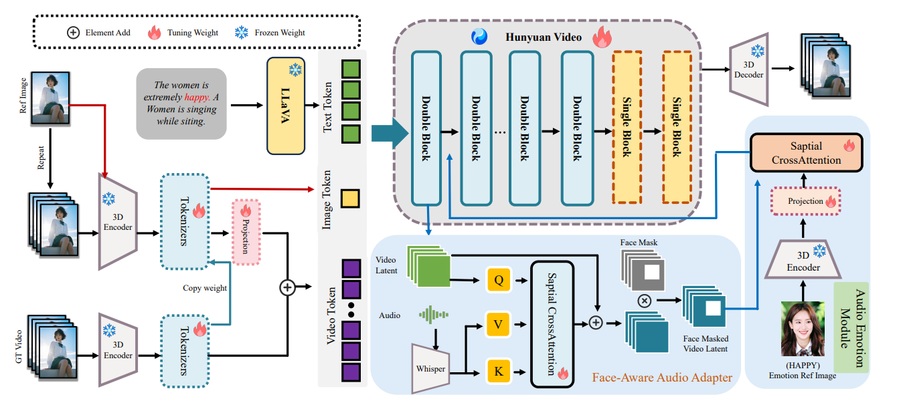

# TextToVideoGenerate

> Author by: 李志峰

上篇文章系统梳理了文本生成视频技术的发展脉络与核心成果。随着数字人交互、影视制作、在线教育等领域的需求升级，音频驱动的视频生成技术凭借其在音画精准同步、情感表达贴合度上的独特优势，成为多模态生成领域的重要研究方向 —— 该技术能够将音频中的节奏、语义与情感特征，转化为口型协调、动作自然、场景适配的动态视频，大幅降低了专业视频内容的制作门槛。与文本生成视频侧重抽象场景构建不同，音频驱动技术更聚焦于 “听觉 - 视觉” 的强关联映射，在单人说话头像生成、多人对话交互、长视频连贯创作等场景中展现出不可替代的价值。本文将围绕音频驱动视频生成的核心技术路径、代表性模型的创新突破，以及关键应用场景展开介绍。

## 1.1 WAN-S2V：音频驱动的电影级视频生成模型
WAN-S2V是阿里巴巴通义实验室（Tongyi Lab）HumanAIGC团队推出的**音频驱动电影级视频生成模型**，基于开源视频生成模型Wan开发。其核心目标是解决现有主流音频驱动角色动画模型（如Hunyuan-Avatar、Omnihuman）在复杂影视场景中的不足——突破“仅支持单角色语音/唱歌”的局限，实现包含细腻角色互动、真实身体动作与动态镜头的电影级视频生成，同时保留文本对全局场景的控制能力。

### 1.1.1 数据：多源采集与精细化处理
WAN-S2V的性能依赖于大规模、高质量的音频-视觉数据集，数据流程分为**预训练数据构建**与**SFT（监督微调）数据筛选**，并通过多轮过滤确保数据质量。

#### 1.1.1.1 预训练数据
预训练数据采用“开源数据集自动筛选+高质量样本手动标注+内部数据补充”的三位一体策略，总规模达数百万个人类中心视频样本，具体构成与处理步骤如下：
1. **数据来源**
   - 开源数据集筛选：从Li et al. (2024)的OpenHumanViD、Wang et al. (2024)等开源视频集中，通过“视频字幕含人类相关描述”进行粗过滤，初步获取人类活动视频；
   - 手动精选：从公开资源中手动筛选包含**复杂人类活动**的样本（如对话、唱歌、舞蹈、多人互动）；
   - 内部补充：加入实验室自采的“角色对话/唱歌视频”，弥补开源数据中影视场景的不足。

2. **精细化处理流程**
   - 姿态跟踪与过滤：使用VitPose提取2D姿态并转换为DWPose，过滤“角色时空占比极低”“无连续清晰人脸”的视频（确保模型能学习音频驱动的面部表情）；
   - 音视频对齐校验：通过Light-ASD 排除“音频与说话者不同步”“场景无活跃说话者”的样本；
   - 多维度质量评估：从5个维度量化视频质量，仅保留高分样本：
     - 清晰度：采用Dover指标评估视觉锐利度；
     - 运动稳定性：通过UniMatch预测光流，过滤运动过度杂乱的视频；
     - 局部锐度：对人脸/手部区域应用拉普拉斯算子，排除模糊样本；
     - 美学质量：使用改进版美学预测模型评估视觉吸引力；
     - 字幕遮挡：通过OCR检测排除“字幕遮挡人脸/手部”的视频；
   - 密集视频字幕生成：采用QwenVL2.5-72B生成细粒度字幕，重点描述“镜头角度（如俯拍、近景）、角色外观/动作（如服装、手势）、背景环境（如建筑风格、色彩）”，避免主观情绪描述，为文本控制提供精准监督。  
WAN-S2V的数据过滤管道如下图：  
  

#### 1.1.1.2 SFT数据
SFT阶段聚焦“高质量电影级场景”，数据从预训练数据中进一步筛选：
- 核心标准：优先选择“多角色互动”“动态镜头切换”“细腻动作（如手势变化、表情起伏）”的影视片段与高保真语音视频；
- 数据量：未明确披露具体数量，但强调“覆盖影视级复杂场景与高清晰度样本”，确保模型在实际影视生产场景中的表现。

### 1.1.2 主模型结构：文本-音频协同驱动的生成框架
WAN-S2V基于Wan文本到视频基础模型构建，核心设计是“文本控制全局+音频控制细节”，通过多模块协同实现电影级视频生成。  
模型的pipeline概述如下图：  
  
音频注入的pipeline如下图：  
  
其结构可拆解为**输入处理、 latent编码、音频融合、解码生成**四大模块。
#### 1. 核心输入与目标
- 输入：参考图像（保留角色/场景基础信息）、音频（驱动动作/表情）、文本提示（定义镜头运动、角色轨迹、场景互动）；
- 输出：与音频同步、保留参考图像内容、符合文本描述的连续视频帧。

#### 2. 关键组件设计
##### （1）3D VAE与Flow Matching噪声注入
- 功能：将RGB目标帧 $X \in \mathbb{R}^{F \times H \times W \times 3}$ 编码为 latent 表示 $x_0 \in \mathbb{R}^{f \times h \times w \times c}$，实现时空维度压缩；
- 噪声机制：采用Flow Matching (Lipman et al. 2023) 注入噪声，生成带噪 latent $x_t = t\epsilon + (1-t)x_0$（$t \in [0,1]$ 为时间步），模型目标是预测速度$\frac{dx}{dt} = \epsilon - x_0$，在推理过程中，模型在参考帧、运动帧、音频输入和提示的条件下，将带噪声的输入 $x_t$ 恢复 $x_0$。

##### （2）运动帧优化：Frame Pack模块（长视频稳定性核心）
- 问题：传统音频驱动模型（如Tian et al. 2024）依赖Motion Frames维持视频一致性，但Motion Frames过多会导致计算量激增，难以支持长视频；
- 解决方案：引入Frame Pack (Zhang & Agrawala 2025) 模块，对“早期运动帧”采用更高压缩比，减少token数量，从而在有限计算资源下纳入更多Motion Frames，确保长视频的运动趋势（如火车行驶方向）与物体身份（如角色手持纸张）一致性。

##### （3）音频编码模块：多尺度特征融合
- 步骤1：用Wav2Vec (Schneider et al. 2019) 提取音频原始特征；
- 步骤2：通过加权平均层（Tian et al. 2024）融合Wav2Vec不同层特征——浅层捕捉节奏/情绪，深层捕捉词汇内容，适配唱歌、情感语音等复杂音频；
- 步骤3：用**因果1D卷积**压缩时间维度，生成与视频latent帧对齐的音频特征 $a_i \in \mathbb{R}^{f \times t \times c}$（$t$ 为每帧音频token数）。

##### （4）Audio Block：高效音视频注意力对齐
- 优化点：避免全3D注意力的高计算量，将带噪 latent token $x_t$ 按时间维度分割为 $x_{ti} \in \mathbb{R}^{(h \times w) \times c}$，仅计算 $a_i$（对应帧音频特征）与 $x_{ti}$ 的注意力；
- 优势：天然实现音视频时空同步，同时降低计算开销，支持高分辨率视频生成。

### 1.1.3 模型效果：全面超越现有SOTA
WAN-S2V在EMTD数据集（Meng et al. 2024，以单角色语音视频为主）及影视场景测试中，从**定性视觉效果**与**定量指标**两方面超越Hunyuan-Avatar、Omnihuman等主流模型。

#### 1. 定性效果对比
| 对比模型       | 核心问题                                  | WAN-S2V优势                              |
|----------------|-------------------------------------------|------------------------------------------|
| Hunyuan-Avatar | 大动作场景下面部失真、角色身份不一致      | 保持身份稳定，面部表情与动作自然协调      |
| Omnihuman      | 动作幅度极小，接近参考图静态姿态          | 生成更大范围动态动作，场景互动更真实      |
| 长视频场景     | Omnihuman无法维持运动趋势（如火车方向）    | 用Frame Pack实现运动/物体身份跨帧一致性  |

#### 2. 定量指标（EMTD数据集）
下表为WAN-S2V与其他SOTA模型的关键指标对比（↓表示越低越好，↑表示越高越好）：

| 方法          | FID↓  | FVD↓  | SSIM↑  | PSNR↑  | Sync-C↑（唇同步） | CSIM↑（身份一致） | EFID↓（表情偏差） |
|---------------|-------|-------|--------|--------|-------------------|-------------------|-------------------|
| EchoMimicV2   | 33.42 | 217.71| 0.662  | 18.17  | 4.44               | 0.519             | 1.052             |
| Hunyuan-Avatar| 18.07 | 145.77| 0.670  | 18.16  | 4.71               | 0.583             | 0.708             |
| Omnihuman     | -     | -     | -      | -      | -                 | -                 | -                 |
| **WAN-S2V**   | **15.66** | **129.57** | **0.734** | **20.49** | **4.51**           | **0.677**         | **0.283**         |

- 核心优势：
  1. 帧质量：FID（15.66）、SSIM（0.734）、PSNR（20.49）均为最优，视觉清晰度更高；
  2. 视频一致性：FVD（129.57）与EMO2相当，优于多数模型，长视频连贯性更强；
  3. 身份与表情：CSIM（0.677）最高（身份一致性最好），EFID（0.283）较低（表情偏差小）；
  4. 唇同步：Sync-C（4.51）接近Hunyuan-Avatar（4.71），音频与唇部动作匹配度高。

#### 3. 典型应用场景
- 长视频生成：支持48帧、1024×768分辨率视频，维持跨片段运动/物体一致性；
- 精准唇同步编辑：音频驱动角色唇部动作，适配影视配音、虚拟人直播等场景。

### 1.1.4 总结与思考
#### 1. 核心贡献
1. **场景扩展**：首次将音频驱动从“单角色语音/唱歌”扩展到“复杂影视场景”，通过文本-音频协同（文本控全局、音频控细节）实现细腻角色互动与动态镜头；
2. **长视频突破**：提出Frame Pack模块优化Motion Frames，解决长视频稳定性与计算量的矛盾；
3. **训练效率优化**：采用“FSDP（Zhao et al. 2023）+ Context Parallel”混合并行策略，支持16B+参数模型全参数训练，单迭代时间从~100s降至~12s，可训练1024×768分辨率视频；
4. **数据体系**：构建“多源采集+多维度过滤+细粒度字幕”的高质量数据集，为模型泛化性提供保障。

#### 2. 技术思考
- 协同控制创新：通过“大模型容量+分阶段训练（音频编码器预训练→全数据集预训练→高质量SFT）”避免文本与音频的控制冲突，这是其超越现有模型的关键；
- 工程化落地：混合并行策略与变量分辨率训练（按token数动态调整分辨率），平衡了“高分辨率”与“训练效率”，具备实际工业应用潜力。

### 1.1.5 存在问题与未来方向
WAN-S2V仍面临以下挑战，也是未来优化的核心方向：
1. **复杂多人互动**：当前模型在“多角色精细化互动”（如对话时的眼神交流、动作配合）场景中表现仍需提升；
2. **音频驱动镜头控制**：仅靠音频实现“影视级精准镜头切换”（如根据对话情绪调整镜头远近）尚未完全解决，仍需文本辅助；
3. **手部动作质量**：HKC（手部关键点置信度）与HKV（手部动作多样性）虽优于多数模型，但不及EMO2（依赖预生成运动序列），端到端音频驱动手部细节的能力有提升空间；
4. **极长视频扩展性**：当前支持48帧长视频，若进一步扩展至分钟级序列，仍需优化Motion Frames的压缩与记忆机制。
WAN-S2V是“Vida研究系列”的首个成果，未来将聚焦“高级角色控制”与“动态舞蹈生成”，持续推进人类中心视频生成的边界。

## 1.2 HunyuanVideo-Avatar
HunyuanVideo-Avatar是腾讯混元团队（联合腾讯音乐天琴实验室）推出的**开源音频驱动人体动画模型**，基于**多模态扩散Transformer（MM-DiT）** 架构，核心能力是通过“角色图像+音频”输入，生成**动态连贯、情感可控、多角色协同**的高保真人体动画视频。模型突破传统音频驱动动画的三大瓶颈（动态与一致性失衡、情感-音频错位、多角色干扰）。

### 1.2.1 数据
#### 1.2.1.1 预训练数据
模型预训练数据经过严格的多阶段过滤，确保数据质量与音视频对齐性，核心细节如下：
- **数据筛选流程**：
  1. 用`LatentSync`工具过滤音视频异步样本，避免唇形与音频错位；
  2. 用`Koala-36M`工具剔除低亮度、低美学质量的样本，保证视觉效果；
- **数据规模**：最终得到50万个含角色音频的样本，总时长约1250小时；
- **数据规格**：训练数据分辨率覆盖704×704 ~ 704×1216，支持多宽高比场景；
- **渐进式数据策略**：
  - 低分辨率预训练：先在256px图像上训练，学习低频概念与基础视觉映射；
  - 混合比例训练：在512px图像上加入多宽高比样本（动态批次大小优化GPU利用率），避免低分辨率能力退化；
  - 视频-图像联合训练：分“低分辨率短视频→低分辨率长视频→高分辨率长视频”三阶段，用图像数据补充视频数据稀缺性，避免语义遗忘。

#### 1.2.1.2 SFT数据
SFT（微调）数据用于模型最后阶段的性能提升，核心特点：
- **数据规模**：1000万样本，为人工注释的高质量数据集；
- **数据特性**：精选含复杂运动细节、视觉吸引力强的视频剪辑，聚焦“动态一致性+情感表达”的精细化优化；
- **作用**：解决预训练阶段对复杂场景（如多角色交互、细腻情感）的拟合不足，提升实际应用场景的生成质量。

### 1.2.2 主模型结构
模型以**HunyuanVideo（MM-DiT架构，13B参数）** 为骨干，核心创新在于三大模块与长视频生成机制，整体框架如下图所示：  
  
#### 1.2.2.1 骨干网络：HunyuanVideo
- 基础能力：支持图像到视频的生成，内置3D VAE（用于图像/视频的潜空间编码）与3D-RoPE位置编码（实现时间轴上的身份信息传播）；
- 训练框架：采用Flow Matching优化，通过预测潜空间样本的速度`u_t`（`dz_t/dt`），最小化预测速度与真实速度的均方误差（损失函数`L_generation`），确保生成质量。

#### 1.2.2.2 三大核心创新模块
##### （1）角色图像注入模块
- 解决问题：传统I2V方法中“填充帧导致动态不足”或“去填充帧导致角色一致性差”的矛盾，消除训练与推理的条件不匹配；
- 实现方式：
  1. 将参考图像重复T次（T=视频长度），通过Tokenizer2编码；
  2. 经全连接层投影模块，直接与视频潜空间特征相加（而非传统拼接）；
  3. 优势：在保证角色、背景、前景一致性的同时，提升运动动态性， ablation实验显示其在Motion Diversity（MD=4.127）和Video Quality（VQ=4.16）优于Token Concat、Token+Channel Concat机制。

##### （2）音频情感模块（AEM）
- 核心目标：对齐音频情感与角色面部表情，实现细粒度情感控制；
- 工作流程：
  1. 用预训练3D VAE编码“情感参考图像”，提取情感特征；
  2. 通过FC层与空间交叉注意力，将情感特征注入HunyuanVideo的Double Block（Single Block无法有效学习情感线索）；
  3. 关键参数：`γ_E`（可学习缩放因子）控制情感特征影响权重；
- 效果：能准确迁移“高兴、悲伤、愤怒、兴奋”等情感，符合Ekman面部动作编码系统，在EmoV-DB测试集情感分类准确率达85%。

##### （3）面部感知音频适配器（FAA）
- 核心目标：实现多角色场景下的独立音频驱动，避免角色间音频干扰；
- 工作流程：
  1. 用`InsightFace`检测角色面部边界框，生成“面部掩码”；
  2. 在潜空间对非面部区域的音频特征归零，仅保留面部区域的音频响应；
  3. 通过交叉注意力，为每个角色注入独立音频特征（音频用Whisper提取，经时间对齐后与视频潜空间匹配）；
- 关键设计：时空分离注意力——每个音频帧仅与对应时间步的视频帧空间token交互，避免跨时间干扰；
- 效果：双人场景唇形同步误差低至0.08秒，对口型准确率达92%，显著优于EchoMimic-V2（78%）。

#### 1.2.2.3 长视频生成机制
- 解决问题：HunyuanVideo-13B默认仅生成129帧（短于多数音频长度）；
- 技术方案：适配`Sonic`的Time-aware Position Shift Fusion方法；
- 核心逻辑：
  1. 按音频分段，每段对应生成视频片段；
  2. 用“起始偏移量α”（3~7步）连接相邻片段，避免抖动与 abrupt 过渡；
  3. 优势：无额外训练/推理成本，实现连续视频生成，支持14秒以上音频驱动。

### 1.2.3 模型效果
模型效果从**定量对比、定性表现、用户研究**三方面验证，均优于当前SOTA方法。

#### 1.2.3.1 定量对比（vs 基线方法）
下表汇总关键数据集的核心指标（↑表示指标越高越好，↓表示越低越好）：

| 测试集         | 指标        | 基线方法（示例）       | HunyuanVideo-Avatar |
|----------------|-------------|------------------------|---------------------|
| CelebV-HQ      | IQA         | Sonic（3.60）          | 3.70                |
| HDTF           | IQA         | Hallo-3（3.77）        | 3.99                |
| HDTF           | Sync-C（音画同步） | EchoMimic（4.07）    | 5.30                |
| CelebV-HQ      | FID         | EchoMimic-V2（46.37）  | 43.42               |
| 自建全身测试集 | Sync-C      | OmniHuman-1（5.34）    | 5.56                |
| 自建全身测试集 | FID         | Hallo3（50.12）        | 49.38               |

- 关键结论：在“音画同步（Sync-C）”“视频质量（IQA）”“真实度（FID）”上全面超越Sonic、EchoMimic、Hallo-3、OmniHuman-1等基线，尤其在全身动画场景优势显著。

#### 1.2.3.2 定性表现
- 多角色场景：支持相声、合唱、对话等多角色同屏，角色动作独立无干扰（如图8“双人跨时空相声”）；
- 风格兼容性：可生成写实、卡通、乐高、中国水墨画、铅笔素描等多样风格角色（如图10）；
- 动态与背景：前景角色动作自然（如唱歌时肢体摆动），背景动态保真（如篝火跳跃、海浪起伏），动态评分达4.16；
- 情感控制：能精准复现音频中的情感变化，如“悲伤时嘴角下垂”“兴奋时挑眉”（如图11）。

#### 1.2.3.3 用户研究
30名参与者对“全身动画样本”从4维度评分（1~5分）：

| 评估维度       | Hallo3 | Fantasy | OmniHuman-1 | HunyuanVideo-Avatar |
|----------------|--------|---------|-------------|---------------------|
| 面部自然度（FCN） | 2.91   | 3.43    | 4.11        | 3.91                |
| 全身自然度（FBN） | 2.59   | 3.49    | 4.18        | 3.88                |
| 身份保持（IP）   | 4.28   | 4.65    | 4.79        | 4.84                |
| 唇同步（LS）     | 3.61   | 4.21    | 4.61        | 4.65                |

- 结论：在“身份保持（IP）”和“唇同步（LS）”上排名第一（得益于角色图像注入模块与FAA）；FCN/FBN略逊于OmniHuman-1（因OmniHuman-1含超分辨率处理，且继承HunyuanVideo的固有问题）。

### 1.2.4 总结与思考

#### 1.1.4.1 核心价值
1. **技术突破**：首次通过“角色注入+情感对齐+多角色适配”三大模块，解决音频驱动动画的三大核心痛点（动态与一致性、情感错位、多角色干扰）；
2. **架构优势**：基于MM-DiT的灵活设计，支持多风格、多景别（头肩/半身/全身），适配从短视频到长视频的生成需求；
3. **开源与实用**：提供完整开源资源（代码、权重、ComfyUI节点），支持FP8量化推理（H100单卡显存省10GB），降低社区使用门槛；
4. **应用场景**：
   - 数字内容：QQ音乐“AI力宏”实时歌唱、全民K歌个性化MV；
   - 电商广告：24小时虚拟主播、多语言带货视频；
   - 影视辅助：短剧分镜生成、群演模拟（如《长安夜话》省67%实拍成本）；
   - 教育：多语种教学视频、历史人物“口述”生平（学习留存率提31%）。

#### 1.2.4.2 技术启示
- 潜空间条件注入优于传统“特征相加”：角色图像注入模块通过“投影+潜空间融合”，平衡动态与一致性，为I2V模型提供新范式；
- 情感控制需“多模态协同”：AEM结合音频特征与参考图像情感线索，比单一文本/音频驱动更精准；
- 多角色交互需“空间掩码+独立注意力”：FAA的局部音频响应机制，为多主体生成提供可复用思路。

### 1.2.5 存在问题
根据技术报告附录，模型当前仍有三大待优化方向：
1. **情感驱动依赖参考图像**：无法直接从音频中推断动态情感变化（如一段音频含“高兴→平静→悲伤”，需多次输入情感参考图像，易出错）；
2. **推理速度慢，不满足实时性**：生成10秒720×1216分辨率视频（50步推理）需约60分钟，远未达到直播、实时交互等场景的需求；
3. **缺乏实时交互反馈能力**：当前为“离线生成”模式，无法根据用户实时输入（如语音、动作）调整动画，限制了虚拟陪伴、互动游戏等场景的应用。

## 参考与引用

https://arxiv.org/abs/2508.18621
https://arxiv.org/abs/2505.20156

