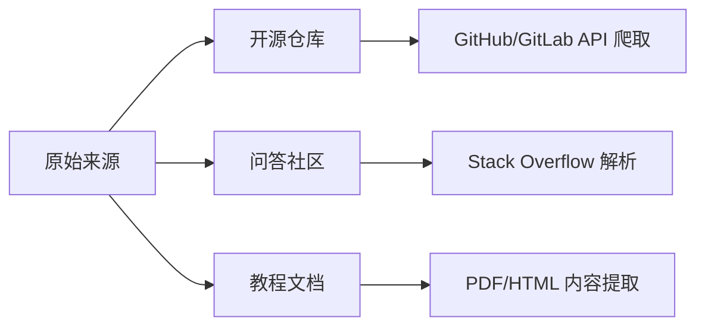
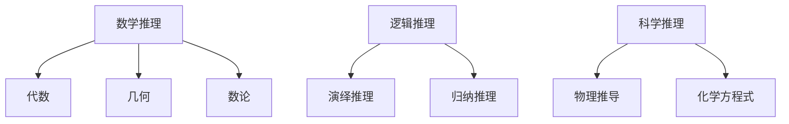
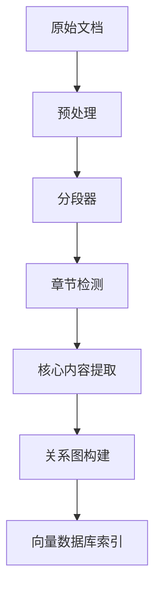

<!--Copyright © ZOMI 适用于[License](https://github.com/Infrasys-AI/AIInfra)版权许可-->

# 01.数据工程概述

Author by: 潘江

!!!!!!!!!
1）注意 markdown 的格式，看我修改和提交的内容；2）看上去基本上是大模型生成的，尽可能用自己的语言和自己的理解去写内容，才有骨肉；3）成段落，不要用大模型的列表和总结展现形式，一定要自己深入核心技术，去挖掘自己以前不懂的东西。4）图很重要，图是理解的很重要一步，自己理解了，然后自己画图，这才是最重要最核心的内容。

数据工程是大模型训练的生命线，决定了模型能力的上限与下限。本节将深入探讨大模型数据工程的核心环节——**Data Curation（数据筛选与整理）**，聚焦代码、多语言、数学与推理、长文本、工具使用、数据真实性与可控性七大关键领域。通过理论解析与工程实践相结合的方式，帮助同学们掌握构建高质量训练数据集的核心技术和方法论。

## 1. 代码数据的筛选与整理

### 1.1 代码数据的战略价值

- 提升模型编程能力：语法理解、API 调用、代码生成
- 支持复杂任务：代码补全、调试、重构、跨语言转换
- 典型案例：GitHub Copilot（基于 Codex）、AlphaCode

### 1.2 数据来源与采集技术



### 1.3 深度处理技术

1. **AST（抽象语法树）分析**：
   - 使用 Tree-sitter 等工具解析代码结构
   - 识别无效代码片段（如未使用变量）
   - 示例：Python AST 模块解析函数调用关系
2. **语义相似度去重**：
   - MinHash+LSH 局部敏感哈希算法
   - 代码嵌入向量聚类（CodeBERT 等模型）
3. **质量验证流水线**：

   ```python
   def validate_code(code):
       # 静态分析
       if has_syntax_error(code): return False
       # 动态测试
       if not passes_unit_tests(code): return False
       # 安全扫描
       if contains_vulnerability(code): return False
       return True
   ```

### 1.4 工程挑战与解决方案

| 挑战 | 解决方案 |
|------|----------|
| 许可证冲突 | SPDX 许可证识别+白名单过滤 |
| 敏感信息泄露 | 正则表达式+ML 模型检测密钥/密码 |
| 环境依赖 | 容器化执行环境（Docker） |
| 风格差异 | 统一格式化工具（Black, Prettier） |

## 2. 多语言数据的整理

### 2.1 多语言建模的瓶颈

- 资源诅咒：90%的互联网内容仅覆盖 10 种语言
- 长尾效应：4000+语言中仅约 100 种有数字资源
- 迁移困境：低资源语言难以从高资源语言迁移知识

### 2.2 数据增强技术

1. **反向翻译增强**：
   - EN→FR→EN 生成同义句对
   - 使用 mBART-50 等多语言翻译模型
2. **代码切换生成**：
   - 基于规则：随机替换名词短语
   - 基于模型：训练代码切换生成器
3. **跨语言对齐**：
   - 利用 Wikidata 实体链接多语言百科
   - 构建多语言 BERT 嵌入空间

### 2.3 质量评估体系

```math
\text{语言质量分数} = \alpha \cdot \text{语法正确性} + \beta \cdot \text{语义连贯性} + \gamma \cdot \text{文化适应性}
```

- 自动化指标：BLEU, TER, ChrF
- 人工评估：雇佣母语者进行 Likert 量表评分

### 2.4 实践案例：NLLB 项目

- 覆盖 200+语言
- 使用 LASER3.0 进行句子嵌入对齐
- 基于温度采样的数据平衡：

  ```
  p(lang_i) = \frac{e^{T \cdot (1/\text{size}_i)}}{\sum_j e^{T \cdot (1/\text{size}_j)}}
  ```

## 3. 数学与推理数据的整理

### 3.1 推理数据类型谱系



### 3.2 结构化标注框架

1. **MathML 标注标准**：
   ```xml
   <math>
     <mrow>
       <msup><mi>a</mi><mn>2</mn></msup>
       <mo>+</mo>
       <msup><mi>b</mi><mn>2</mn></msup>
       <mo>=</mo>
       <msup><mi>c</mi><mn>2</mn></msup>
     </mrow>
   </math>
   ```

2. **推理链标注规范**：

   ```
   [STEP1] 识别问题类型：二次方程求根
   [STEP2] 提取系数：a=1, b=-5, c=6
   [STEP3] 应用公式：x=[-b±√(b²-4ac)]/2a
   [STEP4] 计算结果：x=2 或 x=3
   ```

### 3.3 验证系统设计

- 符号计算引擎：SymPy 验证推导过程
- 定理证明器：Lean/Coq 形式化验证
- 数值验证：NumPy 数值计算比对

### 3.4 数据集构建实践

- Lila：整合 20+数学数据集
- 数据合成技术：

  ```python
  def generate_math_problem(template):
      vars = random_variables()
      problem = template.format(**vars)
      solution = solve(problem)
      return problem, solution
  ```

## 4. 长文本数据的整理

### 4.1 长上下文建模挑战

- 注意力复杂度：O(n²)计算瓶颈
- 信息稀释：关键信息被淹没
- 结构断裂：章节过渡不自然

### 4.2 分层处理架构



### 4.3 关键技术突破

1. **滑动窗口注意力**：
   - 局部注意力+全局记忆单元
   - 示例：Longformer 的 dilated attention
2. **内容重要性评估**：
   - 基于 BERT 的句子嵌入聚类
   - 图算法计算文本节点中心性
3. **跨文档关系构建**：
   - 实体链接（如 Wikifier）
   - 主题建模（LDA/BERTopic）

### 4.4 质量评估指标

- 连贯性得分：基于语言模型困惑度
- 信息密度：实体/概念出现频率
- 结构完整性：标题-内容匹配度

## 5. 工具使用数据的整理

### 5.1 工具交互范式

```
用户： 请绘制北京过去一年的气温变化图
Agent：
  [THOUGHT] 需要获取天气数据并可视化
  [ACTION] WeatherAPI.get_history(city='北京', period='1y')
  [OBSERVATION] {data: [...]}
  [ACTION] Matplotlib.plot(data)
  [RESULT] <image.png>
```

### 5.2 数据标注规范

| 字段 | 类型 | 说明 |
|------|------|------|
| tool_name | string | API 名称 |
| parameters | dict | 调用参数 |
| observation | any | 返回结果 |
| success | bool | 执行状态 |
| dependency | list | 依赖工具 |

### 5.3 工具链构建实践

1. **API 元数据采集**：
   - OpenAPI 规范解析
   - 函数文档自动提取（如 pydoc）
2. **执行环境沙盒化**：
   - Docker 容器隔离
   - 资源限制（CPU/Memory）
3. **错误操作分类**：
   - 参数错误（35%）
   - 依赖缺失（28%）
   - 权限问题（20%）
   - 超时失败（17%）

## 6. 数据真实性与可控性

### 6.1 真实性保障体系


### 6.2 关键技术实现

1. **区块链溯源**：
   - 数据哈希上链（如 IPFS+Ethereum）
   - 不可篡改的修改记录
2. **水印技术**：
   - 不可见文本水印（如 Unicode 零宽度字符）
   - 模型指纹植入
3. **对抗检测**：
   - GAN 生成数据识别器
   - 风格一致性分析

### 6.3 可控性框架设计

```python
class DataGovernance:
    def __init__(self):
        self.provenance = {}  # 数据溯源记录
        self.access_control = RBAC()  # 基于角色的访问控制
        self.version_tree = VersionTree()  # 版本管理
        
    def audit(self, data_id):
        return self.provenance[data_id].get_history()
```

### 6.4 合规性管理

- GDPR 合规：自动识别 PII（个人身份信息）
- 版权过滤：相似度检测+权利信息数据库
- 伦理审查：敏感内容分类模型

## 总结与思考

数据工程是大模型研发的**隐蔽基石**，其复杂度常被低估。通过本节内容，我们有以下认知：

1. 不同类型数据需要**定制化处理流水线**
2. 质量评估必须结合**自动化+人工**双轨制
3. 真实性与可控性需要**技术+制度**双重保障
4. 数据工程正从辅助角色转变为**核心竞争力**

未来趋势预测：

- 合成数据占比将超过 50%（2026）
- 联邦学习推动隐私保护数据工程
- 多模态数据融合成为新常态
