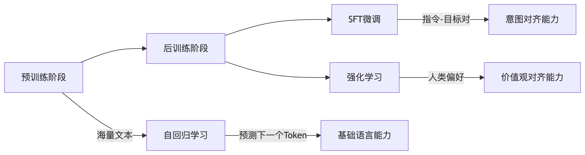
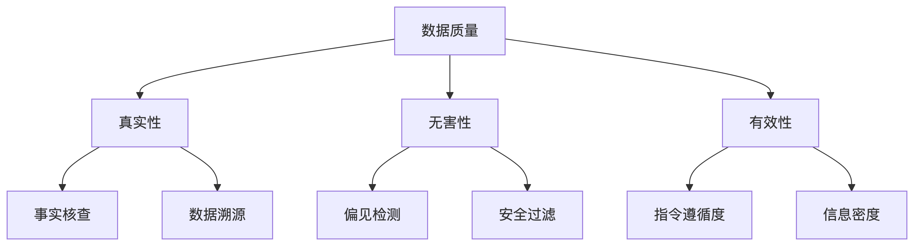
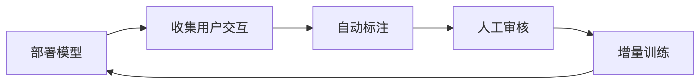

<!--Copyright © ZOMI 适用于[License](https://github.com/Infrasys-AI/AIInfra)版权许可-->

# 07.数据处理：后训练

Author by: 潘江

!!!!!!!!!
1）注意 markdown 的格式，看我修改和提交的内容；2）看上去基本上是大模型生成的，尽可能用自己的语言和自己的理解去写内容，才有骨肉；3）成段落，不要用大模型的列表和总结展现形式，一定要自己深入核心技术，去挖掘自己以前不懂的东西。4）图很重要，图是理解的很重要一步，自己理解了，然后自己画图，这才是最重要最核心的内容。

在预训练阶段，模型通过自回归方式在海量无标注文本中学习“预测下一个 token”的能力，最终得到一个强大的“续写”引擎。借助 few-shot 提示，该引擎已能解决不少复杂任务，但其行为更多体现为“继续写下去”，而非“按人类意图完成指令”，因此与人类的期望仍有差距。

有监督微调（SFT）则致力于弥合这一差距。它以（输入，目标）成对数据为核心，让模型学习“看到输入→给出人类真正想要的输出”，从而显式地获得指令遵循与问答能力。经过 SFT 的模型，不再是单纯的续写器，而成为能够听懂并执行人类指令的对话系统。

在强化学习阶段，我们让模型真正“走上考场”。
它先与大量真实或模拟用户对话，针对同一问题生成多条候选回答；随后，人类或 AI 评委依据“正确、安全、简洁、有趣”等多维标准，为回答打分并排序，训练出 Reward Model（RM）。RM 像一张实时更新的“评分表”，把人类偏好量化成可导的奖励信号。
接着，通过 PPO、GRPO 或 DPO 等算法，模型在 RM 的监督下持续“刷题”：高分回答被强化，低分回答被抑制。经过成千上万次迭代，模型不仅进一步抑制幻觉、毒性，还学会在复杂场景里主动追问、调用工具、进行长链推理，最终完成从“听懂指令”到“主动对齐人类意图”的跃升。




## SFT 数据构建

### 单轮数据构建
本质：指令-响应对（Instruction-Response Pairs）

``` python 
{  
  "instruction": "用 Python 实现斐波那契数列",  
  "output": "def fib(n):\n    if n <= 1:\n        return n\n    return fib(n-1) + fib(n-2)"  
}  
```
### 多轮数据构建
在多轮数据中，要保持对话连贯性与信息一致性。

``` python
[  
  {"role": "user", "content": "如何用 PyTorch 实现 CNN？"},  
  {"role": "assistant", "content": "首先导入 torch.nn 模块..."},  
  {"role": "user", "content": "和 TensorFlow 实现有何不同？"},  
  {"role": "assistant", "content": "主要区别在 API 设计上..."}  
]  

```

### 数据质量提升
在后训练过程中，数据的质量 >> 数据的数量。一般可以从指令的准确性，复杂性，知识密度，指令遵循等多方面提升质量。


## 偏好数据
便好数据构建原则：
帮助性（是否解决问题）；真实性（事实准确性）；无害性（无安全隐患）

``` json

{  
  "prompt": "解释量子纠缠",  
  "chosen": "量子纠缠是粒子间...符合量子力学原理",  
  "rejected": "量子纠缠是心灵感应...属于玄学范畴",  
  "annotation_metrics": {  
    "accuracy": 5,  
    "safety": 5,  
    "helpfulness": 4  
  }  
}  

``` 


## 数据飞轮
数据飞轮（Data Flywheel）是人工智能领域中描述数据、模型和产品之间良性循环的一个重要概念。它借用“飞轮”这一物理装置的比喻，形象地说明了数据驱动 AI 系统在不断自我强化、持续提升的过程。

简单来说，数据飞轮指的是：数据越多，模型越好，产品体验越佳，从而吸引更多用户产生更多数据，进一步提升模型能力，形成正向循环。

大模型上线上线后，用户在实际使用中会产生大量交互数据（如输入、输出、评价、纠错、点赞/踩等）。

从用户交互中自动或人工筛选出高质量的标注数据，包括问题、答案、用户评价、纠错建议等。

这些数据被用于微调（Fine-tuning）、指令调优（Instruction Tuning）、强化学习（如 RLHF）等后训练方法，使模型更贴近用户需求。

优化后的模型能够更好地理解用户意图，生成更准确、自然的回复，提升用户体验。

用户满意度提升，更多人使用，产生更多高质量反馈数据，循环加速。



## 数据蒸馏

数据蒸馏（Data Distillation）是一种通过模型自身生成伪标签（pseudo-labels）或利用模型知识，自动扩充、优化训练数据集的方法。它的目标是利用已有模型的能力，产生更多高质量的训练样本，从而进一步提升模型性能。

数据蒸馏与模型蒸馏（Knowledge Distillation）不同，后者是“模型教模型”，而数据蒸馏是“模型教数据”。

数据蒸馏通常包含以下几个主要步骤：

训练初始模型（Teacher Model）：先用人工标注数据训练一个较好的模型。

利用模型对未标注数据进行预测：用初始模型对大量未标注或弱标注的数据进行推理，产生伪标签。

筛选高置信度的伪标签数据：只保留模型预测置信度高的样本，作为新的训练数据。

将新数据加入训练集，重新训练或微调模型：用扩充后的数据集继续训练模型，提升其泛化能力。

可多轮迭代
：该过程可以多次循环，模型和数据不断优化。

## 参考与引用

!!!!!!!!!!!!
一定要有，自己去阅读文章，去理解，不要直接大模型生成哈
