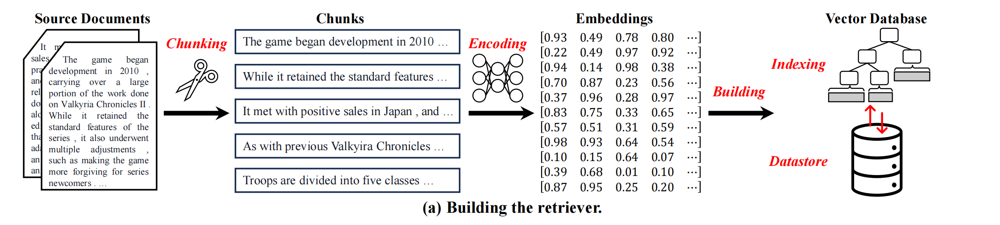

# RAG核心组件

RAG主要分为三个部分，即检索器，检索融合，生成器。下面分别从这三个部分出发，详细介绍每个部分的组件。

## 检索器构建

该过程包括三个步骤：语料库分块、块编码和构建向量数据库。其中，构建向量数据库包括构建 ANN 索引以及以键值对形式存储数据。

### 1.语料库分块（Chunking Corpus）

语料库分块是检索器构建的第一步，指的是将大型文档（corpus）分割成语义独立且包含单一核心思想的小文本块。分块技术的背后原理是，(1) 用于索引的文本或嵌入应该是语义独立的，包含一个核心思想供模型编码，短文本更容易产生歧义。(2) 使用现有的基于 transformer 的模型对长序列文档进行编码会导致相当大的资源开销。因此，分块技术的主要挑战是找到最佳的分块大小，以在文本语义和编码效率之间做出更好的权衡。

为了解决上述挑战，在确定分块大小时应考虑三个关键点：

(1) 任务偏好。不同的任务可能受益于不同类型的检索片段。例如，问答任务可能更喜欢短短语，而摘要任务可能更喜欢长文档。

(2) 编码器的偏好。不同的编码器模型在处理不同长度的文本时具有不同的编码能力。

(3) 查询偏好。用户的查询长度应与片段大小相匹配，这隐式地将片段中的上下文信息量与查询中的上下文信息量对齐，从而提高查询与检索的相关性。例如，基于短短语的检索数据库对于包含长文档的查询可能毫无用处。

三种基本的分块技术分别是固定长度的分块、语义分块和基于内容的分块。固定长度的分块是使用长度超参数顺序分割文档的最简单方法。语义分块根据语义切割文档，如表示句子结束的句号或换行符。基于内容的分块根据独特的结构特征分割文档，如电子病历可以根据章节轻松分割，或者编程代码可以根据功能块分割。

### 2.编码块

编码是指将文本块数值化为向量表示（嵌入）。这些嵌入通常捕获块的含义，使检索器能够根据内容相关性而非仅关键词匹配来执行相似性搜索。根据嵌入的稀疏性，可分为稀疏编码和密集编码。稀疏编码通过创建大多数元素为零的高维向量来表示文本。

**稀疏编码**生成高维向量，其中大多数元素为零，如基础的 one-hot encoding、通过频率计数改进的 Bag of Words (BoW)，以及通过词频和逆文档频率调整计数的 Term Frequency-Inverse Document Frequency (TF-IDF)，以及注重词汇匹配和计算效率的 BM25。稀疏编码在编码文本块方面效率很高，但**可能无法很好地捕捉深层语义意义**

**密集编码**生成大多数元素为非零浮点值的向量，每个维度可以捕获一系列语义特征。密集嵌入通常由深度神经网络模型产生，例如 **BERT及其变体**（如RoBERTa、DistilBERT），**Siamese Encoders**（如DPR、SimCSE），以及利用强大表示能力的 **LLM-based Encoders**（如text-embedding-ada-002）。密集编码利用深度神经网络，特别是 Transformer，能够捕获更广泛的语言和语义信息，因此在大多数表示场景中得到广泛应用。一些工作也会利用混合方法来同时利用词汇和语义信息。

### 3.构建索引

向量数据库中的索引旨在加速搜索与高维查询嵌入相似的数据。与传统数据库索引支持的插入、删除等不同，向量数据库中的索引主要关注支持高效的近似最近邻（ANN）搜索。索引的关键挑战是在搜索质量和搜索效率之间做出良好的权衡。为了解决这一挑战，算法层面和系统层面都有各种具体的优化可供探索，包括相似性度量选择、嵌入的降维（DR）、高级 ANN 索引、系统级优化、硬件感知优化等。

相似性度量（Similarity Metrics）的选择。相似性度量是检索器的基本组成部分，用于衡量查询嵌入和片段嵌入之间的相关性程度，相似度度量影响搜索质量。典型的相似度度量包括余弦相似度、欧几里得相似度和曼哈顿距离。

嵌入降维。降低嵌入的维度可以提高搜索效率，但存在损害语义表示的风险。如主成分分析（PCA）和局部敏感哈希（LSH）。LSH通过将数据映射到桶中来显著降低维度，同时保留原始输入的相似性。另一种有效的方法是积量化（Product Quantization, PQ），它将高维空间划分为独立的量化子空间。虽然这些技术能提高搜索效率和存储效率，但**可能丢失语义信息**。

高级 ANN 索引。ANN 索引通常指用于组织和管理数据的方法或结构，以便近似最近邻搜索过程在检索质量和检索效率上得到优化。如 **IVFPQ**（结合倒排文件系统和积量化，通过粗粒度聚类和细粒度量化来减少搜索空间并保证检索性能）；**分层可导航小世界（HNSW）**，它使用分层图结构高效地执行 ANN 搜索；以及**基于树的索引**，如 Annoy，它使用随机投影构建树的森林来分割向量空间

### 4.使用键值对构建数据存储

向量数据库中使用的存储数据结构是一种专门化的数据库，它将数据作为键值对集合进行存储和管理，其中键是高维嵌入的唯一标识符，值是特定领域的知识。由于存储数据结构中存储的数据量可能非常大，因此存储引擎（例如 LMDB（LMDB，2014）或 RocksDB（Facebook，2013））应能够高效地检索和持久化数据。对于 ANN 搜索，存储数据结构中的关键点在于应该将什么作为值进行存储。例如，对于问答任务，在将检索添加到提示时，一种简单但有效的方法是将问题嵌入作为键，将问答对作为值进行存储。这有助于生成过程，因为检索被用作模型的示例。最近的研究工作提出了各种最先进的向量数据库，包括索引和存储数据结构，例如 Milvus、LlamaIndex等。

如上图所示，是构建检索器的流程图，对应了语料库分块，编码块，构建索引，构建键值对存储数据四个步骤。

## 检索融合

检索增强生成（Retrieval-Augmented Generation, RAG）是一种通过利用外部知识库来增强大型语言模型（LLMs）生成能力的技术，旨在解决 LLMs 固有的幻觉问题、知识更新困难以及缺乏领域专业知识等挑战。在 RAG 系统的核心工作流程中，**检索融合 (Retrieval Fusions)** 模块起着至关重要的作用，它决定了如何有效地利用检索器（retriever）获取的外部知识来提升生成器（generator）的性能。

检索融合技术主要分为三大类：**基于查询的融合 (Query-based Fusion)**、**基于 Logits 的融合 (Logits-based Fusion)** 和 **潜在融合 (Latent Fusions)**。

### 1. 基于查询的融合 (Query-based Fusion)

基于查询的融合是最直接且最简单的融合策略，其核心原理是**在将检索到的信息馈送给生成器之前，通过增强输入查询来整合检索到的知识**。它进一步细分为**文本拼接 (Text Concatenation)** 和 **特征拼接 (Feature Concatenation)**。**文本拼接**将原始查询 $q$ 与检索到的原始邻近文本/文档 $v_1, \ldots, v_k$ 直接拼接成新的输入 $x$，即 $x = v_1 \oplus \ldots \oplus v_k \oplus q$，然后将 $x$ 馈送给生成器 $\mathcal{G}$ 生成响应 $y$。**特征拼接**首先使用编码器 ($\mathcal{E}_f$) 对查询和检索结果进行特征编码，然后将编码后的特征嵌入 $e_q$ 和 $e_{v_j}$ 拼接起来 ($e_x = e_q \oplus e_{v_{1}} \oplus \ldots \oplus e_{v_{k}}$)，最后将 $e_x$ 传递给解码器 ($\mathcal{D}_f$) 生成响应 $y$。

这种方法简单直观，保留了检索信息的原始形态，具有较好的**可解释性**，尤其适合于将 LLMs 作为**黑箱系统**（如 GPT-4 等）通过 API 访问的场景。但文本拼接会**显著增加输入序列

### 2. 基于 Logits 的融合 (Logits-based Fusion)

基于 Logits 的融合专注于生成器的输出层，通过融合检索到的知识的 Logits 来增强或校准模型的预测,，它主要分为集成融合 (Ensemble-based Fusion) 和校准融合 (Calibration-based Fusion) 。其机制是检索到的知识 $v_j$ 和原始查询 $q$ 分别输入到相同的生成器中，以获得各自的输出 logits (或预测 $y_{v_j}, y_q$)。在集成融合中（例如 kNN-LM），融合通过固定的超参数 $\lambda$ 对检索知识的 logits 和原始输出 logits 进行加权求和来实现，从而显著提高模型的泛化性和鲁棒性。而校准融合则不同，它会根据检索和输出 logits 动态地确定融合权重 $\lambda_t$，实现更精细的预测校准。

这种方法的优势在于计算效率高，因为它避免了增加输入序列的长度，并且能够批量处理检索内容，将检索和生成过程解耦，从而使得系统可以独立改进任一组件。然而，基于 Logits 的融合也有局限性，由于融合仅发生在输出层面，这属于浅层上下文整合 (shallow contextual integration)，使其难以处理需要输入和检索信息之间进行细粒度交互的复杂推理任务。

### 3. 潜在融合 (Latent Fusions)

潜在融合（Latent Fusion）旨在将检索到的知识直接整合到生成器（LLM）的隐藏状态或中间表示中，从而以更深层次、更抽象的方式隐式地改善模型的性能。根据引入检索信息的方式，潜在融合可进一步分为**基于注意力机制 (Attention-based)** 和**基于加权相加 (Weighted-addition)** 两种类型,。在基于注意力机制的融合中，例如检索增强型 Transformer (RETRO)，模型在生成器的 Transformer 块中引入了**新的交叉注意力模块** ($\mathcal{M}^{C}*{i}$)，利用查询的隐藏状态作为查询向量（Query），检索到的知识特征作为键值对（Key, Value），从而在模型的内部状态中实现知识融合,。而基于加权相加的融合（如 EAE, ReFusion）则采用更轻量化的方式，将检索到的知识嵌入 $e*{v_j}$ 经过加权求和后，直接添加到模型的隐藏状态 $h^{A}*{i}$ 上，即 $h^{R}*{i}=h^{A}*{i}+\frac{1}{k}\sum*{j}w_{j}e_{v_{j}}$。

这种方法的优势在于它高效且可扩展，因为它避免了输入序列的膨胀，同时实现了检索信息与输入上下文的**深度、上下文感知整合** ，并支持细粒度控制。例如，RETRO 的研究表明，通过这种架构修改，参数量较少的模型能够利用巨大的知识库，达到与大型模型相当的性能,。然而，潜在融合的局限性在于其实施需要对生成器架构进行**重大修改**，通常需要进行从头预训练或精心微调，并且由于融合发生在抽象的中间表示层，它**显著缺乏可解释性**。

### 三种融合方法的对比

这三种检索融合方法各有优劣，适应不同的应用场景和资源约束。基于查询的融合提供了**最高的简单度和可解释性**，尤其适用于黑箱 LLM，但代价是**高计算成本和输入长度限制**。基于 Logits 的融合**计算效率最高**，避免了输入序列变长，但其融合深度有限，仅发生在输出决策层面，可能在复杂推理任务中表现不足。潜在融合提供了**最深度的上下文整合**和良好的可扩展性，但在架构上需要进行**重大修改**和复杂的训练，并且**缺乏可解释性**。因此，融合方法的选择取决于具体应用、可用资源以及对模型简单性、性能和可解释性之间的权衡。

| 融合方法          | 融合阶段   | 整合深度           | 计算效率                 | 架构修改要求                     | 可解释性              | 适用偏好场景                      |
|:------------- |:------ |:-------------- |:-------------------- |:-------------------------- |:----------------- |:--------------------------- |
| **基于查询**      | 输入层    | 中等 (取决于拼接长度)   | 低 (输入序列变长，计算成本高)     | 最小 (主要是 Prompt 设计)         | **高** (保留原始文本)    | 黑箱 LLMs (API 访问)，需要保留原始文本信息 |
| **基于 Logits** | 输出层    | 浅层 (决策层面)      | **高** (可批量处理，避免序列变长) | 最小 (输出层加权或校准)              | 中等                | 追求效率和鲁棒性增强，如 kNN-LM/MT      |
| **潜在融合**      | 中间隐藏状态 | **深层** (上下文感知) | 高且可扩展                | **高** (需修改 Transformer 架构) | **低** (融合发生在抽象状态) | 追求极致性能，资源允许进行预训练或定制架构       |

## 生成器

在检索增强生成（Retrieval-Augmented Generation, RAG）系统中，生成器（Generator）模块是核心组成部分之一，负责基于用户输入和检索到的外部知识来产生最终响应或进行预测。生成器的主要作用是利用检索器（retriever）获取的增强信息来优化大型语言模型（LLMs）的生成能力。通过这种方式，RAG系统能够弥补传统LLMs存在的局限，例如“幻觉”问题（生成看似连贯但事实错误的内容）、知识更新滞后以及缺乏特定领域专业知识等挑战。RAG的整体工作流程是：检索器获取相关知识，检索融合（Retrieval Fusion）模块整合这些知识，然后生成器利用融合后的输入进行最终的生成。

生成器模块主要分为两大类：默认生成器（Default Generators）和检索增强（RA）生成器（Retrieval-Augmented Generators）。默认生成器包括大多数预训练或微调后的大型语言模型，例如GPT系列模型、Mistral模型和Gemini系列模型。这些模型通常基于Transformer架构，且在设计上可能移除了所有编码器模块，仅保留了解码器模块。RA生成器则是在设计时集成了用于融合检索信息的模块，例如RETRO和Enc-Dec模型。这些生成器通过预训练或微调，结合外部检索知识的整合，能够建立更强大的信息基础。

在RAG的实现中，生成器所采用的检索融合方式决定了其对外部知识的利用深度和方式。对于**闭源的LLMs**（如部分GPT系列模型），它们通常只能采用基于查询的融合方式来引入外部知识。这意味着检索到的知识以原始文本或特征的形式与原始查询拼接后，作为生成器的输入。对于**开源的LLMs**，它们则可以适应所有类型的融合方式。例如，潜在融合（Latent Fusion）方法将检索知识整合到LLM的隐藏状态（hidden states）或中间表示中，通过交叉注意力机制实现深度的上下文感知整合，从而在生成过程中实现动态、上下文感知的知识融入。而基于logits的融合则在模型的输出层进行集成或校准，影响生成器的输出 logit 或概率分布。

## 总结

通过对RAG系统的核心组成与关键技术路径的梳理，从**检索器构建、检索融合机制到生成器设计**，完整刻画了一个现代 RAG 系统的技术全景。在检索器层面，从语料分块、嵌入编码、向量索引到键值存储，强调了检索质量本质上是由**语义表达能力、索引效率与存储设计的协同权衡**所决定的；在检索融合层面，通过对基于查询、基于 logits 以及潜在融合三类方法的系统比较，揭示了不同融合策略在**可解释性、计算效率、架构复杂度与推理能力**之间的根本取舍；在生成器层面，则进一步指出生成模型的开放程度（闭源 vs. 开源）在很大程度上限定了可采用的融合深度，从而影响整个 RAG 系统的性能上限。

## 参考文献

Wu S, Xiong Y, Cui Y, et al. Retrieval-augmented generation for natural language processing: A survey[J]. arXiv preprint arXiv:2407.13193, 2024.

Fan W, Ding Y, Ning L, et al. A survey on rag meeting llms: Towards retrieval-augmented large language models[C]//Proceedings of the 30th ACM SIGKDD conference on knowledge discovery and data mining. 2024: 6491-6501.
